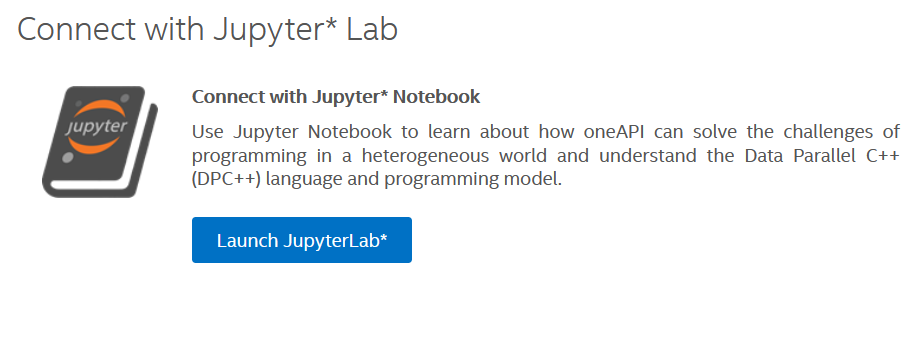
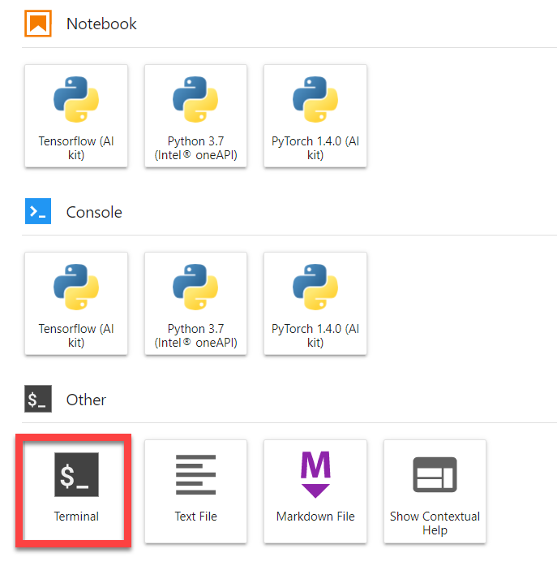

## Running Samples In DevCloud 
### Run Samples in Jupyter Lab
1.	Open [Intel DevCloud](https://software.intel.com/content/www/us/en/develop/tools/devcloud.html).
2.	In the upper right corner, click Sign In.
3.	Log in with your Intel account username and password.
4.	Open Jupyter lab: https://jupyter.oneapi.devcloud.intel.com/

    a.	If you are redirected to the Intel DevCloud page, scroll to the bottom and select Launch Jupyter Lab.
   
    b.  When Jupyter Lab opens, if prompted for a kernel, select **No Kernel**.
5.	Close the Welcome page. The Launcher tab will appear.
6.  On the Launcher tab, click **Terminal**.


7.	You will see your login at the prompt.
8.	Follow the instructions to [get code samples](https://github.com/intel-ai-tce/oneAPI-samples/tree/devcloud/AI-and-Analytics#get-code-samples) and [run samples on DevCloud](https://github.com/intel-ai-tce/oneAPI-samples/tree/devcloud/AI-and-Analytics#how-to-submit-a-workload-to-a-specific-architecture)

 
### Running the Sample in DevCloud with a Local Terminal
1.	Open a terminal on your Linux system.
2.	Log in to DevCloud.
```
ssh devcloud
```
3.	Follow the instructions to [get code samples](https://github.com/intel-ai-tce/oneAPI-samples/tree/devcloud/AI-and-Analytics#get-code-samples) and [run samples on DevCloud](https://github.com/intel-ai-tce/oneAPI-samples/tree/devcloud/AI-and-Analytics#how-to-submit-a-workload-to-a-specific-architecture)


