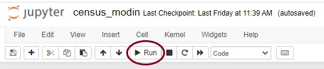
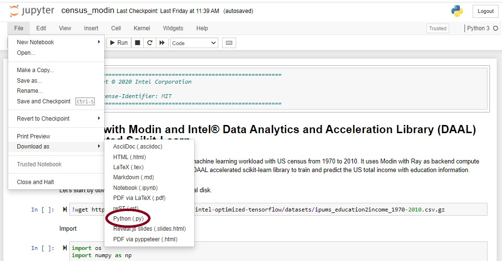
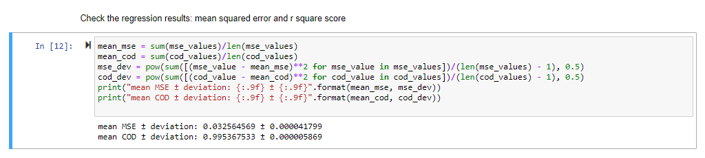

# End-to-end machine learning workload: `Census` Sample

This sample code illustrates how to use Intel® Distribution of Modin for ETL operations and ridge regression algorithm from the Intel® oneAPI Data Analytics Library (oneDAL) accelerated scikit-learn library to build and run an end to end machine learning workload. Both Intel Distribution of Modin and oneDAL accelerated scikit-learn libraries are available together in [Intel AI Analytics Toolkit](https://software.intel.com/content/www/us/en/develop/tools/oneapi/ai-analytics-toolkit.html). This sample code demonstrates how to seamlessly run the end-to-end census workload using the toolkit, without any external dependencies.

| Optimized for                     | Description
| :---                              | :---
| OS                                | 64-bit Linux: Ubuntu 18.04 or higher
| Hardware                          | Intel Atom® Processors; Intel® Core™ Processor Family; Intel® Xeon® Processor Family; Intel® Xeon® Scalable Performance Processor Family
| Software                          | Intel AI Analytics Toolkit (Python version 3.7, Intel® Distribution of Modin , Ray, Intel® oneAPI Data Analytics Library (oneDAL), Scikit-Learn, NumPy)
| What you will learn               | How to use Intel® Distribution of Modin and oneDAL optimized scikit-learn (developed and owned by Intel) to build end to end ML workloads and gain performance.
| Time to complete                  | 15-18 minutes

## Purpose
Intel® Distribution of Modin uses Ray to provide an effortless way to speed up your Pandas notebooks, scripts and libraries. Unlike other distributed DataFrame libraries, Intel® Distribution of Modin provides seamless integration and compatibility with existing Pandas code. Daal4py is a simplified API to Intel oneDAL that allows for fast usage of the framework suited for Data Scientists and Machine Learning users. It is built to help provide an abstraction to Intel® oneDAL for either direct usage or integration into one's own framework.

#### Model and dataset
In this sample, you will use Intel® Distribution of Modin to ingest and process U.S. census data from 1970 to 2010 in order to build a ridge regression based model to find the relation between education and the total income earned in the US.
Data transformation stage normalizes the income to the yearly inflation, balances the data such that each year has a similar number of data points, and extracts the features from the transformed dataset. The feature vectors are fed into the ridge regression model to predict the income of each sample.

Dataset is from IPUMS USA, University of Minnesota, [www.ipums.org](https://ipums.org/) (Steven Ruggles, Sarah Flood, Ronald Goeken, Josiah Grover, Erin Meyer, Jose Pacas and Matthew Sobek. IPUMS USA: Version 10.0 [dataset]. Minneapolis, MN: IPUMS, 2020. https://doi.org/10.18128/D010.V10.0)

## Key Implementation Details
This end-to-end workload sample code is implemented for CPU using the Python language.  With the installation of Intel AI Analytics Toolkit, the conda environment is prepared with Python version 3.7, Intel® Distribution of Modin , Ray, Intel® oneAPI Data Analytics Library (oneDAL), Scikit-Learn, NumPy following which the sample code can be directly run using the underlying steps in this README. 

## License

Code samples are licensed under the MIT license. See
[License.txt](https://github.com/oneapi-src/oneAPI-samples/blob/master/License.txt) for details.

Third party program Licenses can be found here: [third-party-programs.txt](https://github.com/oneapi-src/oneAPI-samples/blob/master/third-party-programs.txt)

## Building Intel® Distribution of Modin and Intel® oneAPI Data Analytics Library (oneDAL) for CPU to build and run end-to-end workload

Intel® Distribution of Modin and Intel® oneAPI Data Analytics Library (oneDAL) is ready for use once you finish the Intel AI Analytics Toolkit installation with the Conda Package Manager.

You can refer to the oneAPI [main page](https://software.intel.com/en-us/oneapi), and the Toolkit [Getting Started Guide for Linux](https://software.intel.com/content/www/us/en/develop/documentation/get-started-with-ai-linux/top.html) for installation steps and scripts.

### Activate conda environment With Root Access

Please follow the Getting Started Guide steps (above) to set up your oneAPI environment with the `setvars.sh` script and [Intel® Distribution of Modin environment installation] (https://software.intel.com/content/www/us/en/develop/articles/installing-ai-kit-with-conda.html). Then navigate in Linux shell to your oneapi installation path, typically `/opt/intel/oneapi/` when installed as root or sudo, and `~/intel/oneapi/` when not installed as a super user. If you customized the installation folder, the `setvars.sh` file is in your custom folder.

Activate the conda environment with the following command:

#### Linux
```
source activate intel-aikit-modin
```

### Activate conda environment Without Root Access (Optional)

By default, the Intel AI Analytics toolkit is installed in the `oneapi` folder, which requires root privileges to manage it. If you would like to bypass using root access to manage your conda environment, then you can clone your desired conda environment using the following command:

#### Linux
```
conda create --name intel-aikit-modin -c intel/label/oneapibeta -c intel -c conda-forge runipy intel-aikit-modin=2021.1b10
```

Then activate your conda environment with the following command:

```
conda activate intel-aikit-modin
```


### Install Jupyter Notebook

Launch Jupyter Notebook in the directory housing the code example

```
conda install jupyter nb_conda_kernels
```
or
```
pip install jupyter
```

### Install wget package

Install wget package to retrieve the Census dataset using HTTPS

```
pip install wget
```

#### View in Jupyter Notebook


Launch Jupyter Notebook in the directory housing the code example

```
jupyter notebook
```

## Running the end-to-end code sample

### Run as Jupyter Notebook

Open .ipynb file and run cells in Jupyter Notebook using the "Run" button. Alternatively, the entire workbook can be run using the "Restart kernel and re-run whole notebook" button. (see image below using "census modin" sample)



### Run as Python File

Open notebook in Jupyter and download as python file (see the image using "census modin" sample)



Run the Program

`python census_modin.py`

##### Expected Printed Output:
Expected Cell Output shown for census_modin.ipynb:

