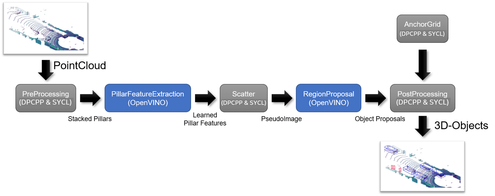
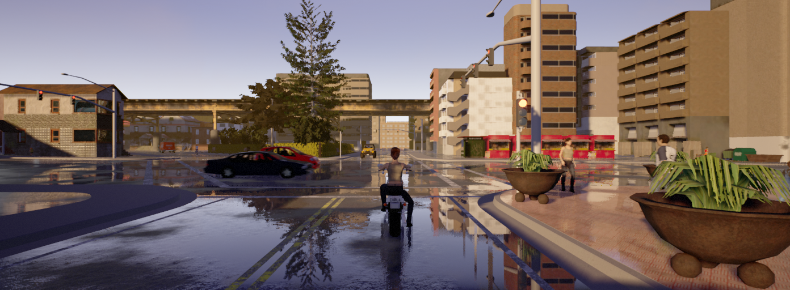
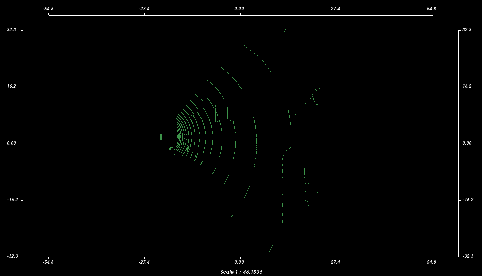

# `PointPillars` Sample
This sample performs 3D object detection and classification using data (point cloud) from a LIDAR sensor as input. The Intel® oneAPI implementation is based on the paper 'PointPillars: Fast Encoders for Object Detection from Point Clouds' [1] and the implementation in [2]. It shows how Intel® oneAPI kernels (using SYCL and DPCPP) can be used in combination with the Intel® Distribution of OpenVINO™ toolkit for CNN inference.

| Optimized for                     | Description
|:---                               |:---
| OS                                | Linux* Ubuntu* 18.04
| Hardware                          | Skylake with GEN9 or newer / Intel Xe Graphics
| Software                          | Intel® oneAPI DPC++/C++ Compiler, Intel® Distribution of OpenVINO™ toolkit
| What you will learn               | How to combine Intel® Distribution of OpenVINO™ toolkit and Intel® oneAPI to offload the computation of a complex workload to one of Intel's supported accelerators (e.g., GPU or CPU)
| Time to complete                  | 30 minutes

## Purpose
PointPillars is an AI algorithm that uses LIDAR point clouds to detect and classify 3D objects in the sensor environment. For this purpose, the algorithm consists of the following steps, that are also visualized in the figure below:



1. Pre-processing of the LiDAR input point cloud is performed. This is realized with the help of kernels implemented using Intel® oneAPI.
2. An anchor grid is generated. The anchors in the grid are later used in object detection to refine detected boxes by the RegionProposalNetwork (RPN). The anchor grid generation is also implemented using Intel® oneAPI.
3. Afterward, the pre-processed data is used by a so-called Pillar Feature Extraction (PFE) CNN to create a 2D image-like representation of the sensor environment. For the inference, this sample uses the Intel® Distribution of OpenVINO™ toolkit. The output of this CNN is a list of dense tensors (learned pillar features).
4. To convert these dense tensors into an pseudo-image, a scatter operation is performed. This operation is again realized with Intel® oneAPI.
5. This pseudo-image is consumed by the second CNN, the so-called Region Proposal Network (RPN). The inference is performed with the help of the Intel® Distribution of OpenVINO™ toolkit. The output is an unfiltered list of possible object detections, their position, dimensions and classifications.
6. Finally, this output data (object list) is post-processed with the help of the anchors created in the 2nd step. The anchors are used to decode the object position, dimension and class. Afterwards, a Non-Maximum-Suppression (NMS) is used to filter out redundant/clutter objects. Finally, the objects are sorted according to their likelihood, and then provided as output. All of these steps are implemented as Intel® oneAPI kernels. 

By default, the application will use 'host' as the Intel® oneAPI execution device and CPU (single-threaded) for Intel® Distribution of OpenVINO™ toolkit inferencing part. The Intel® oneAPI execution device and the inferencing device are displayed in the output, along with the elapsed time of each of the five steps described above. For more details refer to section: [Execution Options for the Sample Program](#execution-options-for-the-sample-program).

## Key Implementation Details
This sample demonstrates a real-world, end-to-end example that uses a combination of Intel® oneAPI and the Intel® Distribution of OpenVINO™ to solve object detection's complex task in a given environment. Hence, this sample will give you insights into the following aspects:
 - You will learn how to transfer data from a oneAPI device/kernel to an OpenVINO-based inference task and back.
 - You will learn how to implement a device manager that allows choosing the target hardware for execution, i.e., CPU, GPU or an accelerator, at runtime in a user transparent manner. As a result, the target hardware can be chosen via a command-line argument without requiring a time-consuming re-compilation (further details on the execution are provided below)
 - You will learn how to implement oneAPI-based function kernels that can be executed on the host system, on a multi-threaded CPU or a GPU.
 - You will learn how to implement standard algorithms for AI-based object detection, for example, _Non-Maximum-Suppression_, using oneAPI.

## License  
Code samples are licensed under the MIT license. See
[License.txt](https://github.com/oneapi-src/oneAPI-samples/blob/master/License.txt) for details.

Third-party program Licenses can be found here: [third-party-programs.txt](https://github.com/oneapi-src/oneAPI-samples/blob/master/third-party-programs.txt)

## Building the `PointPillars` Sample Program for CPU and GPU
Currently, only Linux platforms are supported. It is recommended to use Ubuntu 18.04.

### Requirements
To build and run the PointPillars sample, the following libraries have to be installed:
1. Intel® Distribution of OpenVINO™ toolkit (at least 2021.1)
2. Intel® oneAPI Base Toolkit (at least 2021.2)
3. Boost (including `boost::program_options` library)
4. Optional: If the sample should be run on an Intel GPU, it might be necessary to upgrade the corresponding drivers. Therefore, please consult the following page: https://github.com/intel/compute-runtime/releases/   

### Build process
Perform the following steps:
1. Prepare the environment to be able to use the Intel® Distribution of OpenVINO™ toolkit and oneAPI
``` 
$ source /opt/intel/openvino_2021/bin/setupvars.sh
$ source /opt/intel/oneapi/setvars.sh
```

2. Build the program using the following `cmake` commands. 
``` 
$ mkdir build && cd build
$ cmake ..
$ make
```
Please note that cmake will also download the ONNX models required for the two inference steps executed with the Intel® Distribution of OpenVINO™ toolkit.

## Running the `PointPillars` Sample Program
After a successful build, the sample program can be run as follows:
```
./example.exe
```
The input data for the sample program is the example.pcd located in the /data folder. It contains an artificial point cloud from a simulated LIDAR sensor of the CARLA simulator [3]. The corresponding scene looks as follows:

The example.pcd file is a point cloud in ASCII using the PCL-format, which renders to (using the pcl_viewer tool):

It is worth noting that there are three cars in this scene, one of which is very far away and thus not yet properly covered in the LIDAR scan. Then, there is a black car inside the intersection, which is also well visible in the LIDAR data, and a hidden car, right behind the black one. Hence, `PointPillars` should detect at least one car.

Successful execution of the sample program results in at least one detected object and an output similar to:
```
Starting PointPillars
   PreProcessing - 20ms
   AnchorMask - 10ms
   PFE Inference - 91ms
   Scattering - 50ms
   RPN Inference - 107ms
   Postprocessing - 13ms
Done
Execution time: 296ms

1 cars detected
Car: Probability = 0.622569 Position = (24.8561, 12.5615, -0.00771689) Length = 2.42855 Width = 3.61396
```

## Execution Options for the Sample Program
The sample program provides a few command-line options, which can be accessed using the 'help' option
```
./example.exe --help
```

Furthermore, it is possible to specify the execution device. For using multi-threaded CPU execution, please use:
```
./example.exe --cpu
```
For single-threaded execution on the host system, please use:
```
./example.exe --host
```
And to use an Intel® DG1 or integrated graphics, please use:
```
./example.exe --gpu
```
These options can also be used in combination, e.g.:
```
./example.exe --cpu --gpu --host
```

## Known Limitations
- This sample code only works using models trained with the Sigmoid function, not with Softmax or Crossentropy
- If other models than the recommended models are used, it has to be ensured that the maximum number of classifications is at most 20


---

## References
[1] [PointPillars: Fast Encoders for Object Detection from Point Clouds](https://arxiv.org/abs/1812.05784)

[2] [Autoware package for Point Pillars](https://github.com/Autoware-AI/core_perception/tree/master/lidar_point_pillars)

[3] [Open-source simulator for autonomous driving research](http://carla.org/)

## Notes
OpenVINO is a trademark of Intel Corporation or its subsidiaries
