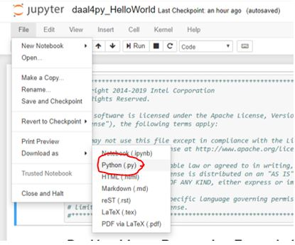

# `Intel® Python XGBoost Performance Sample`
This sample code illustrates how to analyze the performance benefit from using Intel optimizations upstreamed by Intel to latest XGBoost compared to un-optimized XGBoost 0.81. It demonstrates how to use software products that can be found in the [Intel® oneAPI AI Analytics Toolkit](https://software.intel.com/content/www/us/en/develop/tools/oneapi/ai-analytics-toolkit.html).

| Optimized for                     | Description
| :---                              | :---
| OS                                | 64-bit Linux: Ubuntu 18.04 or higher
| Hardware                          | Intel Atom® Processors; Intel® Core™ Processor Family; Intel® Xeon® Processor Family; Intel® Xeon® Scalable processor family
| Software                          | XGBoost, Intel® oneAPI AI Analytics Toolkit
| What you will learn               | How to analyze the performance benefit from using Intel optimizations upstreamed by Intel to the latest XGBoost compared to un-optimized XGBoost 0.81
| Time to complete                  | 10-15 minutes

## Purpose

XGBoost is a widely used gradient boosting library in the classical ML area. Designed for flexibility, performance, and portability, XGBoost includes optimized distributed gradient boosting frameworks and implements Machine Learning algorithms underneath.

In this sample, you will an XGBoost model and prediction using Intel optimizations upstreamed by Intel to the latest XGBoost package and the un-optimized XGBoost 0.81 for comparison.

## Key Implementation Details
This XGBoost sample code is implemented for the CPU using the Python language. The example assumes you XGBoost installed inside a conda environment, similar to what is delivered with the installation of the Intel® Distribution for Python* as part of the [Intel® oneAPI AI Analytics Toolkit](https://software.intel.com/en-us/oneapi/ai-kit). It also assumes you have set up an additional XGBoost 0.81 conda environment, with details on how to do so explained within the sample and this README.

## License
Code samples are licensed under the MIT license. See
[License.txt](https://github.com/oneapi-src/oneAPI-samples/blob/master/License.txt) for details.

Third-party program Licenses can be found here: [third-party-programs.txt](https://github.com/oneapi-src/oneAPI-samples/blob/master/third-party-programs.txt)

## Building XGBoost for CPU

XGBoost is ready for use once you finish the Intel® oneAPI AI Analytics Toolkit installation and have run the post installation script.

You can refer to the oneAPI [main page](https://software.intel.com/en-us/oneapi) for toolkit installation and the Toolkit [Getting Started Guide for Linux](https://software.intel.com/en-us/get-started-with-intel-oneapi-linux-get-started-with-the-intel-ai-analytics-toolkit) for post-installation steps and scripts.


### Activate conda environment With Root Access

Please follow the Getting Started Guide steps (above) to set up your oneAPI environment with the `setvars.sh` script. Then navigate in Linux shell to your oneapi installation path, typically `/opt/intel/oneapi/` when installed as root or sudo, and `~/intel/oneapi/` when not installed as a superuser. If you customized the installation folder, the `setvars.sh` file is in your custom folder.

Intel Python environment will be active by default. However, if you activated another environment, you can return with the following command:

#### On a Linux* System
```
source activate base
```

### Activate conda environment Without Root Access (Optional)

By default, the Intel® oneAPI AI Analytics Toolkit is installed in the inteloneapi folder, which requires root privileges to manage it. If you would like to bypass using root access to manage your conda environment, then you can clone your desired conda environment using the following command:

#### On a Linux* System
```
conda create --name usr_intelpython --clone base
```

Then activate your conda environment with the following command:

```
source activate usr_intelpython
```

### Install Jupyter Notebook
```
conda install jupyter nb_conda_kernels
```

### Building XGBoost 0.81 Conda Environment

To see the performance comparison to the latest XGBoost with Intel optimizations and un-optimized XGBoost 0.81, you will be required to run this sample in a second conda environment with XGBoost 0.81 installed.

### View in Jupyter Notebook

_Note: This distributed execution cannot be launched from the jupyter notebook version, but you can still view inside the notebook to follow the included write-up and description._

Launch Jupyter Notebook in the directory housing the code example

```
jupyter notebook
```

## Running the Sample

### Running the Sample as a Jupyter Notebook

Open .pynb file and run cells in Jupyter Notebook using the "Run" button (see the image using "Modin Getting Started" sample)


##### Expected Printed Output for Cells (with similar numbers):
```
[CODE_SAMPLE_COMPLETED_SUCCESFULLY]
```

### Running the Sample as a Python File

Open notebook in Jupyter and download as python file (see the image using "daal4py Hello World"  sample)



Run the Program

`python IntelPython_XGBoost_Performance.py`

The output files of the script will be saved in the included models and result directories.

##### Expected Printed Output (with similar numbers):
```
[CODE_SAMPLE_COMPLETED_SUCCESFULLY]
```
### Using Visual Studio Code*  (VS Code)

You can use VS Code extensions to set your environment, create launch configurations,
and browse and download samples.

The basic steps to build and run a sample using VS Code include:
 - Download a sample using the extension **Code Sample Browser for Intel oneAPI Toolkits**.
 - Configure the oneAPI environment with the extension **Environment Configurator for Intel oneAPI Toolkits**.
 - Open a Terminal in VS Code (**Terminal>New Terminal**).
 - Run the sample in the VS Code terminal using the instructions below.

To learn more about the extensions and how to configure the oneAPI environment, see
[Using Visual Studio Code with Intel® oneAPI Toolkits](https://software.intel.com/content/www/us/en/develop/documentation/using-vs-code-with-intel-oneapi/top.html).

After learning how to use the extensions for Intel oneAPI Toolkits, return to this readme for instructions on how to build and run a sample.