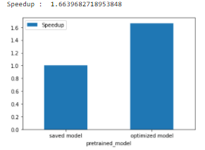

# Tutorial : Optimize TensorFlow pre-trained model for inference
This tutorial will guide you how to optimize a pre-trained model for a better inference performance, and also 
analyze the model pb files before and after the inference optimizations.  
Both The Intel® Low Precision Optimization Tool (Intel® LPOT) and TensorFlow optimization tools are used in this tutorial, and LPOT is the preferred tool for inference optimization on Intel Architectures.

| Optimized for                     | Description
|:---                               |:---
| OS                                | Ubuntu* 18.04 
| Hardware                          | Intel® Xeon® Scalable processor family or newer
| Software                          | [Intel® oneAPI AI Analytics Toolkit](https://software.intel.com/content/www/us/en/develop/tools/oneapi/ai-analytics-toolkit.html)
| What you will learn               | Optimize a pre-trained model for a better inference performance
| Time to complete                  | 30 minutes

## Purpose
Show users the importance of inference optimization on performance, and also analyze TensorFlow ops difference in pre-trained models before/after the optimizations.  
Those optimizations include:  
* Converting variables to constants.
* Removing training-only operations like checkpoint saving.
* Stripping out parts of the graph that are never reached.
* Removing debug operations like CheckNumerics.
* Folding batch normalization ops into the pre-calculated weights.
* Fusing common operations into unified versions.

## Key implementation details
This tutorial contains one Jupyter notebook and three python scripts listed below.  
### Jupyter Notebooks 
 
| Notebook | Notes|
| ------ | ------ |
|  tutorial_optimize_TensorFlow_pretrained_model.ipynb | Optimize a pre-trained model for a better inference performance, and also analyze the model pb files  |

### Python Scripts
| Scripts | Notes|
| ------ | ------ |
|  tf_pb_utils.py | This script parses a pre-trained TensorFlow model PB file.  |
|  freeze_optimize_v2.py | This script optimizes a pre-trained TensorFlow model PB file.  |
|  profile_utils.py | This script helps on output processing of the Jupyter Notebook.  |
   
    
## License  
Code samples are licensed under the MIT license. See
[License.txt](https://github.com/oneapi-src/oneAPI-samples/blob/master/License.txt) for details.

Third party program Licenses can be found here: [third-party-programs.txt](https://github.com/oneapi-src/oneAPI-samples/blob/master/third-party-programs.txt)

## Build and Run the Sample

### Pre-requirement

> NOTE: No action is required if users use Intel DevCloud as their environment. 
  Please refer to [Intel oneAPI DevCloud](https://intelsoftwaresites.secure.force.com/devcloud/oneapi) for Intel DevCloud.

 1. **Intel® AI Analytics Toolkit**  
       You can refer to the oneAPI [main page](https://software.intel.com/en-us/oneapi) for toolkit installation,   
       and the Toolkit [Getting Started Guide for Linux](https://software.intel.com/en-us/get-started-with-intel-oneapi-linux-get-started-with-the-intel-ai-analytics-toolkit) for post-installation steps and scripts.

 2. **Jupyter Notebook**
       Users can install via PIP by `$pip install notebook`.
       Users can also refer to the [installation link](https://jupyter.org/install) for details.

### Running the Sample

1. Launch Jupyter notebook: `$jupyter notebook --ip=0.0.0.0`

2. Follow the instructions to open the URL with the token in your browser
3. Click the `tutorial_optimize_TensorFlow_pretrained_model.ipynb` file
4. Change your Jupyter notebook kernel to "tensorflow" or "intel-tensorflow" 
5. Run through every cell of the notebook one by one

### Example of Output
Users should be able to see some diagrams for performance comparison and analysis.  
One example of performance comparison diagrams:
  

For performance analysis, users can also see pie charts for different Tensorflow* operations in the analyzed pre-trained model pb file.  
One example of model pb file analysis diagrams:
  

