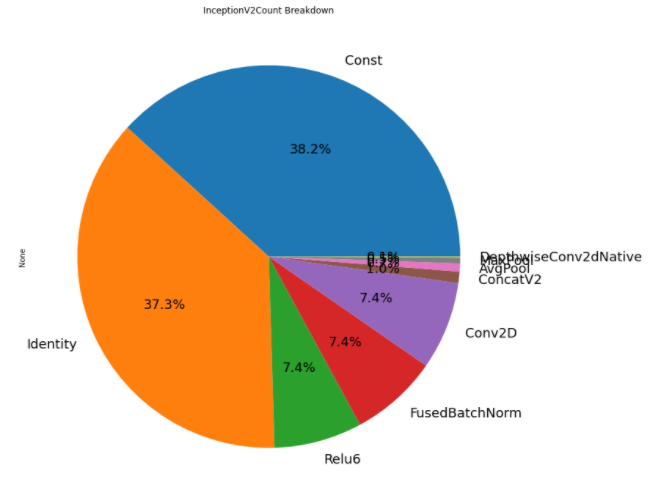

# `Optimize TensorFlow Pre-trained Model for Inference` Sample

The `Optimize TensorFlow Pre-trained Model for Inference` sample demonstrates how to optimize a pre-trained model for a better inference performance, and also analyze the model pb files before and after the inference optimizations.

| Area                 | Description
|:---                  |:---
| What you will learn  | Optimize a pre-trained model for a better inference performance
| Time to complete     | 30 minutes
| Category             | Code Optimization

## Prequisites

| Optimized for        | Description
|:---                  |:---
| OS                   | Ubuntu* 18.04
| Hardware             | Intel® Xeon® Scalable processor family or newer
| Software             | [Intel® AI Analytics Toolkit (AI Kit)](https://software.intel.com/content/www/us/en/develop/tools/oneapi/ai-analytics-toolkit.html)

### For Local Development Environments

- **Intel® AI Analytics Toolkit (AI Kit)**

  You can get the AI Kit from [Intel® oneAPI Toolkits](https://www.intel.com/content/www/us/en/developer/tools/oneapi/toolkits.html#analytics-kit). <br> See [*Get Started with the Intel® AI Analytics Toolkit for Linux**](https://www.intel.com/content/www/us/en/develop/documentation/get-started-with-ai-linux) for AI Kit installation information and post-installation steps and scripts.

- **Jupyter Notebook**

  Install using PIP: `$pip install notebook`. <br> Alternatively, see [*Installing Jupyter*](https://jupyter.org/install) for detailed installation instructions.

The sample uses both the Intel® Low Precision Optimization Tool (Intel® LPOT) and TensorFlow* optimization tools, and Intel® LPOT is the preferred tool for inference optimization on Intel Architectures.

### For Intel® DevCloud

The necessary tools and components are already installed in the environment. You do not need to install additional components. See [Intel® DevCloud for oneAPI](https://devcloud.intel.com/oneapi/get_started/) for information.

## Purpose

Show users the importance of inference optimization on performance, and also analyze TensorFlow ops difference in pre-trained models before/after the optimizations. Those optimizations include:

- Converting variables to constants.
- Removing training-only operations like checkpoint saving.
- Stripping out parts of the graph that are never reached.
- Removing debug operations like CheckNumerics.
- Folding batch normalization ops into the pre-calculated weights.
- Fusing common operations into unified versions.

## Key Implementation Details

This tutorial contains one Jupyter Notebook and three python scripts listed below.

### Jupyter Notebooks

| Notebook                                             | Description
|:---                                                  |:---
|`tutorial_optimize_TensorFlow_pretrained_model.ipynb` | Optimize a pre-trained model for a better inference performance, and also analyze the model pb files

### Python Scripts

| Script                 | Description
|:---                    |:---
|`tf_pb_utils.py`        | Parses a pre-trained TensorFlow model PB file. <br> (See [TensorFlow* PB File Parser README](scripts/README.md) for more information.)
|`freeze_optimize_v2.py` | Optimizes a pre-trained TensorFlow model PB file.
|`profile_utils.py`      | Helps output processing of the Jupyter Notebook.

## Set Environment Variables

When working with the command-line interface (CLI), you should configure the oneAPI toolkits using environment variables. Set up your CLI environment by sourcing the `setvars` script every time you open a new terminal window. This practice ensures that your compiler, libraries, and tools are ready for development.

## Run the `Optimize TensorFlow Pre-trained Model for Inference` Sample

### On Linux*

> **Note**: If you have not already done so, set up your CLI
> environment by sourcing  the `setvars` script in the root of your oneAPI installation.
>
> Linux*:
> - For system wide installations: `. /opt/intel/oneapi/setvars.sh`
> - For private installations: ` . ~/intel/oneapi/setvars.sh`
> - For non-POSIX shells, like csh, use the following command: `bash -c 'source <install-dir>/setvars.sh ; exec csh'`
>
> For more information on configuring environment variables, see *[Use the setvars Script with Linux* or macOS*](https://www.intel.com/content/www/us/en/develop/documentation/oneapi-programming-guide/top/oneapi-development-environment-setup/use-the-setvars-script-with-linux-or-macos.html)*.


#### Open Jupyter Notebook

1. Launch Jupyter Notebook.
   ```
   jupyter notebook --ip=0.0.0.0
   ```
2. Follow the instructions to open the URL with the token in your browser.
3. Locate and select the Notebook.
   ```
   tutorial_optimize_TensorFlow_pretrained_model.ipynb
   ```
4. Change your Jupyter Notebook kernel to **tensorflow** or **intel-tensorflow**.
5. Run every cell in the Notebook in sequence.

#### Troubleshooting

If you receive an error message, troubleshoot the problem using the **Diagnostics Utility for Intel® oneAPI Toolkits**. The diagnostic utility provides configuration and system checks to help find missing dependencies, permissions errors, and other issues. See the [Diagnostics Utility for Intel® oneAPI Toolkits User Guide](https://www.intel.com/content/www/us/en/develop/documentation/diagnostic-utility-user-guide/top.html) for more information on using the utility.

### Run the Sample on Intel® DevCloud (Optional)

1. If you do not already have an account, request an Intel® DevCloud account at [*Create an Intel® DevCloud Account*](https://intelsoftwaresites.secure.force.com/DevCloud/oneapi).
2. On a Linux* system, open a terminal.
3. SSH into Intel® DevCloud.
   ```
   ssh DevCloud
   ```
   > **Note**: You can find information about configuring your Linux system and connecting to Intel DevCloud at Intel® DevCloud for oneAPI [Get Started](https://devcloud.intel.com/oneapi/get_started).
   
4. Follow the instructions to open the URL with the token in your browser.
5. Locate and select the Notebook.
   ```
   tutorial_optimize_TensorFlow_pretrained_model.ipynb
   ```
6. Change the kernel to **tensorflow** or **intel-tensorflow**.
7. Run every cell in the Notebook in sequence.

## Example Output

Users should be able to see some diagrams for performance comparison and analysis.

For performance analysis, users can also see pie charts for different Tensorflow* operations in the analyzed pre-trained model pb file.

One example of model pb file analysis diagrams:



## License

Code samples are licensed under the MIT license. See
[License.txt](https://github.com/oneapi-src/oneAPI-samples/blob/master/License.txt) for details.

Third party program Licenses can be found here: [third-party-programs.txt](https://github.com/oneapi-src/oneAPI-samples/blob/master/third-party-programs.txt).