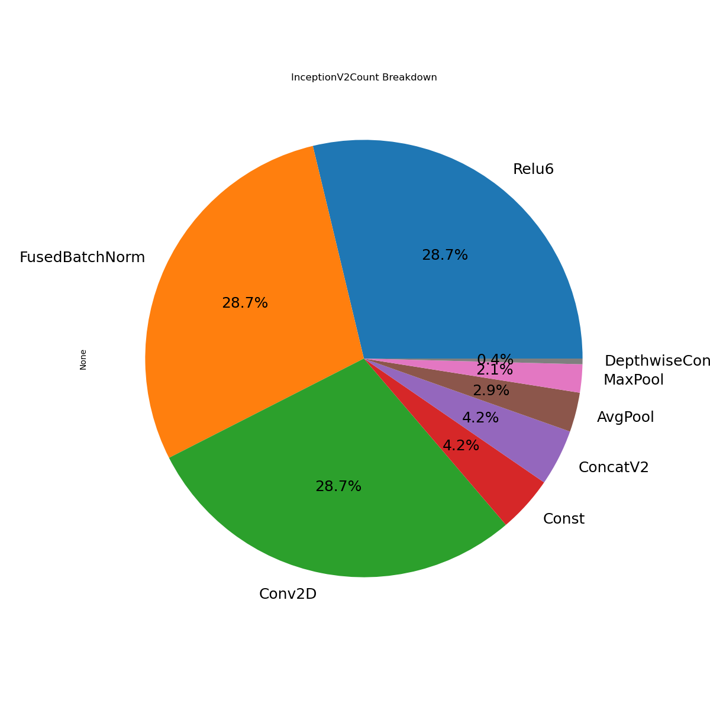

# TensorFlow* PB File Parser

## Prerequisites 

You must have a PB file and TensorFlow environment first.  

## How to Parse a PB File

A TensorFlow graph might be composed from many subgraphs; therefore, users might see many layers in a PB file due to those subgraphs.

### ( Optional ) 1. Understand Structures of a PB file

This section is optional for users who fully understand the structure of the pb file.
If you investigate into a new pb file, you might need to go through below section to understand the structure of pb file.

The `tf_pb_utils.py` will parse op.type and op.name from a graph_def into a CSV file.

op.name might contain a layer structure.

Below is an example.

ex : FeatureExtractor\InceptionV2\InceptionV2\Mixed_5c\Branch_2\Conv2d_0b_3x3\Conv2D
The first layer is FeatureExtractor, and the second layer is InceptionV2. The last layer is Conv2D.

Here is another example.

ex : BoxPredictor_4\BoxEncodingPredictor\Conv2D
Even the last layer is Conv2D, it has different first and second layer.
Moreover, this Conv2D is not related to InceptionV2 layer, so we don't want to count this Conv2D as a inceptionV2 ops.

Therefore, we still need the layers information to focus on the ops important to us.

We parse op.type and op.name into a CSV file "out.csv". The following table maps the CSV column and op.type & op.name. op.name[i] represent the i layer of this op.name.  

|op_type|op_name|op1|op2|op3|op4|op5|op6|  
|:-----|:----|:-----|:-----|:-----|:-----|:-----|:-----|  
|op.type| op.name[-1] |op.name[0] | op.name[1] | op.name[2] |op.name[3] |op.name[4] |op.name[5] |  

Following two sub-sections will show you how to focus on op.type of an interested layer such as InceptionV2.

### ( Optional ) 2. Find the Column Containing the Interested Layer

Below command will group rows by the values on the selected column from out.csv file.
Check which column contains the interested layer. Below is column 3 of ssd_inception_v2 case, it contains InceptionV2 as second row.

```
     == Dump column : 3 ==
    op2
    BatchMultiClassNonMaxSuppression    5307
    InceptionV2                         1036
    0                                    263
    map                                   63
    Decode                                63
    ClassPredictor                        36
    BoxEncodingPredictor                  36
    Meshgrid_14                           34
    Meshgrid_1                            34
    Meshgrid_10                           34
    dtype: int64
```
Both indexes of column and row start from 0; therefore, we could access second row by index 1.
By using column index 3 and row index 1, we could access InceptionV2 related op.name.

###  3. Parse an Interested Subgraph of a PB File

With understanding of interested subgraph of a pb file, users can parse that subgraph by assigning related column and row index. Ex : column 3 and row 1 from Step 2 above.

```
python tf_pb_utils.py model.pb -c 3 -r 1
```

One example of TensorFlow Operations breakdown diagrams from a PB file:

