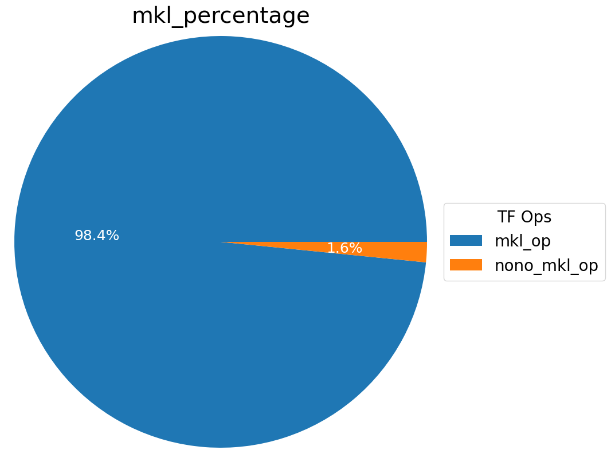
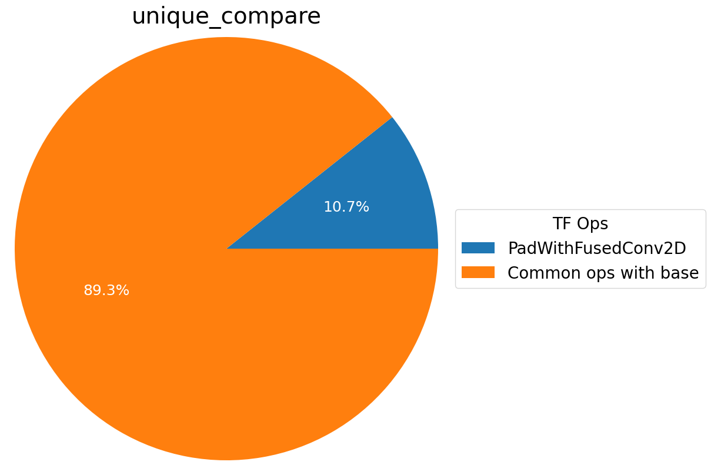
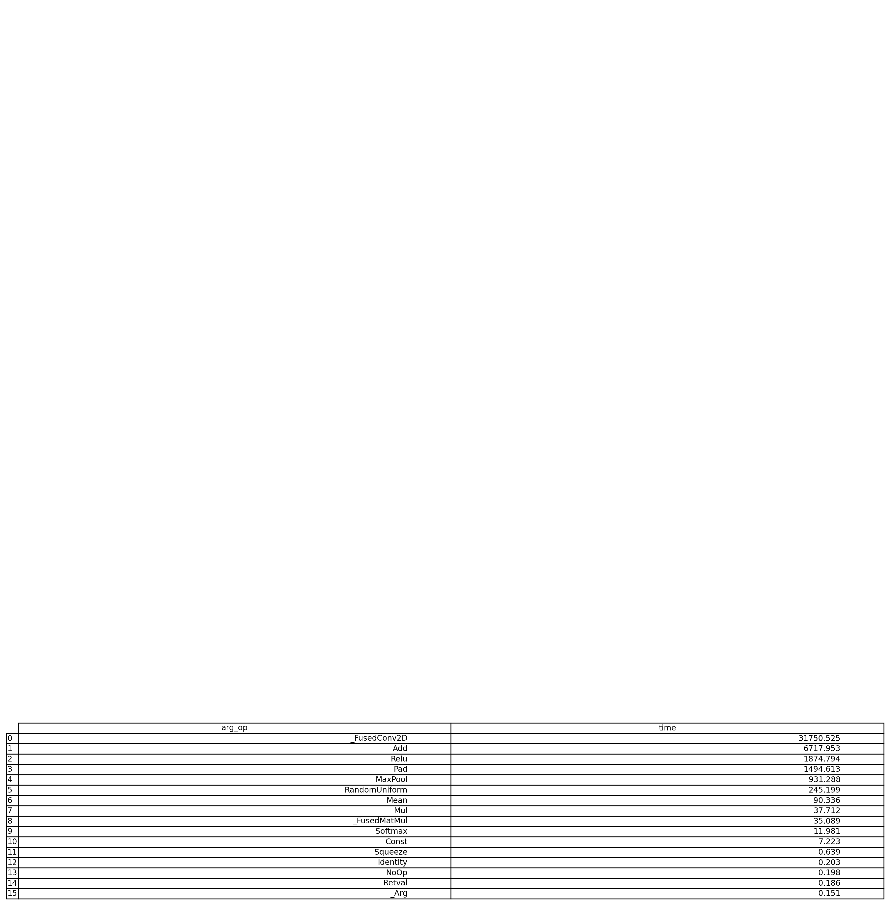
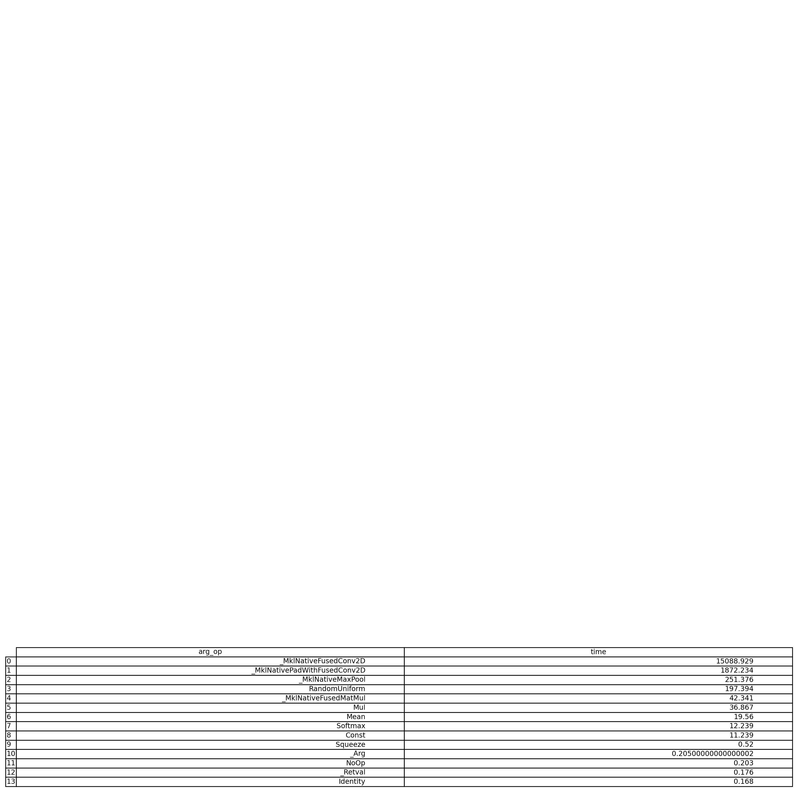
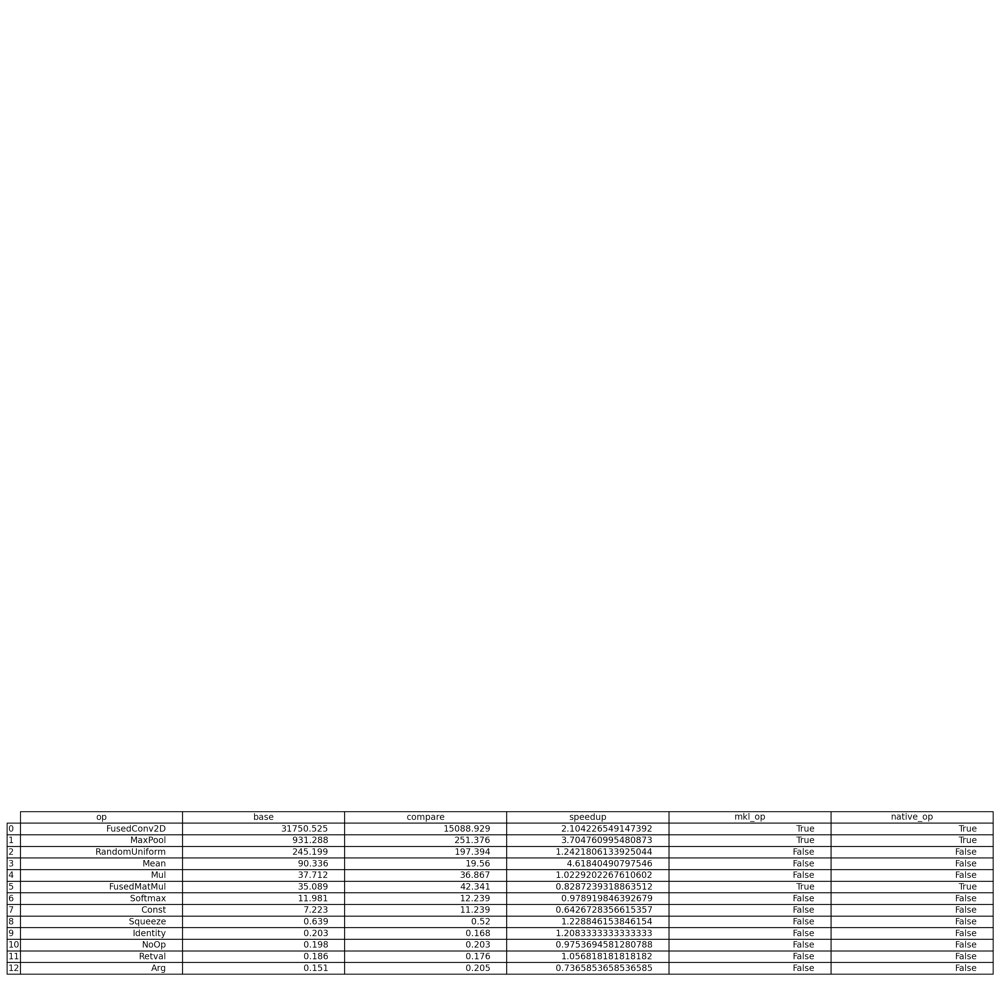

# Analyze TensorFlow Trace Json Files
This analyze tool helps users to analyze TensorFlow Trace Json with a HTML output which contains some statistic charts and a timeline chart.

## Prerequisites 

*  users need to enable TensorFlow Profiler in their workloads first.  Please refer to [TF_PerfAnalysis.ipynb](../TF_PerfAnalysis.ipynb) for more details.

## How to analyze TensorFlow tace json.gz files

### analyze a TensorFlow tace json.gz file
Users could also use a file path instead.  
*  parse a trace from workload : `$./analyze A.trace.json.gz`  

### Compare and Analyze two TensorFlow tace json.gz files 
Users could also use a file path instead. 
*  compare two json.gz files "A.trace.json.gz" and "B.trace.json.gz" : `$./analyze A.trace.json.gz B.trace.json.gz` 

## Understand Reports  

 oneDNN overall useage  

  
Users could understand how many percentage this workload spend on oneDNN computations.   
Here is an example diagram, and more than 94% of cpu time are on oneDNN computations which is good.      
  

 Bart Chart for TF ops Elapsed time comparison 

  
Users could compare TF ops elpased time between Base and Compare run.    
Here is an example diagram.  
Yellow bars are from Base Run and Blue bars are from Compare run.   
Overall, lower is better for the elapsed time.  
  

 Bart Chart for TF ops speedup comparison  

  
Users could compare TF ops speedup between Base and Compare run.    
Here is an example diagram.  
Yellow bars are from Eigen Ops and Blue bars are oneDNN Ops.   
Each bar show the speedup from Compare run to Base run, so higher is better.       
  

 Pie Chart for Base Run TF Ops hotspots  

  
Users could understand how many percentage this workload spend on different TF ops.   
Here is an example diagram, and more than 73% of cpu time are on FusedConv2D. 
Users could start optimize the top hotspot to improve the performance
  

  Pie Chart for Base Run Unique TF Ops hotspots  

  
Users could understand how many percentage this workload spend on unique TF ops only used in the Base run.   
Here is an example diagram, and there is a unique TF ops "Add" token ~15% of total cpu time.    
  

 Pie Chart for Compare Run TF Ops hotspots   

  
Users could understand how many percentage this workload spend on different TF ops.   
Here is an example diagram, and more than 86% of cpu time are on FusedConv2D. 
Users could start optimize the top hotspot to improve the performance   
  

  

  Pie Chart for Compare Run Unique TF Ops hotspots  

  
Users could understand how many percentage this workload spend on unique TF ops only used in the compare run.   
Here is an example diagram, and there is a unique TF ops "PadWithFusedConv2D" token ~10% of total cpu time.       
  

  

 Table for Base Run TF ops Elapsed time  

  
Users could understand exact elpased time for each TF ops from Base run.   
Here is an example diagram.       
  

 
  

 Table for Compare Run TF ops Elapsed time   

  
Users could understand exact elpased time for each TF ops from Compare run.   
Here is an example diagram.     
  

  

 Table for Compare Run TF ops Elapsed time with shape info  

  
Users could understand exact elpased time for each TF ops with shape info from Compare run.   
Here is an example diagram.     
  

  

 Table for TF ops Elapsed time comparison   

  
Users could understand exact elpased time for each TF ops from both run and related speedup number.   
If the TF ops is accelerated with oneDNN, mkl_op would be marked as True.  
If the TF ops is accelerated with native format, native_op would be marked as True.    
Here is an example diagram.  
  

