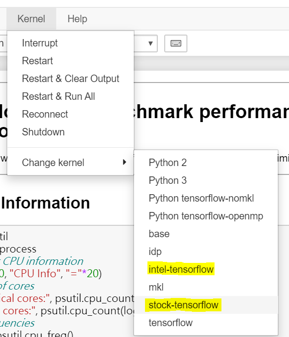
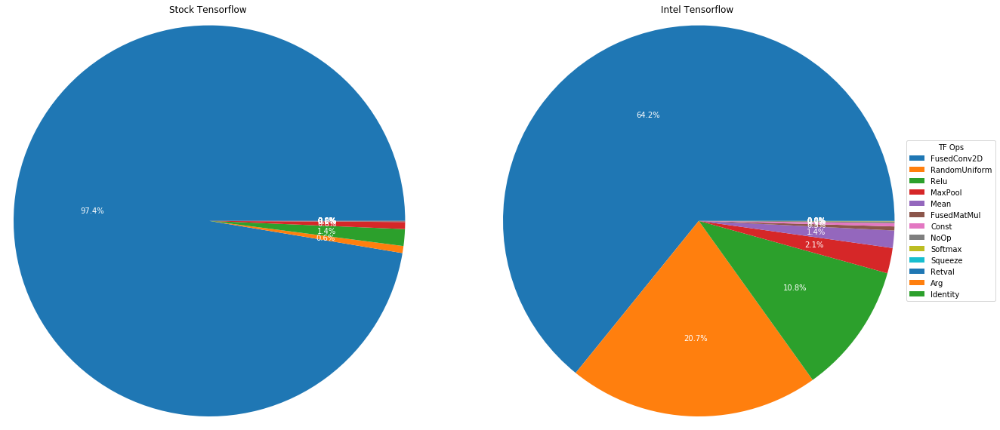

# `TensorFlow* Performance Analysis Using Model Zoo for Intel® Architecture` Sample

The `TensorFlow* Performance Analysis Using Model Zoo for Intel® Architecture` sample contains one Jupyter notebook from this GitHub Repo and four Jupyter Notebooks from the Model Zoo for Intel® Architecture to help users analyze the performance difference among different Tensorflow enviroments such as Stock vs Intel.

| Area                     | Description
|:---                      |:---
| What you will learn      | How to analyze performance benefits when using Intel® Optimization for TensorFlow*
| Time to complete         | 40 minutes

## Purpose

The [Model Zoo for Intel® Architecture](https://github.com/IntelAI/models) GitHub contains links to pre-trained models, sample scripts, best practices, and step-by-step tutorials for many popular open source machine learning models optimized by Intel to run on Intel® Xeon® Scalable processors.

This sample helps demonstrate AI workloads and deep learning models optimized by Intel and validated to run on Intel hardware. Using the TensorFlow* Timeline, you can analyze the performance benefits from Intel Optimizations for Tensorflow* and Intel® oneAPI Deep Neural Network Library (oneDNN) among different layers to execute, train, and deploy Intel-optimized models.  
This sample also provide an Analysis script to give users a quick performance analysis over their TensorFlow Profiling results.  

## Prerequisites

| Optimized for           | Description
|:---                     |:---
| OS                      | Ubuntu* 20.04
| Hardware                | Intel® Xeon® Scalable processor family or newer
| Software                | Intel® AI Analytics Toolkit (AI Kit)

### For Local Development Environments

You will need to download and install the following toolkits, tools, and components to use the sample.

- **Intel® AI Analytics Toolkit (AI Kit)**

  You can get the AI Kit from [Intel® oneAPI Toolkits](https://www.intel.com/content/www/us/en/developer/tools/oneapi/toolkits.html#analytics-kit). <br> See [*Get Started with the Intel® AI Analytics Toolkit for Linux**](https://www.intel.com/content/www/us/en/develop/documentation/get-started-with-ai-linux) for AI Kit installation information and post-installation steps and scripts.

- **Jupyter Notebook**

  Install using PIP: `$pip install notebook`. <br> Alternatively, see [*Installing Jupyter*](https://jupyter.org/install) for detailed installation instructions.

### For Intel® DevCloud

The necessary tools and components are already installed in the environment. You do not need to install additional components. See [Intel® DevCloud for oneAPI](https://devcloud.intel.com/oneapi/get_started/) for information.


## Key Implementation Details

### Jupyter Notebooks  
Jupyter Notebooks help users analyze the performance benefit from using Intel® Optimization for TensorFlow* with the oneDNN library.

>**Note**: The notebooks are released with the Intel® AI Analytics Toolkit (AI Kit), and they are under the /opt/intel/oneapi/modelzoo/latest/models/docs/notebooks/perf_analysis folder.

You can find the Jupyter Notebooks in Model Zoo for Intel® Architecture GitHub using the links in the table below.

| Analysis Type                   | Notebook | Notes
|:---                             |:--- |:---
| Analysis on a Kera model | [TensorFlow Profiler Analysis](TF_PerfAnalysis.ipynb) | Guides auidences how to generate trace.json file by using TensorFlow Profiler, and then analyze it accordingly. |
|Stock vs. Intel TensorFlow*      | 1. [benchmark_perf_comparison](https://github.com/IntelAI/models/blob/master/docs/notebooks/perf_analysis/benchmark_perf_comparison.ipynb) | Compare performance between Stock and Intel® Optimization for TensorFlow* among different models  |
|Stock vs. Intel TensorFlow*      | 2. [benchmark_perf_timeline_analysis](https://github.com/IntelAI/models/blob/master/docs/notebooks/perf_analysis/benchmark_perf_comparison.ipynb) | Analyze the performance benefit from oneDNN among different layers by using TensorFlow*Timeline |
|FP32 vs. BF16 vs. INT8           | 1. [benchmark_data_types_perf_comparison](https://github.com/IntelAI/models/blob/master/docs/notebooks/perf_analysis/benchmark_data_types_perf_comparison.ipynb) | Compare Model Zoo for Intel® Architecture benchmark performance among different data types on Intel® Optimization for TensorFlow* 
|FP32 vs. BF16 vs. INT8           | 2.[benchmark_data_types_perf_timeline_analysis](https://github.com/IntelAI/models/blob/master/docs/notebooks/perf_analysis/benchmark_data_types_perf_timeline_analysis.ipynb) | Analyze the bf16/int8 data type performance benefit from oneDNN among different layers by using TensorFlow*Timeline |

### TensorFlow Timeline Analyze Scripts

We aslo provide a analyze tool which helps users to analyze TensorFlow Trace Json with a HTML output.  
The HTML report contains some statistic charts and a timeline chart.  
Users could refer to [README](Analyze/README.md) for more details.

## Set Environment Variables

When working with the command-line interface (CLI), you should configure the oneAPI toolkits using environment variables. Set up your CLI environment by sourcing the `setvars` script every time you open a new terminal window. This practice ensures that your compiler, libraries, and tools are ready for development.

## Create the Conda Environments

### Intel® DevCloud
<details>
<summary>Stock TensorFlow*</summary>


1. Create and activate the Conda environment.
   ```
   $conda create -n stock-tensorflow python matplotlib ipykernel psutil pandas gitpython
   $source activate stock-tensorflow
   ```
2. Install stock TensorFlow*with a specific version.
   ```
   (stock-tensorflow) $pip install tensorflow
   ```
3. Install extra packages.
   ```
   (stock-tensorflow) $pip install cxxfilt
   ```
4. Deactivate Conda environment.
   ```
   (stock-tensorflow)$conda deactivate
   ```
5. Register the kernel to the Jupyter Notebook.
   ```
   $~/.conda/envs/stock-tensorflow/bin/python -m ipykernel install --user --name=stock-tensorflow
   ```
   >**Note**: Change the Python path if you have a different folder path for anaconda3.

6. After profiling, you can remove the kernel from the Jupyter Notebook.
   ```
   $jupyter kernelspec uninstall stock-tensorflow
   ```
</details>

<details>
<summary>Intel® Optimization for TensorFlow*</summary>


>**Note**: Intel® Optimization for TensorFlow* is on DevClou; however, users do not have the access necessary to install extra packages. You must clone Intel® Optimization for TensorFlow* into your home directory to install extra packages.

1. If you have not already done so, source oneAPI environment variables.
   ```
   $source /opt/intel/oneapi/setvars.sh
   ```
2. Create and active the Conda environment.
   ```
   $conda create --name intel-tensorflow --clone tensorflow
   $source activate intel-tensorflow
   ```
3. Install the extra packages.
   ```
   (intel-tensorflow) $pip install cxxfilt matplotlib ipykernel psutil pandas gitpython
   ```
4. Deactivate the Conda environment.
   ```
   (intel-tensorflow)$conda deactivate
   ```
5. Register the kernel to the Jupyter Notebook.
   ```
   $~/.conda/envs/intel-tensorflow/bin/python  -m ipykernel install --user --name=intel-tensorflow
   ```
   >**Note**: Change the Python path if you have a different folder path for anaconda3.

6. After profiling, you can remove the kernel from the Jupyter Notebook.
   ```
   $jupyter kernelspec uninstall intel-tensorflow
 
   ```
</details>


### On Linux

<details>
<summary>Stock TensorFlow*</summary>

1. Create and activate Conda environment.
   ```
   $conda create -n stock-tensorflow python matplotlib ipykernel psutil pandas gitpython
   $conda activate stock-tensorflow
   ```
2. Install stock TensorFlow* with a specific version.
   ```
   (stock-tensorflow) $pip install tensorflow
   ```
3. Install extra packages.
   ```
   (stock-tensorflow) $pip install cxxfilt
   ```
4. Deactivate the Conda environment.
   ```
   (stock-tensorflow)$conda deactivate
   ```
5. Register the kernel to the Jupyter Notebook.
   ```
   $~/anaconda3/envs/stock-tensorflow/bin/python  -m ipykernel install --user --name=stock-tensorflow
   ```
   >**Note**: Change the Python path if you have a different folder path for anaconda3.

6. After profiling, you can remove the kernel from the Jupyter Notebook.
   ```
   $jupyter kernelspec uninstall stock-tensorflow
   ```
</details>

<details>
<summary>Intel® Optimization for TensorFlow*</summary>

1. Source oneAPI environment variables.
   ```
   $source /opt/intel/oneapi/setvars.sh
   ```
   For more information on configuring environment variables, see *[Use the setvars Script with Linux* or macOS*](https://www.intel.com/content/www/us/en/develop/documentation/oneapi-programming-guide/top/oneapi-development-environment-setup/use-the-setvars-script-with-linux-or-macos.html)*.  
2. Create and activate the Conda environment.
   ```
   $conda create --name intel-tensorflow --clone tensorflow
   $source activate intel-tensorflow
   ```
3. Install the extra packages.
   ```
   (intel-tensorflow) $pip install cxxfilt matplotlib ipykernel psutil pandas gitpython
   ```
4. Deactivate the Conda environment.
   ```
   (intel-tensorflow)$conda deactivate
   ``` 
5. Register the kernel to the Jupyter Notebook.
   ```
   $~/anaconda3/envs/intel-tensorflow/bin/python  -m ipykernel install --user --name=intel-tensorflow
   ```
   >**Note**: Change the Python path if you have a different folder path for anaconda3.

6. After profiling, you can remove the kernel from the Jupyter Notebook.
   ```
   $jupyter kernelspec uninstall intel-tensorflow
   ```  
 </details>  

#### Troubleshooting

If you receive an error message, troubleshoot the problem using the **Diagnostics Utility for Intel® oneAPI Toolkits**. The diagnostic utility provides configuration and system checks to help find missing dependencies, permissions errors, and other issues. See the [Diagnostics Utility for Intel® oneAPI Toolkits User Guide](https://www.intel.com/content/www/us/en/develop/documentation/diagnostic-utility-user-guide/top.html) for more information on using the utility.

### Run the Sample

<details>
<summary> Run the TensorFlow Profiler Analysis notebook </summary>

1. Launch Jupyter notebook: `$jupyter notebook --ip=0.0.0.0`  
2. Follow the instructions to open the URL with the token in your browser  
3. Click the `TF_PerfAnalysis.ipynb` file  
4. Change your Jupyter notebook kernel to either "stock-tensorflow" or "intel-tensorflow" (highlighted in the diagram below)  
    <br><br>  
5. Run through every cell of the notebook one by one  

</details>

<details>
<summary> Run Benchmark Notebooks from Model Zoo </summary>

>**Note**: Run the Jupyter Notebooks on the login node of the Intel® DevCloud.

1. Copy the Model Zoo from your AI Kit installation path.
   ```
   $cp -rf /opt/intel/oneapi/modelzoo/latest/models ~/
   ```
2. Update Git instance.
   ```
   cd ~/models; git init; git add . ; git commit -m 'initial commit'
   ```
4. Launch Jupyter Notebook.
   ```
   $jupyter notebook --ip=0.0.0.0
   ```
5. Follow the instructions to open the URL with the token in your browser.
6. Browse to the `models/docs/notebooks/perf_analysis` folder.
7. Select the Notebooks.
   ```
   benchmark_perf_comparison.ipynb
   ```
   ```
   benchmark_perf_timeline_analysis.ipynb
   ```
8. Change your Jupyter Notebook kernel to either **stock-tensorflow** or **intel-tensorflow**.
9. Run every cell of the notebook in sequence.
10. Run all cells before the comparison section with both **stock-tensorflow** and **intel-tensorflow **kernels to compare stock TensorFlow* and Intel® Optimization for TensorFlow* results in the section "Analyze TF Timeline results among Stock and Intel TensorFlow*".

</details>

## Example Output

You should see diagrams for performance comparison and analysis. 

For performance analysis, users can also see pie charts for top hotspots of Tensorflow* operations among Stock and Intel® Optimization for TensorFlow*.
One example of performance analysis diagrams:



## License

Code samples are licensed under the MIT license. See
[License.txt](https://github.com/oneapi-src/oneAPI-samples/blob/master/License.txt) for details.

Third party program Licenses can be found here: [third-party-programs.txt](https://github.com/oneapi-src/oneAPI-samples/blob/master/third-party-programs.txt).
