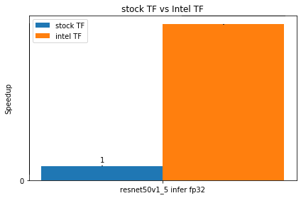

# `TensorFlow Performance Analysis by using Intel Model Zoo` Sample
This sample contains two Jupyter notebooks from Intel Model Zoo to help users analyze the performance difference between Stock Tensorflow and Intel Tensorflow.  

| Optimized for                     | Description
|:---                               |:---
| OS                                | Linux* Ubuntu* 18.04 
| Hardware                          | Intel® Xeon® Scalable processor family or newer
| Software                          | Intel® oneAPI AI Analytics Toolkit
| What you will learn               | Analyze the performance benefit from using Intel Optimizations for Tensorflow*
| Time to complete                  | 40 minutes

## Purpose
[Intel Model Zoo](https://github.com/IntelAI/models) contains links to pre-trained models, sample scripts, best practices, and step-by-step tutorials for many popular open-source machine learning models optimized by Intel to run on Intel® Xeon® Scalable processors.

This sample helps demonstrate AI workloads and deep learning models optimized by Intel and validated to run on Intel hardware. Using the Tensorflow Timeline, you can analyze the performance benefits from Intel Optimizations for Tensorflow* and oneDNN among different layers to efficiently execute, train, and deploy Intel-optimized models

## Key implementation details
### Jupyter Notebooks 
 
Jupyter notebooks help users analyze the performance benefit from using Intel Optimizations for Tensorflow with the oneDNN library.  

>The notebooks are released with oneAPI AI Analytics Toolkit, and they are under the /opt/intel/oneapi/modelzoo/latest/models/docs/notebooks/perf_analysis folder.  
Users could also find the notebooks in Model Zoo Github by following the links in the below table.  

| Analysis Type | Notebook | Notes|
| ------ | ------ | ------ |
|stock vs. Intel Tensorflow | 1. [benchmark_perf_comparison](https://github.com/IntelAI/models/blob/master/docs/notebooks/perf_analysis/benchmark_perf_comparison.ipynb) | Compare performance between Stock and Intel Tensorflow among different models  |
|^| 2. [benchmark_perf_timeline_analysis](https://github.com/IntelAI/models/blob/master/docs/notebooks/perf_analysis/benchmark_perf_comparison.ipynb) | Analyze the performance benefit from oneDNN among different layers by using Tensorflow Timeline |  
|fp32 vs. bf16 vs. int8 | 1. [benchmark_data_types_perf_comparison](https://github.com/IntelAI/models/blob/master/docs/notebooks/perf_analysis/benchmark_data_types_perf_comparison.ipynb) | Compare Model Zoo benchmark performance among different data types on Intel Optimizations for  Tensorflow  |
|^| 2.[benchmark_data_types_perf_timeline_analysis](https://github.com/IntelAI/models/blob/master/docs/notebooks/perf_analysis/benchmark_data_types_perf_timeline_analysis.ipynb) | Analyze the bf16/int8 data type performance benefit from oneDNN among different layers by using Tensorflow Timeline |  

    
## License  
Code samples are licensed under the MIT license. See
[License.txt](https://github.com/oneapi-src/oneAPI-samples/blob/master/License.txt) for details.

Third party program Licenses can be found here: [third-party-programs.txt](https://github.com/oneapi-src/oneAPI-samples/blob/master/third-party-programs.txt)

## Build and Run the Sample

### Prerequisites
> NOTE: No prerequisite is required if users use Intel DevCloud as their environment. 
 1. **Intel® AI Analytics Toolkit**  
       You can refer to the oneAPI [main page](https://software.intel.com/en-us/oneapi) for toolkit installation,   
       and the Toolkit [Getting Started Guide for Linux](https://software.intel.com/en-us/get-started-with-intel-oneapi-linux-get-started-with-the-intel-ai-analytics-toolkit) for post-installation steps and scripts.

 2. **Jupyter Notebook**
       Users can install via PIP by `$pip install notebook`.
       Users can also refer to the [installation link](https://jupyter.org/install) for details.

#### **Conda Environment Creation**

##### **1. Intel® DevCloud for oneAPI**
---
###### **Stock TensorFlow**

1. Create conda env: `$conda create -n stock-tensorflow python matplotlib ipykernel psutil pandas gitpython`
2. Activate the created conda env: `$source activate stock-tensorflow.`
3. Install stock Tensorflow with a specific version: `(stock-tensorflow) $pip install tensorflow==2.6.0`
4. Install extra needed package: `(stock-tensorflow) $pip install cxxfilt`
5. Deactivate conda env: `(stock-tensorflow)$conda deactivate`
6. Register the kernel to Jupyter NB: `$~/.conda/envs/stock-tensorflow/bin/python -m ipykernel install --user --name=stock-tensorflow`

>  NOTE: Please change the python path if you have a different folder path for anaconda3.
   After profiling, users can remove the kernel from Jupyter NB with `$jupyter kernelspec uninstall stock-tensorflow.`
###### **Intel TensorFlow**

> NOTE: Intel-optimized Tensorflow is on DevCloud. However, users don't have access to install extra packages. 
  Therefore, we need to clone Intel Tensorflow into the user's home directory for installing extra packages.
1. Source oneAPI environment variables: `$source /opt/intel/oneapi/setvars.sh`
2. Create conda env: `$conda create --name intel-tensorflow --clone tensorflow`  
3. Activate the created conda env: `$source activate intel-tensorflow`  
4  Install the extra needed package: `(intel-tensorflow) $pip install cxxfilt matplotlib ipykernel psutil pandas gitpython`  
5. Deactivate conda env: `(intel-tensorflow)$conda deactivate`  
6. Register the kernel to Jupyter NB: `$~/.conda/envs/intel-tensorflow/bin/python  -m ipykernel install --user --name=intel-tensorflow`

> NOTE: Please change the python path if you have a different folder path for anaconda3. 
  After profiling, users can remove the kernel from Jupyter NB with `$jupyter kernelspec uninstall intel-tensorflow.`
  
  
   
##### **2. Linux with Intel® oneAPI AI Analytics Toolkit (AI Kit)**   
---
###### **Stock TensorFlow**

1. Create conda env: `$conda create -n stock-tensorflow python matplotlib ipykernel psutil pandas gitpython`

2. Activate the created conda env: `$conda activate stock-tensorflow`
3. Install stock tensorflow with a specific version: `(stock-tensorflow) $pip install tensorflow==2.6.0`
4. Install extra needed package: `(stock-tensorflow) $pip install cxxfilt`
5. Deactivate conda env: `(stock-tensorflow)$conda deactivate`
6. Register the kernel to Jupyter NB: `$~/anaconda3/envs/stock-tensorflow/bin/python  -m ipykernel install --user --name=stock-tensorflow`

> NOTE: Please change the python path if you have a different folder path for anaconda3. 
  After profiling, users can remove the kernel from Jupyter NB with `$jupyter kernelspec uninstall stock-tensorflow.`

###### **Intel TensorFlow**

1. Source oneAPI environment variables: `$source /opt/intel/oneapi/setvars.sh`
2. Create conda env: `$conda create --name intel-tensorflow --clone tensorflow`
3. Activate the created conda env: `$source activate intel-tensorflow`
4  Install the extra needed package: `(intel-tensorflow) $pip install cxxfilt matplotlib ipykernel psutil pandas gitpython`
5. Deactivate conda env: `(intel-tensorflow)$conda deactivate`
6. Register the kernel to Jupyter NB: `$~/anaconda3/envs/intel-tensorflow/bin/python  -m ipykernel install --user --name=intel-tensorflow`

> NOTE: Please change the python path if you have a different folder path for anaconda3. 
  After profiling, users can remove the kernel from Jupyter NB with `$jupyter kernelspec uninstall intel-tensorflow.`

### Running the Sample

1. Copy the Intel Model Zoo from your AI Analytics Toolkit installation path: `$cp -rf /opt/intel/oneapi/modelzoo/latest/models ~/`
2. cd ~/models; git init; git add . ; git commit -m 'initial commit'
3. Launch Jupyter notebook: `$jupyter notebook --ip=0.0.0.0`
4. Follow the instructions to open the URL with the token in your browser
5. Browse to the `models/docs/notebooks/perf_analysis` folder
6. Click the `benchmark_perf_comparison.ipynb` or `benchmark_perf_timeline_analysis.ipynb` file
7. Change your Jupyter notebook kernel to either "stock-tensorflow" or "intel-tensorflow" (highlighted in the diagram below)
      
8. Run through every cell of the notebook one by one

> NOTE: To compare stock and Intel-optimized TF results in the section "Analyze TF Timeline results among Stock and Intel Tensorflow," users need to run all cells before the comparison section with both stock-tensorflow and intel-tensorflow kernels.  

> NOTE: Users will run the jupyter notebooks on the login node of the DevCloud for now.

### Example of Output
Users should be able to see some diagrams for performance comparison and analysis.
One example of performance comparison diagrams:
  

For performance analysis, users can also see pie charts for top hotspots of Tensorflow* operations among Stock and Intel Tensorflow.
One example of performance analysis diagrams:
  
