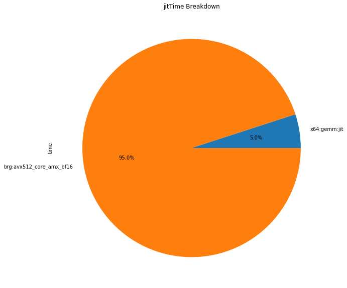

# `TensorFlow* Transformer with Advanced Matrix Extensions bfloat16 Mixed Precision Learning` Sample 

The `TensorFlow* Transformer with Advanced Matrix Extensions bfloat16 Mixed Precision Learning` sample code demonstrates optimizing a TensorFlow* model with Intel® Advanced Matrix Extensions (Intel® AMX) using bfloat16 (Brain Floating Point) on 4th Gen Intel® Xeon® processors (formerly Sapphire Rapids).

| Area                  | Description
|:---                   |:--
 What you will learn    | How to use Intel® AMX bfloat16 mixed precision learning on a TensorFlow* model
| Time to complete      | 15 minutes
| Category              | Getting Started

> **Note**: The sample is based on the [*Text classification with Transformer*](https://keras.io/examples/nlp/text_classification_with_transformer/) Keras sample.

## Purpose

In this sample, you will run a transformer classification model with bfloat16 mixed precision learning on Intel® AMX ISA and compare the performance against AVX512. You should notice that using Intel® AMX results in performance increases when compared to AVX512 while retaining the expected precision.

## Prerequisites

>**Note**: The code in the sample works on 4th Gen Intel® Xeon® processors (formerly Sapphire Rapids) only.

| Optimized for             | Description
|:---                       |:---
| OS                        | Ubuntu* 20.04
| Hardware                  | 4th Gen Intel® Xeon® processors
| Software                  | Intel® AI Analytics Toolkit (AI Kit)

The sample assumes Intel® Optimization for TensorFlow* is installed. (See the [Intel® Optimization for TensorFlow* Installation Guide](https://www.intel.com/content/www/us/en/developer/articles/guide/optimization-for-TensorFlow-installation-guide.html) for more information.)

### For Local Development Environments

You will need to download and install the following toolkits, tools, and components to use the sample.

- **Intel® AI Analytics Toolkit (AI Kit)**

  You can get the AI Kit from [Intel® oneAPI Toolkits](https://www.intel.com/content/www/us/en/developer/tools/oneapi/toolkits.html#analytics-kit). <br> See [*Get Started with the Intel® AI Analytics Toolkit for Linux**](https://www.intel.com/content/www/us/en/develop/documentation/get-started-with-ai-linux) for AI Kit installation information and post-installation steps and scripts.

- **Jupyter Notebook**

  Install using PIP: `$pip install notebook`. <br> Alternatively, see [*Installing Jupyter*](https://jupyter.org/install) for detailed installation instructions.


- **Intel® oneAPI Data Analytics Library (oneDAL)**

  You might need some parts of the [Intel® oneAPI Data Analytics Library](https://software.intel.com/content/www/us/en/develop/tools/oneapi/components/onedal.html).


### For Intel® DevCloud

The necessary tools and components are already installed in the environment. You do not need to install additional components. See [Intel® DevCloud for oneAPI](https://devcloud.intel.com/oneapi/get_started/) for information.


## Key Implementation Details

The sample code is written in Python and targets 4th Gen Intel® Xeon® processors (formerly Sapphire Rapids) only.

## Set Environment Variables

When working with the command-line interface (CLI), you should configure the oneAPI toolkits using environment variables. Set up your CLI environment by sourcing the `setvars` script every time you open a new terminal window. This practice ensures that your compiler, libraries, and tools are ready for development.

## Run the Sample

### On Linux*

> **Note**: If you have not already done so, set up your CLI
> environment by sourcing  the `setvars` script in the root of your oneAPI installation.
>
> Linux*:
> - For system wide installations: `. /opt/intel/oneapi/setvars.sh`
> - For private installations: ` . ~/intel/oneapi/setvars.sh`
> - For non-POSIX shells, like csh, use the following command: `bash -c 'source <install-dir>/setvars.sh ; exec csh'`
>
> For more information on configuring environment variables, see [Use the setvars Script with Linux* or macOS*](https://www.intel.com/content/www/us/en/develop/documentation/oneapi-programming-guide/top/oneapi-development-environment-setup/use-the-setvars-script-with-linux-or-macos.html).

#### Activate Conda

1. Activate the Conda environment.
    ```
    conda activate tensorflow
    ```
   By default, the AI Kit is installed in the `/opt/intel/oneapi` folder and requires root privileges to manage it.

   You can choose to activate Conda environment without root access. To bypass root access to manage your Conda environment, clone and activate your desired Conda environment using the following commands similar to the following.

   ```
   conda create --name usr_tensorflow --clone tensorflow
   conda activate usr_tensorflow
   ```

#### Run Jupyter NoteBook

1. Launch Jupyter Notebook.
   ```
   jupyter notebook --ip=0.0.0.0
   ```
2. Follow the instructions to open the URL with the token in your browser.
3. Locate and select the Notebook.
   ```
   IntelTensorFlow_Transformer_AMX_bfloat16_MixedPrecision.ipynb
   ```
4. Run every cell in the Notebook in sequence.

#### Troubleshooting

If you receive an error message, troubleshoot the problem using the **Diagnostics Utility for Intel® oneAPI Toolkits**. The diagnostic utility provides configuration and system checks to help find missing dependencies, permissions errors, and other issues. See the *[Diagnostics Utility for Intel® oneAPI Toolkits User Guide](https://www.intel.com/content/www/us/en/develop/documentation/diagnostic-utility-user-guide/top.html)* for more information on using the utility.

### Run the Sample on Intel® DevCloud

1. If you do not already have an account, request an Intel® DevCloud account at [*Create an Intel® DevCloud Account*](https://intelsoftwaresites.secure.force.com/DevCloud/oneapi).
2. On a Linux* system, open a terminal.
3. SSH into Intel® DevCloud.
   ```
   ssh DevCloud
   ```
   > **Note**: You can find information about configuring your Linux system and connecting to Intel DevCloud at Intel® DevCloud for oneAPI *[Get Started](https://devcloud.intel.com/oneapi/get_started)*.

4. Locate and select the Notebook.
   ```
   IntelTensorFlow_Transformer_AMX_bfloat16_MixedPrecision.ipynb
   ```
5. Run every cell in the Notebook in sequence.


## Example Output

You should see diagrams demonstrating performance analysis formatted, as pie charts, for JIT Kernel Type Time breakdown for both AVX512 and AMX.

The following image shows a typical example of JIT Kernel Time breakdown file analysis diagrams.



## Further Reading

Explore *[Get Started with the Intel® AI Analytics Toolkit for Linux*](https://www.intel.com/content/www/us/en/develop/documentation/get-started-with-ai-linux/top.html)* to find out how you can achieve performance gains for popular deep-learning and machine-learning frameworks through Intel optimizations.

## License

Code samples are licensed under the MIT license. See [License.txt](https://github.com/oneapi-src/oneAPI-samples/blob/master/License.txt)
for details.

Third party program Licenses can be found here: [third-party-programs.txt](https://github.com/oneapi-src/oneAPI-samples/blob/master/third-party-programs.txt).