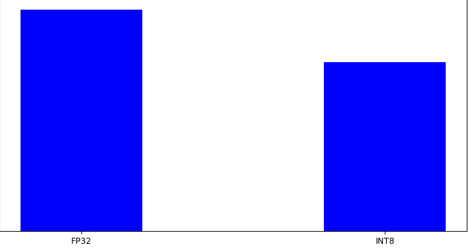

# `Getting Started with Intel® Neural Compressor for Quantization` Sample

The sample is a getting started tutorial for the Intel® Neural Compressor (INC), and demonstrates how to perform INT8 quantization on a Hugging Face BERT model. This sample shows how to achieve performance boosts using Intel hardware.

| Area                  | Description
|:---                   |:---
| What you will learn   | How to quantize a BERT model using Intel® Neural Compressor
| Time to complete      | 20 minutes
| Category              | Code Optimization

## Purpose

Intel® Neural Compressor comes with many options for deep learning model compression, one of them being INT8 Quantization. Quantization help to reduce the size of the model, which enables faster inference. The approach requires a trade-off in reduced accuracy for the reduced size; however, Intel® Neural Compressor provides automated accuracy-driven tuning recipes that will allow you to quantize your model and maintain your model accuracy goals.

The sample starts by loading a BERT model from Hugging Face. After loading the model, we set up an evaluation function that we care about using PyTorch* Dataset and DataLoader classes. Using this evaluation function, Intel® Neural Compressor can perform both post training static and dynamic quantization to achieve the speedups.

## Prerequisites

| Optimized for           | Description
|:---                     |:---
| OS                      | Ubuntu* 20.04 (or newer)
| Hardware                | Intel® Xeon® Scalable processor family
| Software                | Intel® Neural Compressor, Intel® Extension of PyTorch*

> **Note**: AI and Analytics samples are validated on AI Tools Offline Installer. For the full list of validated platforms refer to [Platform Validation](https://github.com/oneapi-src/oneAPI-samples/tree/master?tab=readme-ov-file#platform-validation).

## Key Implementation Details
The sample contains one Jupyter Notebook and one Python script. It can be run using Jupyter notebooks or the offline installer.

### Use the following steps to run using Jupyter notebook or Python script

|Notebook                  |Description
|:---                      |:---
|`quantize_with_inc.ipynb` | Get started tutorial for using Intel® Neural Compressor for PyTorch*

### Python Script

|Script                    |Description
|:---                      |:---
|`dataset.py`              | The script provides a PyTorch* Dataset class that tokenizes text data 

### Environment Setup

You will need to download and install the following toolkits, tools, and components to use the sample.

**1. Get Intel® AI Tools**

Required AI Tools: **Intel® Neural Compressor, Intel® Extension of PyTorch***. 
<br>If you have not already, select and install these Tools via via [AI Tools Selector](https://www.intel.com/content/www/us/en/developer/tools/oneapi/ai-tools-selector.html). AI and Analytics samples are validated on AI Tools Offline Installer. It is recommended to select Offline Installer option in AI Tools Selector.

**2. Install dependencies**
```
pip install -r requirements.txt
```
**Install Jupyter Notebook** by running `pip install notebook`. Alternatively, see [Installing Jupyter](https://jupyter.org/install) for detailed installation instructions.

## Run the `Getting Started with Intel® Neural Compressor for Quantization` Sample 

>**Note**: Before running the sample, make sure [Environment Setup](https://github.com/oneapi-src/oneAPI-samples/tree/master/AI-and-Analytics/Getting-Started-Samples/INC-Quantization-Sample-for-PyTorch#environment-setup) is completed.

Go to the section which corresponds to the installation method chosen in [AI Tools Selector](https://www.intel.com/content/www/us/en/developer/tools/oneapi/ai-tools-selector.html) to see relevant instructions:
* [AI Tools Offline Installer (Validated)](#ai-tools-offline-installer-validated)
* [Conda/PIP](#condapip) 
* [Docker](#docker)

### AI Tools Offline Installer (Validated)  
1. If you have not already done so, activate the AI Tools bundle base environment. 
If you used the default location to install AI Tools, open a terminal and type the following
```
source $HOME/intel/oneapi/intelpython/bin/activate
```
If you used a separate location, open a terminal and type the following
```
source <custom_path>/bin/activate
```
2. Activate the Conda environment:
```
conda activate pytorch
``` 
3. Clone the GitHub repository:
``` 
git clone https://github.com/oneapi-src/oneAPI-samples.git
cd oneAPI-samples/AI-and-Analytics/Getting-Started-Samples
```
4. Launch Jupyter Notebook: 
> **Note**: You might need to register Conda kernel to Jupyter Notebook kernel, 
feel free to check [the instruction](https://github.com/IntelAI/models/tree/master/docs/notebooks/perf_analysis#option-1-conda-environment-creation)
```
jupyter notebook --ip=0.0.0.0
```
5. Follow the instructions to open the URL with the token in your browser.
6. Select the Notebook:
```
quantize_with_inc.ipynb
```
7. Change the kernel to `pytorch`
8. Run every cell in the Notebook in sequence.

### Conda/PIP
> **Note**: Make sure your Conda/Python environment with AI Tools installed is activated
1. Clone the GitHub repository:
``` 
git clone https://github.com/oneapi-src/oneAPI-samples.git
cd oneAPI-samples/AI-and-Analytics/Getting-Started-Samples
```
2. Launch Jupyter Notebook: 
> **Note**: You might need to register Conda kernel to Jupyter Notebook kernel, 
feel free to check [the instruction](https://github.com/IntelAI/models/tree/master/docs/notebooks/perf_analysis#option-1-conda-environment-creation)
```
jupyter notebook --ip=0.0.0.0
```
4. Follow the instructions to open the URL with the token in your browser.
5. Select the Notebook:
```
quantize_with_inc.ipynb
```
6. Run every cell in the Notebook in sequence.

### Docker
AI Tools Docker images already have Get Started samples pre-installed. Refer to [Working with Preset Containers](https://github.com/intel/ai-containers/tree/main/preset) to learn how to run the docker and samples.
 
## Example Output
You should see an image showing the performance comparison and analysis between FP32 and INT8.
>**Note**: The image shown below is an example of a general performance comparison for inference speedup obtained by quantization. (Your results might be different.)


## Related Samples
* [Fine-tuning Text Classification Model with Intel® Neural Compressor (INC)](https://github.com/oneapi-src/oneAPI-samples/tree/master/AI-and-Analytics/Features-and-Functionality/INC_QuantizationAwareTraining_TextClassification)
* [Optimize PyTorch* Models using Intel® Extension for PyTorch* (IPEX)](https://github.com/oneapi-src/oneAPI-samples/tree/master/AI-and-Analytics/Features-and-Functionality/INC_QuantizationAwareTraining_TextClassification)
## License

Code samples are licensed under the MIT license. See
[License.txt](https://github.com/oneapi-src/oneAPI-samples/blob/master/License.txt) for details.

Third party program Licenses can be found here: [third-party-programs.txt](https://github.com/oneapi-src/oneAPI-samples/blob/master/third-party-programs.txt).

*Other names and brands may be claimed as the property of others. [Trademarks](https://www.intel.com/content/www/us/en/legal/trademarks.html)
