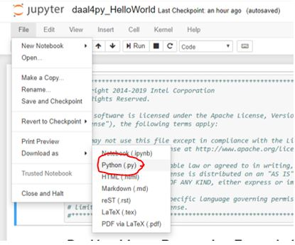

# Intel Python XGBoost Getting Started
This Getting Started sample code show how to use Intel optimized XGBoost published as part of IntelAI Analytics Toolkit powered by oneAPI. The sample also illustrates how to setup and train an XGBoost* model on datasets for prediction. It demonstrates how to use software products that can be found in the [Intel AI Analytics Toolkit powered by oneAPI](https://software.intel.com/content/www/us/en/develop/tools/oneapi/ai-analytics-toolkit.html). 

| Optimized for                     | Description
| :---                              | :---
| OS                                | 64-bit Linux: Ubuntu 18.04 or higher, 64-bit Windows 10, macOS 10.14 or higher
| Hardware                          | Intel Atom® Processors; Intel® Core™ Processor Family; Intel® Xeon® Processor Family; Intel® Xeon® Scalable Performance Processor Family
| Software                          | XGBoost, Intel® AI Analyics Toolkit
| What you will learn               | basic XGBoost programming model for Intel CPU
| Time to complete                  | 5 minutes

## Purpose

XGBoost* is a widely used gradient boosting library in the classical ML area. Designed for flexibility, performance, and portability, XGBoost* includes optimized distributed gradient boosting frameworks and implements Machine Learning algorithms underneath.

In this sample you will learn how to use Intel optimized XGBoost published as part of IntelAI Analytics Toolkit powered by oneAPI. The sample also illustrates how to setup and train an XGBoost* model on datasets for prediction. 
  
## Key Implementation Details 
This Getting Started sample code is implemented for CPU using the Python language. The example assumes you have XGboost installed inside a conda environment, similar to what is delivered with the installation of the Intel(R) Distribution for Python as part of the [oneAPI AI Analytics Toolkit powered by oneAPI](https://software.intel.com/en-us/oneapi/ai-kit). 

## License  
This code sample is licensed under MIT license

## Building XGBoost for CPU

XGBoost* is ready for use once you finish the Intel AI Analytics Toolkit installation, and have run the post installation script.

You can refer to the oneAPI [main page](https://software.intel.com/en-us/oneapi) for toolkit installation, and the Toolkit [Getting Started Guide for Linux](https://software.intel.com/en-us/get-started-with-intel-oneapi-linux-get-started-with-the-intel-ai-analytics-toolkit) for post-installation steps and scripts.

### Activate conda environment With Root Access

Please follow the Getting Started Guide steps (above) to set up your oneAPI environment with the `setvars.sh script`. Then navigate in Linux shell to your oneapi installation path, typically `/opt/intel/oneapi/` when installed as root or sudo, and `~/intel/oneapi/` when not installed as a super user. If you customized the installation folder, the `setvars.sh` file is in your custom folder. 

However, if you activated another environment, you can return with the following command:

#### On a Linux* System
```
source activate base
```

### Activate conda environment Without Root Access (Optional)

By default, the Intel AI Analytics Toolkit is installed in the inteloneapi folder, which requires root privileges to manage it. If you would like to bypass using root access to manage your conda environment, then you can clone your desired conda environment using the following command:

#### On a Linux* System
```
conda create --name user_base --clone base
```

Then activate your conda environment with the following command:

```
source activate user_base
```

### Install Jupyter Notebook

Launch Jupyter Notebook in the directory housing the code example

```
conda install jupyter nb_conda_kernels
```

#### View in Jupyter Notebook

_Note: This distributed execution cannot be launched from the jupyter notebook version, but you can still view inside the notebook to follow the included write-up and description._

Launch Jupyter Notebook in the directory housing the code example

```
jupyter notebook
```
## Running the Sample

### Running the Sample as a Jupyter Notebook

Open .pynb file and run cells in Jupyter Notebook using the "Run" button (see image using "Modin Getting Started" sample)


##### Expected Printed Output for Cells (with similar numbers):
```
RMSE: 11.113036205909719
[CODE_SAMPLE_COMPLETED_SUCCESFULLY]
```


### Running the Sample as a Python File

Open notebook in Jupyter and download as python file (see image using "daal4py Hello World"  sample)



Run the Program

`python IntelPython_XGBoost_GettingStarted.py`

The output files of the script will be saved in the included models and results directories. 

##### Expected Printed Output (with similar numbers):
```
RMSE: 11.113036205909719
[CODE_SAMPLE_COMPLETED_SUCCESFULLY]
```

