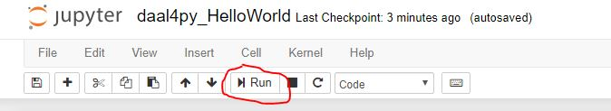

# Intel Python daal4py Getting Started
This Getting Started sample code show how to do batch linear regression using the python API package daal4py from oneDAL. It demonstrates how to use software products that can be found in the [Intel oneAPI Data Analytics Library](https://software.intel.com/content/www/us/en/develop/tools/oneapi/components/onedal.html) or the [Intel AI Analytics Toolkit powered by oneAPI](https://software.intel.com/content/www/us/en/develop/tools/oneapi/ai-analytics-toolkit.html). 

| Optimized for                     | Description
| :---                              | :---
| OS                                | 64-bit Linux: Ubuntu 18.04 or higher, 64-bit Windows 10, macOS 10.14 or higher
| Hardware                          | Intel Atom® Processors; Intel® Core™ Processor Family; Intel® Xeon® Processor Family; Intel® Xeon® Scalable Performance Processor Family
| Software                          | oneDAL Software Library, Python version >= 3.6, conda-build version >= 3, C++ compiler with C++11 support, Pickle, Pandas, NumPy
| What you will learn               | basic oneDAL programming model for Intel CPU
| Time to complete                  | 5 minutes

## Purpose

daal4py is a simplified API to Intel® DAAL that allows for fast usage of the framework suited for Data Scientists or Machine Learning users. Built to help provide an abstraction to Intel® DAAL for either direct usage or integration into one's own framework.

In this sample you will run a batch Linear Regression model with oneDAL daal4py library memory objects. You will also learn how to train a model and save the information to a file.
  
## Key Implementation Details 
This Getting Started sample code is implemented for CPU using the Python language. The example assumes you have daal4py and scikit-learn installed inside a conda environment, similar to what is delivered with the installation of the Intel(R) Distribution for Python as part of the [oneAPI AI Analytics Toolkit powered by oneAPI](https://software.intel.com/en-us/oneapi/ai-kit). 

## License  
This code sample is licensed under MIT license

## Building daal4py for CPU

oneAPI Data Analytics Library is ready for use once you finish the Intel AI Analytics Toolkit installation, and have run the post installation script.

You can refer to the oneAPI [main page](https://software.intel.com/en-us/oneapi) for toolkit installation, and the Toolkit [Getting Started Guide for Linux](https://software.intel.com/en-us/get-started-with-intel-oneapi-linux-get-started-with-the-intel-ai-analytics-toolkit) for post-installation steps and scripts.

### Activate conda environment With Root Access

Please follow the Getting Started Guide steps (above) to set up your oneAPI environment with the `setvars.sh` script. Then navigate in Linux shell to your oneapi installation path, typically `/opt/intel/oneapi/` when installed as root or sudo, and `~/intel/oneapi/` when not installed as a super user. If you customized the installation folder, the `setvars.sh` file is in your custom folder. 

Intel Python environment will be activte by default. However, if you activated another environment, you can return with the following command:

#### On a Linux* System
```
source activate base
```

### Activate conda environment Without Root Access (Optional)

By default, the Intel AI Analytics Toolkit is installed in the inteloneapi folder, which requires root privileges to manage it. If you would like to bypass using root access to manage your conda environment, then you can clone your desired conda environment using the following command:

#### On a Linux* System
```
conda create --name usr_intelpython --clone base
```

Then activate your conda environment with the following command:

```
source activate usr_intelpython
```

### Install Jupyter Notebook

Launch Jupyter Notebook in the directory housing the code example

```
conda install jupyter nb_conda_kernels
```

#### View in Jupyter Notebook

_Note: This distributed execution cannot be launched from the jupyter notebook version, but you can still view inside the notebook to follow the included write-up and description._

Launch Jupyter Notebook in the directory housing the code example

```
jupyter notebook
```
## Running the Sample

### Running the Sample as a Jupyter Notebook

Open .pynb file and run cells in Jupyter Notebook using the "Run" button (see image)



##### Expected Printed Output for Cells (with similar numbers):
```
Here's our model:


 NumberOfBetas: 14

NumberOfResponses: 1

InterceptFlag: False

Beta: array(
  [[ 0.00000000e+00 -1.05416344e-01  5.25259886e-02  4.26844883e-03
     2.76607367e+00 -2.82517989e+00  5.49968304e+00  3.48833264e-03
    -8.73247684e-01  1.74005447e-01 -8.38917510e-03 -3.28044397e-01
     1.58423529e-02 -4.57542900e-01]],
  dtype=float64, shape=(1, 14))

NumberOfFeatures: 13

Here is one of our loaded model's features:

 [[ 0.00000000e+00 -1.05416344e-01  5.25259886e-02  4.26844883e-03
   2.76607367e+00 -2.82517989e+00  5.49968304e+00  3.48833264e-03
  -8.73247684e-01  1.74005447e-01 -8.38917510e-03 -3.28044397e-01
   1.58423529e-02 -4.57542900e-01]]
[CODE_SAMPLE_COMPLETED_SUCCESFULLY]
```


### Running the Sample as a Python File

Open notebook in Jupyter and download as python file


Run the Program

`python IntelPython_daal4py_GettingStarted.py`

The output files of the script will be saved in the included models and results directories. 

##### Expected Printed Output (with similar numbers):
```
Here's our model:


 NumberOfBetas: 14

NumberOfResponses: 1

InterceptFlag: False

Beta: array(
  [[ 0.00000000e+00 -1.05416344e-01  5.25259886e-02  4.26844883e-03
     2.76607367e+00 -2.82517989e+00  5.49968304e+00  3.48833264e-03
    -8.73247684e-01  1.74005447e-01 -8.38917510e-03 -3.28044397e-01
     1.58423529e-02 -4.57542900e-01]],
  dtype=float64, shape=(1, 14))

NumberOfFeatures: 13

Here is one of our loaded model's features:

 [[ 0.00000000e+00 -1.05416344e-01  5.25259886e-02  4.26844883e-03
   2.76607367e+00 -2.82517989e+00  5.49968304e+00  3.48833264e-03
  -8.73247684e-01  1.74005447e-01 -8.38917510e-03 -3.28044397e-01
   1.58423529e-02 -4.57542900e-01]]
[CODE_SAMPLE_COMPLETED_SUCCESFULLY]
```

