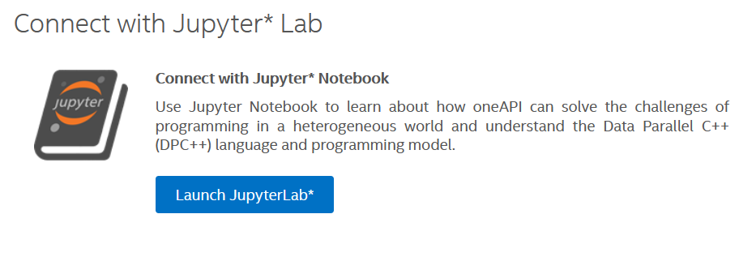
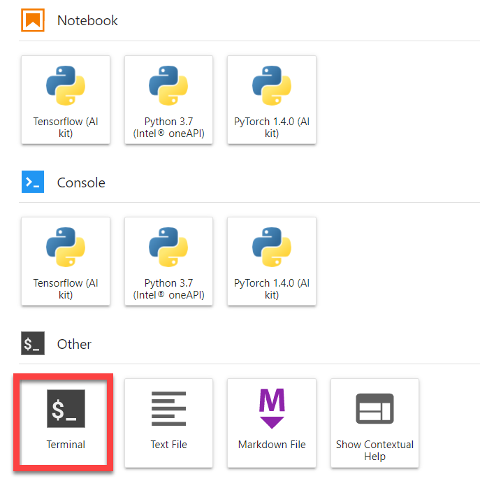
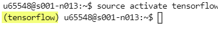

# `TensorFlow HelloWorld` Sample
TensorFlow* is a widely-used machine learning framework in the deep learning arena, demanding efficient computational resource utilization. To take full advantage of Intel® architecture and to extract maximum performance, the TensorFlow framework has been optimized using Intel® Deep Neural Networks (Intel® DNNL) primitives. This sample demonstrates how to train an example neural network and shows how Intel-optimized TensorFlow enables Intel® DNNL calls by default. 

| Optimized for                       | Description
|:---                               |:---
| OS                                | Linux* Ubuntu* 18.04 
| Hardware                          | Intel® Xeon® Scalable processor family or newer
| Software                          | Intel® oneAPI AI Analytics Toolkit
| What you will learn               | How to get started to use Intel optimization for TensorFlow*
| Time to complete                  | 10 minutes

## Purpose
This sample code shows how to get started with Intel Optimization for TensorFlow*. It implements an example neural network with one convolution layer and one ReLU layer. Developers can quickly build and train a Tensorflow neural network using a simple python code. Also, by controlling the build-in environment variable, the sample attempts to explicitly show how Intel® DNNL Primitives are called and their performance during the neural network training. 

Intel-optimized Tensorflow is available as part of the Intel® AI Analytics Toolkit. For more information on the optimizations and performance data, see this blog post [TensorFlow* Optimizations on Modern Intel® Architecture](https://software.intel.com/content/www/us/en/develop/articles/tensorflow-optimizations-on-modern-intel-architecture.html).

## Key implementation details
*Please* **export the environment variable `MKLDNN_VERBOSE=1`** *to display the deep learning primitives trace during execution.*

 - The training data is generated by `np.random`. 
 - The neural network with one convolution layer and one ReLU layer is created by `tf.nn.conv2d` and `tf.nn.relu`.
 - The TF session is inistialized by `tf.global_variables_initializer`.
 - The train is implemented via the below for-loop: 
    ```python
    for epoch in range(0, EPOCHNUM):
        for step in range(0, BS_TRAIN):
            x_batch = x_data[step*N:(step+1)*N, :, :, :]
            y_batch = y_data[step*N:(step+1)*N, :, :, :]
            s.run(train, feed_dict={x: x_batch, y: y_batch})
    ```
    
##### Note: For convenience, code line os.environ["MKLDNN_VERBOSE"] = "1" has been added in the body of the script as an alternative method to setting this variable.

Runtime settings for `MKLDNN_VERBOSE`, `KMP_AFFINITY`, and `Inter/Intra-op` Threads are set within the script. You can read more about these settings in this dedicated document: [Maximize TensorFlow Performance on CPU: Considerations and Recommendations for Inference Workloads](https://software.intel.com/en-us/articles/maximize-tensorflow-performance-on-cpu-considerations-and-recommendations-for-inference) 
    
## License
Code samples are licensed under the MIT license. See
[License.txt](https://github.com/oneapi-src/oneAPI-samples/blob/master/License.txt) for details.

Third party program Licenses can be found here: [third-party-programs.txt](https://github.com/oneapi-src/oneAPI-samples/blob/master/third-party-programs.txt)

## Build and Run the Sample on your Local Machine

These instructions demonstrate how to build and run a sample on a machine where you have installed the Intel AI Analytics Toolkit. If you would like to try a sample without installing a toolkit, see [Running Samples in DevCloud](#running-samples-in-devcloud).

### Pre-requirement

TensorFlow is ready for use once you finish the Intel AI Analytics Toolkit installation and have run the post installation script.

You can refer to the oneAPI [main page](https://software.intel.com/en-us/oneapi) for toolkit installation and the Toolkit [Getting Started Guide for Linux](https://software.intel.com/en-us/get-started-with-intel-oneapi-linux-get-started-with-the-intel-ai-analytics-toolkit) for post-installation steps and scripts.

### Activate conda environment With Root Access

Please follow the Getting Started Guide steps (above) to set up your oneAPI environment with the setvars.sh script. Then, navigate the Linux shell to your oneapi installation path, typically `~/intel/oneapi`. Activate the conda environment with the following command:

```
source /opt/intel/oneapi/setvars.sh
source activate tensorflow
```

please replace ~/intel/oneapi for your oneapi installation path.

### Activate conda environment Without Root Access (Optional)

By default, the Intel AI Analytics toolkit is installed in the inteloneapi folder, which requires root privileges to manage it. If you would like to bypass using root access to manage your conda environment, then you can clone your desired conda environment using the following command:

```
conda create --name user_tensorflow --clone tensorflow
```

Then activate your conda environment with the following command:

```
source activate user_tensorflow
```

## Running the Sample

To run the program on Linux*, type the following command in the terminal with Python installed:

1. Navigate to the directory with the TensorFlow sample:

```
cd ~/oneAPI-samples/AI-and-Analytics/Getting-Started Samples/IntelTensorFlow_GettingStarted
```
2. Run the sample:

```
    python TensorFlow_HelloWorld.py
```
### Example of Output
With successful execution, it will print out the following results:

```
    0 0.4147554
    1 0.3561021
    2 0.33979267
    3 0.33283564
    4 0.32920069
    [CODE_SAMPLE_COMPLETED_SUCCESSFULLY] 
```

If you export the DNNL_VERBOSE as 1 in the command line, the mkldnn run-time verbose trace should look similar to what is shown below:
```
export DNNL_VERBOSE=1
```
Then run the sample again:
```
python TensorFlow_HelloWorld.py
```
You will see the verbose output:
```
2021-01-06 10:44:28.875296: I tensorflow/compiler/xla/service/service.cc:176]   StreamExecutor device (0): Host, Default Version
dnnl_verbose,info,DNNL v1.2.0 (commit N/A)
dnnl_verbose,info,cpu,runtime:OpenMP
dnnl_verbose,info,cpu,isa:Intel AVX-512 with Intel DL Boost
dnnl_verbose,info,gpu,runtime:none
dnnl_verbose,exec,cpu,reorder,jit:uni,undef,src_f32::blocked:acdb:f0 dst_f32::blocked:abcd:f0,,,4x4x128x128,12.0649
dnnl_verbose,exec,cpu,reorder,simple:any,undef,src_f32::blocked:cdba:f0 dst_f32:p:blocked:Acdb16a:f0,,,10x4x3x3,0.187012
dnnl_verbose,exec,cpu,convolution,jit:avx512_common,forward_training,src_f32::blocked:abcd:f0 wei_f32:p:blocked:Acdb16a:f0 bia_undef::undef::f0 dst_f32:p:blocked:aBcd16b:f0,,alg:convolution_direct,mb4_ic4oc10_ih128oh128kh3sh1dh0ph1_iw128ow128kw3sw1dw0pw1,0.266113
```
Please see the [DNNL Developer's Guide](https://intel.github.io/mkl-dnn/dev_guide_verbose.html) for more details on the verbose log. 

## Running Samples In DevCloud (Optional)
### Run TensorFlow_HelloWorld in Jupyter Lab
1.	Open [Intel DevCloud](https://software.intel.com/content/www/us/en/develop/tools/devcloud.html).
2.	In the upper right corner, click Sign In.
3.	Log in with your Intel account username and password.
4.	Open Jupyter lab: https://jupyter.oneapi.devcloud.intel.com/

    a.	If you are redirected to the Intel DevCloud page, scroll to the bottom and select Launch Jupyter Lab.

    b.  When Jupyter Lab opens, if prompted for a kernel, select **No Kernel**.
5.	Close the Welcome page. The Launcher tab will appear.
6.  On the Launcher tab, click **Terminal**.


7.	You will see your login at the prompt.
8.	Activate the TensorFlow environment: 
source activate tensorflow
You will see (tensorflow) in your prompt.



9.	Change directories to the TensorFlow Getting Started sample directory.
```
cd ~/oneAPI-samples/AI-and-Analytics/Getting-Started-Samples/IntelTensorFlow_GettingStarted
```
10. Run the program:
```
python TensorFlow_HelloWorld.py
```
With successful execution, it will print out the following results:
 ```
 0 0.4147554
    1 0.3561021
    2 0.33979267
    3 0.33283564
    4 0.32920069
    [CODE_SAMPLE_COMPLETED_SUCCESSFULLY]
```
To see verbose output, enable verbose mode:

```
export DNNL_VERBOSE=1
```

Run the sample again to see the verbose output:
```
python TensorFlow_HelloWorld.py
```
The mkldnn run-time verbose trace should look similar to what is shown below:

```
2021-01-06 10:44:28.875296: I tensorflow/compiler/xla/service/service.cc:176]   StreamExecutor device (0): Host, Default Version
dnnl_verbose,info,DNNL v1.2.0 (commit N/A)
dnnl_verbose,info,cpu,runtime:OpenMP
dnnl_verbose,info,cpu,isa:Intel AVX-512 with Intel DL Boost
dnnl_verbose,info,gpu,runtime:none
dnnl_verbose,exec,cpu,reorder,jit:uni,undef,src_f32::blocked:acdb:f0 dst_f32::blocked:abcd:f0,,,4x4x128x128,12.0649
dnnl_verbose,exec,cpu,reorder,simple:any,undef,src_f32::blocked:cdba:f0 dst_f32:p:blocked:Acdb16a:f0,,,10x4x3x3,0.187012
dnnl_verbose,exec,cpu,convolution,jit:avx512_common,forward_training,src_f32::blocked:abcd:f0 wei_f32:p:blocked:Acdb16a:f0 bia_undef::undef::f0 dst_f32:p:blocked:aBcd16b:f0,,alg:convolution_direct,mb4_ic4oc10_ih128oh128kh3sh1dh0ph1_iw128ow128kw3sw1dw0pw1,0.266113
```

 
### Running the Sample in DevCloud with a Local Terminal
1.	Open a terminal on your Linux system.
2.	Log in to DevCloud.
```
ssh devcloud
```
3.	Enable job submission to the queue:
```
qsub -I
```
4.	Change directories to the TensorFlow Getting Started sample directory.
```
cd ~/oneAPI-samples/AI-and-Analytics/Getting-Started-Samples/IntelTensorFlow_GettingStarted
```
5.  To run the program on Linux* or the environment of Intel DevCloud:
```
python TensorFlow_HelloWorld.py
```
With successful execution, it will print out the following results:
```
    0 0.4147554
    1 0.3561021
    2 0.33979267
    3 0.33283564
    4 0.32920069
    [CODE_SAMPLE_COMPLETED_SUCCESSFULLY] 
```

To see verbose output, enable verbose mode:
```
export DNNL_VERBOSE=1
```
Run the sample again to see the verbose output:
```
python TensorFlow_HelloWorld.py
```

The mkldnn run-time verbose trace should look similar to what is shown below:

```
2021-01-06 10:44:28.875296: I tensorflow/compiler/xla/service/service.cc:176]   StreamExecutor device (0): Host, Default Version
dnnl_verbose,info,DNNL v1.2.0 (commit N/A)
dnnl_verbose,info,cpu,runtime:OpenMP
dnnl_verbose,info,cpu,isa:Intel AVX-512 with Intel DL Boost
dnnl_verbose,info,gpu,runtime:none
dnnl_verbose,exec,cpu,reorder,jit:uni,undef,src_f32::blocked:acdb:f0 dst_f32::blocked:abcd:f0,,,4x4x128x128,12.0649
dnnl_verbose,exec,cpu,reorder,simple:any,undef,src_f32::blocked:cdba:f0 dst_f32:p:blocked:Acdb16a:f0,,,10x4x3x3,0.187012
dnnl_verbose,exec,cpu,convolution,jit:avx512_common,forward_training,src_f32::blocked:abcd:f0 wei_f32:p:blocked:Acdb16a:f0 bia_undef::undef::f0 dst_f32:p:blocked:aBcd16b:f0,,alg:convolution_direct,mb4_ic4oc10_ih128oh128kh3sh1dh0ph1_iw128ow128kw3sw1dw0pw1,0.266113
```

### Run in Batch Mode on DevCloud
The batch script will activate your environment for each sample and run each sample.

1.	Navigate to the directory with the TensorFlow sample:
```
cd ~/oneAPI-samples/AI-and-Analytics/Getting-Started Samples/IntelTensorFlow_GettingStarted
```

2.	Create a new file titled hello-world.sh.
```
vim hello-world.sh
```
3.	Add these two lines to the top of the file:
```
source activate tensorflow
python TensorFlow_HelloWorld.py
```
4.	Save and exit your text editor
```
:wq
```
5.	You can now use the script to run in batch mode.
source hello-world.sh
6.	To add files to run in bach mode, open hello-world.sh and add each script or sample on a new line.


