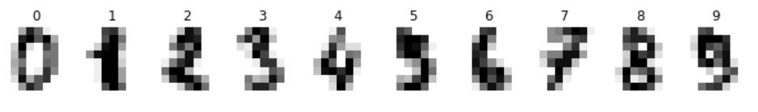
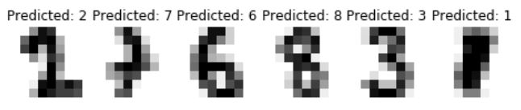

# `Intel® Python Scikit-learn Getting Started` Sample
Intel(R) Extension for Scikit-learn is a seamless way to speed up your Scikit-learn application. The acceleration is achieved through the use of the Intel(R) oneAPI Data Analytics Library (oneDAL).
This Getting Started sample code shows how to use support vector machine classifier from Intel(R) Extension for Scikit-learn for digit recognition problem. All other machine learning algorithms available with Scikit-learn can be used in the similar way. Intel(R) Extension for Scikit-learn is a seamless way to speed up scikit-learn application. The acceleration is achieved through the use of the Intel(R) oneAPI Data Analytics Library (oneDAL) [Intel oneAPI Data Analytics Library](https://software.intel.com/content/www/us/en/develop/tools/oneapi/components/onedal.html) which comes with [Intel® oneAPI AI Analytics Toolkit(AI kit)](https://software.intel.com/content/www/us/en/develop/tools/oneapi/ai-analytics-toolkit.html).

| Optimized for                     | Description
| :---                              | :---
| OS                                | 64-bit Linux: Ubuntu 18.04 or higher, 64-bit Windows* 10, macOS 10.14 or higher
| Hardware                          | Intel Atom® Processors; Intel® Core™ Processor Family; Intel® Xeon® Processor Family; Intel® Xeon® Scalable processor family
| Software                          | oneDAL Software Library, Python version >= 3.6, conda-build version >= 3, C++ compiler with C++11 support, Pickle, Pandas, NumPy
| What you will learn               | basic Intel(R) sklearn extension(sklearnex) programming model for Intel CPU
| Time to complete                  | 5 minutes

## Purpose

Intel(R) Extension for Scikit-learn* depends on Intel(R) daal4py. daal4py is a simplified API to Intel® oneDAL that allows for fast usage of the framework suited for Data Scientists or Machine Learning users. Built to help provide an abstraction to Intel® oneDAL for direct usage or integration into one's own framework.

In this sample, you will run a support vector classifier model from sklearn with oneDAL daal4py library memory objects. You will also learn how to train a model and save the information to a file.

## Key Implementation Details
This Getting Started sample code is implemented for CPU using the Python language. The example assumes you have Intel(R) Extension for Scikit-learn installed inside a conda environment, similar to what is delivered with the installation of the Intel&reg; Distribution for Python* as part of the [Intel® oneAPI AI Analytics Toolkit](https://software.intel.com/en-us/oneapi/ai-kit). Intel(R) Extension for Scikit-learn is available as a part of [Intel® oneAPI AI Analytics Toolkit(AI kit)]

## License
Code samples are licensed under the MIT license. See
[License.txt](https://github.com/oneapi-src/oneAPI-samples/blob/master/License.txt) for details.

Third party program Licenses can be found here: [third-party-programs.txt](https://github.com/oneapi-src/oneAPI-samples/blob/master/third-party-programs.txt)

## Running Samples on the Intel&reg; DevCloud
If you are running this sample on the DevCloud, see [Running Samples on the Intel&reg; DevCloud](#run-samples-on-devcloud)

## Building Intel(R) Extension for Scikit-learn for CPU

oneAPI Data Analytics Library is ready for use once you finish the Intel® oneAPI AI Analytics Toolkit installation and have run the post installation script.

You can refer to the oneAPI [main page](https://software.intel.com/en-us/oneapi) for toolkit installation and the Toolkit [Getting Started Guide for Linux](https://software.intel.com/en-us/get-started-with-intel-oneapi-linux-get-started-with-the-intel-ai-analytics-toolkit) for post-installation steps and scripts.


### Setting Environment Variables


For working at a Command-Line Interface (CLI), the tools in the oneAPI toolkits
are configured using environment variables. Set up your CLI environment by
sourcing the ``setvars`` script every time you open a new terminal window. This
will ensure that your compiler, libraries, and tools are ready for development.


#### Linux
Source the script from the installation location, which is typically in one of
these folders:


For root or sudo installations:


  ``. /opt/intel/oneapi/setvars.sh``


For normal user installations:

  ``. ~/intel/oneapi/setvars.sh``

**Note:** If you are using a non-POSIX shell, such as csh, use the following command:

     ``$ bash -c 'source <install-dir>/setvars.sh ; exec csh'``

If environment variables are set correctly, you will see a confirmation
message.

If you receive an error message, troubleshoot the problem using the
Diagnostics Utility for Intel® oneAPI Toolkits, which provides system
checks to find missing dependencies and permissions errors.
[Learn more](https://www.intel.com/content/www/us/en/develop/documentation/diagnostic-utility-user-guide/top.html).


**Note:** [Modulefiles scripts](https://www.intel.com/content/www/us/en/develop/documentation/oneapi-programming-guide/top/oneapi-development-environment-setup/use-modulefiles-with-linux.html)
    can also be used to set up your development environment.
    The modulefiles scripts work with all Linux shells.


**Note:** If you wish to fine
    tune the list of components and the version of those components, use
    a [setvars config file](https://www.intel.com/content/www/us/en/develop/documentation/oneapi-programming-guide/top/oneapi-development-environment-setup/use-the-setvars-script-with-linux-or-macos/use-a-config-file-for-setvars-sh-on-linux-or-macos.html)
    to set up your development environment.

#### Windows

Execute the  ``setvars.bat``  script from the root folder of your
oneAPI installation, which is typically:


  ``"C:\Program Files (x86)\Intel\oneAPI\setvars.bat"``


For Windows PowerShell* users, execute this command:

  ``cmd.exe "/K" '"C:\Program Files (x86)\Intel\oneAPI\setvars.bat" && powershell'``


If environment variables are set correctly, you will see a confirmation
message.

If you receive an error message, troubleshoot the problem using the
Diagnostics Utility for Intel® oneAPI Toolkits, which provides system
checks to find missing dependencies and permissions errors.
[Learn more](https://www.intel.com/content/www/us/en/develop/documentation/diagnostic-utility-user-guide/top.html).

### Activate conda environment With Root Access

Intel Python environment will be active by default. However, if you activated another environment, you can return with the following command:

#### On a Linux* System
```
source activate base
```

### Activate conda environment Without Root Access (Optional)

By default, the Intel® oneAPI AI Analytics Toolkit is installed in the inteloneapi folder, which requires root privileges to manage it. If you would like to bypass using root access to manage your conda environment, then you can clone your desired conda environment using the following command:

#### On a Linux* System
```
conda create --name usr_intelpython --clone base
```

Then activate your conda environment with the following command:

```
source activate usr_intelpython
```

### Install Jupyter Notebook

Launch Jupyter Notebook in the directory housing the code example

```
conda install jupyter nb_conda_kernels
```

#### View in Jupyter Notebook

_Note: This distributed execution cannot be launched from the jupyter notebook version, but you can still view inside the notebook to follow the included write-up and description._

Launch Jupyter Notebook in the directory housing the code example

```
jupyter notebook
```
## Running the Sample<a name="running-the-sample"></a>

### Running the Sample as a Jupyter Notebook<a name="run-as-jupyter-notebook"></a>

Open .ipynb file and run cells in Jupyter Notebook using the "Run" button (see image)


#### Expected Printed Output for Cells (with similar numbers):





Model accuracy on test data: 0.9833333333333333

[CODE_SAMPLE_COMPLETED_SUCCESFULLY]


### Running Samples on the Intel&reg; DevCloud (Optional)<a name="run-samples-on-devcloud"></a>

<!---Include the next paragraph ONLY if the sample runs in batch mode-->
### Run in Batch Mode
This sample runs in batch mode, so you must have a script for batch processing. Once you have a script set up, refer to [Running the Sample](#running-the-sample).

<!---Include the next paragraph ONLY if the sample DOES NOT RUN in batch mode-->
### Run in Interactive Mode
This sample runs in interactive mode. For more information, see [Run as Juypter Notebook](#run-as-jupyter-notebook).

### Request a Compute Node
In order to run on the DevCloud, you need to request a compute node using node properties such as: `gpu`, `xeon`, `fpga_compile`, `fpga_runtime` and others. For more information about the node properties, execute the `pbsnodes` command.
 This node information must be provided when submitting a job to run your sample in batch mode using the qsub command. When you see the qsub command in the Run section of the [Hello World instructions](https://devcloud.intel.com/oneapi/get_started/aiAnalyticsToolkitSamples/), change the command to fit the node you are using. Nodes which are in bold indicate they are compatible with this sample:

<!---Mark each compatible Node in BOLD-->
| Node              | Command                                                 |
| ----------------- | ------------------------------------------------------- |
| GPU               | qsub -l nodes=1:gpu:ppn=2 -d . hello-world.sh           |
| __CPU__           | __qsub -l nodes=1:xeon:ppn=2 -d . hello-world.sh__      |
| FPGA Compile Time | qsub -l nodes=1:fpga\_compile:ppn=2 -d . hello-world.sh |
| FPGA Runtime      | qsub -l nodes=1:fpga\_runtime:ppn=2 -d . hello-world.sh |


#### Expected Printed Output for Cells (with similar numbers):


Model accuracy on test data: 0.9833333333333333

[CODE_SAMPLE_COMPLETED_SUCCESFULLY]

### Build and run additional samples
Several sample programs are available for you to try, many of which can be compiled and run in a similar fashion. Experiment with running the various samples on different kinds of compute nodes or adjust their source code to experiment with different workloads.

### Troubleshooting
If an error occurs, troubleshoot the problem using the Diagnostics Utility for Intel® oneAPI Toolkits.
[Learn more](https://software.intel.com/content/www/us/en/develop/documentation/diagnostic-utility-user-guide/top.html)

### Using Visual Studio Code*  (Optional)

You can use Visual Studio Code (VS Code) extensions to set your environment, create launch configurations,
and browse and download samples.

The basic steps to build and run a sample using VS Code include:
 - Download a sample using the extension **Code Sample Browser for Intel oneAPI Toolkits**.
 - Configure the oneAPI environment with the extension **Environment Configurator for Intel oneAPI Toolkits**.
 - Open a Terminal in VS Code (**Terminal>New Terminal**).
 - Run the sample in the VS Code terminal using the instructions below.
 - (Linux only) Debug your GPU application with GDB for Intel® oneAPI toolkits using the Generate Launch Configurations extension.

To learn more about the extensions, see
[Using Visual Studio Code with Intel® oneAPI Toolkits](https://software.intel.com/content/www/us/en/develop/documentation/using-vs-code-with-intel-oneapi/top.html).

After learning how to use the extensions for Intel oneAPI Toolkits, return to this readme for instructions on how to build and run a sample.