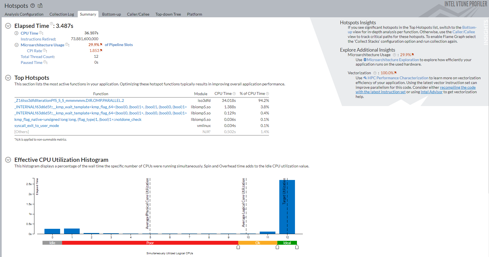
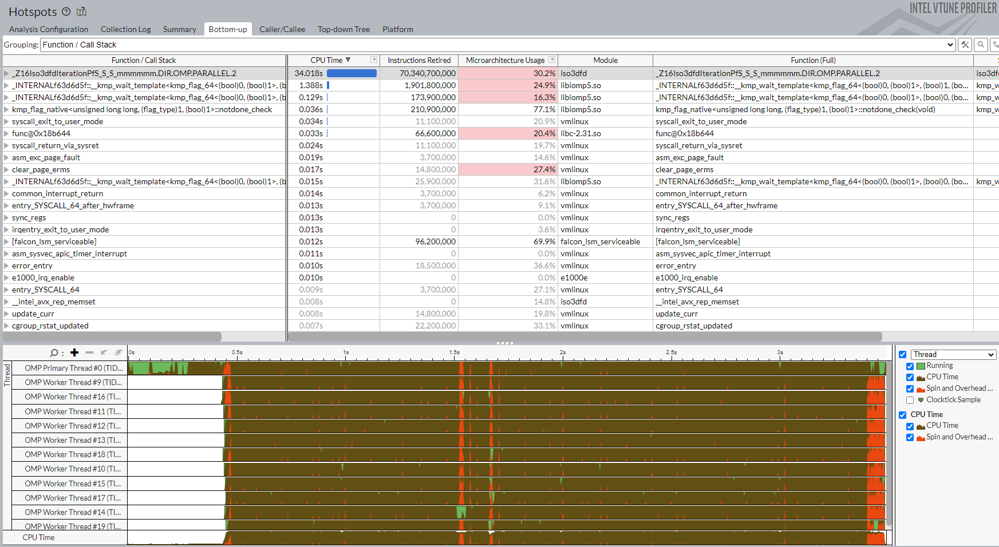
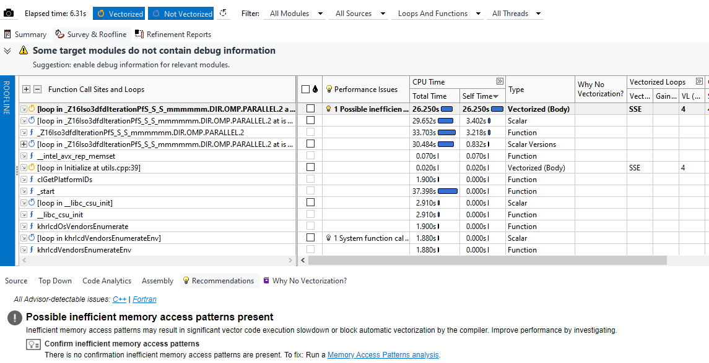
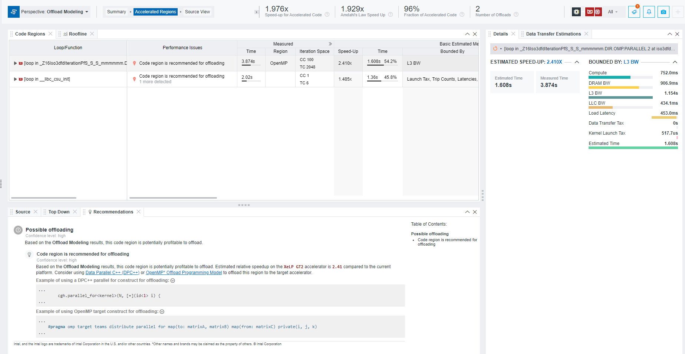
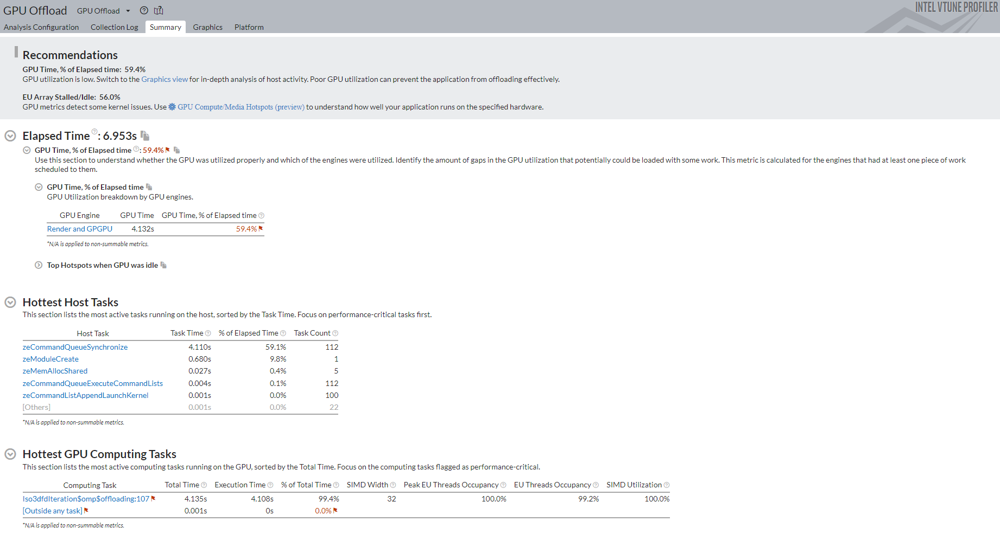
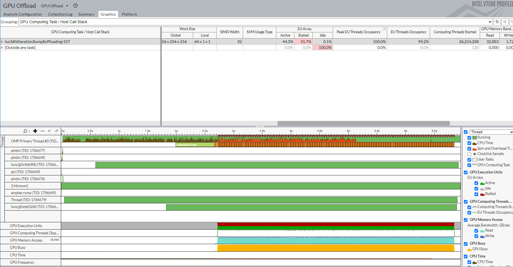
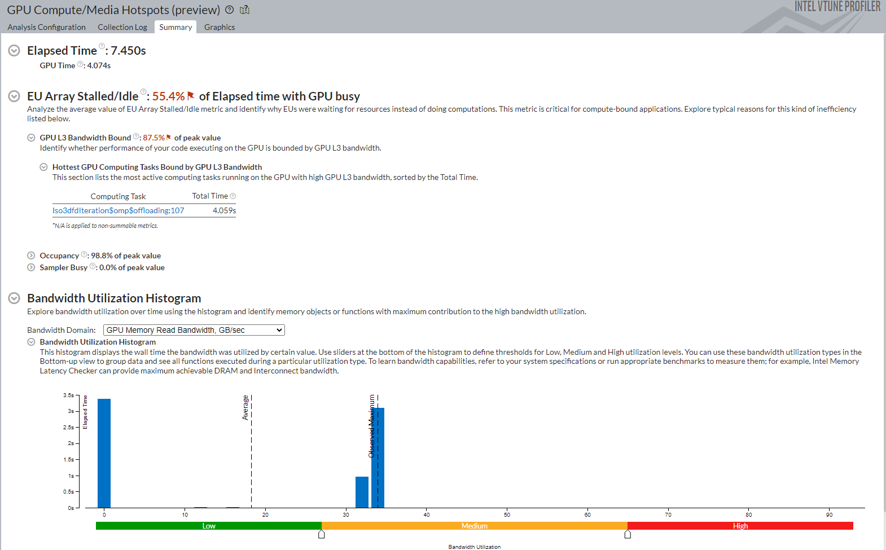
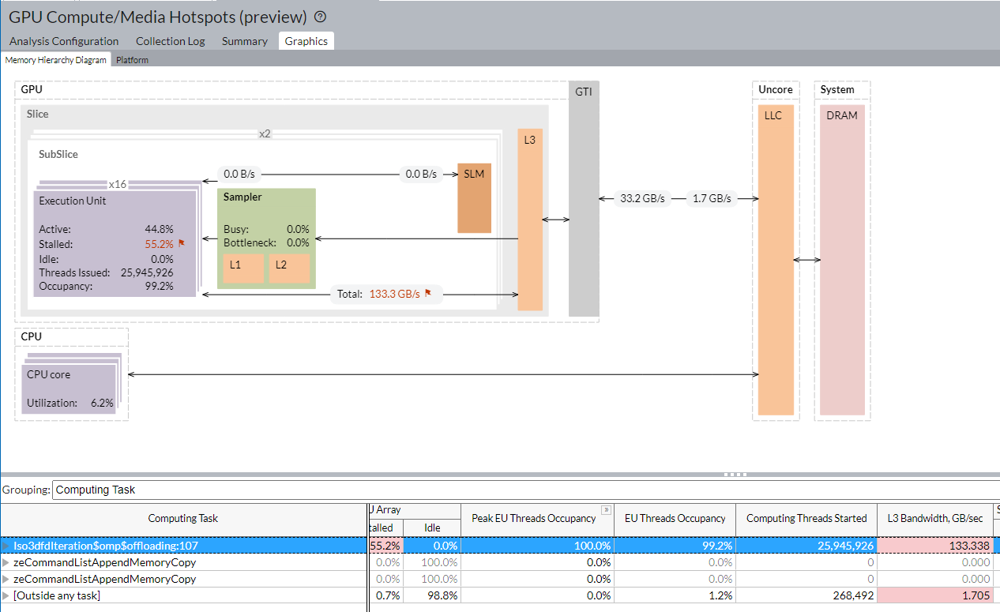
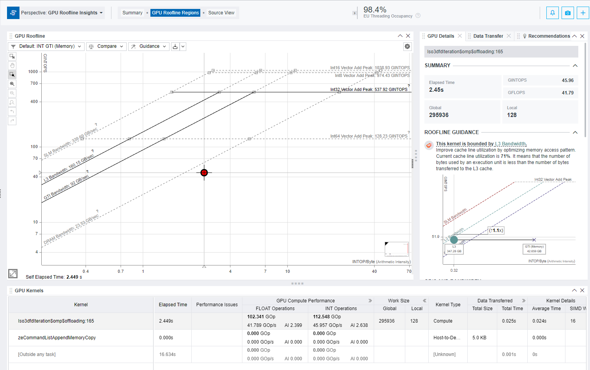

# `Guided iso3dfd OpenMP Offload` Sample

The `Guided iso3dfd OpenMP Offload ` Sample demonstrates how you can:

&nbsp;&nbsp;&nbsp;&nbsp;&nbsp;1. Analyze the performance of an application when running on CPU<br>
&nbsp;&nbsp;&nbsp;&nbsp;&nbsp;2. Add OpenMP* directives to increase parallelism<br>
&nbsp;&nbsp;&nbsp;&nbsp;&nbsp;3.Offload the optimized code onto Intel GPUs<br>

This workflow makes use of oneAPI components available in the Intel® oneAPI Base Toolkit and Intel® HPC Toolkit.

`iso3dfd` is a three-dimensional stencil designed to simulate a wave which propagates in a 3D isotropic medium.  This sample exposes some typical challenges you face when offloading applications onto OpenMP* (OMP) Offload devices. The sample also introduces techniques to resolve these challenges in order to achieve good performance.  

To learn more about optimizing OpenMP Offload applications for Intel® GPUs, see Offload and Optimize OpenMP* Applications with Intel Developer Tools.


  **What You Will Learn:**         
 1. Analyze CPU Performance <br>
 2. Find loops and functions to offload onto an Intel GPU<br>
 3. Analyze your GPU Offload  
<br>
<br>

## `iso3dfd Sample Structure`

There are five versions of the iso3dfd project.

- `CPU Only Implementation`: This is the basic serial CPU implementation.
- `GPU Offload Unoptimized`: This version demonstrates the use of the OpenMP offload target parallel for construct with the collapse.
- `GPU Offload Optimized 1`: This version demonstrates the use of the OpenMP offload teams distribute construct and use of `num_teams` and `thread_limit` clause.
- `GPU Offload Optimized 2`: This vesion demonstrates the use of the OpenMP offload teams distribute construct with an improved pattern for data-access.
- `GPU Offload Optimized 3`: In this version, iterations are over a third dimension.

The iso3dfd sample has a single executable. To run each implementation, use appropriate cmake commands to rebuild the executable. You can find instructions in 'Build The iso3dfd Sample`.

<br>
<br>

## `iso3dfd OpenMP Offload Workflow`
You start the workflow with the basic version of the sample, called `CPU Only Implementation`. This version has serial CPU implementation. As you proceed through the workflow, the sample goes through modifications which are captured in different versions.  

This table describes the steps in the iso3dfd workflow. You can also see the oneAPI tools used at each step and the relevant implementation of the iso3dfd sample.

 |Steps| Sample Version Used &nbsp; &nbsp; &nbsp; &nbsp; &nbsp; &nbsp; &nbsp; &nbsp; &nbsp; &nbsp; &nbsp; &nbsp; &nbsp; &nbsp; &nbsp; &nbsp; &nbsp; &nbsp; &nbsp; &nbsp; &nbsp; &nbsp; &nbsp; &nbsp; &nbsp; &nbsp; &nbsp; &nbsp; |Analysis Type|Intel Analysis Tool &nbsp; &nbsp; &nbsp; &nbsp; &nbsp; &nbsp; &nbsp; &nbsp; &nbsp; &nbsp; &nbsp; &nbsp; &nbsp; &nbsp; &nbsp; &nbsp; &nbsp; &nbsp; &nbsp; &nbsp; &nbsp; &nbsp; &nbsp; &nbsp; &nbsp; &nbsp; &nbsp; &nbsp; &nbsp; &nbsp;  &nbsp;|
  |:------|:------:|:------:|:------:|
 |**Step 1:** [Set Environment Variables](https://github.com/clevels/oneAPI-samples/blob/development/DirectProgramming/C%2B%2B/StructuredGrids/iso3dfd_omp_offload/README.md#step-1-set-environment-variables)| --- | --- | ---|
 |**Step 2:** [Build the iso3dfd Sample](https://github.com/clevels/oneAPI-samples/blob/development/DirectProgramming/C%2B%2B/StructuredGrids/iso3dfd_omp_offload/README.md#step-2-build-the-iso3dfd-sample)| --- | --- | --- |  
 |**Step 3:** [Identify the Most Time-Consuming Loops](https://github.com/clevels/oneAPI-samples/blob/development/DirectProgramming/C%2B%2B/StructuredGrids/iso3dfd_omp_offload/README.md#step-3-identify-the-most-time-consuming-loops)| `CPU Only Implementation`| Hotspots Analysis | Intel VTune™ Profiler|  
 |**Step 4:** [Analyze Vectorization](https://github.com/clevels/oneAPI-samples/blob/development/DirectProgramming/C%2B%2B/StructuredGrids/iso3dfd_omp_offload/README.md#step-4-analyze-vectorization)| `CPU Only Implementation`| Vectorization Analysis|Intel® Advisor|
 |**Step 5:** [Identify Profitable Code to Offload](https://github.com/clevels/oneAPI-samples/blob/development/DirectProgramming/C%2B%2B/StructuredGrids/iso3dfd_omp_offload/README.md#step-5-identify-profitable-code-to-offload) | `CPU Only Implementation` | Offload Advisor |Intel® Advisor |
 |**Step 6:** [Determine if the Application is CPU/GPU Bound](https://github.com/clevels/oneAPI-samples/blob/development/DirectProgramming/C%2B%2B/StructuredGrids/iso3dfd_omp_offload/README.md#step-6-determine-if-the-application-is-cpugpu-bound)| `GPU Offload Unoptimized`| GPU Offload analysis| Intel VTune™ Profiler|  
 |**Step 7:** [Examine offload for GPU Kernel Optimization](https://github.com/clevels/oneAPI-samples/blob/development/DirectProgramming/C%2B%2B/StructuredGrids/iso3dfd_omp_offload/README.md#step-7-examine-offload-for-gpu-kernel-optimization)| `GPU Offload Unoptimized` | GPU Compute/Media Hotspots Analysis | Intel VTune™ Profiler|
 |**Step 8:** [Maximize Application Performance](https://github.com/clevels/oneAPI-samples/blob/development/DirectProgramming/C%2B%2B/StructuredGrids/iso3dfd_omp_offload/README.md#step-8-maximize-application-performance) | `GPU Offload Optimized 2`            | GPU Roofline Analysis               | Intel® Advisor                  |


<br>\
<br>
## `Approach`
The `iso3dfd` guided sample workflow makes extensive use of Intel® VTune™ Profiler and Intel® Advisor to profile software performance. The workflow uses these tools to:
     1. Identify the most time-consuming loops and functions in the sample
     2. Conduct offload modeling  to identify profitable code regions to offload onto a Gen11 device.
     3. Analyze the OpenMP* code portions that were offloaded

`iso3dfd` is a finite difference stencil kernel that you can use to solve the 3D acoustic isotropic wave equation. You can use this equation as a proxy for propagating a seismic wave. In this sample, kernels are implemented as 16th order in space, with symmetric coefficients, and 2nd order in time scheme without boundary conditions. Using OpenMP Offload, the sample can explicitly run on the GPU to propagate a seismic wave, which is a compute-intensive task.

The code searches for an available GPU or an alternate device that is suitable for OpenMP Offload. If a compatible device is not detected, the code exits. By default, the output prints the current implementation getting executed (`CPU Only Implementation`, `GPU Offload Unoptimized`, `GPU Offload Optimized 1`, `GPU Offload Optimized 2`, `GPU Offload Optimized 3`) along with the grid computation metrics - flops and effective throughput. To validate results, run an OpenMP/CPU-only version of the applicarion on host machine, and compare results to the OpenMP Offload version.

The code also demonstrates some of the common optimization techniques that you can use to improve 3D-stencil code running on a GPU device.

 **Example Output:**
```
Grid Sizes: 256 256 256
Tile sizes: 16 8 64
Using no-offload implementation
--CPU-Only
Memory Usage (MBytes): 230
--------------------------------------
time         : 3.915 secs
throughput   : 428.537 Mpts/s
flops        : 26.1407 GFlops
bytes        : 5.14244 GBytes/s

--------------------------------------

--------------------------------------
```

<br>

## **`Requirements`**

| Operating System        | Hardware                   | Software
|:---                     |:---                        |:---
|Ubuntu* 18.04            |Skylake with GEN9 or newer  |Intel® oneAPI DPC++/C++ Compiler
|--                       |--                          |Intel VTune™ Profiler
|--                       |--                          |Intel® Advisor

<br>\
<br>

<h1 align="center">-----Begin Workflow-----</h1>
<br>
<br>

# `Step 1: Set Environment Variables`
When working with the command-line interface (CLI), configure the software tools using environment variables. To set up your CLI environment every time you open a new terminal window, source the `setvars` script. This practice ensures that your compiler, libraries, and tools are ready for development.

> Linux*:
> - For system wide installations: `. /opt/intel/oneapi/setvars.sh`
> - For private installations: ` . ~/intel/oneapi/setvars.sh`
> - For non-POSIX shells, like csh, use the following command: `bash -c 'source <install-dir>/setvars.sh ; exec csh'`
>
> For more information on configuring environment variables, see [Use the setvars Script with Linux*](https://www.intel.com/content/www/us/en/develop/documentation/oneapi-programming-guide/top/oneapi-development-environment-setup/use-the-setvars-script-with-linux-or-macos.html).


> **Note**: For GPU analysis on Linux* systems, enable the option to collect GPU hardware metrics. Setting the value of the dev.i915 perf_stream_paranoidsysctl option to 0 as follows. Run the following command:
>
> `sudo sysctl -w dev.i915.perf_stream_paranoid=0`
>
>The above command makes a temporary change that is lost after reboot. To make a permanent change,run:
>
> `sudo echo dev.i915.perf_stream_paranoid=0 > /etc/sysctl.d/60-mdapi.conf`

### Use Visual Studio Code* (VS Code) (Optional)

You can use Visual Studio Code* (VS Code) extensions to set your environment,
create launch configurations, and browse and download samples.

Follow these steps to build and run a sample using VS Code:
 1. Configure the oneAPI environment with the extension **Environment Configurator for Intel Software Developer Tools**.
 2. Download a sample using the extension **Code Sample Browser for Intel Software Developer Tools**.
 3. Open a terminal in VS Code (**Terminal > New Terminal**).
 4. Run the sample in the VS Code terminal using the instructions below.

To learn more about the extensions and how to configure the oneAPI environment, see the
[Using Visual Studio Code with Intel® oneAPI Toolkits User Guide](https://www.intel.com/content/www/us/en/develop/documentation/using-vs-code-with-intel-oneapi/top.html).
<br>
<br>

# `Step 2: Build The iso3dfd Sample`
### On Linux*
1. Change to the sample directory.
2. Build the program.
    ```
    mkdir build
    cd build
    cmake <sample implementation> ..
    ```

    By default, the executable is built with `GPU Offload Unoptimized`. Optionally, you can build the strictly CPU version, or build the kernel with optimized offloaded versions.

    **Build `CPU Only Implementation`:**
    ```
    cmake -DNO_OFFLOAD=1 -DVERIFY_RESULTS=0 ..
    make -j
    ```
    **Build `GPU Offload Unpotimized`:**
    ```
    cmake -DVERIFY_RESULTS=0 ..
    make -j
    ```
    **Build `GPU Offload Optimized 1`:**
    ```
    cmake -DUSE_OPT1=1 -DVERIFY_RESULTS=0 ..
    make -j
    ```
    **Build `GPU Offload Optimized 2`:**
    ```
    cmake -DUSE_OPT2=1 -DVERIFY_RESULTS=0 ..
    make -j
    ```
   **Build `GPU Offload Optimized 3`:**
    ```
    cmake -DUSE_OPT3=1 -DVERIFY_RESULTS=0 ..
    make -j
    ```
    If an error occurs, get more details by running `make` with the `VERBOSE=1` argument:
    ```
    make VERBOSE=1
    ```
    Run the program on Linux:
   ```
   make run
   ```
   Clean the program. (Optional)
   ```
   make clean
   ```

4. Change the optimized version (if necessary)

   If you already compiled with the optimization path, for example "*cmake -DUSE_OPT1=1 ..*", use "*cmake -DUSE_OPT1=0 ..*" can go back to the baseline version.

#### Troubleshooting

If you receive an error message, troubleshoot the problem using the **Diagnostics Utility for Intel® oneAPI Toolkits**. The diagnostic utility provides configuration and system checks to help find missing dependencies, permissions errors, and other issues. For more information, see the [Diagnostics Utility for Intel® oneAPI Toolkits User Guide](https://www.intel.com/content/www/us/en/develop/documentation/diagnostic-utility-user-guide/top.html).


### Application Parameters

The program supports several configurable input parameters. The general syntax is as follows:
```
src/iso3dfd n1 n2 n3 n1_block n2_block n3_block Iterations
```

|Parameter                      |Description
|:---                           |:---
|n1 n2 n3                       |Grid sizes for the stencil. The sample uses `256 256 256` as the default values.
|n1_block n2_block n3_block     |Cache block sizes for **CPU** or **tile sizes** for OpenMP Offload. The sample uses as `16 8 64` the default values.
|Iterations                    	|Number of timesteps. The sample uses `100` as the default value.

The default syntax is `src/iso3dfd 256 256 256 16 8 64 100`.

# `Step 3: Identify the Most Time-Consuming Loops`
To find the most time consuming functions in the `CPU Only Implementation` version, use the VTune™ Profiler to run a Hotspots Analysis.

**Build Command:**\
`cmake -DNO_OFFLOAD=1 -DVERIFY_RESULTS=0 ..`\
`make -j`

**Command:**\
`vtune -collect hotspots -knob sampling-mode=hw --result-dir=./vtune_hotspots -- src/iso3dfd 256 256 256 16 8 64 100`

Once the data collection completes, review the **Summary** page to see such performance metrics as:\
-**Elapsed Time** <br>
-**CPU Time**<br>
-**Microarchitecture Usage Percentage**  
<br>
<br>

In the **Top Hotspot** section the most time consuming function is **`_Z16Iso3dfdIterarionPfS_S_S_mmmmmm.DIR.OMP.PARALLEL2`**.  This function occupies 94.2% of the total CPU time. The **Effective CPU Utilization Histogram** shows the ideal usage of all the CPUs.



Look at the **Hotspots Insights** section in the top right corner of the Summary window. Both the **Microarchitecture Usage** and **Vectorization** have been flagged as poor performing metrics. For each flagged metric, there is a recommendation to run another analysis type and further examine the issue.

The Microarchitecture Usage metric is flagged at 29.9%. This is an estimation of how effectively the code utilizes the current microarchitecture.

The Vectorization metric is flagged at 100%- All of the floating point operations are vectorized, but this value does not neccisarily imply that they operations are 100% efficient.



Next, switch to the **Bottom-Up** window. The table shows a breakdown of metrics reported for all of the identified hotspots. The timeline below the table shows a visualization of the thread activity throughout the execution time of the application.

Based on these results, the biggest performance problems point to the inefficient use of the platform and possible inefficiencies in the vectorization. Microarchitecture usage is low, and there is no use of a GPU.

Before you evaluate potential performance on the GPU, examine the vectorization in this code. Use Intel Advisor to complete a high-level CPU analysis.


# `Step 4: Analyze Vectorization`
When you run a vectorization analysis with Intel Advisor, yopu can investigate potential CPU performance improvements before you evaluate potential performance on the GPU.

At the command prompt, run these commands:
**Build Command:**\
`cmake -DNO_OFFLOAD=1 -DVERIFY_RESULTS=0 ..`\
`make -j`

**Command:**\
`advisor --collect=survey --project-dir=./adv_vectorization -- ./src/iso3dfd 256 256 256 16 8 64 100`\
`advisor --collect=tripcounts --flop --stacks --project-dir=./adv_vectorization -- ./src/iso3dfd 256 256 256 16 8 64 100`

In the result, you can see a technical breakdown of the overall vectorization of the application. There is more information about the **`_Z16Iso3dfdIterarionPfS_S_S_mmmmmm.DIR.OMP.PARALLEL2`** function identified in the Hotspots Analysis.

The **Recommendations** tab provides guidance for potential optimizations.



Now that your high-level scan of CPU performance is complete, investigate the potential performance when you offload the iso3dfd application onto a GPU.

# `Step 5: Identify Profitable Code to Offload`
Use Intel Advisor to run the Offload Modeling Perspective. You can see the **projected** performance of the offload on the GPU, without needing access to the hardware. This perspective also shows the exact code that would be most profitable to offload.

 This exercise looks for projected performance on the 12th Generation Intel® Iris® Xe graphics. Note that you do **not** need to access the hardware to run the Offload Modeling Perspective.

**Build Command:**\
`cmake -DNO_OFFLOAD=1 -DVERIFY_RESULTS=0 ..`\
`make -j`

**Command:**\
`advisor --collect=offload --config=gen12_tgl --project-dir=./adv_offload_model -- ./src/iso3dfd 256 256 256 16 8 64 100`

When the results displat, the **Top Metrics** section shows metrics that pertain to the overall projected performance of the offloaded code. Looking at the results below, if you were to offload both of the recommended code regions, you could expect an approximated 1.976x speed-up of the offloaded code and a 1.929x speed-up of the entire application. The offloaded code would be 96% of the overall code.

In the **Program Metrics** section, see a visual comparison of the original execution time (6.22s) with the projected accelerated execution time (3.323s). This section also shows a breakdown of additional characteristics of the offload.

In the **Offload Bounded By** section, see the potential limiting factors of the offloaded code. Use this to form your offload strategy.


At the bottom of the result in the **Top Offloaded** section, see the loops that are recommended for offload. You can also  see specific metrics for each loop.

The **Top Non-Offloaded** region typically shows loops that could be offloaded but would not be profitable. In this example, there are no such loops.



The Offload Modeling Perspective also provides a technical breakdown of the loops recommended for offloading, as well as recommendations to get started with the offload to the GPU. Notice that **`_Z16Iso3dfdIterarionPfS_S_S_mmmmmm.DIR.OMP.PARALLEL2`** is the top candidate for offload. use the [OpenMP* Offload Programming Model](https://www.intel.com/content/www/us/en/docs/oneapi/programming-guide/current/c-c-or-fortran-with-openmp-offload-programming.html) to get started with this offload.

### How the Initial Offload was Done
For the initial offload, the original pragma was changed to do an OpenMP offload to a target device specified in the compiler option. The modified pragma instructs the application to run the loop on the GPU instead of the CPU. For more information on OpenMP Targets see the [Intel® oneAPI DPC++/C++ Compiler Developer Guide and Reference](https://www.intel.com/content/www/us/en/docs/dpcpp-cpp-compiler/developer-guide-reference/2023-0/fopenmp-targets-qopenmp-targets.html)

 **Pragma before Offload:**
 ```
 #pragma omp parallel default(shared)
 ```
**Pragma used for OpenMP Offload:**
```
#pragma omp target parallel for simd collapse(3)
```

# `Step 6: Determine if the Application is CPU/GPU Bound`                                 
Start analyzing the offloaded version of the sample and determine if it is CPU or GPU-bound. Build the sample and run the GPU Offload Analysis in VTune Profiler to begin analyzing the [`GPU Offload Unoptimized`](https://github.com/intel-sandbox/clevels/blob/main/iso3dfd_omp_offload_new/README.md#iso3dfd-sample-structure) version of the iso3dfd sample.

**Build Command:**\
`cmake -DVERIFY_RESULTS=0 ..`\
`make -j`

**Command:**\
`vtune -collect gpu-offload  --result-dir=./vtune_gpu_offload_unopt -- ./src/iso3dfd 256 256 256 16 8 64 100`

When the analysis finishes, the **Summary** window displays the percentage of the overall execution time on the GPU as well as top tasks that were executed on the GPU vs the CPU.

In the **Recommendations** section you see that:

-The overall utilization of the GPU is lower than optimal. <br>
-The tasks on the GPU are likely performing suboptimal as well.<br>

<br>
This confirms that the application is GPU-bound. To further examine these metrics, switch to the **Graphics** window.



The table in the Graphics window shows detailed metrics about each GPU computing task. The percentage of stalls in the EU array have been flagged as a performance issue. To get more details about this performance issue, you can run the GPU Compute/Media Hotspots Analysis.

The timeline below the table shows how the metrics change through the runtime of the application. At the top of the timeline, the `OpenMP Primary Thread` starts by executing on the CPU. Around the 2 second mark, this thread begins prepare the offload process. The lower portion of the timeline shows when execution starts on the GPU.



# `Step 7: Examine offload for GPU Kernel Optimization`    
 Now that the application is GPU-bound, run the GPU Compute/Media Hotspots Analysis in VTune Profiler to do a deeper dive focused on the kernels running on the GPU. Run these commands:

**Build Command:**\
`cmake -DVERIFY_RESULTS=0 ..`\
`make -j`

**Command:**\
`vtune -collect gpu-hotspots --result-dir=./vtune_gpu_hotspots_unopt -- ./src/iso3dfd 256 256 256 16 8 64 100`

When the analysis finishes, the Summary window displays a comprehensive view of GPU performance.  

-The percentage of EU Array stalls has been flagged as a top performance issue.
-Additionally, the offload is L3 Bandwidth Bound.



In the Graphics window, the Memory Hierarchy Diagram illustrates the flow of data from the CPU to the GPU. Use this diagram to identify potential bottlenecks. Notice that when the EU was stalled, the L3 Bandwidth was high.

The metrics and diagram inform that any time an instruction needs data, the instruction has to go to L3 cache. Using data reuse could possibly decrease the number of stalls on the EU and thereby increase GPU performance.




# `Step 8: Maximize Application Performance`    
Build the sample to analyze GPU Optimized 2. Then use Intel Advisor to run a GPU Roofline Analysis. Use this analysis to visualize the performance of the kernels against the maximum achievable performance of the system.

In this optimized version we can see that the offload is L3 Bandwidth Bound. Intel Advisor recommends that you optimize the memory access patterns.

**Build Command:**\
`cmake -DUSE_OPT2=1 -DVERIFY_RESULTS=0 ..`\
`make -j`

**Command:**\
`advisor --collect=roofline --profile-gpu --search-dir src:r=src --project-dir=./adv_gpu_roofline_opt2 -- ./src/iso3dfd 256 256 256 16 8 64 100`



## Output
```
Grid Sizes: 256 256 256
Tile sizes: 16 8 64
Using no-offload implementation
--CPU-Only
Memory Usage (MBytes): 230
--------------------------------------
time         : 3.915 secs
throughput   : 428.537 Mpts/s
flops        : 26.1407 GFlops
bytes        : 5.14244 GBytes/s

--------------------------------------


Grid Sizes: 256 256 256
Tile sizes ignored for OMP Offload
--Using Baseline version with omp target with collapse
Memory Usage (MBytes): 230
--------------------------------------
time         : 4.132 secs
throughput   : 406.031 Mpts/s
flops        : 24.7679 GFlops
bytes        : 4.87238 GBytes/s

--------------------------------------


Grid Sizes: 256 256 256
Tile sizes: 16 8 64
Using Optimized target code - version 1:
--OMP_Offload with Tiling
Memory Usage (MBytes): 230
--------------------------------------
time         : 4.14 secs
throughput   : 405.247 Mpts/s
flops        : 24.7201 GFlops
bytes        : 4.86296 GBytes/s

--------------------------------------


Grid Sizes: 256 256 256
Tile sizes: 16 8 64
Using Optimized target code - version 2:
--OMP_Offload with Tiling and Z Window
Memory Usage (MBytes): 230
--------------------------------------
time         : 2.806 secs
throughput   : 597.905 Mpts/s
flops        : 36.4722 GFlops
bytes        : 7.17486 GBytes/s

--------------------------------------


Grid Sizes: 256 256 256
Tile sizes: 16 8 64
Using Optimized target code - version 3:
--OMP Threads + OMP_Offload with Tiling and Z Window
Memory Usage (MBytes): 230
--------------------------------------
time         : 2.846 secs
throughput   : 589.502 Mpts/s
flops        : 35.9596 GFlops
bytes        : 7.07402 GBytes/s

--------------------------------------
```

## License

Code samples are licensed under the MIT license. See [License.txt](License.txt) for details.

Third-party program Licenses can be found here: [third-party-programs.txt](third-party-programs.txt)
