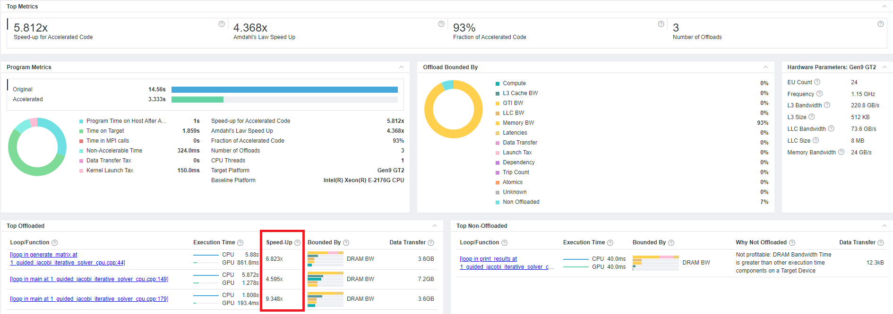
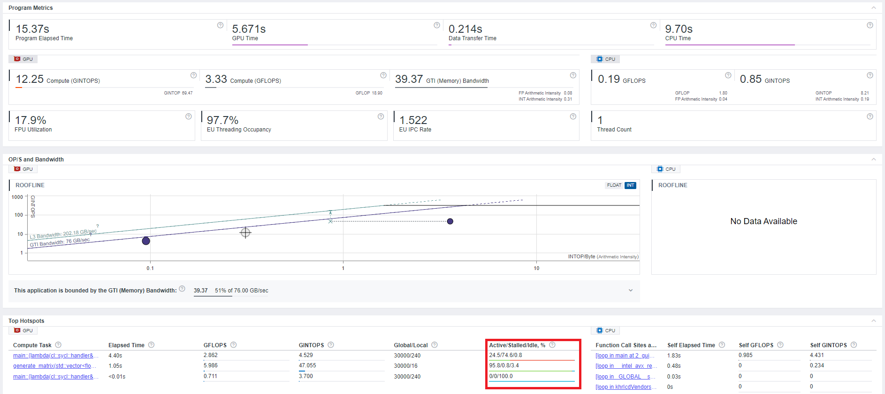

# `Jacobi Iterative Solver` Sample

The `Jacobi Iterative Solver` sample demonstrates how to use Intel® oneAPI Base Toolkit (Base Kit) to target CPU, GPU, and multi-GPU to offload resource intensive computation using SYCL*. The targeted sample code demonstrates optimization and runtime differences for each type of device.

| Area                   | Description
|:---                    |:---
| What you will learn    | How selecting a different target impacts the behavior of a program.
| Time to complete       | 10 minutes
| Category               | Code Optimization


## Purpose

The `Jacobi Iterative Solver` sample illustrates how to use the Jacobi Iterative method to solve linear equations. In this case, the sample solves a system of equations represented by two input matrices. The first matrix is the number of unknown variables. The second matrix contains the results. The sample code calculates the results using the Jacobi method and compares the newly calculated results with the old ones.

This sample starts with a CPU-oriented application and shows how to use SYCL and several tools to offload regions of the code to a GPU on the target system.

The guided instructions, found in the [Guided Builds and Offloads](#guided-builds-and-offloads) section, walk you through using Intel® Advisor for offload modeling to identify code regions that can benefit from GPU offload. After the initial offload, the instructions walk you through developing an optimization strategy by iteratively optimizing the code based on opportunities exposed Intel® Advisor to run roofline analysis.

>**Note**: For comprehensive information about oneAPI programming, see the *[Intel® oneAPI Programming Guide](https://software.intel.com/en-us/oneapi-programming-guide)*. (Use search or the table of contents to find relevant information quickly.)

The sample includes three versions of the `Jacobi Iterative Solver` program.

| File Name                                      | Description
|:---                                            |:---
|`1_guided_jacobi_iterative_solver_cpu.cpp`      | Demonstrates a basic, serial CPU implementation.
|`2_guided_jacobi_iterative_solver_gpu`          | Demonstrates an initial single-GPU offload using SYCL.
|`3_guided_jacobi_iterative_solver_multi_gpu.cpp`| Demonstrates multi-GPU offload using SYCL. (Preview.)

## Prerequisites

| Optimized for          | Description
|:---                    |:---
| OS                     | Ubuntu* 18.04 (or newer)
| Hardware               | GEN9 (or newer)
| Software               | Intel® oneAPI DPC++/C++ Compiler

## Key Implementation Details

The basic SYCL implementation explained in the code includes:

- local buffers and accessors (declare local memory buffers and accessors to be accessed and managed by each workgroup)
- shared local memory (SLM) optimizations
- kernels (including parallel_for function and range<1> objects)


## Set Environment Variables

When working with the command-line interface (CLI), you should configure the oneAPI toolkits using environment variables. Set up your CLI environment by sourcing the `setvars` script every time you open a new terminal window. This practice ensures that your compiler, libraries, and tools are ready for development.

## Build the `Jacobi Iterative Solver` Sample

> **Note**: If you have not already done so, set up your CLI
> environment by sourcing  the `setvars` script in the root of your oneAPI installation.
>
> Linux*:
> - For system wide installations: `. /opt/intel/oneapi/setvars.sh`
> - For private installations: ` . ~/intel/oneapi/setvars.sh`
> - For non-POSIX shells, like csh, use the following command: `bash -c 'source <install-dir>/setvars.sh ; exec csh'`
>
> For more information on configuring environment variables, see *[Use the setvars Script with Linux* or macOS*](https://www.intel.com/content/www/us/en/develop/documentation/oneapi-programming-guide/top/oneapi-development-environment-setup/use-the-setvars-script-with-linux-or-macos.html)*.

> **Note**: For GPU Analysis on Linux*, enable collecting GPU hardware metrics by setting the value of `dev.i915 perf_stream_paranoidsysctl` option to `0`. 
>
> The command makes a temporary change that is lost after reboot:
>
> `sudo sysctl -w dev.i915.perf_stream_paranoid=0`
>
> To make the change permanent, enter:
>
> `sudo echo dev.i915.perf_stream_paranoid=0 > /etc/sysctl.d/60-mdapi.conf`

### Using Visual Studio Code*  (Optional)

You can use Visual Studio Code (VS Code) extensions to set your environment, create launch configurations, and browse and download samples.

The basic steps to build and run a sample using VS Code include:

1. Configure the oneAPI environment with the extension **Environment Configurator for Intel® oneAPI Toolkits**.
2. Download a sample using the extension **Code Sample Browser for Intel® oneAPI Toolkits**.
3. Open a terminal in VS Code (**Terminal > New Terminal**).
4. Run the sample in the VS Code terminal using the instructions below.

To learn more about the extensions and how to configure the oneAPI environment, see the 
*[Using Visual Studio Code with Intel® oneAPI Toolkits User Guide](https://software.intel.com/content/www/us/en/develop/documentation/using-vs-code-with-intel-oneapi/top.html)*.

### On Linux*

1. Change to the sample directory.
2. Build the program.
   ```
   mkdir build
   cd build
   cmake ..
   make
   ```
3. Run the program for CPU.
   ```
   make run_1_cpu
   ```
4. Run the program for GPU. (Optional)
   ```
   make run_2_gpu
   ```
5. Run the program for multiple GPUs. (Optional)
   ```
   make run_3_multi_gpu
   ```
   > **Note**: This option is untested, but you should be able to run it in a multi-GPU environment.
   
6. Clean the project. (Optional)
   ```
   make clean
   ```

## Guided Builds and Offloads

These guided instructions show how to optimize code using the Jacobi Iterative method in the following steps:

1. Start with code that runs on the CPU.
2. Change the code for basic GPU offload.
3. Change the code for the multi-GPU offload. (Not available in this release.)

In each step, the Intel® Advisor analysis tool provides performance analysis for the applications. The Intel® Advisor runtime might take a long time.

> **Important**: The performance results and measurements depend on hardware. Your results may vary from what is shown.

### CPU Offload Modeling

The first step is to run offload modeling on the CPU version to identify portions of the code can benefit from acceleration.

> **Note**: This process may take up to 30 minutes.

1. Run Intel® Advisor to model the CPU code.
   ```
   advisor --collect=offload --config=gen9_gt2 --project-dir=./../advisor/1_cpu -- ./src/1_guided_jacobi_iterative_solver_cpu
   ```
2. View the results. 
   ```
   advisor-gui ../advisor/1_cpu/e000/e000.advixeexp
   ```
   > **Note**: If you are connecting to a remote system with oneAPI tools installed, you might not be able to launch the Intel® Advisor graphical interface. You can transfer the HTML-based report to a local machine to view it.

   Based on the output captured from Intel® Advisor, one can see an estimated speed-up if we offload loops identified in the Top Offloaded section of the output. We can get about 9x speedup for one loop and a 4.5x speedup for another. The generation of the matrix can be speedup almost 7x times. In the next step, we will offload those loops to the GPUs.

   

### Basic GPU Offload

The second step is to offload to a GPU. The `2_guided_jacobi_iterative_solver_gpu` uses the basic offload of each for loop into a GPU. For example, the main loop calculating the unknown variables will be calculated by N kernels where N is the number of rows in the matrix. Even this basic offload improves the execution time.

Once the offload code changes, run the roofline analysis to look for performance optimization opportunities.

> **Note**: Multi-GPU programs are not supported in this release, so no output from Intel® Advisor will be available.

1. Run Intel® Advisor again.
   ```
   advisor --collect=roofline --profile-gpu --project-dir=./../advisor/2_gpu -- ./src/2_guided_jacobi_iterative_solver_gpu
   ```

2. View the results again.
   ```
   advisor-gui ../advisor/2_gpu/e000/e000.advixeexp
   ```

   As we can see in the charts below, the execution time has been sped up as we predicted in all cases besides the main loop. The reason is that we have to wait for each iteration to finish calculations, as the next iteration is dependent on the results we get. This is why 74.6% of the time that the GPU has been in the **Stalled** mode.

   


### Build and Run the Sample in Intel® DevCloud (Optional)

>**Note**: For more information on using Intel® DevCloud, see the Intel® oneAPI [Get Started](https://devcloud.intel.com/oneapi/get_started/) page.

1. Open a terminal on a Linux* system.
2. Log in to the Intel® DevCloud.
   ```
   ssh devcloud
   ```
3. Change to the sample directory.
4. Configure the sample for the appropriate node.
   
   <details>
   <summary>You can specify nodes using a single line script.</summary>

   The following example is for a GPU node. (This is a single line script.)
	```
	qsub  -I  -l nodes=1:gpu:ppn=2 -d .
	```
   - `-I` (upper case I) requests an interactive session.
   - `-l nodes=1:gpu:ppn=2` (lower case L) assigns one full GPU node.
   - `-d .` makes the current folder as the working directory for the task.

     |Available Nodes    |Command Options
     |:---               |:---
     |GPU	             |`qsub -l nodes=1:gpu:ppn=2 -d .`
     |CPU	             |`qsub -l nodes=1:xeon:ppn=2 -d .`

  </details>

5. Perform build steps you would on Linux. (Including optionally cleaning the project.)

   <details>
   <summary>You can submit build and run jobs through a Portable Bash Script (PBS).</summary>

   A job is a script that submitted to PBS through the `qsub` utility. By default, the `qsub` utility does not inherit the current environment variables or your current working directory, so you might need to submit jobs to configure the environment variables. To indicate the correct working directory, you can use either absolute paths or pass the `-d \<dir\>` option to `qsub`. 

   If you choose to use scripts, jobs terminate with writing files to the disk:
   - `<script_name>.sh.eXXXX`, which is the job stderr
   - `<script_name>.sh.oXXXX`, which is the job stdout

   Here XXXX is the job ID, which gets printed to the screen after each qsub command.

   You can inspect output of the sample.
   ```
   cat run.sh.oXXXX
   ```
   Once the jobs complete, you can remove the stderr and stdout files.
   ```
   rm run.sh.*
   ```
</details>

6. Run the sample.

   > **Note**: To inspect job progress if you are using a script, use the qstat utility.
   >   ```
   >   watch -n 1 qstat -n -1
   >   ```
   >  The command displays the results every second. The job is complete when no new results display.

7. Review the output, then exit.


## Example Output

### CPU Results

The following output is for a **9x9** matrix.
```
Scanning dependencies of target run_cpu
./jacobi_cpu_iterative_solver
Device : Intel(R) Core(TM) i7-10610U CPU @ 1.80GHz

Matrix generated, time elapsed: 0.31112 seconds.
[5122.01 263.22 1.67 626.22 317 -333.22 947.8 -852.83 -808.99 ][277.63]
[277.63 -4634.73 529.95 -657.22 -564.18 601.12 676.36 452.62 314.03 ][740.29]
[740.29 499.7 -4774.05 794.3 -156.33 -237.9 397.63 -160.86 916.96 ][76.47]
[76.47 -693.42 -135.63 4075.95 -287.56 993 936.34 -28.63 86.55 ][833.52]
[833.52 769.69 -400.31 443.35 -5587.83 431.49 453.66 556.13 845.82 ][844.33]
[844.33 549.12 440.36 416.48 -236.84 -4121.63 -460.53 -236.51 -359.54 ][-358.82]
[-358.82 -655.35 -569.26 -982.24 102.27 522.64 -4836.28 -534.2 -552.49 ][545.54]
[545.54 -403.51 249.11 918.1 -575.88 -151.27 159.93 3964.62 -770 ][-216.26]
[-216.26 751.31 267.88 691.34 -161.82 973.27 908.53 -175.76 -4150.42 ][-813.02]

Computations complete, time elapsed: 0.295054 seconds.
Total number of sweeps: 30
Checking results
All values are correct.

Check complete, time elapsed: 0.00481672 seconds.
Total runtime is 0.750036 seconds.
X1 equals: 0.09895873327
X2 equals: -0.15802401129
X3 equals: 0.03854686450
X4 equals: 0.16617806412
X5 equals: -0.12925305745
X6 equals: 0.11829640135
X7 equals: -0.13914309700
X8 equals: -0.09521910620
X9 equals: 0.19864875400
Built target run_cpu
```

### GPU Offload Results

The following output is for a **30000x30000** matrix.

```
Device : Intel(R) Graphics [0x020a]

Matrix generated, time elapsed: 3.58536 seconds.

Computations complete, time elapsed: 3.41483 seconds.
Total number of sweeps: 7
Checking results
All values are correct.

Check complete, time elapsed: 2.61934 seconds.
Total runtime is 13.5157 seconds.
[100%] Built target run_2_gpu
```

## License

Code samples are licensed under the MIT license. See
[License.txt](https://github.com/oneapi-src/oneAPI-samples/blob/master/License.txt) for details.

Third party program Licenses can be found here: [third-party-programs.txt](https://github.com/oneapi-src/oneAPI-samples/blob/master/third-party-programs.txt).