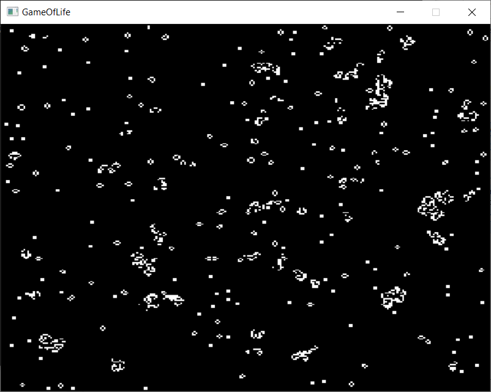

# `Conway's Game of Life` Sample

Conway's Game of Life is a cellular automaton invented by John Horton Conway in 1970. It is played on a grid of cells, where each cell is either "alive" or "dead", and the state of each cell is updated based on its surrounding neighbors. Rules are applied simultaneously to all cells in the grid.
This `Conway's Game of Life` sample demonstrates how to use SYCL*-compliant code for offloading computations to a GPU (or other devices) and visualize it with the SDL2 library.

| Property                       | Description
|:---                               |:---
| What you will learn               | How to offload the computation to GPU using the Intel&reg; oneAPI DPC++/C++ Compiler and visualize the output.
| Time to complete                  | 15 minutes

For comprehensive information in oneAPI programming, see the [Intel&reg; oneAPI Programming Guide](https://software.intel.com/en-us/oneapi-programming-guide). (Use search or the table of contents to find relevant information.)

## Purpose

This sample of `Conway's Game of Life` is a SYCL-compliant application that generates an animation by randomly initializing a matrix of 256 x 256 cells.
Each cell's computation is independent of the other cells, and the sample includes a parallel implementation with interactive visualization.
This feature allows users to examine different patterns and create their own. The parallel implementation demonstrates the use of buffers and the SDL2 graphics library.

## Prerequisites
| Property                       | Description
|:---                               |:---
| OS                                | Ubuntu* 18.04 <br>Windows* 10 or newer
| Hardware                          | Skylake with GEN9 or newer
| Software                          | Intel&reg; oneAPI DPC++/C++ Compiler

## Key Implementation Details

The program first attempts to run on an available GPU and falls back to the system CPU if a compatible GPU is not detected.

In the first phase, the program creates a window and displays a randomly generated set of cells that can be modified by clicking the left mouse button (LMB) on the image to make cells alive or dead.

The code includes a basic SYCL implementation with device selector, buffer, accessor, kernel, and command groups. In addition, there is an SDL implementation that includes creating windows, a renderer, and a texture, handling events, and texture streaming.

## Build the `Conway's Game of Life` Sample

### Setting Environment Variables
For working with the Command-Line Interface (CLI), you should configure the oneAPI toolkits using environment variables. Set up your CLI environment by
sourcing the `setvars` script every time you open a new terminal window. This practice ensures your compiler, libraries, and tools are ready for development.

> **Note**: If you have not already done so, set up your CLI
> environment by sourcing  the `setvars` script located in
> the root of your oneAPI installation.
>
> Linux*:
> - For system wide installations: `. /opt/intel/oneapi/setvars.sh`
> - For private installations: `. ~/intel/oneapi/setvars.sh`
> - For non-POSIX shells, like csh, use the following command: `$ bash -c 'source <install-dir>/setvars.sh ; exec csh'`
>
> Windows*:
> - `C:\Program Files(x86)\Intel\oneAPI\setvars.bat`
> - For Windows PowerShell*, use the following command: `cmd.exe "/K" '"C:\Program Files (x86)\Intel\oneAPI\setvars.bat" && powershell'`
>
>For more information on environment variables, see "Use the setvars Script" for [Linux or macOS](https://www.intel.com/content/www/us/en/develop/documentation/oneapi-programming-guide/top/oneapi-development-environment-setup/use-the-setvars-script-with-linux-or-macos.html), or [Windows](https://www.intel.com/content/www/us/en/develop/documentation/oneapi-programming-guide/top/oneapi-development-environment-setup/use-the-setvars-script-with-windows.html).

You can use [Modulefiles scripts](https://www.intel.com/content/www/us/en/develop/documentation/oneapi-programming-guide/top/oneapi-development-environment-setup/use-modulefiles-with-linux.html) to set up your development environment. The modulefiles scripts work with all Linux shells.

If you wish to fine tune the list of components and the version of those components, use
a [setvars config file](https://www.intel.com/content/www/us/en/develop/documentation/oneapi-programming-guide/top/oneapi-development-environment-setup/use-the-setvars-script-with-linux-or-macos/use-a-config-file-for-setvars-sh-on-linux-or-macos.html) to set up your development environment.

### Include Files
The include folder is located on your development system at `%ONEAPI_ROOT%\dev-utilities\latest\include`.

### On Linux*
Perform the following steps:
1. Install SDL library `apt install libsdl2-dev`

2. Build the program.
   ```
   $ mkdir build
   $ cd build
   $ cmake ..
   $ make
   ```

If an error occurs, you can get more details by running `make` with the `VERBOSE=1` argument:
```
make VERBOSE=1
```

#### Troubleshooting
If you receive an error message, troubleshoot the problem using the Diagnostics Utility for Intel&reg; oneAPI Toolkits, which provides system checks to find missing
dependencies and permissions errors. See [Diagnostics Utility for Intel&reg; oneAPI Toolkits User Guide](https://www.intel.com/content/www/us/en/develop/documentation/diagnostic-utility-user-guide/top.html).


### On Windows* Using Visual Studio*
- Build the program using VS2019 or later.
    - Right-click on the solution file and open using the IDE.
    - Right-click on the project in **Solution Explorer** and select **Rebuild**.
    - From the top menu, select **Debug** > **Start without Debugging**.

- Build the program using MSBuild.
     - Open "x64 Native Tools Command Prompt for VS2019" or "x64 Native Tools Command Prompt for VS2022" or whatever is appropriate for your Visual Studio version.
     - Run the following command: `MSBuild GameOfLife.sln /t:Rebuild /p:Configuration="Release"`


## Run the Sample
1. Run the program (default uses buffers).
    ```
    make run
    ```
### Usage

Drag while holding RMB to move the image.
Use scroll to zoom in or out. 

Click LMB to add or remove cell in the first phase.
Click Esc to finish phase.
Hold Space to render next frame.

### Modifying Application Parameters

You can modify some parameters in `GameOfLife.cpp`. Adjust the parameters to see how performance varies using the different offload techniques. The configurable parameters are:

|Parameter |Description
|:--- |:---
|`windowWidth` |Window width. Default is 640.
|`windowHeight` |Window height. Default is 480.
|`width` |Texture width. Default is 256.
|`height` |Texture height. Default is 256.
|`probability` |Alive cell probability. Default is 10.


### Example Output


## License
Code samples are licensed under the MIT license. See
[License.txt](https://github.com/oneapi-src/oneAPI-samples/blob/master/License.txt) for details.

Third party program licenses are at [third-party-programs.txt](https://github.com/oneapi-src/oneAPI-samples/blob/master/third-party-programs.txt).