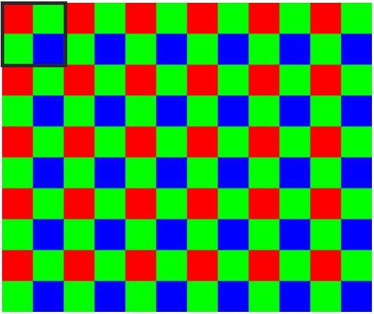
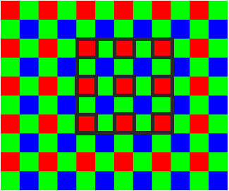
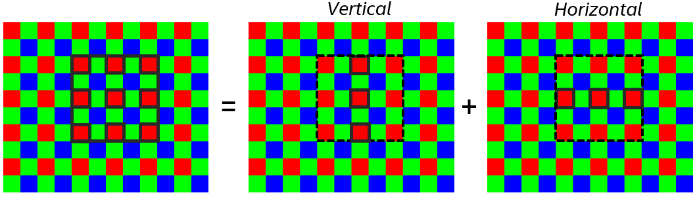
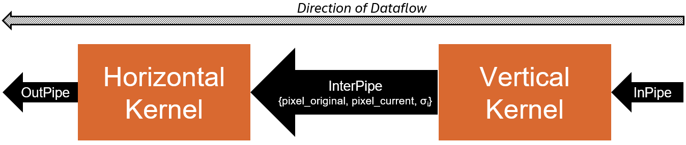
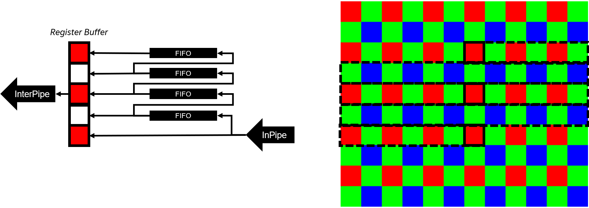
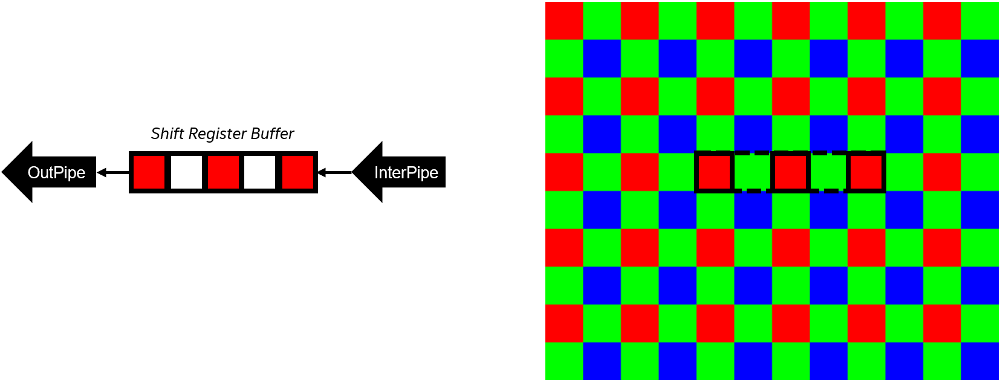
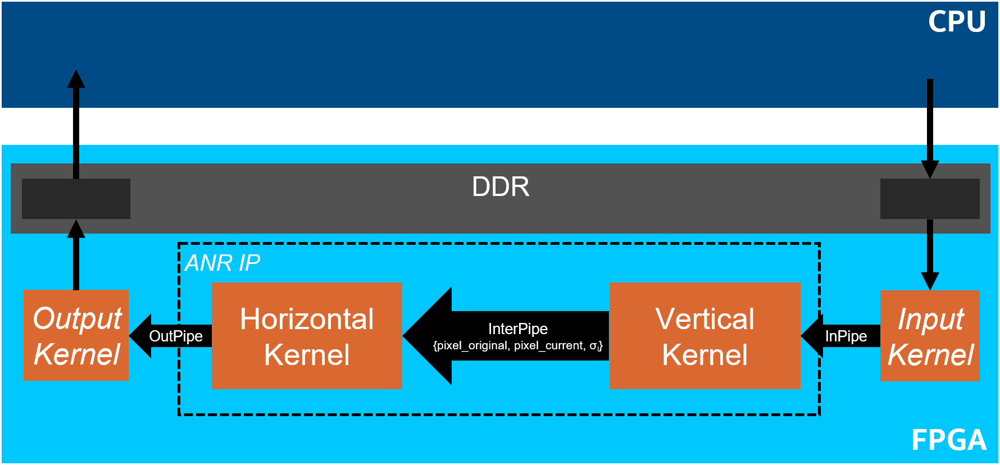

# `Adaptive Noise Reduction` Sample
This `Adaptive Noise Reduction` (ANR) sample is a reference design to demonstrate a highly optimized image sensor adaptive noise reduction algorithm for field programmable gate arrays (FPGAs).

| Area                      | Description
---                         |---
| What you will learn       | How to create a parameterizable image processing pipeline to implement an Adaptive Noise Reduction (ANR) algorithm on a FPGA.
| Time to complete          | ~1 hour

## Purpose
This FPGA reference design demonstrates a parameterizable image processing pipeline that implements an Adaptive Noise Reduction (ANR) algorithm using a bilateral filter.

See [Key Implementation Details](#key-implementation-details) below for more information on the ANR algorithm itself and how it was implemented for the FPGA.

## Prerequisites

This sample is part of the FPGA code samples.
It is categorized as a Tier 4 sample that demonstrates a reference design.


Find more information about how to navigate this part of the code samples in the [FPGA top-level README.md](/DirectProgramming/C++SYCL_FPGA/README.md).
You can also find more information about [troubleshooting build errors](/DirectProgramming/C++SYCL_FPGA/README.md#troubleshooting), [running the sample on the Intel® DevCloud](/DirectProgramming/C++SYCL_FPGA/README.md#build-and-run-the-samples-on-intel-devcloud-optional), [using Visual Studio Code with the code samples](/DirectProgramming/C++SYCL_FPGA/README.md#use-visual-studio-code-vs-code-optional), [links to selected documentation](/DirectProgramming/C++SYCL_FPGA/README.md#documentation), etc.

| Optimized for                     | Description
|:---                               |:---
| OS                                | Ubuntu* 18.04/20.04 <br> RHEL*/CentOS* 8 <br> SUSE* 15 <br> Windows* 10
| Hardware                          | Intel® Agilex® 7, Arria® 10, and Stratix® 10 FPGAs
| Software                          | Intel® oneAPI DPC++/C++ Compiler

> **Note**: Even though the Intel DPC++/C++ OneAPI compiler is enough to compile for emulation, generating reports and generating RTL, there are extra software requirements for the simulation flow and FPGA compiles.
>
> For using the simulator flow, Intel® Quartus® Prime Pro Edition and one of the following simulators must be installed and accessible through your PATH:
> - Questa*-Intel® FPGA Edition
> - Questa*-Intel® FPGA Starter Edition
> - ModelSim® SE
>
> When using the hardware compile flow, Intel® Quartus® Prime Pro Edition must be installed and accessible through your PATH.
>
> :warning: Make sure you add the device files associated with the FPGA that you are targeting to your Intel® Quartus® Prime installation.

## Key Implementation Details

### ANR Algorithm

The adaptive noise reduction (ANR) algorithm uses an input image that is in a Bayer format. (See the [Bayer format](https://en.wikipedia.org/wiki/Bayer_filter) Wikipedia article for more information.)  Unlike image formats you may be used to, like PNG or JPG, where each pixel has a red, green, and blue value (RGB), each pixel in a Bayer format image is either red, green, or blue. (See the image below.) To convert to an RGB image, one must operate on a 4x4 square and generate the RGB pixel by averaging the two green pixels. One purpose of this format is to dedicate more pixels to green as the human eye is more sensitive to green.



The ANR algorithm uses a bilateral filter. Unilateral filters (for example, a Box blur or Gaussian blur) replace the intensity of a given pixel with a weighted average of the neighboring pixels; the weight of each neighboring pixel depends on the spatial distance from the pixel being computed. With bilateral filters, like the one used in this design, the weight of each neighboring pixel depends on both the spatial distance and the difference in pixel intensity. This difference makes bilateral filters better at preserving sharp edges. (See the [bilateral filter](https://en.wikipedia.org/wiki/Bilateral_filter), [Box blur](https://en.wikipedia.org/wiki/Box_blur), and [Gaussian blur](https://en.wikipedia.org/wiki/Gaussian_blur) Wikipedia articles for more information.)

Bilateral filters are non-linear and therefore non-separable. In the case of a 5x5 window (shown below), only 9 pixels (not 25) are used in the computation. This difference is an artifact of the Bayer image format. The most accurate approach would produce the bilateral filter window and combine the entire window of the given pixel color (for the image below, red) at once to generate the output pixel (the middle pixel). For the 5x5 case, this would result in 9 multiplications that need to be summed.



This produces a long chain of adders to sum the results of the multiplications. The design approximates a bilateral filter by making it separable. The first step is to apply a 1D vertical filter to the middle pixel and then a 1D horizontal filter, as shown in the image below. This approach reduces the number of multiplications needing to be summed together to 3. The code in the design applies vertical filter to *all* pixels first and then applies the horizontal filter, which results in the *corner* pixels indirectly applying some weight to the middle pixel.



### ANR FPGA Design
The ANR algorithm is designed as a streaming kernel system with input pixels streaming through the input pipe, and the denoised output pixels streaming out the output pipe, as shown in the figure below. The design consists of two kernels, `Vertical Kernel` and `Horizontal Kernel`, that are connected by an internal SYCL pipe, as shown in the figure below. The `Vertical Kernel` computes an intensity sigma value based on the current pixel, computes the bilateral filter, and applies it to the current window to produce an intermediate pixel value. The `Vertical Kernel` kernel sends three values through the internal pipe: the original pixel value, the current pixel value (the intermediate pixel that was just computed), and the intensity sigma value. The `Horizontal Kernel` streams in these tuples and performs a similar computation on a horizontal window. The algorithm uses the forwarded intensity sigma value to compute the bilateral filer, the new pixel values to perform the bilateral filter computation, and the original pixel to perform *alpha blending*, where the output pixel is a weighted percentage of the original pixel value and the denoised pixel value.



To compute a given pixel, the `Vertical Kernel` must store previous rows (lines) of the input image. (The image shows the technique.) The pixels are streamed in from the pipe and used with pixels from previous rows to perform the 1D vertical window operation.




The logic for the `Horizontal Kernel`, shown below, is simpler since it operates on a single row at a time.



To produce the input data and consume the output, the design sets up a full system as shown in the figure below. The `Input Kernel` reads input data from device memory and provides it to the ANR design via the input pipe. The `Output Kernel` reads the output from the ANR design from the output pipe and writes it to device memory. The oneAPI host code then uses the output data to validate the accuracy of the ANR algorithm against a golden result using Peak signal-to-noise ratio (PSNR). (See the [Peak signal-to-noise ratio (PSNR)](https://en.wikipedia.org/wiki/Peak_signal-to-noise_ratio) Wikipedia article for more information.)



### Quantized Floating-Point (QFP)
Floating-point values consist of a sign bit, an exponent, and a mantissa. In this design, we take 32-bit single-precision floating values and convert them to quantized floating-point (QFP) values, which use fewer bits. (See the [32-bit single-precision](https://en.wikipedia.org/wiki/Single-precision_floating-point_format) Wikipedia article for more information.)

All of the QFPs in this design have 10 bits total but use a different number for the exponent and mantissa. The purpose of this conversion is to be able to create lookup-table (LUT) read-only memories (ROMs) to approximate expensive 32-bit floating-point operations, like an exponential (`exp(x)`) and inversion (`1/x`). Creating LUT ROMs for 32-bit floats would require `2^32*4 = 17GB` bytes of on-chip memory. If the float can be *quantized* to 10 bits, it requires only `2^10*4 = 4KB` of on-chip memory, at the expense of reduced precision.


#### Source Code Breakdown

The following source files are in the `src` directory.

| File                            | Description
|:---                             |:---
|`main.cpp`                       | Contains the `main()` function and the top-level launching, validation, and performance measurements.
|`anr_params.hpp`                 | A class for parsing and holding the ANR specific parameters, such as the sigma coefficients, the filter size, and the alpha value.
|`anr.hpp`                        | Contains the logic for submitting all of the ANR kernels to the queue and the top-level description of the bilateral filter (both horizontal and vertical).
|`column_stencil.hpp`             | A generic library for computing a column stencil (a 1D vertical convolution).
|`constants.hpp`                  | Contains the constants and datatypes for the ANR algorithm.
|`data_bundle.hpp`                | A generic library for bundling data to move between kernels; essentially an array.
|`dma_kernels.hpp`                | Contains kernels that move data between the host and device, as well as reading/writing data between the FPGA and device memory.
|`intensity_sigma_lut.hpp`        | A RAM LUT for the intensity sigma values.
|`qfp_exp_lut.hpp`                | A ROM LUT for computing exp(-x) on a 32-bit floating-point value (using a QFP).
|`qfp_inv_lut.hpp`                | A ROM LUT for computing 1/x on a 32-bit floating-point value (using a QFP).
|`qfp.hpp`                        | Contains a class with generic static methods for converting between 32-bit floating-point and quantized floating-point (QFP).
|`row_stencil.hpp`                | A generic library for computing a row stencil (a 1D horizontal convolution).
|`shift_reg.hpp`                  | A generic library for a shift register.

For `constexpr_math.hpp`, `unrolled_loop.hpp`, and `rom_base.hpp` see the README in the `DirectProgramming/C++SYCL_FPGA/include/` directory.

#### Reusable Header Files

The design uses the following generic header files.

>**Note**: Some of these headers files are in the `/DirectProgramming/C++SYCL_FPGA/include` folder. You might need to copy some of them to the reference design sample `src` directory to compile the program correctly.

| File                                    | Description
|:---                                     |:---
|`ColumnStencil` (*column_stencil.hpp*)   | A library for generalizing a column stencil (i.e., the vertical filter) using C++ functors for callbacks to perform the filter. This library hides the details of the FIFO line stores and padding logic and allows the user to worry about the filter convolution.
|`DataBundle` (*data_bundle.hpp*)         | A library for holding multiple pieces of the same data. This class is similar to a C++ `std::array`, but ensures that the constructors and `operator=` are overridden properly to avoid expensive loops.
|`ROMBase` (*rom_base.hpp*)               | This library provides a base class for creating a `constexpr` class that results in a ROM in the FPGA.
|`UnrolledLoop` (*unrolled_loop.hpp*)     | A library that implements a front-end unrolled loop using C++ metaprogramming.
|`mp_math.hpp`                            | A set of various `constexpr` math functions that are implemented using C++ metaprogramming.

>**Note**: For more information on the usage and implementation of these header libraries, view the comments in the source code in the `.hpp` files.

## Build the `Adaptive Noise Reduction` Reference Design

> **Note**: When working with the command-line interface (CLI), you should configure the oneAPI toolkits using environment variables.
> Set up your CLI environment by sourcing the `setvars` script located in the root of your oneAPI installation every time you open a new terminal window.
> This practice ensures that your compiler, libraries, and tools are ready for development.
>
> Linux*:
> - For system wide installations: `. /opt/intel/oneapi/setvars.sh`
> - For private installations: ` . ~/intel/oneapi/setvars.sh`
> - For non-POSIX shells, like csh, use the following command: `bash -c 'source <install-dir>/setvars.sh ; exec csh'`
>
> Windows*:
> - `C:\Program Files(x86)\Intel\oneAPI\setvars.bat`
> - Windows PowerShell*, use the following command: `cmd.exe "/K" '"C:\Program Files (x86)\Intel\oneAPI\setvars.bat" && powershell'`
>
> For more information on configuring environment variables, see [Use the setvars Script with Linux* or macOS*](https://www.intel.com/content/www/us/en/develop/documentation/oneapi-programming-guide/top/oneapi-development-environment-setup/use-the-setvars-script-with-linux-or-macos.html) or [Use the setvars Script with Windows*](https://www.intel.com/content/www/us/en/develop/documentation/oneapi-programming-guide/top/oneapi-development-environment-setup/use-the-setvars-script-with-windows.html).

### On Linux*

1. Change to the sample directory.
2. Configure the build system for the Agilex® 7 device family, which is the default.

   ```
   mkdir build
   cd build
   cmake ..
   ```

   > **Note**: You can change the default target by using the command:
   >  ```
   >  cmake .. -DFPGA_DEVICE=<FPGA device family or FPGA part number>
   >  ```
   >
   > Alternatively, you can target an explicit FPGA board variant and BSP by using the following command:
   >  ```
   >  cmake .. -DFPGA_DEVICE=<board-support-package>:<board-variant> -DIS_BSP=1
   >  ```
   >
   > You will only be able to run an executable on the FPGA if you specified a BSP.

3. Compile the design. (The provided targets match the recommended development flow.)

   1. Compile for emulation (fast compile time, targets emulated FPGA device).
      ```
      make fpga_emu
      ```
   2. Compile for simulation (fast compile time, targets simulator FPGA device):
      ```
      make fpga_sim
      ```
   3. Generate HTML performance report.
      ```
      make report
      ```
      The report resides at `anr_report.prj/reports/report.html`.

   4. Compile for FPGA hardware (longer compile time, targets FPGA device).
      ```
      make fpga
      ```

### On Windows*

1. Change to the sample directory.
2. Configure the build system for the Agilex® 7 device family, which is the default.
   ```
   mkdir build
   cd build
   cmake -G "NMake Makefiles" ..
   ```

   > **Note**: You can change the default target by using the command:
   >  ```
   >  cmake -G "NMake Makefiles" .. -DFPGA_DEVICE=<FPGA device family or FPGA part number>
   >  ```
   >
   > Alternatively, you can target an explicit FPGA board variant and BSP by using the following command:
   >  ```
   >  cmake -G "NMake Makefiles" .. -DFPGA_DEVICE=<board-support-package>:<board-variant> -DIS_BSP=1
   >  ```
   >
   > You will only be able to run an executable on the FPGA if you specified a BSP.

3. Compile the design. (The provided targets match the recommended development flow.)

   1. Compile for emulation (fast compile time, targets emulated FPGA device).
      ```
      nmake fpga_emu
      ```
   2. Compile for simulation (fast compile time, targets simulator FPGA device):
      ```
      nmake fpga_sim
      ```
   3. Generate HTML performance report.
      ```
      nmake report
      ```
      The report resides at `anr_report.prj/reports/report.html`.

   4. Compile for FPGA hardware (longer compile time, targets FPGA device).
      ```
      nmake fpga
      ```
>**Note**: If you encounter any issues with long paths when compiling under Windows*, you may have to create your ‘build’ directory in a shorter path, for example `C:\samples\build`. You can then run cmake from that directory, and provide cmake with the full path to your sample directory.

## Run the `Adaptive Noise Reduction` Executable

### On Linux

1. Run the sample on the FPGA emulator (the kernel executes on the CPU).
   ```
   ./anr.fpga_emu
   ```
2. Run the sample on the FPGA simulator device.
   ```
   CL_CONTEXT_MPSIM_DEVICE_INTELFPGA=1 ./anr.fpga_sim
   ```
3. Alternatively, run the sample on the FPGA device (only if you ran `cmake` with `-DFPGA_DEVICE=<board-support-package>:<board-variant>`).
   ```
   ./anr.fpga
   ```

### On Windows

1. Run the sample on the FPGA emulator (the kernel executes on the CPU).
   ```
   anr.fpga_emu.exe
   ```
2. Run the sample on the FPGA simulator device.
   ```
   set CL_CONTEXT_MPSIM_DEVICE_INTELFPGA=1
   anr.fpga_sim.exe
   set CL_CONTEXT_MPSIM_DEVICE_INTELFPGA=
   ```
3. Alternatively, run the sample on the FPGA device (only if you ran `cmake` with `-DFPGA_DEVICE=<board-support-package>:<board-variant>`).
   ```
   anr.fpga.exe
   ```

## Example Output

```
Runs:             2
Columns:          1920
Rows:             1436
Frames:           8
Filter Size:      9
Pixels Per Cycle: 2
Maximum Columns:  2048

Execution time: 45.0012 ms
Throughput: 488.876 MB/s
PASSED
```
> **Note**: When running on the FPGA emulator, the *Execution time* and *Throughput* do not reflect the hardware performance of the design.

## License

Code samples are licensed under the MIT license. See [License.txt](https://github.com/oneapi-src/oneAPI-samples/blob/master/License.txt) for details.

Third-party program Licenses can be found here: [third-party-programs.txt](https://github.com/oneapi-src/oneAPI-samples/blob/master/third-party-programs.txt).
