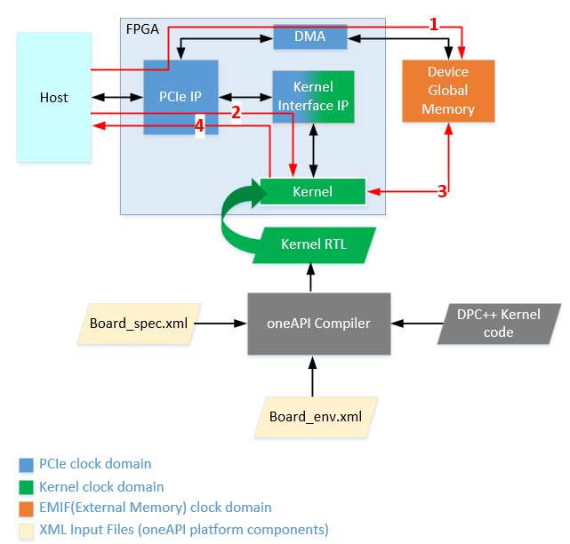

# `Board Test` Sample
The `Board Test` sample is a reference design that contains tests to check FPGA board interfaces and reports the following metrics:

- Host-to-device global memory interface bandwidth
- Kernel clock frequency
- Kernel launch latency
- Kernel-to-device global memory bandwidth
- Unified Shared Memory bandwidth

| Area                    | Description
|:---                     |:---
| What you will learn     | How to test board interfaces to ensure that the designed platform provides expected performance
| Time to complete        | 30 minutes (not including compile time)

## Purpose
This reference design implements tests to check FPGA board interfaces and measure host-to-device and kernel-to-global memory interface metrics. Use this reference design as a starting point to validate platform interfaces when you customize a BSP.

## Prerequisites

This sample is part of the FPGA code samples.
It is categorized as a Tier 4 sample that demonstrates a reference design.


Find more information about how to navigate this part of the code samples in the [FPGA top-level README.md](/DirectProgramming/C++SYCL_FPGA/README.md).
You can also find more information about [troubleshooting build errors](/DirectProgramming/C++SYCL_FPGA/README.md#troubleshooting), [running the sample on the Intel® DevCloud](/DirectProgramming/C++SYCL_FPGA/README.md#build-and-run-the-samples-on-intel-devcloud-optional), [using Visual Studio Code with the code samples](/DirectProgramming/C++SYCL_FPGA/README.md#use-visual-studio-code-vs-code-optional), [links to selected documentation](/DirectProgramming/C++SYCL_FPGA/README.md#documentation), etc.

| Optimized for           | Description
|:---                     |:---
| OS                      | Ubuntu* 18.04/20.04 <br> RHEL*/CentOS* 8 <br> SUSE* 15 <br> Windows* 10
| Hardware                | Intel® Agilex® 7, Arria® 10, and Stratix® 10 FPGAs
| Software                | Intel® oneAPI DPC++/C++ Compiler

> **Note**: Even though the Intel DPC++/C++ oneAPI compiler is enough to compile for emulation, generating reports and generating RTL, there are extra software requirements for the simulation flow and FPGA compiles.
>
> For using the simulator flow, Intel® Quartus® Prime Pro Edition and one of the following simulators must be installed and accessible through your PATH:
> - Questa*-Intel® FPGA Edition
> - Questa*-Intel® FPGA Starter Edition
> - ModelSim® SE
>
> When using the hardware compile flow, Intel® Quartus® Prime Pro Edition must be installed and accessible through your PATH.
>
> :warning: Make sure you add the device files associated with the FPGA that you are targeting to your Intel® Quartus® Prime installation.

> :warning: This sample is benchmarking an FPGA board, therefore it should really be used when targeting an FPGA board/BSP.

## Key Implementation Details

A oneAPI Board Support Package (BSP) consists of software layers and an FPGA hardware scaffold design, making it possible to target an FPGA through the Intel® oneAPI DPC++/C++ Compiler.

The compiler stitches the generated FPGA design into the oneAPI BSP framework. Refer to the [Intel® oneAPI Programming Guide](https://www.intel.com/content/www/us/en/develop/documentation/oneapi-programming-guide/top/programming-interface/fpga-flow/fpga-bsps-and-boards.html) for information about oneAPI BSPs.

The BSP hardware components typically comprise RTL for all interfaces the oneAPI kernel requires; for example, a PCIe IP for the host to kernel communication, EMIF (External Memory Interface) IP for kernel to memory, and host to FPGA board memory communication among other things.

The BSP software components typically consist of a Memory Mapped Device (MMD) layer and a driver. The implementation is vendor-dependent.

The BSP consists of components operating at different clock domains. PCIe and external memories operate at a fixed frequency. Corresponding RTL IPs are parametrized to operate at these fixed frequencies by platform vendors. The kernel clock frequency varies and is calculated as part of the oneAPI offline compilation flow for FPGAs. The BSP has logic to handle the data transfer across these clock domains.

`Board Test` measures the frequency that the kernel is running at in the FPGA and compares this to the compiled kernel clock frequency.

The following block diagram shows an overview of a typical oneAPI FPGA BSP hardware design and the numbered arrows depict the following:

- Path 1 represents the host to kernel interface.
- Path 2 represents the host-to-device global memory interface.
- Path 3 represents the kernel-to-device global memory interface.
- Path 4 represents the kernel-to-shared host memory interface




> **Note**: The block diagram shown is an overview of a typical oneAPI FPGA platform. See the oneAPI platform or BSP vendor documentation for more details about platform components.

### Source Code Explanation

| File               | Description
|:---                |:---
| `board_test.cpp`   | Contains the `main()` function and the test selection logic as well as calls to each test.
| `board_test.hpp`   | Contains the definitions for all the individual tests in the sample.
| `host_speed.hpp`   | Header for host speed test. Contains definition of functions used in host speed test.
| `usm_speed.hpp`    | Header for the USM bandwidth test. Contains definitions of functions used in the USM bandwidth test.
| `helper.hpp`       | Contains constants (for example, binary name) used throughout the code as well as definition of functions that print help and measure execution time.

### Compiler Flags Used

| Flag                  | Description
|:---                   |:---
`-Xsno-interleaving`    | By default oneAPI compiler burst interleaves across same memory type.  `-Xsno-interleaving` disables burst interleaving and enables testing each memory bank independently. (See the [FPGA Optimization Guide for Intel® oneAPI Toolkits Developer Guide](https://www.intel.com/content/www/us/en/develop/documentation/oneapi-fpga-optimization-guide/top/flags-attr-prag-ext/optimization-flags/disabl-burst-int.html) for more information.)

## Build the `Board Test` Program

> **Note**: When working with the command-line interface (CLI), you should configure the oneAPI toolkits using environment variables. 
> Set up your CLI environment by sourcing the `setvars` script located in the root of your oneAPI installation every time you open a new terminal window. 
> This practice ensures that your compiler, libraries, and tools are ready for development.
>
> Linux*:
> - For system wide installations: `. /opt/intel/oneapi/setvars.sh`
> - For private installations: ` . ~/intel/oneapi/setvars.sh`
> - For non-POSIX shells, like csh, use the following command: `bash -c 'source <install-dir>/setvars.sh ; exec csh'`
>
> Windows*:
> - `C:\Program Files(x86)\Intel\oneAPI\setvars.bat`
> - Windows PowerShell*, use the following command: `cmd.exe "/K" '"C:\Program Files (x86)\Intel\oneAPI\setvars.bat" && powershell'`
>
> For more information on configuring environment variables, see [Use the setvars Script with Linux* or macOS*](https://www.intel.com/content/www/us/en/develop/documentation/oneapi-programming-guide/top/oneapi-development-environment-setup/use-the-setvars-script-with-linux-or-macos.html) or [Use the setvars Script with Windows*](https://www.intel.com/content/www/us/en/develop/documentation/oneapi-programming-guide/top/oneapi-development-environment-setup/use-the-setvars-script-with-windows.html).

### On Linux*

1. Change to the sample directory.
2. Configure the build system for your BSP.

   ```
   mkdir build
   cd build
   cmake .. -DFPGA_DEVICE=<board-support-package>:<board-variant>
   ```
   > **Note**: You must set FPGA_DEVICE to point to your BSP in order to build this sample.

3. Compile the design. (The provided targets match the recommended development flow.)

   1. Compile and run for emulation (fast compile time, targets emulated FPGA device).
      ```
      make fpga_emu
      ```
   2. Generate the optimization report. 
      ```
      make report
      ```
   3. Compile and run for FPGA hardware (longer compile time, targets an FPGA device).
      ```
      make fpga
      ```

### On Windows*

1. Change to the sample directory.
2. Configure the build system for your BSP.
   ```
   mkdir build
   cd build
   cmake -G "NMake Makefiles" .. -DFPGA_DEVICE=<board-support-package>:<board-variant>
   ```
   > **Note**: You must set FPGA_DEVICE to point to your BSP in order to build this sample.

3. Compile the design. (The provided targets match the recommended development flow.)

   1. Compile and run for emulation (fast compile time, targets emulated FPGA device).
      ```
      nmake fpga_emu
      ```
   2. Generate the optimization report.
      ```
      nmake report
      ```
   3. Compile and run for FPGA hardware (longer compile time, targets an FPGA device).
      ```
      nmake fpga
      ```
>**Note**: If you encounter any issues with long paths when compiling under Windows*, you may have to create your ‘build’ directory in a shorter path, for example `C:\samples\build`. You can then run cmake from that directory, and provide cmake with the full path to your sample directory.

## Run the `Board Test` Executable

### Configurable Parameters

The complete board test is divided into six subtests. By default, all tests run. You can choose to run a single test by using the `-test=<test number>` option. Refer to the [Running the Sample](#running-the-sample) section for test usage instructions.

| Test Number  | Test Name
|:---          |:---
| 1            | Host Speed and Host Read Write Test
| 2            | Kernel Clock Frequency Test
| 3            | Kernel Launch Test
| 4            | Kernel Latency Measurement
| 5            | Kernel-to-Memory Read Write Test
| 6            | Kernel-to-Memory Bandwidth Test
| 7            | Unified Shared Memory (USM) Bandwidth Test

>**Note:** You should run all tests at least once to ensure that the platform interfaces are fully functional.

To view test details and usage information using the binary, use the `-help` option: `<program> -help`.

The tests listed above check the following interfaces in a platform:

- **Host-to-device global memory interface (Test 1):** This interface is checked by performing explicit data movement between the host and device global memory. Host to device global memory bandwidth is measured and reported. As a part of this interface check, unaligned data transfers are also performed to verify that non-DMA transfers complete successfully.

- **Kernel clock frequency (Test 2):** The test measures the frequency the programmed kernel is running at on the FPGA device and reports it. By default, this test fails if the measured frequency is not within 2% of the compiled frequency.

  >**Note**: The test allows overriding this failure; however, overriding may lead to functional errors and is not recommended. The override option is provided to allow debugging in cases where platform design changes are done to force the kernel to run at a slower clock frequency (though this is not a common use case). To override, set the `report_chk` variable to `false` in `board_test.cpp` and recompile only the host code by using the `-reuse-exe=board_test.fpga` option in your compile command (this flag is added by default for you in the CMake file included with this code sample).

- **Host-to-kernel interface (Tests 3 & 4):** The test ensures that the host to kernel communication is correct and that the host can launch a kernel successfully. It also measures the roundtrip kernel launch latency and throughput (number of kernels/ms) of single task no-operation kernels.

- **Kernel-to-device global memory interface (Tests 5 & 6):** This interface is checked by performing kernel to memory data transfers using simple read and write kernels. Kernel to memory bandwidth is measured and reported.

- **Unified shared memory (USM) interface (Test 7):** This interface is checked by copying data between, reading data from, and writing data to host USM. The bandwidth is measured and reported for each case. Applies only to board variants with USM support; to run this test you must specify the `SUPPORTS_USM` macro at compile-time; e.g., `cmake .. -DSUPPORTS_USM=1`.

### On Linux

 1. Run the sample on the FPGA emulator (the kernel executes on the CPU).
    ```
    ./board_test.fpga_emu
    ```
    By default the program runs all tests. To run a specific test, enter the test number as an argument to the `-test` option:
    ```
    ./board_test.fpga_emu -test=<test_number>
    ```
 2. Run the sample on the FPGA device.
    ```
    ./board_test.fpga
    ```
    By default the program runs all tests. To run a specific test, enter the test number as an argument to the `-test` option:
    ```
    ./board_test.fpga -test=<test_number>
    ```
### On Windows

 1. Run the sample on the FPGA emulator (the kernel executes on the CPU):
    ```
    board_test.exe
    ```
    By default the program runs all tests. To run a specific test, enter the test number as an argument to the `-test` option:
    ```
    board_test.exe -test=<test_number>
    ```
 2. Run the sample on the FPGA device.
    ```
    board_test.fpga.exe
    ```
    By default the program runs all tests. To run a specific test, enter the test number as an argument to the `-test` option:
    ```
    board_test.fpga.exe -test=<test_number>
    ```

## Example Output

Running on FPGA device (Intel Stratix 10 SX platform). Performance results are based on testing as of August 14, 2023.

> **Note**: Refer to the [Performance Disclaimers](/DirectProgramming/C++SYCL_FPGA/README.md#performance-disclaimers) section for important performance information.

```
*** Board_test usage information ***
Command to run board_test using generated binary:
  > To run all tests (default): run board_test.fpga
  > To run a specific test (see list below); pass the test number as argument to "-test" option: 
  Linux: ./board_test.fpga -test=<test_number>
  Windows: board_test.exe -test=<test_number>
  > To see more details on what each test does use -help option
The tests are:
  1. Host Speed and Host Read Write Test
  2. Kernel Clock Frequency Test
  3. Kernel Launch Test
  4. Kernel Latency Measurement
  5. Kernel-to-Memory Read Write Test
  6. Kernel-to-Memory Bandwidth Test
  7. Unified Shared Memory Bandwidth Test
Note: Kernel Clock Frequency is run along with all tests except 1 (Host Speed and Host Read Write test)

Running all tests 
Running on device: pac_s10_usm : Intel PAC Platform (pac_f300000)

clGetDeviceInfo CL_DEVICE_GLOBAL_MEM_SIZE = 34359738368
clGetDeviceInfo CL_DEVICE_MAX_MEM_ALLOC_SIZE = 34359738368
Device buffer size available for allocation = 34359738368 bytes

*****************************************************************
*********************** Host Speed Test *************************
*****************************************************************

Size of buffer created = 34359738368 bytes
Writing 32768 MB to device global memory ... 5467.71 MB/s
Reading 32768 MB from device global memory ... 5418.46 MB/s
Verifying data ...
Successfully wrote and readback 32768 MB buffer

Transferring 8192 KBs in 256 32 KB blocks ...
Transferring 8192 KBs in 128 64 KB blocks ...
Transferring 8192 KBs in 64 128 KB blocks ...
Transferring 8192 KBs in 32 256 KB blocks ...
Transferring 8192 KBs in 16 512 KB blocks ...
Transferring 8192 KBs in 8 1024 KB blocks ...
Transferring 8192 KBs in 4 2048 KB blocks ...
Transferring 8192 KBs in 2 4096 KB blocks ...
Transferring 8192 KBs in 1 8192 KB blocks ...

Writing 8192 KBs with block size (in bytes) below:

Block_Size Avg Max Min End-End (MB/s)
   32768 728.06 957.68 450.37 612.81 
   65536 1206.82 1545.84 742.51 1039.50 
  131072 1904.39 2219.85 1218.16 1690.47 
  262144 2641.81 3139.88 2090.79 2451.81 
  524288 3402.66 3630.32 3048.84 3232.47 
 1048576 3741.77 4034.06 3270.88 3635.78 
 2097152 3856.43 4146.10 3397.37 3807.60 
 4194304 4297.57 5006.66 3764.43 4276.62 
 8388608 4699.70 4699.70 4699.70 4699.70 

Reading 8192 KBs with block size (in bytes) below:

Block_Size Avg Max Min End-End (MB/s)
   32768 1284.84 1416.59 862.47 853.33 
   65536 2105.26 2245.54 780.54 1612.20 
  131072 2801.30 2989.72 1904.53 2424.31 
  262144 3451.71 3592.88 2760.14 3117.73 
  524288 3857.30 3969.04 3550.99 3651.80 
 1048576 4043.79 4099.79 3841.44 3926.42 
 2097152 3864.89 3953.67 3773.29 3835.53 
 4194304 4551.54 4842.46 4293.59 4532.24 
 8388608 4856.18 4856.18 4856.18 4856.18 

Host write top speed = 5006.66 MB/s
Host read top speed = 4856.18 MB/s


HOST-TO-MEMORY BANDWIDTH = 4931 MB/s


*****************************************************************
********************* Host Read Write Test **********************
*****************************************************************

--- Running host read write test with device offset 0
--- Running host read write test with device offset 3

HOST READ-WRITE TEST PASSED!

*****************************************************************
*******************  Kernel Clock Frequency Test  ***************
*****************************************************************

Measured Frequency    =   357.478 MHz 
Quartus Compiled Frequency  =   358 MHz 

Measured Clock frequency is within 2 percent of Quartus compiled frequency. 

*****************************************************************
********************* Kernel Launch Test ************************
*****************************************************************

Launching kernel KernelSender ...
Launching kernel KernelReceiver ...
  ... Waiting for sender
Sender sent the token to receiver
  ... Waiting for receiver

KERNEL_LAUNCH_TEST PASSED

*****************************************************************
********************  Kernel Latency  **************************
*****************************************************************

Processed 10000 kernels in 245.4532 ms
Single kernel round trip time = 24.5453 us
Throughput = 40.7410 kernels/ms
Kernel execution is complete

*****************************************************************
*************  Kernel-to-Memory Read Write Test  ***************
*****************************************************************

Maximum device global memory allocation size is 34359738368 bytes 
Finished host memory allocation for input and output data
Creating device buffer
Finished writing to device buffers 
Launching kernel MemReadWriteStream ... 
Launching kernel with global offset : 0
Launching kernel with global offset : 1073741824
Launching kernel with global offset : 2147483648
Launching kernel with global offset : 3221225472
Launching kernel with global offset : 4294967296
Launching kernel with global offset : 5368709120
Launching kernel with global offset : 6442450944
Launching kernel with global offset : 7516192768
... kernel finished execution. 
Finished Verification
KERNEL TO MEMORY READ WRITE TEST PASSED 

*****************************************************************
*****************  Kernel-to-Memory Bandwidth  *****************
*****************************************************************

Note: This test assumes that design was compiled with -Xsno-interleaving option


Performing kernel transfers of 4096 MBs on the default global memory (address starting at 0)
Launching kernel MemWriteStream ... 
Launching kernel MemReadStream ... 
Launching kernel MemReadWriteStream ... 

Summarizing bandwidth in MB/s/bank for banks 1 to 8
 16115.8  16130  16116.6  16135.7  16115.7  16130  16116.2  16115.6  MemWriteStream
 17339.4  17339.4  17339.4  17339.6  17339.2  17339.1  17339.4  17339.3  MemReadStream
 16080.5  16082.8  16080  16084.2  16080.2  16082.8  16079.7  16079.9  MemReadWriteStream

KERNEL-TO-MEMORY BANDWIDTH = 16514.2 MB/s/bank

*****************************************************************
***********************  USM Bandwidth  *************************
*****************************************************************

Iterations: 1
Data size: 1024 MB
Data type size: 64 bytes
Case: Full Duplex
Average Time: 98856.4 ns	
Average Throughput: 20.2314 GB/s	

Iterations: 1
Data size: 1024 MB
Data type size: 64 bytes
Case: From Host to Device
Average Time: 86983.6 ns	
Average Throughput: 11.4964 GB/s	

Iterations: 1
Data size: 1024 MB
Data type size: 64 bytes
Case: From Device to Host
Average Time: 84260.1 ns	
Average Throughput: 11.868 GB/s	


BOARD TEST PASSED

```

## License

Code samples are licensed under the MIT license. See [License.txt](/License.txt) for details.

Third party program Licenses can be found here: [third-party-programs.txt](/third-party-programs.txt).
