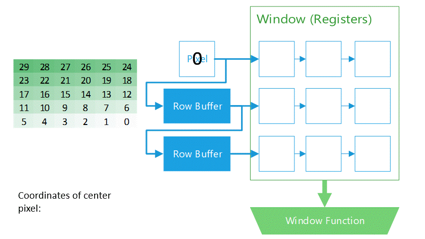
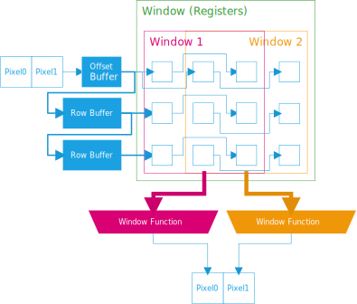
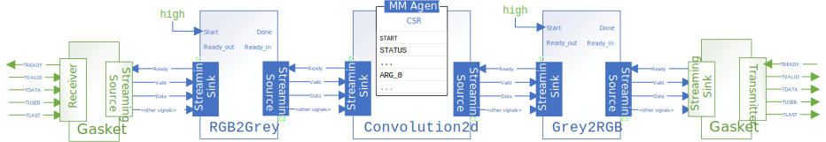
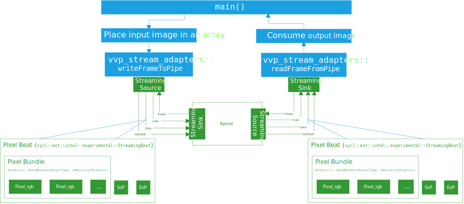

# 2D Image Convolution

This project demonstrates how to use SYCL HLS to create a 2D Convolution IP that can be used in your Intel® Quartus® Prime projects. 

## Purpose

Convolution is a cornerstone problem in video processing designs. It commonly appears in both hardware and software systems, but in general, software implementations do not efficiently synthesize into RTL. This reference design includes:

* A reusable C++ library that generates an efficient line buffer hardware module. This hardware module is the foundation of convolution algorithms, and other similar algorithms.

* An example of how to chain together multiple video processing modules using `sycl::pipe`s, which behave like streaming interfaces in hardware designs.

* A video-processing testbench that you can use to test your own designs. This testbench consumes image data from RAM and parcels it into streaming transactions. This makes it easy to stream a test image into your video design.

* Demonstration of a simple, greyscale Sobel filter. Single-channel convolution kernels like this are useful for edge-detection.

## Prerequisites

This sample is part of the FPGA code samples.
It is categorized as a Tier 4 sample that demonstrates a reference design.


Find more information about how to navigate this part of the code samples in the [FPGA top-level README.md](/DirectProgramming/C++SYCL_FPGA/README.md).
You can also find more information about [troubleshooting build errors](/DirectProgramming/C++SYCL_FPGA/README.md#troubleshooting), [running the sample on the Intel® DevCloud](/DirectProgramming/C++SYCL_FPGA/README.md#build-and-run-the-samples-on-intel-devcloud-optional), [using Visual Studio Code with the code samples](/DirectProgramming/C++SYCL_FPGA/README.md#use-visual-studio-code-vs-code-optional), [links to selected documentation](/DirectProgramming/C++SYCL_FPGA/README.md#documentation), etc.

| Optimized for      | Description
|:---                |:---
| OS                 | Ubuntu* 20.04 <br> RHEL*/CentOS* 8 <br> SUSE* 15 <br> Windows* 10 <br> Windows Server* 2019
| Hardware           | Intel® Agilex® 7, Arria® 10, and Stratix® 10 FPGAs
| Software           | Intel® oneAPI DPC++/C++ Compiler

> **Note**: Even though the Intel DPC++/C++ oneAPI compiler is enough to compile for emulation, generating reports and generating RTL, there are extra software requirements for the simulation flow and FPGA compiles.
>
> For using the simulator flow, Intel® Quartus® Prime Pro Edition and one of the following simulators must be installed and accessible through your PATH:
> - Questa*-Intel® FPGA Edition
> - Questa*-Intel® FPGA Starter Edition
> - ModelSim® SE
>
> When using the hardware compile flow, Intel® Quartus® Prime Pro Edition must be installed and accessible through your PATH.
>
> :warning: Make sure you add the device files associated with the FPGA that you are targeting to your Intel® Quartus® Prime installation.

### Performance

Performance results are based on testing conducted with a pre-release version of oneAPI 2024.2, with released Intel® Quartus® Prime Pro Edition 24.1 software. Testing was conducted May 25, 2024. Area and f<sub>MAX</sub> estimates are averaged across 8 seeds. 
* These area estimates are ONLY for the `Convolution2d` kernel, and do not include the `RGB2Grey` or `Grey2RGB` kernels. You can compile the design with only the `Convolution2d` kernel by compiling with the `-DTEST_CONV2D_ISOLATED=1` compiler flag, or by adding `#define TEST_CONV2D_ISOLATED 1` in `src/main.cpp`.
* These estimates were achieved by setting a 600 MHz clock target for the `Agilex7` device. You can set the clock target by adding the `-Xsclock=600MHz` flag to CMakeLists.txt, or by passing it to the `cmake` command as shown in [Building the `convolution2d` Tutorial](#building-the-convolution2d-tutorial).
* The reported fMAX is the 'restricted fMAX' as reported by Intel® Quartus® Prime.

> **Note**: Refer to the [Performance Disclaimers](/DirectProgramming/C++SYCL_FPGA/README.md#performance-disclaimers) section for important performance information.

#### Intel Agilex® 7 FPGA

| Parallel Pixels | Window Dimensions | Coefficient Type | Input Type     | f<sub>MAX</sub> (MHz) | ALMs  | DSP blocks | M20K Block RAM
|---              |---                |---               |---             |---                    |---    |---         |---
| 1               | 3x3               | `float`          | 10-bit Integer | 639.8                 | 3026  |   9        | 19
| 2               | 3x3               | `float`          | 10-bit Integer | 639.8                 | 4618  |  18        | 19
| 4               | 3x3               | `float`          | 10-bit Integer | 639.8                 | 7677  |  36        | 18
| 8               | 3x3               | `float`          | 10-bit Integer | 639.8                 | 14410 |  72        | 19

> **Note**: This design uses a relatively large number of ALM resources because of the floating-point conversions in `ConvolutionFunction()` in `src/convolution_kernel.hpp`. The coefficients for this design were specified as floating-point for maximal flexibility in coefficient values, but the enthusiastic user is encouraged to convert this function to fixed-point using the `ac_fixed` types, as described in [this sample](/DirectProgramming/C%2B%2BSYCL_FPGA/Tutorials/Features/ac_fixed).

## Key Implementation Details

### Line Buffer Hardware

The `LineBuffer2d` class describes a line buffer data structure that compiles into efficient FPGA hardware. The user code inserts pixels into the line buffer data structure, which buffers the pixels so as to effectively slide a 2-D 'window' across the input data stream. A user-specified function operates on the 'window'.



> **Note**: Observe how the pixels at the end of the image need to be flushed out with dummy data. You should pass a number of dummy pixels equal to the capacity of the row buffers. If you do not remember to flush out the line buffer, the final image that you process will not be able to completely exit the filter. If you want to send a new image to the filter, these dummy pixels will still be in the line buffers.

The `LineBuffer2d` class lets you specify the number of concurrent pixels your design processes each transaction. This number affects the width and depth of the line buffer, and controls number of copies of your window function. Increasing the number of parallel pixels improves throughput, but also consumes more FPGA resources. The line buffer structure compiles into hardware like in the following figure:



You can instantiate the `LineBuffer2d` in a oneAPI kernel. The example below demonstrates a kernel that parses data indefinitely, but uses 'start-of-packet' and 'end-of-packet' sideband signals to indicate where new frames start. These signals are communicated to the `LineBuffer2d` instance in the call to the `Filter()`.

```c++
#include "linebuffer2d.hpp"
<...>
template <typename PipeIn, typename PipeOut>
struct Convolution2d {
  // these defaults are not propagated to the RTL
  int rows = 0;
  int cols = 0;

  // These coefficients used in convolution. kernel are often called a 'kernel'
  // in the image-processing field, but that term is avoided to reduce
  // confusion. Since kernel are a kernel argument, kernel can be specified at
  // runtime. The coefficients can only be updated by stopping the kernel and
  // re-starting it.
  std::array<float, conv2d::kWindowSize * conv2d::kWindowSize> coeffs;

  void operator()() const {
    // Publish kernel version so that other IPs can poll it
    VersionCSR::write(kKernelVersion);

    // This instance of the line buffer will store previously read pixels so
    // that they can be operated on in a local filter. The filter is invoked
    // below in the loop.
    line_buffer_2d::LineBuffer2d<conv2d::PixelType, conv2d::PixelType,
                                 conv2d::kWindowSize, conv2d::kMaxCols,
                                 conv2d::kParallelPixels>
        myLineBuffer(rows, cols);

    bool keep_going = true;
    bool bypass = false;

    [[intel::initiation_interval(1)]]  // NO-FORMAT: Attribute
    while (keep_going) {
      // do non-blocking reads so that the kernel can be interrupted at any
      // time.
      bool did_read_beat = false;
      conv2d::GreyScaleBeat new_beat = PipeIn::read(did_read_beat);

      // the bypass signal lets the user disable the line buffer processing.
      bool did_read_bypass = false;
      bool should_bypass = BypassCSR::read(did_read_bypass);

      // the stop signal lets the user instruct the kernel to halt so that new
      // coefficients can be read.
      bool did_read_stop = false;
      bool should_stop = StopCSR::read(did_read_stop);

      if (did_read_bypass) {
        bypass = should_bypass;
      }

      if (did_read_beat) {
        conv2d::GreyScaleBeat output_beat;
        if (bypass) {
          output_beat = new_beat;
        } else {
          bool sop, eop;

          // Call `Filter()` function on `LineBuffer2d` object. This inserts a
          // new pixel into the line buffer, and runs the user-provided window
          // function (`ConvolutionFunction()`). The additional argument
          // `coeffs` is passed to `ConvolutionFunction()`. The return value of
          // `Filter()` is the pixel data that we should propagate on to the
          // next link in the processing chain.
          conv2d::GreyPixelBundle output_bundle =
              myLineBuffer.Filter<ConvolutionFunction>(
                  new_beat.data, new_beat.sop, new_beat.eop, sop, eop, coeffs);
          output_beat = conv2d::GreyScaleBeat(output_bundle, sop, eop, 0);
        }
        PipeOut::write(output_beat);
      }

      if (did_read_stop) {
        keep_going = !should_stop;
      }
    }
  }
};
```

The window function that you supply to `LineBuffer2d::filter<>()` should be of the following form:

```c++
OutputPixelType WindowFunction(short row, short col, short rows,
                               short cols, InputPixelType *buffer,
                               ... otherArgs)
```

`row`, `col`, `rows`, `cols`, and `buffer` are mandatory, but you can add additional arguments. For example, a runtime-defined set of coefficients.

You can use this line buffer to implement a convolution operation by specifying a window function like this:

```c++
conv2d::PixelType ConvolutionFunction(
    short row, short col, short rows, short cols, conv2d::PixelType *buffer,
    const std::array<float, conv2d::kWindowSize * conv2d::kWindowSize>
        coefficients) {
  float sum = 0.0f;
#pragma unroll
  for (int w_row = 0; w_row < conv2d::kWindowSize; w_row++) {
#pragma unroll
    for (int w_col = 0; w_col < conv2d::kWindowSize; w_col++) {
      short c_select, r_select;

      // handle the case where the center of the window is at the image edge.
      // In this design, simply 'reflect' pixels that are already in the
      // window.
      SaturateWindowCoordinates(w_row, w_col,  // NO-FORMAT: Alignment
                                row, col,      // NO-FORMAT: Alignment
                                rows, cols,    // NO-FORMAT: Alignment
                                r_select, c_select);
      conv2d::PixelType pixel =
          buffer[c_select + r_select * conv2d::kWindowSize];

      constexpr float kNormalizationFactor = (1 << conv2d::kBitsPerChannel);

      // converting `pixel` to a floating-point value uses lots of FPGA
      // resources. If your expected coefficients have a narrow range, it will
      // be worthwhile to convert these operations to fixed-point.
      float normalized_pixel = (float)pixel / kNormalizationFactor;

      float normalized_coeff =
          coefficients[w_col + w_row * conv2d::kWindowSize];

      sum += normalized_pixel * normalized_coeff;
    }
  }

  // map range [0, 1.0) to [0, 1<<kBitsPerChannel)
  // conv2d::PixelType return_val = sum * (float)(1 << conv2d::kBitsPerChannel);

  // map range (-1.0, 1.0) to [0, 1<<kBitsPerChannel)
  constexpr float kOutputOffset = ((1 << conv2d::kBitsPerChannel) / 2);
  conv2d::PixelType return_val =
      ((int16_t)kOutputOffset + (int16_t)(sum * (kOutputOffset)));

  return return_val;
}
```

### Kernel Structure

This design is structured with 3 kernels pipelined together as follows:



The `Convolution2d` kernel contains the line buffer code, and uses a register-mapped invocation interface. The two colorspace converter kernels simply convert between 3-channel RGB pixels and 1-channel greyscale pixels, since many video pipelines will use RGB video.

The colorspace converter kernels don't require any kernel arguments, so they are implemented using a streaming invocation interface with the downstream stall (the `ready_in` signal) removed. This means that your system will need to tie the `start` signals for these two kernels high in order for this design to function.

Finally, this design includes a pair of gasket IP files that enable the generated RTL to interoperate with Intel's suite of [video/vision processing (VVP) IPs](https://www.intel.com/content/www/us/en/products/details/fpga/intellectual-property/dsp/video-vision-processing-suite.html). These gasket IPs convert the Avalon Streaming signals to AXI4 Streaming signals. These IP files may be found in the `quartus_project_files/non_acds_ip` directory.

For convenience, you may use the header file included in `quartus_project_files/software` to control your IP from a Nios® 2 or Nios V softcore processor.

### Test bench utilities

In this design, pipes are used to transfer data between kernels, and between the design and the testbench (host code). An aggregate type (`std::array`) is used to allow multiple pixels to transfer in one clock cycle. To help with this, this reference design uses the `WriteFrameToPipe()` and `ReadFrameFromPipe()` functions, which are defined in `include/vvp_stream_adapters.hpp`. 

`WriteFrameToPipe()` writes the contents of an array of pixels *into* a SYCL pipe that can be consumed by a oneAPI kernel. It detects the parameterization of the aggregate type used by the pipe, and groups pixels together accordingly. It also generates start-of-packet and end-of-packet sideband signals like a VVP FPGA IP would, so you can test that your IP can interface with other IPs that use the VVP standard. 

`ReadFrameFromPipe()` consumes groups of pixels from a SYCL pipe and writes the pixels sequentially to a block of memory. Like `WriteFrameToPipe()`, this function also detects the parameterization of the aggregate type used by the pipe, and groups pixels together accordingly. It parses start-of-packet and end-of-packet sideband signals like a VVP FPGA IP would, and informs you of any errors via its output arguments. If this function detects an unexpected start-of-packet signal, it will print a note and write the new frame over the previous partial frame. It will return once it has read a complete frame, so if your design does not completely output a frame, the `ReadFrameFromPipe()` function will hang. 

Finally, `WriteDummyPixelsToPipe()` writes dummy pixels to a SYCL pipe to let you flush a kernel that buffers data. This function behaves similarly to `WriteFrameToPipe()`, except that the pixels it writes always have both the `start-of-frame` and `end-of-line` signals high, so they will be easily identifiable in simulation waveforms.

The following diagram illustrates how these functions adapt image data to pipes, and how they add and process sideband signals.



The following code snippet demonstrates how you can use these functions to populate a pipe with image data before invoking a kernel, and how you can parse the output.

```c++
bool TestTinyFrameOnStencil(sycl::queue q, bool print_debug_info) {
  std::cout << "\n**********************************\n"
            << "Check Tiny frame... "
            << "\n**********************************\n"
            << std::endl;
  constexpr int rows_small = 3;
  constexpr int cols_small = 8;

  constexpr int pixels_count = rows_small * cols_small;

  conv2d::PixelType grey_pixels_in[] = {
      101, 201, 301, 401, 501, 601, 701, 801,  //
      102, 202, 302, 402, 502, 602, 702, 802,  //
      103, 203, 303, 403, 503, 603, 703, 803};

  vvp_stream_adapters::WriteFrameToPipe<InputImageStreamGrey>(
      q, rows_small, cols_small, grey_pixels_in);

  // add extra pixels to flush out the FIFO after all image frames
  // have been added
  int dummy_pixels = cols_small * conv2d::kWindowSize;
  vvp_stream_adapters::WriteDummyPixelsToPipe<InputImageStreamGrey>(
      q, dummy_pixels, (uint16_t)15);

  sycl::event e = q.single_task<ID_Convolution2d>(
      Convolution2d<InputImageStreamGrey, OutputImageStreamGrey>{
          (int)rows_small, (int)cols_small, identity_coeffs});

  conv2d::PixelType grey_pixels_out[pixels_count];
  bool sidebands_ok;
  int parsed_frames;
  vvp_stream_adapters::ReadFrameFromPipe<OutputImageStreamGrey>(
      q, rows_small, cols_small, grey_pixels_out, sidebands_ok, parsed_frames,
      print_debug_info);

  bool pixels_match = true;
  for (int i = 0; i < pixels_count; i++) {
    conv2d::PixelType grey_pixel_expected = <...>
    pixels_match &= (grey_pixel_expected == grey_pixels_out[i]);
  }

  // Stop the kernel in case testbench wants to run again with different kernel
  // arguments.
  StopCSR::write(q, true);
  e.wait();

  return sidebands_ok & pixels_match;
}
```

## Building the `convolution2d` Tutorial

> **Note**: When working with the command-line interface (CLI), you should configure the oneAPI toolkits using environment variables.
> Set up your CLI environment by sourcing the `setvars` script located in the root of your oneAPI installation every time you open a new terminal window.
> This practice ensures that your compiler, libraries, and tools are ready for development.
>
> Linux*:
> - For system wide installations: `. /opt/intel/oneapi/setvars.sh`
> - For private installations: ` . ~/intel/oneapi/setvars.sh`
> - For non-POSIX shells, like csh, use the following command: `bash -c 'source <install-dir>/setvars.sh ; exec csh'`
>
> Windows*:
> - `C:\Program Files(x86)\Intel\oneAPI\setvars.bat`
> - Windows PowerShell*, use the following command: `cmd.exe "/K" '"C:\Program Files (x86)\Intel\oneAPI\setvars.bat" && powershell'`
>
> For more information on configuring environment variables, see [Use the setvars Script with Linux* or macOS*](https://www.intel.com/content/www/us/en/develop/documentation/oneapi-programming-guide/top/oneapi-development-environment-setup/use-the-setvars-script-with-linux-or-macos.html) or [Use the setvars Script with Windows*](https://www.intel.com/content/www/us/en/develop/documentation/oneapi-programming-guide/top/oneapi-development-environment-setup/use-the-setvars-script-with-windows.html).

Use these commands to run the design, depending on your OS.

### On a Linux* System
This design uses CMake to generate a build script for GNU/make.

1. Change to the sample directory.

2. Configure the build system for the Arria 10 device family, which is the default.

   ```
   mkdir build
   cd build
   cmake ..
   ```

   > **Note**: You can change the default target by using the command:
   > ```
   > cmake .. -DFPGA_DEVICE=<FPGA device family or FPGA part number>
   > ```

   > **Note**: The performance table above was produced by compiling with the `-DTEST_CONV2D_ISOLATED=1` compiler flag.
   > ```
   > cmake .. -DTEST_CONV2D_ISOLATED=1 -DUSER_FPGA_FLAGS="-Xsclock=600MHz"
   > ```


3. Compile the design through the generated `Makefile`. The following build targets are provided, matching the recommended development flow:

   | Compilation Type    | Command
   |:---                 |:---
   | FPGA Emulator       | `make fpga_emu`
   | Optimization Report | `make report`
   | FPGA Simulator      | `make fpga_sim`
   | FPGA Hardware       | `nmake fpga`

### On a Windows* System
This design uses CMake to generate a build script for  `nmake`.

1. Change to the sample directory.

2. Configure the build system for the Agilex® 7 device family, which is the default.
   ```
   mkdir build
   cd build
   cmake -G "NMake Makefiles" ..
   ```

   > **Note**: You can change the default target by using the command:
   > ```
   > cmake -G "NMake Makefiles" .. -DFPGA_DEVICE=<FPGA device family or FPGA part number>
   > ```

   > **Note**: The performance table above was produced by compiling with the `-DTEST_CONV2D_ISOLATED=1` compiler flag.
   > ```
   > cmake -G "NMake Makefiles" .. -DTEST_CONV2D_ISOLATED=1 -DUSER_FPGA_FLAGS="-Xsclock=600MHz"
   > ```

3. Compile the design through the generated `Makefile`. The following build targets are provided, matching the recommended development flow:

   | Compilation Type    | Command (Windows)
   |:---                 |:---
   | FPGA Emulator       | `nmake fpga_emu`
   | Optimization Report | `nmake report`
   | FPGA Simulator      | `nmake fpga_sim`
   | FPGA Hardware       | `nmake fpga`

   > **Note**: If you encounter any issues with long paths when compiling under Windows*, you may have to create your 'build' directory in a shorter path, for example c:\samples\build.  You can then run cmake from that directory, and provide cmake with the full path to your sample directory, for example:
>
>  ```
  > C:\samples\build> cmake -G "NMake Makefiles" C:\long\path\to\code\sample\CMakeLists.txt
>  ```
## Run the `convolution2d` Executable

### On Linux
1. Run the sample on the FPGA emulator (the kernel executes on the CPU).
   ```
   ./conv.fpga_emu
   ```
2. Run the sample on the FPGA simulator device.
   ```
   CL_CONTEXT_MPSIM_DEVICE_INTELFPGA=1 ./conv.fpga_sim
   ```
### On Windows
1. Run the sample on the FPGA emulator (the kernel executes on the CPU).
   ```
   conv.fpga_emu.exe
   ```
2. Run the sample on the FPGA simulator device.
   ```
   set CL_CONTEXT_MPSIM_DEVICE_INTELFPGA=1
   conv.fpga_sim.exe
   set CL_CONTEXT_MPSIM_DEVICE_INTELFPGA=
   ```

## Example Output

```
Running on device: Intel(R) FPGA Emulation Device

**********************************
Check a sequence of good frames... 
**********************************

INFO: Load image ../test_bitmaps/test_0.bmp
INFO: convert to vvp type.
INFO: WriteFrameToPipe(): writing 4096 pixels to pipe with 2 pixels in parallel. 
INFO: Load image ../test_bitmaps/test_1.bmp
INFO: convert to vvp type.
INFO: WriteFrameToPipe(): writing 4096 pixels to pipe with 2 pixels in parallel. 
INFO: Load image ../test_bitmaps/test_2.bmp
INFO: convert to vvp type.
INFO: WriteFrameToPipe(): writing 4096 pixels to pipe with 2 pixels in parallel. 
INFO: Load image ../test_bitmaps/test_3.bmp
INFO: convert to vvp type.
INFO: WriteFrameToPipe(): writing 4096 pixels to pipe with 2 pixels in parallel. 
INFO: Load image ../test_bitmaps/test_4.bmp
INFO: convert to vvp type.
INFO: WriteFrameToPipe(): writing 4096 pixels to pipe with 2 pixels in parallel. 
INFO: WriteDummyPixelsToPipe(): storing dummy pixels to pipe with 2 pixels in parallel. 
INFO: WriteDummyPixelsToPipe(): wrote 64 dummy streaming beats.

*********************
Launch RGB2Grey kernel
Launch Convolution2d kernel
Launch Grey2RGB kernel

*********************
Reading out frame 0
INFO: ReadFrameFromPipe(): reading data from pipe with 2 pixels in parallel. 
INFO: ReadFrameFromPipe(): saw start of packet; reset counters.
INFO: ReadFrameFromPipe(): saw a block of 33 dummy beats. Counters reset.
INFO: ReadFrameFromPipe(): wrote 64 lines. 
INFO: convert to bmp type.
Wrote convolved image ./output_0.bmp
Compare with ../test_bitmaps/expected_sobel_0.bmp. 
frame 0 passed

*********************
Reading out frame 1
INFO: ReadFrameFromPipe(): reading data from pipe with 2 pixels in parallel. 
INFO: ReadFrameFromPipe(): saw start of packet; reset counters.
INFO: ReadFrameFromPipe(): saw a block of 0 dummy beats. Counters reset.
INFO: ReadFrameFromPipe(): wrote 64 lines. 
INFO: convert to bmp type.
Wrote convolved image ./output_1.bmp
Compare with ../test_bitmaps/expected_sobel_1.bmp. 
frame 1 passed

*********************
Reading out frame 2
INFO: ReadFrameFromPipe(): reading data from pipe with 2 pixels in parallel. 
INFO: ReadFrameFromPipe(): saw start of packet; reset counters.
INFO: ReadFrameFromPipe(): saw a block of 0 dummy beats. Counters reset.
INFO: ReadFrameFromPipe(): wrote 64 lines. 
INFO: convert to bmp type.
Wrote convolved image ./output_2.bmp
Compare with ../test_bitmaps/expected_sobel_2.bmp. 
frame 2 passed

*********************
Reading out frame 3
INFO: ReadFrameFromPipe(): reading data from pipe with 2 pixels in parallel. 
INFO: ReadFrameFromPipe(): saw start of packet; reset counters.
INFO: ReadFrameFromPipe(): saw a block of 0 dummy beats. Counters reset.
INFO: ReadFrameFromPipe(): wrote 64 lines. 
INFO: convert to bmp type.
Wrote convolved image ./output_3.bmp
Compare with ../test_bitmaps/expected_sobel_3.bmp. 
frame 3 passed

*********************
Reading out frame 4
INFO: ReadFrameFromPipe(): reading data from pipe with 2 pixels in parallel. 
INFO: ReadFrameFromPipe(): saw start of packet; reset counters.
INFO: ReadFrameFromPipe(): saw a block of 0 dummy beats. Counters reset.
INFO: ReadFrameFromPipe(): wrote 64 lines. 
INFO: convert to bmp type.
Wrote convolved image ./output_4.bmp
Compare with ../test_bitmaps/expected_sobel_4.bmp. 
frame 4 passed

Kernel version = 1 (Expected 1)

Finished checking a sequence of good frames.


******************************************************
Check a defective frame followed by a good frame... 
******************************************************

Reading input image ../test_bitmaps/test_0.bmp
INFO: convert to vvp type.
INFO: WriteFrameToPipe(): writing 2048 pixels to pipe with 2 pixels in parallel. 
INFO: WriteFrameToPipe(): writing 4096 pixels to pipe with 2 pixels in parallel. 
INFO: WriteDummyPixelsToPipe(): storing dummy pixels to pipe with 2 pixels in parallel. 
INFO: WriteDummyPixelsToPipe(): wrote 96 dummy streaming beats.

*********************
Launch RGB2Grey kernel
Launch Convolution2d kernel
Launch Grey2RGB kernel

****************************
Read out defective frame, and overwrite with good frame.
INFO: ReadFrameFromPipe(): reading data from pipe with 2 pixels in parallel. 
INFO: ReadFrameFromPipe(): saw start of packet; reset counters.
INFO: ReadFrameFromPipe(): saw a block of 64 dummy beats. Counters reset.
DEFECT: ReadFrameFromPipe(): [i = 2048] - expect sop=FALSE eop=FALSE. saw sop=TRUE eop=FALSE.
INFO: ReadFrameFromPipe(): saw start of packet; reset counters.
INFO: ReadFrameFromPipe(): wrote 64 lines. 
INFO: convert to bmp type.
Wrote convolved image ./output_defect.bmp
frame 'defect' passed

Overall result: PASSED
```
## License
Code samples are licensed under the MIT license. See
[License.txt](/License.txt) for details.

Third party program Licenses can be found here: [third-party-programs.txt](/third-party-programs.txt).

