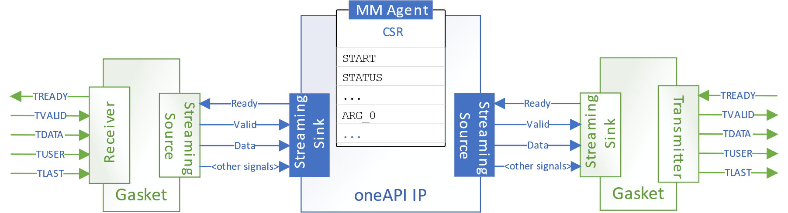
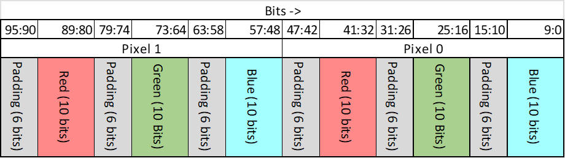
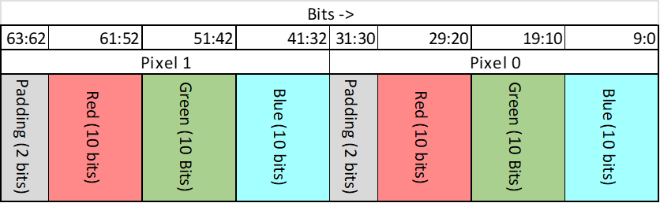
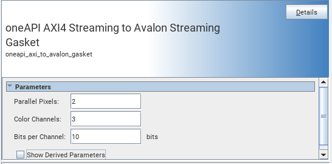
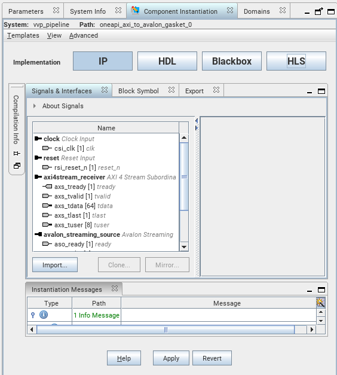
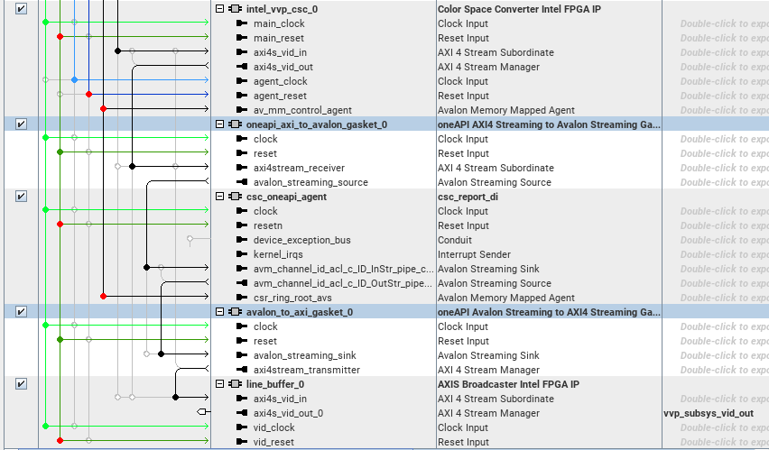

# oneAPI SYCL HLS Gaskets

The two Platform Designer IPs in this repository simplify the process of using oneAPI video IPs with the existing [Intel Video and Vision Processing (VVP)](https://www.intel.com/content/www/us/en/products/details/fpga/intellectual-property/dsp/video-vision-processing-suite.html) IP suite.

These gaskets should be placed on either side of a oneAPI IP to adapt the AXI4-Streaming physical layer used by the VVP IPs to the Avalon Streaming physical layer used by the oneAPI IPs. 

## Description

These gaskets do NOT do any protocol conversion, they simply route the sideband signals as follows:

| AXI4-Streaming Signal | Avalon Streaming Signal |
|-----------------------|-------------------------|
| `tready`              | `ready`                 |
| `tvalid`              | `valid`                 |
| `tdata`               | `data`                  |
| `tlast`               | `endofpacket`           |
| `tuser[0]`            | `startofpacket`         |

Furthermore, these gaskets also adapt the padding between pixels used in the VVP video protocol to match the padding requirements imposed by limitations of SYCL HLS. SYCL HLS inserts padding bits after each *color channel*, while the AXI4-Streaming video protocol requires padding only be inserted after each *pixel*. The IPs in this repository adapt the pixels appropriately.

**oneAPI Padding**

**VVP Padding**

## Usage

You can add these IPs to a Platform Designer system easily. When you instantiate an IP, you will see a parameter editor screen like this:

Set the `Parallel Pixels`, `Color Channels`, and `Bits per Channel` properties to match the parameterizations of your VVP IPs. The Avalon interfaces will automatically be calculated. You can view the intermediate calculations by ticking the `Show Derived Parameters` check box, or by inspecting the `Signals and Interfaces` tab under `Component Instantiation`.

Here is an example of how to connect up the IPs in the Platform Designer patch panel:

