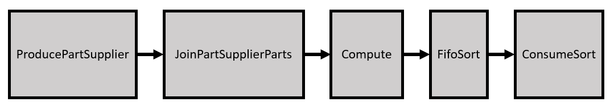
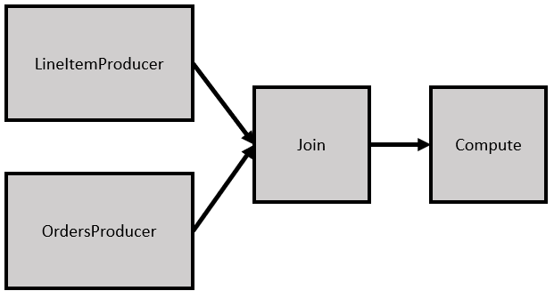

# `DB` Sample

This reference design demonstrates how to use an FPGA to accelerate database queries for a data-warehouse schema derived from TPC-H.

| Area                   | Description
|:---                    |:---
| What you will learn    | How to accelerate database queries using an Intel FPGA
| Time to complete       | 1 hour
| Category               | Reference Designs and End to End

## Purpose

The database query acceleration sample includes 8 tables and a set of 21 business-oriented queries with broad industry-wide relevance. This reference design shows how three queries can be accelerated using oneAPI. To do so, we create a set of common database operators (found in the `src/db_utils/` directory) that are combined in different ways to build the three queries.

Note that this design uses a lot of resources and is designed with Intel® Stratix® 10 FPGA capabilities in mind.

## Prerequisites

This sample is part of the FPGA code samples.
It is categorized as a Tier 4 sample that demonstrates a reference design.


Find more information about how to navigate this part of the code samples in the [FPGA top-level README.md](/DirectProgramming/C++SYCL_FPGA/README.md).
You can also find more information about [troubleshooting build errors](/DirectProgramming/C++SYCL_FPGA/README.md#troubleshooting), [running the sample on the Intel® DevCloud](/DirectProgramming/C++SYCL_FPGA/README.md#build-and-run-the-samples-on-intel-devcloud-optional), [using Visual Studio Code with the code samples](/DirectProgramming/C++SYCL_FPGA/README.md#use-visual-studio-code-vs-code-optional), [links to selected documentation](/DirectProgramming/C++SYCL_FPGA/README.md#documentation), etc.

| Optimized for                     | Description
---                                 |---
| OS                                | Ubuntu* 18.04/20.04 <br> RHEL*/CentOS* 8 <br> SUSE* 15 <br> Windows* 10
| Hardware                          | Intel® Agilex® 7, Arria® 10, and Stratix® 10 FPGAs
| Software                          | Intel® oneAPI DPC++/C++ Compiler

> **Note**: Even though the Intel DPC++/C++ OneAPI compiler is enough to compile for emulation, generating reports and generating RTL, there are extra software requirements for the simulation flow and FPGA compiles.
>
> For using the simulator flow, Intel® Quartus® Prime Pro Edition and one of the following simulators must be installed and accessible through your PATH:
> - Questa*-Intel® FPGA Edition
> - Questa*-Intel® FPGA Starter Edition
> - ModelSim® SE
>
> When using the hardware compile flow, Intel® Quartus® Prime Pro Edition must be installed and accessible through your PATH.
>
> :warning: Make sure you add the device files associated with the FPGA that you are targeting to your Intel® Quartus® Prime installation.

### Performance

In this design, we accelerate three database queries as **offload accelerators**. In an offload accelerator scheme, the queries are performed by transferring the relevant data from the CPU host to the FPGA, starting the query kernel on the FPGA, and copying the results back. This means that the relevant performance number is the processing time (the wall clock time) from when the query is requested to the time the output data is accessible by the host. This includes the time to transfer data between the CPU and FPGA over PCIe (with an approximate read and write bandwidth of 6877 and 6582 MB/s, respectively). Most of the total query time is spent transferring the data between the CPU and FPGA, and the query kernels themselves are a small portion of the total latency.

> **Note**: Refer to the [Performance Disclaimers](/DirectProgramming/C++SYCL_FPGA/README.md#performance-disclaimers) section for important performance information.

## Key Implementation Details

The key optimization techniques used in this design include:

1. Accelerating complex database queries using an Intel FPGA and oneAPI.
2. Improving code reuse, readability, and extendability using C++ templates for FPGA device code.
3. Showcasing the usage of advanced FPGA optimizations listed above to improve the performance of a large design.

This design leverages concepts discussed in the [FPGA tutorials](/DirectProgramming/C++SYCL_FPGA/Tutorials) to optimize the different database queries,.

* *Shannonization to improve Fmax/II* (shannonization)
* *Optimizing Inner Loop Throughput* (optimize_inner_loop)
* *Caching On-Chip Memory to Improve Loop Performance* (onchip_memory_cache)
* *Unrolling Loops* (loop_unroll)
* *Loop `ivdep` Attribute* (loop_ivdep)

### Query Implementations

The following sections describe at a high level how queries 1, 11 and 12 are implemented on the FPGA using a set of generalized database operators (found in `db_utils/`). In the block diagrams below, the blocks are oneAPI kernels, and the arrows represent `pipes` that shows the flow of data from one kernel to another.

#### Query 1

Query 1 is the simplest of the three queries and only uses the `Accumulator` database operator. The query streams in each row of the LINEITEM table and performs computation on each row.

#### Query 11

Query 11 showcases the `MapJoin` and `FifoSort` database operators. The block diagram of the design is shown below.



#### Query 12

Query 12 showcases the `MergeJoin` database operator. The block diagram of the design is shown below.



### Source Code Breakdown
| File                                  | Description
|:---                                   |:---
|`db.cpp`                               | Contains the `main()` function and the top-level interfaces to the database functions.
|`dbdata.cpp`                           | Contains code to parse the database input files and validate the query output
|`dbdata.hpp`                           | Definitions of database related data structures and parsing functions
|`query1/query1_kernel.cpp`             | Contains the kernel for Query 1
|`query11/query11_kernel.cpp`           | Contains the kernel for Query 11
|`query11/pipe_types.cpp`               | All data types and instantiations for pipes used in query 11
|`query12/query12_kernel.cpp`           | Contains the kernel for Query 12
|`query12/pipe_types.cpp`               | All data types and instantiations for pipes used in query 12
|`db_utils/Accumulator.hpp`             | Generalized templated accumulators using registers or BRAMs
|`db_utils/Date.hpp`                    | A class to represent dates within the database
|`db_utils/fifo_sort.hpp`               | An implementation of a FIFO-based merge sorter (based on: D. Koch and J. Torresen, "FPGASort: a high performance sorting architecture exploiting run-time reconfiguration on fpgas for large problem sorting", in FPGA '11: ACM/SIGDA International Symposium on Field Programmable Gate Arrays, Monterey CA USA, 2011. https://dl.acm.org/doi/10.1145/1950413.1950427)
|`db_utils/LikeRegex.hpp`               | Simplified REGEX engine to determine if a string 'Begins With', 'Contains', or 'Ends With'.
|`db_utils/MapJoin.hpp`                 | Implements the MapJoin operator
|`db_utils/MergeJoin.hpp`               | Implements the MergeJoin and DuplicateMergeJoin operators
|`db_utils/Misc.hpp`                    | Miscellaneous utilities used by the operators and the queries
|`db_utils/ShannonIterator.hpp`         | A template based iterator to improve Fmax/II for designs
|`db_utils/StreamingData.hpp`           | A generic data structure for streaming data between kernels
|`db_utils/Tuple.hpp`                   | A templated tuple that behaves better on the FPGA than the std::tuple
|`db_utils/Unroller.hpp`                | A templated-based loop unroller that unrolls loops in the front end

## Build the `DB` Reference Design

> **Note**: When working with the command-line interface (CLI), you should configure the oneAPI toolkits using environment variables.
> Set up your CLI environment by sourcing the `setvars` script located in the root of your oneAPI installation every time you open a new terminal window.
> This practice ensures that your compiler, libraries, and tools are ready for development.
>
> Linux*:
> - For system wide installations: `. /opt/intel/oneapi/setvars.sh`
> - For private installations: ` . ~/intel/oneapi/setvars.sh`
> - For non-POSIX shells, like csh, use the following command: `bash -c 'source <install-dir>/setvars.sh ; exec csh'`
>
> Windows*:
> - `C:\Program Files(x86)\Intel\oneAPI\setvars.bat`
> - Windows PowerShell*, use the following command: `cmd.exe "/K" '"C:\Program Files (x86)\Intel\oneAPI\setvars.bat" && powershell'`
>
> For more information on configuring environment variables, see [Use the setvars Script with Linux* or macOS*](https://www.intel.com/content/www/us/en/develop/documentation/oneapi-programming-guide/top/oneapi-development-environment-setup/use-the-setvars-script-with-linux-or-macos.html) or [Use the setvars Script with Windows*](https://www.intel.com/content/www/us/en/develop/documentation/oneapi-programming-guide/top/oneapi-development-environment-setup/use-the-setvars-script-with-windows.html).

### On Linux*
1. Change to the sample directory.
2. Configure the build system for the default target (the Agilex® 7 device family).
   ```
   mkdir build
   cd build
   cmake .. -DQUERY=1
   ```
   `-DQUERY=<QUERY_NUMBER>` can be any of the following query numbers: `1`, `11` or `12`.

   > **Note**: You can change the default target by using the command:
   >  ```
   >  cmake .. -DQUERY=<QUERY_NUMBER> -DFPGA_DEVICE=<FPGA device family or FPGA part number>
   >  ```
   >
   > Alternatively, you can target an explicit FPGA board variant and BSP by using the following command:
   >  ```
   >  cmake .. -DQUERY=<QUERY_NUMBER> -DFPGA_DEVICE=<board-support-package>:<board-variant>
   >  ```
   >
   > You will only be able to run an executable on the FPGA if you specified a BSP.

3. Compile the design. (The provided targets match the recommended development flow.)

   1. Compile for emulation (fast compile time, targets emulated FPGA device).
      ```
      make fpga_emu
      ```
   2. Compile for simulation (fast compile time, targets simulator FPGA device):
      ```
      make fpga_sim
      ```
   3. Generate HTML performance report.
      ```
      make report
      ```
      The report resides at `db_report.prj/reports/report.html`.

   4. Compile for FPGA hardware (longer compile time, targets FPGA device).

      ```
      make fpga
      ```
      When building for hardware, the default scale factor is **1**. To use the smaller scale factor of 0.01, add the flag `-DSF_SMALL=1` to the original `cmake` command. For example: `cmake .. -DQUERY=11 -DSF_SMALL=1`. See the [Database files](#database-files) for more information.


### On Windows*

1. Change to the sample directory.
2. Configure the build system for the default target (the Agilex® 7 device family).
   ```
   mkdir build
   cd build
   cmake -G "NMake Makefiles" .. -DQUERY=1
   ```
   `-DQUERY=<QUERY_NUMBER>` can be any of the following query numbers: `1`, `11` or `12`.

   > **Note**: You can change the default target by using the command:
   >  ```
   >  cmake -G "NMake Makefiles" .. -DQUERY=<QUERY_NUMBER> -DFPGA_DEVICE=<FPGA device family or FPGA part number>
   >  ```
   >
   > Alternatively, you can target an explicit FPGA board variant and BSP by using the following command:
   >  ```
   >  cmake -G "NMake Makefiles" .. -DQUERY=<QUERY_NUMBER> -DFPGA_DEVICE=<board-support-package>:<board-variant>
   >  ```
   >
   > You will only be able to run an executable on the FPGA if you specified a BSP.

3. Compile the design. (The provided targets match the recommended development flow.)

   1. Compile for emulation (fast compile time, targets emulated FPGA device).
      ```
      nmake fpga_emu
      ```
   2. Compile for simulation (fast compile time, targets simulator FPGA device):
      ```
      nmake fpga_sim
      ```
   3. Generate HTML performance report.
      ```
      nmake report
      ```
      The report resides at `db_report.prj/reports/report.html` directory.

   4. Compile for FPGA hardware (longer compile time, targets FPGA device):
      ```
      nmake fpga
      ```

>**Note**: If you encounter any issues with long paths when compiling under Windows*, you may have to create your ‘build’ directory in a shorter path, for example `C:\samples\build`. You can then run cmake from that directory, and provide cmake with the full path to your sample directory.

## Run the `DB` Reference Design

### Configurable  Parameters

| Argument   |Description                                                                | Default
|:---        | :---                                                                      |:---
|`--help`    | Print help.                                                               | `false`
|`--dbroot`  | Specify location for the database files (e.g. `--dbroot=../data/sf0.01`). | "."
|`--test`    | Specify whether to validate the output of the query.                      | `false`
|`--print`   | Print the output of the query to `stdout`.                                | `false`
|`--args`    | Pass custom arguments to the query. (See `--help` for more information.)  |
|`--runs`    | Define the number of query iterations to perform for throughput measurement (for example, `--runs=5`). | `1` for emulation <br> `5` for FPGA hardware

### On Linux

1. Run the design on the FPGA emulator (the kernel executes on the CPU).
   ```
   ./db.fpga_emu --dbroot=../data/sf0.01 --test
   ```
   (Optional) Run the design for queries `11` and `12`.
2. Run the sample on the FPGA simulator device.
   ```
   CL_CONTEXT_MPSIM_DEVICE_INTELFPGA=1 ./db.fpga_sim --dbroot=../data/sf0.01 --test
   ```
3. Run the design on an FPGA device (only if you ran `cmake` with `-DFPGA_DEVICE=<board-support-package>:<board-variant>`).
   ```
   ./db.fpga --dbroot=../data/sf1 --test
   ```

### On Windows

1. Run the sample on the FPGA emulator (the kernel executes on the CPU).
   ```
   db.fpga_emu.exe --dbroot=../data/sf0.01 --test
   ```
   (Optional) Run the design for queries `11` and `12`.
2. Run the sample on the FPGA simulator device.
   ```
   set CL_CONTEXT_MPSIM_DEVICE_INTELFPGA=1
   db.fpga_sim.exe --dbroot=../data/sf0.01 --test
   set CL_CONTEXT_MPSIM_DEVICE_INTELFPGA=
   ```
3. Run the sample on an FPGA device (only if you ran `cmake` with `-DFPGA_DEVICE=<board-support-package>:<board-variant>`).
   ```
   db.fpga.exe --dbroot=../data/sf1 --test
   ```

## Example Output

>**Note**: The scale factor 1 (SF=1) database files (`../data/sf1`) are **not** shipped with this reference design. See the [Database files](#database-files) section below for information on how to generate these files.

### FPGA Emulator
```
    Parsing database files in: ../data/sf0.01
    Parsing LINEITEM table from: ../data/sf0.01/lineitem.tbl
    Finished parsing LINEITEM table with 60175 rows
    Parsing ORDERS table from: ../data/sf0.01/orders.tbl
    Finished parsing ORDERS table with 15000 rows
    Parsing PARTS table from: ../data/sf0.01/part.tbl
    Finished parsing PARTS table with 2000 rows
    Parsing SUPPLIER table from: ../data/sf0.01/supplier.tbl
    Finished parsing SUPPLIER table with 100 rows
    Parsing PARTSUPPLIER table from: ../data/sf0.01/partsupp.tbl
    Finished parsing PARTSUPPLIER table with 8000 rows
    Parsing NATION table from: ../data/sf0.01/nation.tbl
    Finished parsing NATION table with 25 rows
    Database SF = 0.01
    Running Q1 within 90 days of 1998-12-1
    Validating query 1 test results
    PASSED
```

### FPGA Device
```
    Parsing database files in: ../data/sf1
    Parsing LINEITEM table from: ../data/sf1/lineitem.tbl
    Finished parsing LINEITEM table with 6001215 rows
    Parsing ORDERS table from: ../data/sf1/orders.tbl
    Finished parsing ORDERS table with 1500000 rows
    Parsing PARTS table from: ../data/sf1/part.tbl
    Finished parsing PARTS table with 200000 rows
    Parsing SUPPLIER table from: ../data/sf1/supplier.tbl
    Finished parsing SUPPLIER table with 10000 rows
    Parsing PARTSUPPLIER table from: ../data/sf1/partsupp.tbl
    Finished parsing PARTSUPPLIER table with 800000 rows
    Parsing NATION table from: ../data/sf1/nation.tbl
    Finished parsing NATION table with 25 rows
    Database SF = 1
    Running Q1 within 90 days of 1998-12-1
    Validating query 1 test results
    Running Q1 within 90 days of 1998-12-1
    Validating query 1 test results
    Running Q1 within 90 days of 1998-12-1
    Validating query 1 test results
    Running Q1 within 90 days of 1998-12-1
    Validating query 1 test results
    Running Q1 within 90 days of 1998-12-1
    Validating query 1 test results
    Processing time: 44.7673 ms
    Kernel time: 4.4103 ms
    Throughput: 226.742 queries/s
    PASSED
```

#### Database Files

In the `data/` directory, you will find database files for a scale factor of **0.01**. These are manually generated files that you can use to verify the queries in emulation; however, **the supplied files are too small to showcase the true performance of the FPGA hardware**.

>**Note**: This reference design currently only supports databases with scale factors of **0.01** or **1**.

To generate larger database files to run on the hardware, you can use TPC's `dbgen` tool. Instructions for downloading, building, and running the `dbgen` tool can be found on the [TPC-H website](http://www.tpc.org/tpch/).
As of September 12, 2022, you should be able to perform the following steps:

1. Clone the [tpch-dbgen](https://github.com/electrum/tpch-dbgen) GitHub repository.
2. Run `make`.
3. Generate the files using a scale factor of 1: `./dbgen -s 1`.
4. Copy all the generated `.tbl` files and the `answers` folder in a new `data/sf1` folder.

## License

Code samples are licensed under the MIT license. See [License.txt](/License.txt) for details.

Third party program Licenses can be found here: [third-party-programs.txt](/third-party-programs.txt).
