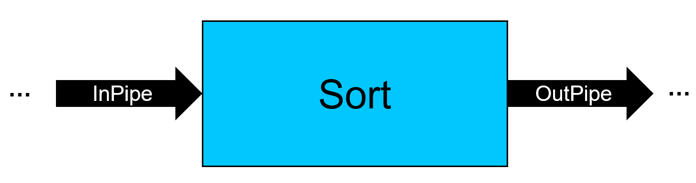
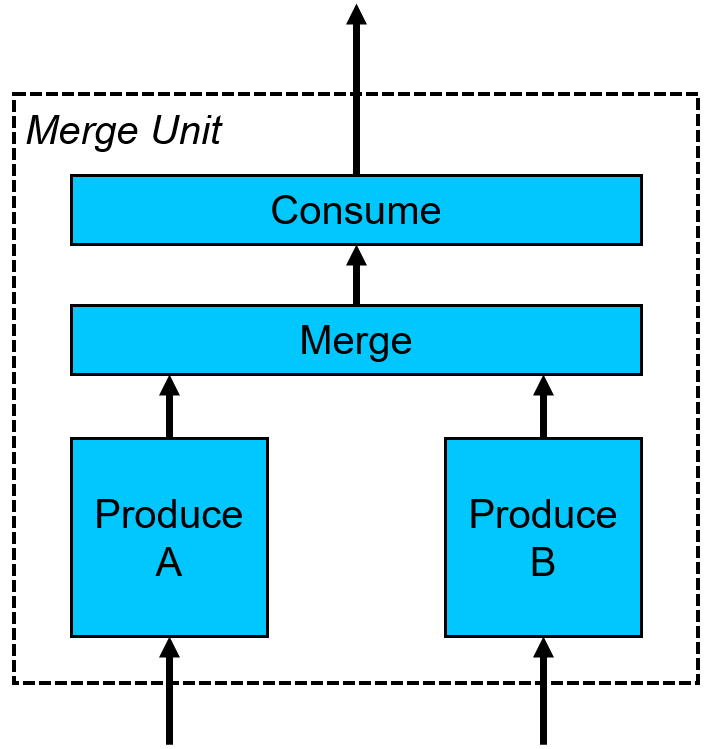
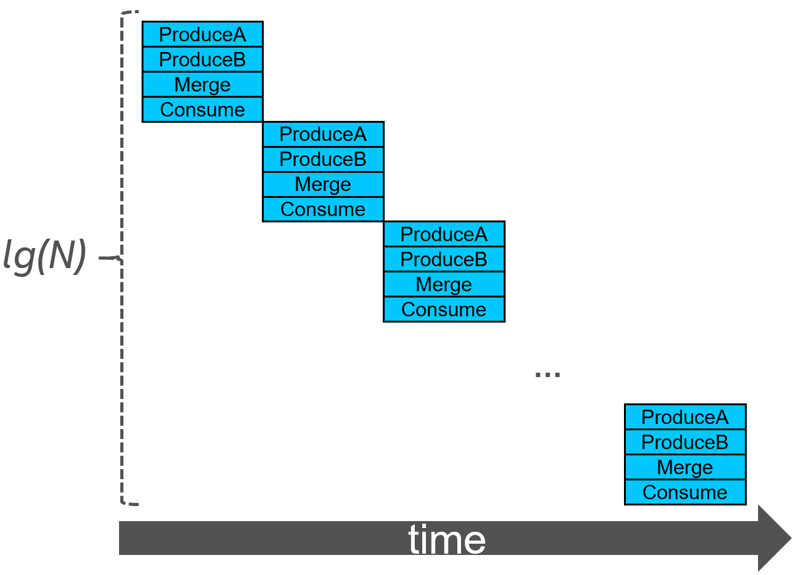
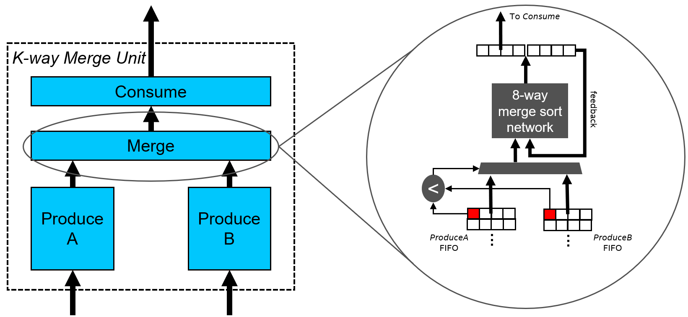
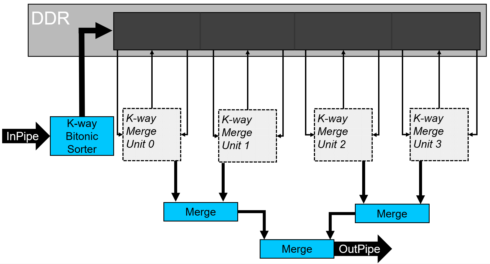

# `Merge Sort` Sample

This reference design demonstrates a merge sort algorithm on an FPGA.

| Optimized for         | Description
|:---                   |:---
| What you will learn   | How to use the spatial compute of the FPGA to create a merge sort design that takes advantage of thread- and SIMD-level parallelism.
| Time to complete      | 1 hour
| Category              | Reference Designs and End to End


## Purpose

This FPGA reference design demonstrates a merge sort design with multiple parameters that utilizes the spatial computing of the FPGA.

>**Note**: See the [merge sort](https://en.wikipedia.org/wiki/Merge_sort) Wikipedia article for more information.

## Prerequisites

This sample is part of the FPGA code samples.
It is categorized as a Tier 4 sample that demonstrates a reference design.


Find more information about how to navigate this part of the code samples in the [FPGA top-level README.md](/DirectProgramming/C++SYCL_FPGA/README.md).
You can also find more information about [troubleshooting build errors](/DirectProgramming/C++SYCL_FPGA/README.md#troubleshooting), [running the sample on the Intel® DevCloud](/DirectProgramming/C++SYCL_FPGA/README.md#build-and-run-the-samples-on-intel-devcloud-optional), [using Visual Studio Code with the code samples](/DirectProgramming/C++SYCL_FPGA/README.md#use-visual-studio-code-vs-code-optional), [links to selected documentation](/DirectProgramming/C++SYCL_FPGA/README.md#documentation), etc.

| Optimized for        | Description
|:---                  |:---
| OS                   | Ubuntu* 18.04/20.04 <br> RHEL*/CentOS* 8 <br> SUSE* 15
| Hardware             | Intel® Agilex® 7, Arria® 10, and Stratix® 10 FPGAs
| Software             | Intel® oneAPI DPC++/C++ Compiler

> **Note**: Even though the Intel DPC++/C++ OneAPI compiler is enough to compile for emulation, generating reports and generating RTL, there are extra software requirements for the simulation flow and FPGA compiles.
>
> For using the simulator flow, Intel® Quartus® Prime Pro Edition and one of the following simulators must be installed and accessible through your PATH:
> - Questa*-Intel® FPGA Edition
> - Questa*-Intel® FPGA Starter Edition
> - ModelSim® SE
>
> When using the hardware compile flow, Intel® Quartus® Prime Pro Edition must be installed and accessible through your PATH.
>
> :warning: Make sure you add the device files associated with the FPGA that you are targeting to your Intel® Quartus® Prime installation.

## Key Implementation Details

### Merge Sort Details

This section describes how the merge sort design is structured and how it takes advantage of the spatial compute of the FPGA.

The figure below shows the conceptual view of the merge sort design to the user. The user streams data into a SYCL pipe (`InPipe`) and, after some delay, the elements are streamed out of a SYCL pipe (`OutPipe`), in sorted order. The number of elements that the merge sort design is capable of sorting is a runtime parameter, but it must be a power of 2. However, this restriction can be worked around by padding the input stream with min/max elements, depending on the direction of the sort (smallest-to-largest vs largest-to-smallest). This technique is demonstrated in this design (see the `fpga_sort` function in *main.cpp*).



The basis of the merge sort design is what we call a *merge unit*, which is shown in the figure below. A single merge unit streams in two sorted lists of size `count` in parallel and merges them into a single sorted list of size `2*count`. The lists are streamed in from device memory (e.g., DDR or HBM) by two `Produce` kernels. The `Consume` kernel can stream data out to either a SYCL pipe or to device memory.



A single merge unit requires `lg(N)` iterations to sort `N` elements. This requires the host to enqueue `lg(N)` iterations of the merge unit kernels that merge sublists of size {`1`, `2`, `4`, ...} into larger lists of size {`2`, `4`, `8`, ...}, respectively. This results in a timeline that looks like the figure below.



To achieve SIMD-level (**S**ingle **I**nstruction **M**ultiple **D**ata) parallelism, we enhance the merge unit to merge `k` elements per cycle. The figure below illustrates how this is done. In the following discussion, we will assume that we are sorting from smallest-to-largest, but the logic is very similar for sorting largest-to-smallest and is easily configurable at compile time in this design.

The merge unit looks at the two inputs of size `k` coming from the `ProduceA` and `ProduceB` kernels (in the figure below, `k=4`) and compares the first elements of each set; remember, the set of `k` elements are already sorted, so we are comparing the smallest elements of the set. Whichever set of elements has the *smaller of the smallest elements* is chosen and combined with `k` other elements from the `feedback` path. These `2*k` elements go through a merge sort network that sorts them in a single cycle. After the `2*k` elements are sorted, the smallest `k` elements are sent to the output (to the `Consume` kernel) and the largest `k` elements are fed back into the sorting network (the `feedback` path in the figure below), and the process repeats. This allows the merge unit to process `k` elements per cycle in the steady state. Note that `k` must be a power of 2.

>**Note**: You can find more information about this design in the paper *[A High Performance FPGA-Based Sorting Accelerator with a Data Compression Mechanism](https://www.researchgate.net/publication/316604001_A_High_Performance_FPGA-Based_Sorting_Accelerator_with_a_Data_Compression_Mechanism)* by Ryohei Kobayashi and Kenji Kise.



To achieve thread-level parallelism, the merge sort design accepts a template parameter, `units`, which allows one to instantiate multiple instances of the merge unit, as shown in the figure below. Before the merge units start processing data, the incoming data coming from the input pipe is sent through a bitonic sorting network and written to the temporary buffer partitions in device memory. This sorting network sorts `k` elements per cycle in the steady state. Choosing the number of merge units is an area-performance tradeoff (note: the number of instantiated merge units must be a power of 2). Each merge unit sorts an `N/units`-sized partition of the input data in parallel.



After the merge units sort their `N/units`-sized partition, the partitions of each unit must be reduced into a single sorted list. There are two options to do this: (1) reuse the merge units to perform `lg(units)` more iterations to sort the partitions, or (2) create a merge tree to reduce the partitions into a single sorted list. Option (1) saves area at the expense of performance, since it has to perform additional sorting iterations. Option (2), which we choose for this design, improves performance by creating a merge tree to reduce the final partitions into a single sorted list. The `Merge` kernels in the merge tree (shown in the figure above) use the same kernel code that is used in the `Merge` kernel of the merge unit, which means they too can merge `k` elements per cycle. Once the merge units perform their last iteration, they output to a pipe (instead of writing to device memory) that feeds the merge tree.

### Source Code

The following source files can be found in the `src/` sub-directory.

| File                   | Description
|:---                    |:---
|`main.cpp`              | Contains the `main()` function and the top-level interfaces.
|`merge_sort.hpp`        | The function to submit all of the merge sort kernels (`SortingNetwork`, `Produce`, `Merge`, and `Consume`).
|`consume.hpp`           | The `Consume` kernel for the merge unit. This kernel reads from an input pipe and writes out to either a different output pipe, or to device memory.
|`merge.hpp`             | The `Merge` kernel for the merge unit and the merge tree. This kernel streams in two sorted lists, merges them into a single sorted list of double the size, and streams the data out a pipe.
|`produce.hpp`           | The `Produce` kernel for the merge unit. This kernel reads from input pipes or performs strided reads from device memory and writes the data to an output pipe.
|`sorting_networks.hpp`  | Contains all of the code relevant to sorting networks, including the `SortingNetwork` kernel, as well as the `BitonicSortingNetwork` and `MergeSortNetwork` helper functions.

For `constexpr_math.hpp`, `pipe_utils.hpp`, and `unrolled_loop.hpp` see the README in the `../include/` directory of the FPGA section of the repository.

## Build the `Merge Sort` Design

> **Note**: When working with the command-line interface (CLI), you should configure the oneAPI toolkits using environment variables.
> Set up your CLI environment by sourcing the `setvars` script located in the root of your oneAPI installation every time you open a new terminal window.
> This practice ensures that your compiler, libraries, and tools are ready for development.
>
> Linux*:
> - For system wide installations: `. /opt/intel/oneapi/setvars.sh`
> - For private installations: ` . ~/intel/oneapi/setvars.sh`
> - For non-POSIX shells, like csh, use the following command: `bash -c 'source <install-dir>/setvars.sh ; exec csh'`
>
> For more information on configuring environment variables, see [Use the setvars Script with Linux* or macOS*](https://www.intel.com/content/www/us/en/develop/documentation/oneapi-programming-guide/top/oneapi-development-environment-setup/use-the-setvars-script-with-linux-or-macos.html).

### On Linux*

1. Change to the sample directory.
2. Configure the build system for the Agilex® 7 device family, which is the default.

   ```
   mkdir build
   cd build
   cmake ..
   ```

   > **Note**: You can change the default target by using the command:
   >  ```
   >  cmake .. -DFPGA_DEVICE=<FPGA device family or FPGA part number>
   >  ```
   >
   > Alternatively, you can target an explicit FPGA board variant and BSP by using the following command:
   >  ```
   >  cmake .. -DFPGA_DEVICE=<board-support-package>:<board-variant> -DIS_BSP=1
   >  ```
   >
   > You will only be able to run an executable on the FPGA if you specified a BSP.

3. Compile the design. (The provided targets match the recommended development flow.)

   1. Compile for emulation (fast compile time, targets emulated FPGA device).
      ```
      make fpga_emu
      ```
   2. Compile for simulation (fast compile time, targets simulator FPGA device):
      ```
      make fpga_sim
      ```
   3. Generate the HTML performance report.
      ```
      make report
      ```
      The report resides at `merge_sort_report.prj/reports/report.html`.

   4. Compile for FPGA hardware (longer compile time, targets FPGA device).
      ```
      make fpga
      ```

## Run the `Merge Sort` Program

### On Linux

1. Run the sample on the FPGA emulator (the kernel executes on the CPU).
   ```
   ./merge_sort.fpga_emu
   ```
2. Run the sample on the FPGA simulator device.
   ```
   CL_CONTEXT_MPSIM_DEVICE_INTELFPGA=1 ./merge_sort.fpga_sim
   ```
3. Run the sample on the FPGA device (only if you ran `cmake` with `-DFPGA_DEVICE=<board-support-package>:<board-variant>`).
   ```
   ./merge_sort.fpga
   ```

## Example Output

>**Note**: When running on the FPGA emulator, the *Execution time* and *Throughput* values do not reflect the design's actual hardware performance.

```
Running sort 17 times for an input size of 16777216 using 8 4-way merge units
Streaming data from device memory
Execution time: 24.7522 ms
Throughput: 646.408 Melements/s
PASSED
```
>**Note**: The performance numbers above were achieved using the Intel® FPGA Programmable Acceleration Card (PAC) D5005 (with Intel Stratix® 10 SX); your results may vary.

## License

Code samples are licensed under the MIT license. See [License.txt](/License.txt) for details.

Third party program Licenses can be found here: [third-party-programs.txt](/third-party-programs.txt).
