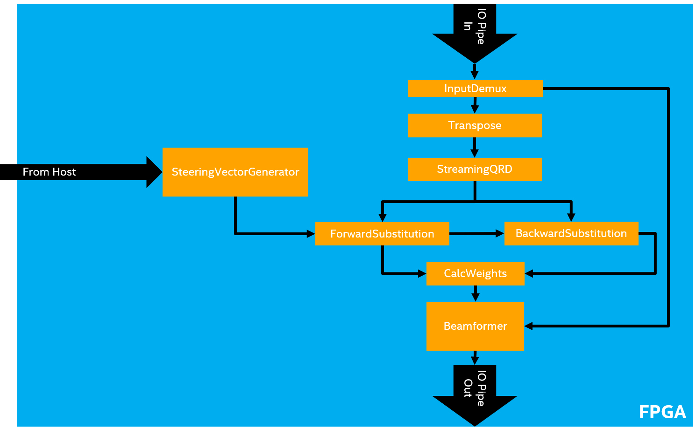
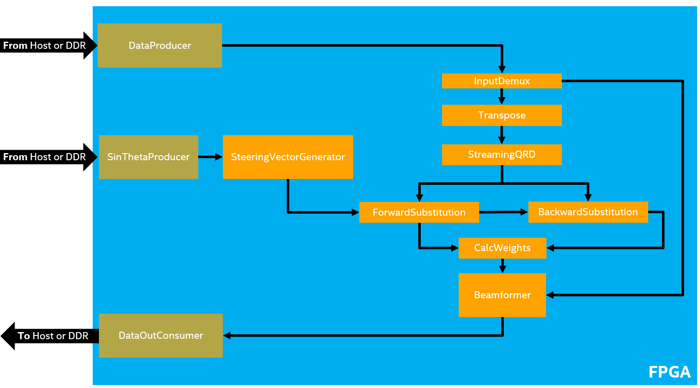

# `MVDR Beamforming` Sample

This reference design demonstrates IO streaming using SYCL* on an FPGA for a large system. The IO streaming is 'faked' using data from the host.

| Area                 | Description
|:---                  |:---
| What you will learn  | How to create a full, complex system that performs IO streaming using SYCL*-compliant code.
| Time to complete     | 1 hour
| Category             | Reference Designs and End to End

## Purpose

The purpose of this reference design is to implement a high-performance streaming IO design. In this reference design, we implement an MVDR-beamforming algorithm using oneAPI.

This reference design code sample leverages concepts that are discussed in the following FPGA tutorials:

- **IO Streaming** (io_streaming)
- **Explicit Pipelining with `fpga_reg`** (fpga_reg)
- **Loop `ivdep` Attribute** (loop_ivdep)
- **Triangular Loop Optimization** (triangular_loop)
- **Unrolling Loops** (loop_unroll)
- **Pipe Arrays** (pipe_array)

You should review the **IO Streaming** code sample as this reference design is a direct extension of the concepts described in that tutorial. The IO Streaming sample code clearly illustrates the concept of 'fake' IO Pipes, which is used heavily in this reference design.

## Prerequisites

This sample is part of the FPGA code samples.
It is categorized as a Tier 4 sample that demonstrates a reference design.


Find more information about how to navigate this part of the code samples in the [FPGA top-level README.md](/DirectProgramming/C++SYCL_FPGA/README.md).
You can also find more information about [troubleshooting build errors](/DirectProgramming/C++SYCL_FPGA/README.md#troubleshooting), [running the sample on the Intel® DevCloud](/DirectProgramming/C++SYCL_FPGA/README.md#build-and-run-the-samples-on-intel-devcloud-optional), [using Visual Studio Code with the code samples](/DirectProgramming/C++SYCL_FPGA/README.md#use-visual-studio-code-vs-code-optional), [links to selected documentation](/DirectProgramming/C++SYCL_FPGA/README.md#documentation), etc.

| Optimized for        | Description
|:---                  |:---
| OS                   | Ubuntu* 18.04/20.04 <br> RHEL*/CentOS* 8 <br> SUSE* 15 <br> Windows* 10
| Hardware             | Intel® Agilex® 7, Arria® 10, and Stratix® 10 FPGAs
| Software             | Intel® oneAPI DPC++/C++ Compiler

> **Note**: Even though the Intel DPC++/C++ OneAPI compiler is enough to compile for emulation, generating reports and generating RTL, there are extra software requirements for the simulation flow and FPGA compiles.
>
> For using the simulator flow, Intel® Quartus® Prime Pro Edition and one of the following simulators must be installed and accessible through your PATH:
> - Questa*-Intel® FPGA Edition (Simulator flow can have a long run time)
> - Questa*-Intel® FPGA Starter Edition (Simulator flow can have a long run time)
> - ModelSim® SE
>
> When using the hardware compile flow, Intel® Quartus® Prime Pro Edition must be installed and accessible through your PATH.
>
> :warning: Make sure you add the device files associated with the FPGA that you are targeting to your Intel® Quartus® Prime installation.

## Key Implementation Details

### MVDR Beamforming

>**Note**: This reference design is built upon the **IO Streaming** sample code and concepts. Review that tutorial for more information.

The images below show the data flow in the MVDR beamforming design. The first image shows the "real" data flow when IO pipes are used at the inputs and outputs. The second image shows the data flow in this reference design where we don't have access to a BSP with IO pipes.





The `DataProducer` kernel replaces the input IO pipe in the first image. The splitting of data between the training and beamforming pipelines is done by the `InputDemux` kernel. The `DataOutConsumer` kernel replaces the output IO pipe in the first image. The data for the `SteeringVectorGenerator` kernel still comes from the host through the `SinThetaProducer` kernel. This kernel does not replace an IO pipe but simplifies and modularizes the host's data streaming to the device.

### Source Code

| File                       | Description
|:---                        |:---
|`mvdr_beamforming.cpp`      | Contains the `main()` function and the top-level interfaces to the MVDR functions
|`BackwardSubstitution.hpp`  | Backward Substitution kernel
|`Beamformer.hpp`            | Beamformer kernel, multiplies input vectors by each weight vector to generate final output
|`CalcWeights.hpp`           | CalcWeights kernel, multiplies BackwardSubstitution output by steering vectors
|`Constants.hpp`             | Defines constants used throughout the design, some can be overridden from the command line during compilation
|`FakeIOPipes.hpp`           | Implements 'fake' IO pipes, which interface to the host
|`ForwardSubstitution.hpp`   | Forward Substitution kernel
|`InputDemux.hpp`            | InputDemux kernel, separates training and processing data
|`mvdr_complex.hpp`          | Definition of ComplexType, used throughout this design
|`MVDR.hpp`                  | Function to launch all MVDR kernels and define the pipes that connect them together
|`ParallelCopyArray.hpp`     | Defines the ParallelCopyArray class, an array that supports unrolled copy / assign operations
|`pipe_utils.hpp`            | Header file containing the definition of an array of pipes and a pipe duplicator. This header can be found in the ../include/ directory of this repository.
|`SteeringVectorGenerator.hpp`   | SteeringVectorGenerator kernel, generates steering vectors based on data from the host
|`StreamingQRD.hpp`          | StreamingQRD kernel, performs Q-R Decomposition on a matrix
|`Transpose.hpp`             | Transpose kernel, reorders data for the StreamingQRD kernel
|`Tuple.hpp`                 | A templated tuple that defines the NTuple class which is used for pipe interfaces
|`udp_loopback_test.cpp`     | Contains the `main()` function for the loopback test. This code is only relevant for use with real IO pipes
|`UDP.hpp`                   | This code is **only** relevant for using the real IO pipes (for example not in Intel® DevCloud). This is discussed later in the [Using Real IO-pipes Section](#using-real-io-pipes)
|`UnrolledLoop.hpp`          | A templated-based loop unroller that unrolls loops in the compiler front end

## Build the `MVDR Beamforming` Design

> **Note**: When working with the command-line interface (CLI), you should configure the oneAPI toolkits using environment variables.
> Set up your CLI environment by sourcing the `setvars` script located in the root of your oneAPI installation every time you open a new terminal window.
> This practice ensures that your compiler, libraries, and tools are ready for development.
>
> Linux*:
> - For system wide installations: `. /opt/intel/oneapi/setvars.sh`
> - For private installations: ` . ~/intel/oneapi/setvars.sh`
> - For non-POSIX shells, like csh, use the following command: `bash -c 'source <install-dir>/setvars.sh ; exec csh'`
>
> Windows*:
> - `C:\Program Files(x86)\Intel\oneAPI\setvars.bat`
> - Windows PowerShell*, use the following command: `cmd.exe "/K" '"C:\Program Files (x86)\Intel\oneAPI\setvars.bat" && powershell'`
>
> For more information on configuring environment variables, see [Use the setvars Script with Linux* or macOS*](https://www.intel.com/content/www/us/en/develop/documentation/oneapi-programming-guide/top/oneapi-development-environment-setup/use-the-setvars-script-with-linux-or-macos.html) or [Use the setvars Script with Windows*](https://www.intel.com/content/www/us/en/develop/documentation/oneapi-programming-guide/top/oneapi-development-environment-setup/use-the-setvars-script-with-windows.html).

### On Linux*

1. Change to the sample directory.
2. Configure the build system for the Agilex® 7 device family, which is the default.

   ```
   mkdir build
   cd build
   cmake ..
   ```

   > **Note**: You can change the default target by using the command:
   >  ```
   >  cmake .. -DFPGA_DEVICE=<FPGA device family or FPGA part number>
   >  ```
   >
   > Alternatively, you can target an explicit FPGA board variant and BSP by using the following command:
   >  ```
   >  cmake .. -DFPGA_DEVICE=<board-support-package>:<board-variant> -DIS_BSP=1
   >  ```
   >
   > You will only be able to run an executable on the FPGA if you specified a BSP.

3. Compile the design. (The provided targets match the recommended development flow.)

   1. Compile for emulation (fast compile time, targets emulated FPGA device).
      ```
      make fpga_emu
      ```
   2. Compile for simulation (fast compile time, targets simulator FPGA device):
      ```
      make fpga_sim
      ```
   3. Generate the HTML performance report.
      ```
      make report
      ```
      The report resides at `mvdr_beamforming_report.prj/reports/report.html`.

   4. Compile for FPGA hardware (longer compile time, targets FPGA device).
      ```
      make fpga
      ```

### On Windows*

1. Change to the sample directory.
2. Configure the build system for the Agilex® 7 device family, which is the default.
   ```
   mkdir build
   cd build
   cmake -G "NMake Makefiles" ..
   ```

  > **Note**: You can change the default target by using the command:
  >  ```
  >  cmake -G "NMake Makefiles" .. -DFPGA_DEVICE=<FPGA device family or FPGA part number>
  >  ```
  >
  > Alternatively, you can target an explicit FPGA board variant and BSP by using the following command:
  >  ```
  >  cmake -G "NMake Makefiles" .. -DFPGA_DEVICE=<board-support-package>:<board-variant> -DIS_BSP=1
  >  ```
  >
  > You will only be able to run an executable on the FPGA if you specified a BSP.

3. Compile the design. (The provided targets match the recommended development flow.)

   1. Compile for emulation (fast compile time, targets emulated FPGA device).
      ```
      nmake fpga_emu
      ```
   2. Compile for simulation (fast compile time, targets simulator FPGA device):
      ```
      nmake fpga_sim
      ```
   3. Generate the HTML performance report.
      ```
      nmake report
      ```
      The report resides at `mvdr_beamforming_report.a.prj/reports/report.html`.

   4. Compile for FPGA hardware (longer compile time, targets FPGA device).
      ```
      nmake fpga
      ```
> **Note**: If you encounter any issues with long paths when compiling under Windows*, you may have to create your ‘build’ directory in a shorter path, for example `c:\samples\build`. You can then run cmake from that directory, and provide cmake with the full path to your sample directory.

## Run the `MVDR Beamforming` Design

### Configurable Parameters

The general syntax for running the program is shown below and the table describes the index values.

`<program> <Index 0> <Index 1> <Index 2>`

| Argument Index | Description
|:---            |:---
| 0              | The number of matrices (default=`1024`)
| 1              | The input directory (default=`../data`)
| 2              | The output directory (default=`.`)

### On Linux
1. Run the sample on the FPGA emulator (the kernel executes on the CPU).
   ```
   ./mvdr_beamforming.fpga_emu 1024 ../data .
   ```
2. Run the sample on the FPGA simulator device.
   ```
   CL_CONTEXT_MPSIM_DEVICE_INTELFPGA=1 ./mvdr_beamforming.fpga_sim 1024 ../data .
   ```
3. Run the sample on the FPGA device (only if you ran `cmake` with `-DFPGA_DEVICE=<board-support-package>:<board-variant>`).
   ```
   ./mvdr_beamforming.fpga 1024 ../data .
   ```

### On Windows

1. Run the sample on the FPGA emulator (the kernel executes on the CPU).
   ```
   mvdr_beamforming.fpga_emu.exe 1024 ../data .
   ```
2. Run the sample on the FPGA simulator device.
   ```
   set CL_CONTEXT_MPSIM_DEVICE_INTELFPGA=1
   mvdr_beamforming.fpga_sim.exe ../data .
   set CL_CONTEXT_MPSIM_DEVICE_INTELFPGA=
   ```
3. Run the sample on the FPGA device (only if you ran `cmake` with `-DFPGA_DEVICE=<board-support-package>:<board-variant>`).
   ```
   mvdr_beamforming.fpga.exe 1024 ../data .
   ```

## Build and Run the Design Using Real IO-pipes

This section describes how to build and run this reference design on a BSP with real IO pipes. The real IO pipes version does **not** work on Windows and requires a specific system setup and BSP.

>**Note**: This design requires a specific board support package (BSP) with a distinct hardware configuration. For access to this BSP or general customer support, submit a case through Intel® Premier Support (IPS) or contact your Intel or Distribution Sales Representative.

### Build on Linux

1. Build the loopback test and reference design with real IO pipes.
   ```
   mkdir build
   cd build
   cmake .. -DREAL_IO_PIPES=1 -DFPGA_DEVICE=pac_s10_usm_udp
   ```
   The `REAL_IO_PIPES` cmake flag defines a variable that is used *exclusively* in `mvdr_beamforming.cpp` to create a kernel system using real IO pipes, as opposed to the fake IO pipes described earlier in this document.

2. Build the loopback test only.
   ```
   make udp_loopback_test
   ```
3. Build the MVDR reference design only.
   ```
   make fpga
   ```
### Run on Linux

1. Run the loopback test and reference design with real IO pipes.
   ```
   ./udp_loopback_test.fpga 64:4C:36:00:2F:20 192.168.0.11 34543 255.255.255.0 94:40:C9:71:8D:10 192.168.0.10 34543 10000000
   ```

   The general syntax for running the program is shown below and the table describes the index values.

   `<program> <Index 1> <Index 2> <Index 3> <Index 4> <Index 5> <Index 6> <Index 7> <Index 8>`

   | Argument Index | Description
   |:---            |:---
   | 1              | FPGA Media Access Control (MAC) Address
   | 2              | FPGA Internet Protocol (IP) Address
   | 3              | FPGA User Datagram Protocol (UDP) Port
   | 4              | FPGA Netmask
   | 5              | Host Media Access Control (MAC) Address
   | 6              | Host Internet Protocol (IP) Address
   | 7              | Host User Datagram Protocol (UDP) Port
   | 8              | Number of packets (optional, default=`100000000`)

2. Run the MVDR reference design with real IO pipes.
   ```
   ./mvdr_beamforming.fpga 64:4C:36:00:2F:20 192.168.0.11 34543 255.255.255.0 94:40:C9:71:8D:10 192.168.0.10 34543 1024 ../data .
   ```
   The general syntax for running the program is shown below and the table describes the index values.

   `<program> <Index 1> <Index 2> <Index 3> <Index 4> <Index 5> <Index 6> <Index 7> <Index 8> <Index 9> <Index 10>`

   | Argument Index | Description
   |:---            |:---
   | 1              | FPGA Media Access Control (MAC) Address
   | 2              | FPGA Internet Protocol (IP) Address
   | 3              | FPGA User Datagram Protocol (UDP) Port
   | 4              | FPGA Netmask
   | 5              | Host Media Access Control (MAC) Address
   | 6              | Host Internet Protocol (IP) Address
   | 7              | Host User Datagram Protocol (UDP) Port
   | 8              | The number of matrices (optional, default=`1024`)
   | 9              | The input directory (optional, default=`../data`)
   | 10             | The output directory (optional, default=`.`


## Example Output

```
Matrices:         1024
Input Directory:  '../data'
Output Directory: '.'

Reading training data from '../data/A_real.txt and ../data/A_imag.txt
Reading input data from ../data/X_real.txt and ../data/X_imag.txt
Launched MVDR kernels

*** Launching throughput test of 1024 matrices ***
Sensor inputs                 : 16
Training matrix rows          : 48
Data rows per training matrix : 48
Steering vectors              : 25
Streaming pipe width          : 4
Throughput: 177299 matrices/second
Checking output data against ../data/small_expected_out_real.txt and ../data/small_expected_out_imag.txt
Output data check succeeded
PASSED
```

## License

Code samples are licensed under the MIT license. See [License.txt](/License.txt) for details.

Third party program Licenses can be found here: [third-party-programs.txt](/third-party-programs.txt).
