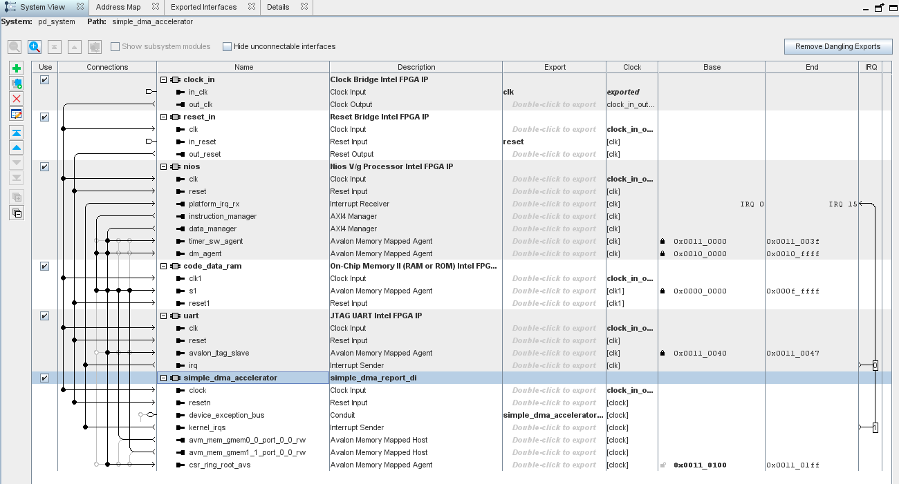
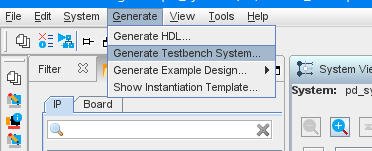

# `Nios V` Sample
The `Nios V` sample is a reference design that demonstrates how to simulate an FPGA IP produced with the Intel® oneAPI DPC++/C++ Compiler with a Nios® V softcore processor.

| Area                      | Description
---                         |---
| What you will learn       | How to configure a Nios V system to interact with an FPGA IP produced with the Intel® oneAPI DPC++/C++ Compiler 
| Time to complete          | ~30 minutes

## Purpose
This FPGA reference design demonstrates a simple Direct Memory Access (DMA) module produced with the Intel® oneAPI DPC++/C++ Compiler, and how to use a Nio V softcore processor to interact with it.

## Prerequisites

This sample is part of the FPGA code samples.
It is categorized as a Tier 4 sample that demonstrates a reference design.


Find more information about how to navigate this part of the code samples in the [FPGA top-level README.md](/DirectProgramming/C++SYCL_FPGA/README.md).
You can also find more information about [troubleshooting build errors](/DirectProgramming/C++SYCL_FPGA/README.md#troubleshooting), [running the sample on the Intel® DevCloud](/DirectProgramming/C++SYCL_FPGA/README.md#build-and-run-the-samples-on-intel-devcloud-optional), [using Visual Studio Code with the code samples](/DirectProgramming/C++SYCL_FPGA/README.md#use-visual-studio-code-vs-code-optional), [links to selected documentation](/DirectProgramming/C++SYCL_FPGA/README.md#documentation), etc.

| Optimized for                     | Description
|:---                               |:---
| OS                                | Ubuntu* 20.04 <br> SUSE* 15 <br> Windows* 10 <br> Windows Server* 2019
| Hardware                          | Intel® Agilex® 7, Arria® 10, and Stratix® 10 FPGAs
| Software                          | Intel® oneAPI DPC++/C++ Compiler<br> Intel® Quartus® Prime Pro Edition Version 23.1 or later

> **Note**: Even though the Intel DPC++/C++ oneAPI compiler is enough to compile for emulation, generating reports and generating RTL, there are extra software requirements for the simulation flow and FPGA compiles.
>
> To use the simulator flow, Intel® Quartus® Prime Pro Edition and one of the following simulators must be installed and accessible through your PATH:
> - Questa*-Intel® FPGA Edition
> - Questa*-Intel® FPGA Starter Edition
> - Questa* Advanced Simulator
> - ModelSim® SE
>
> This design depends on the Nios V design suite, which is available with Intel® Quartus® Prime Pro Edition 23.1 and later.
>
> Before attempting to use this design, you should ensure the following directories are in your `PATH` environment variable:
>
> ```
> <QUARTUS_INSTALL_DIR>/qsys/bin
> <QUARTUS_INSTALL_DIR>/questa_fe/bin
> ```
>
> :warning: Make sure you add the device files associated with the FPGA that you are targeting to your Intel® Quartus® Prime installation.

## Key Implementation Details

The design has the following directory structure after you compile it:

| Directory          | Description
|--------------------|------------
|`.qsys_edit`        | (generated directory) Temporary Platform Designer files
|`DNI/`              | (generated directory) Files generated by Intel® Quartus® Prime 
|`ip/`               | .ip files for all IP inside platform designer system
|`kernels/`          | Directory containing oneAPI kernels (oneAPI kernel sources should be placed here)
|`pd_system/`        | (generated directory) RTL comprising the Platform Designer system 
|`pd_system_tb/`     | (generated directory) Platform Designer test bench system that instantiates pd_system.qsys and wraps it with BFMs
|`qdb`               | (generated directory) Files generated by Intel® Quartus® Prime during synthesis
|`simulation_files/` | Scripts to automate co-simulating hardware and Nios V software
|`software/`         | Nios V sample software with build script (application and BSP will generated from build script)
|`build_and_sim_testsystem.tcl`| Script to run the steps in the [build steps](#build-the-niosv-reference-design) below
|`components.ipx`    | IP search path file that extends the search path to the /custom_ip and /kernels directories
|`pd_system.qsys`    | Platform Designer system (including Nios V, JTAG UART, 1MB of on-chip RAM)
|`pd_system.qsys.legacy`| (generated file) Legacy Platform Designer file
|`test_system.qpf`   | Quartus project file
|`test_system.qsf`   | Quartus settings file

### Hardware Overview

The Nios V softcore processor is connected to the other IPs in this design using Platform Designer. This design is stored in the file `pd_system.qsys`.



There are three important IPs in this system:

1. **On-chip Memory** This on-chip RAM is shared between the Nios V/g softcore processor and the simple DMA accelerator FPGA IP produced with the Intel® oneAPI DPC++/C++ Compiler.

2. **Nios V/g softcore processor** This softcore processor executes a simple test program to exercise the simple DMA accelerator FPGA IP produced with the Intel® oneAPI DPC++/C++ Compiler.

3. **Simple DMA Accelerator** This FPGA IP is produced with the Intel® oneAPI DPC++/C++ Compiler

Although FPGA IP produced with the Intel® oneAPI DPC++/C++ Compiler does not support AXI4 interfaces, Platform Designer is able to generate an interconnect that supports both for you. 


### Nios V Software Overview

The software directory for the Nios V/g core has the following structure:

| Directory            | Description
|----------------------|------------
|`/software`           | Top level of the software directory
|`-/simple_dma_test`   | Test software that interacts with the DMA IP component in a cosimulation environment
|`--/app`              | (generated directory) Application directory where the Nios V executable (.elf) and memory initialization (.hex) files will be generated
|`--/bsp`              | (generated directory) BSP directory where all the Nios V drivers, library, and HAL files will be generated (do not touch the contents here)
|`--/src`              | Source directory for simple_dma_test
|`--software_build.tcl`| Build script that creates the /app and /bsp directories and populates them.  Edit the top of this file to port it to other projects.

The test program exercises the simple DMA accelerator in the following phases:

1. Populate a source buffer in the shared on-chip memory with an incrementing pattern of 'BUFFER_LENGTH' bytes

2. Clear out the destination buffer in the shared on-chip memory

3. Instruct the DMA IP component to copy the data from the source buffer to the destination buffer

4. Check that the destination contents match the source

The Nios V CPU uses memory caching, so it is important to flush the cache after setting up the source and destination buffers, **before** you start the `simple_dma_accelerator`. This will guarantee that all the data you wrote to `code_data_ram` will be visible to the `simple_dma_accelerator` IP.

See the comments in the [source code](software/simple_dma_test/src/simple_dma_test.c) for further hints and notes.

### :warning: Synthesis Notes

The focus of this design is on the interaction between the FPGA IP produced with the Intel® oneAPI DPC++/C++ Compiler, and a Nios® V softcore processor. In order to demonstrate this interaction as simply as possible, some design choices were made that would make this design impractical in a real system as it is written.

1. This design does not have any timing constraints or pin assignments, so do not synthesize the design without including those first. This design contains a JTAG UART, so if it is ported to a board, ensure the JTAG I/O are constrained properly. The input reset path can be safely cut since the reset block inside the Platform Designer system will synchronize the reset for you.

2. For simplicity, a single memory holds the Nios® V softcore processor instructions and also the data that will be processed. In a more realistic system, this memory would likely be off-chip and split into multiple banks to allow the DMA kernel to move data concurrently. Since the DMA source and destination interfaces share, this forms a bottleneck.

## Build the `Nios V` Reference Design

> **Note**: When working with the command-line interface (CLI), you should configure the oneAPI toolkits using environment variables.
> Set up your CLI environment by sourcing the `setvars` script located in the root of your oneAPI installation every time you open a new terminal window.
> This practice ensures that your compiler, libraries, and tools are ready for development.
>
> Linux*:
> - For system wide installations: `. /opt/intel/oneapi/setvars.sh`
> - For private installations: ` . ~/intel/oneapi/setvars.sh`
> - For non-POSIX shells, like csh, use the following command: `bash -c 'source <install-dir>/setvars.sh ; exec csh'`
>
> Windows*:
> - `C:\"Program Files (x86)"\Intel\oneAPI\setvars.bat`
> - Windows PowerShell*, use the following command: `cmd.exe "/K" '"C:\Program Files (x86)\Intel\oneAPI\setvars.bat" && powershell'`
>
> For more information on configuring environment variables, see [Use the setvars Script with Linux* or macOS*](https://www.intel.com/content/www/us/en/develop/documentation/oneapi-programming-guide/top/oneapi-development-environment-setup/use-the-setvars-script-with-linux-or-macos.html) or [Use the setvars Script with Windows*](https://www.intel.com/content/www/us/en/develop/documentation/oneapi-programming-guide/top/oneapi-development-environment-setup/use-the-setvars-script-with-windows.html).

### On Linux*

1. Enable the Nios V build tools:

```bash
$> ./<QUARTUS_INSTALL_DIR>/niosv/bin/niosv-shell
```

You can manually follow the steps below, or run the `build_and_sim_testsystem.tcl` script:

```bash
$> quartus_sh -t build_and_sim_testsystem.tcl
```

2. Change to the sample directory (`kernels/simple_dma`)

3. Configure the build system for the Intel® Arria® 10 device family, which is the default.

   ```
   mkdir build
   cd build
   cmake ..
   ```

   > **Note**: You can change the default target by using the command:
   >  ```
   >  cmake .. -DFPGA_DEVICE=<FPGA device family or FPGA part number>
   >  ```

4. Compile the DMA IP. Generate an IP component and optimization report:

      ```
      make report
      ```

   You can emulate and simulate this design as well, but that is not necessary for this procedure. 

   Continue to Step 5 below.

### On Windows*

1. Enable the Nios V build tools:

```bash
$> <QUARTUS_INSTALL_DIR>\niosv\bin\niosv-shell.exe
```

You can manually follow the steps below, or run the `build_and_sim_testsystem.tcl` script:

```bash
> quartus_sh.exe -t build_and_sim_testsystem.tcl
```

2. Change to the sample directory (`kernels/simple_dma`)

3. Configure the build system for the Intel® Arria® 10 device family, which is the default.

   ```
   mkdir build
   cd build
   cmake .. -G "NMake Makefiles"
   ```

   > **Note**: You can change the default target by using the command:
   >  ```
   >  cmake .. -G "NMake Makefiles" -DFPGA_DEVICE=<FPGA device family or FPGA part number>
   >  ```

4. Compile the DMA IP. Generate an IP component and optimization report:

      ```
      nmake report
      ```

   You can emulate and simulate this design as well, but that is not necessary for this procedure. 
   
   Continue to Step 5 below.

### On both Linux* and Windows*

5. Add the DMA IP to the Platform Designer system. The included `components.ipx` file shows Platform Designer where to look for FPGA IPs produced with the Intel® oneAPI DPC++/C++ Compiler. See the [Platform Designer tutorial](/DirectProgramming/C++SYCL_FPGA/Tutorials/Tools/platform_designer) for detailed instructions on how to add an FPGA IP to a Platform Designer system. Here are some specific directions for this example:
    1. Change the HDL entity name to `simple_dma_accelerator` to match names used in the Nios V software.
    2. Connect the interrupt port to the Nios V interrupt receiver and assign its IRQ number to 1 (or any number besides 0 which is used by the UART)
    3. Connect the Nios V data host port to the IP component's `csr_ring_root_avs` port. Ensure the base address is assigned between `0x0010_0000` and `0x001F_FFFF`.
    4. Connect the IP component's read and write Avalon memory-mapped host ports to the `code_data_ram` on-chip memory.
    5. Export the IP component's `device_exception_bus` signal. You can leave the default name `simple_dma_accelerator_device_exception_bus`.

    

6. Generate the Platform Designer testbench:
    1. Select the "Generate" toolbar menu option --> select "Generate Testbench System"

    

    2. When the Generate dialog box appears select "Generate" and wait for the testbench system to finish generating
    
    3. Exit Platform Designer

7. Build the Nios V software (make sure you've enabled the Nios V build tools as described in Step 1):

    1. Navigate to the /software/simple_dma_test directory
    
    2. Run the software build script:

        ```bash
        quartus_sh -t software_build.tcl
        ```
       This script copies the hex file from software compilation to the testbench simulation directory.The hex file is generated in the software directory tree: `/software/simple_dma_test/app/build/code_data_ram_init.hex`. The testbench simulation directory: (for Questa) lives at `/pd_system_tb/pd_system_tb/sim/mentor`.

## Run the `Nios V` Executable

### On both Linux* and Windows*

1. Navigate to the `/simulation_files` directory

2. Run the simulation script:

    ```bash
    vsim -c -do test_nios_commandline.tcl
    ```

3. You can tell if the simulation succeeded by looking for this text in the output transcript:

    ```
    # Initializing memory contents for pd_system_tb.pd_system_inst.code_data_ram.code_data_ram.altera_syncram_component.initialize_mem_contents with code_data_ram_init.ver
    #               990000: INFO: pd_system_tb.pd_system_inst_reset_bfm.pd_system_inst_reset_bfm.reset_deassert: Reset deasserted
    # Test design for the simple DMA kernel
    # 
    # Test will initialize 256 incrementing four byte unsigned integers, have the accelerator DMA copy the data to a destination and then check the destination for correctness.
    # Test Pass:  All the data at the destination matches the source.
    # Software will now exit.
    ```

>**Note**: If you encounter any issues with long paths when compiling under Windows*, you may have to create your 'build' directory in a shorter path, for example `C:\samples\build`. You can then run cmake from that directory, and provide cmake with the full path to your sample directory, for example:
>
>  ```
  > C:\samples\build> cmake -G "NMake Makefiles" C:\long\path\to\code\sample\CMakeLists.txt
>  ```
## License

Code samples are licensed under the MIT license. See [License.txt](/License.txt) for details.

Third-party program Licenses can be found here: [third-party-programs.txt](/third-party-programs.txt).
