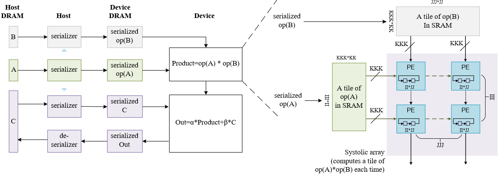
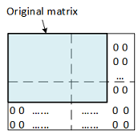

# Matrix Multiplication

This design demonstrates the following matrix-matrix product:

$C \longleftarrow \alpha * op(A) * op(B) + \beta * C$

where $op(X)$ is $X$, $X^T$, or $X^H$, $alpha$ and $beta$ are scalars, and $A$, $B$ and $C$ are matrices.

The design has static and dynamic parameters. The static parameters include
* data types of the matrices and scalars, denoted `TA`, `TB`, `TC` and `TS`, respectively. A data type can be any of `s` (single precision), `d` (double precision), `c` (complex single precision), `z` (complex double precision), and in future, `bfloat16` etc.
* [sizes of the systolic array](#user-content-sizes-of-a-systolic-array) that is expressed by the design.

For each combination of the static parameters, the design needs to be synthesized once.

Once the design is synthesized, the dynamic parameters are passed in and control its execution:
* `TransposeA`, `ConjugateA`, `SymmetricA`, `HermitianA`, `UpA`
* `TransposeB`, `ConjugateB`, `SymmetricB`, `HermitianB`, `UpB`
* `SymmetricC`, `HermitianC`, `UpC`
* `HalfSpaceOut`
* `alpha`, `beta`

where

* `TransposeX`, `ConjugateX`: Is matrix X to be transposed? Is it to be conjugated?
* `SymmetricX`, `HermitianX`: Is matrix X symmetric? Is it Hermitian?
* `UpX`: Given matrix X as symmetric or Hermitian, is its upper triangle stored?
* `HalfSpaceOut`: Compute only half of the output matrix? This is true when the output is symmetric or Hermitian. In this case, the design computes only the upper triangle of the output in tiles; only the data strictly above or on the diagonal are ensured to be correct.

Through APIs that provide appropriate dynamic parameters and post-processing, a synthesized design simulates the following standard BLAS kernels:
* `GEMM` - Computes a matrix-matrix product with general matrices.
* `SYMM` - Computes a matrix-matrix product where one input matrix is symmetric and one matrix is general.
* `HEMM` - Computes a matrix-matrix product where one input matrix is Hermitian and one matrix is general.
* `SYRK` - Performs a rank-k update of the upper or lower triangle of a symmetric matrix.
* `HERK` - Performs a rank-k update of the upper or lower triangle of a Hermitian matrix.

Note:
* `SYRK` and `HERK` are to be available in the next release.

| Area                | Description                                                  |
| ------------------- | ------------------------------------------------------------ |
| What you will learn | How to implement a high performance systolic array for matrix multiplication on an FPGA |
| Time to complete    | ~1 hr (excluding compile time)                               |
| Category            | Reference Designs and End to End                             |

## Prerequisites
| Optimized for        | Description
|:---                  |:---
| OS                   | Ubuntu* 18.04/20.04 (The design is not really specific to any OS. Other Linux distributions or Windows might also work, although not tested)
| Hardware             | Intel® Programmable Acceleration Card with Intel® Arria® 10 GX FPGA (Intel® PAC with Intel® Arria® 10 GX FPGA) <br> Intel® FPGA Programmable Acceleration Card (PAC) D5005 (with Intel Stratix® 10 SX)
| Software             | Intel® oneAPI DPC++/C++ Compiler 2023.2<br> BSP used for Arria® 10 FPGA: inteldevstack/a10_gx_pac_ias_1_2_1_pv/opencl/opencl_bsp<br>T2SP compiler (a beta version is pre-installed)

## The design
In this design, the input/output matrices are pre/post-processed on the host so that the FPGA device loads/stores data sequentially from/to the device DRAM. This ensures that the memory accesses won't be a bottleneck of the performance. In pre-processing, the host reads an input matrix $X$ in such a way that in effect, the elements of $op(X)$ are read in the order they are to used in the computation, and sent sequentially to the device. This is serialization.

To allow arbitrarily large matrices, the matrices are tiled. Every time, a tile of matrix $op(A)$ and a tile of matrix $op(B)$ are fetched into the device SRAM. The product of two input tiles is calculated by a systolic array, and is used to update a tile of the product $op(A)*op(B)$. The product tile is divided between the PEs (processing elements) of the systolic array. Each PE works on a part of the product tile, storing them in rotating registers.



When the tiles of an input matrix $op(X)$ cover a bigger area than the original matrix, zeros are automatically inserted. This is zero-padding.



Similary, when the tiles of the product matrix $op(A)*op(B)$ cover a bigger area than the product matrix, extraneous data are automatically removed.

### Sizes of a systolic array
* `III` - Rows of PEs in the systolic array.
* `JJJ` - Columns of PEs in the systolic array. The output matrix $C$ is stored in `JJJ`-wide vectors to the device memory.
* `KKK` - SIMD lanes in a PE: every cycle, the PE computes a dot product, in a vectorized way, between `KKK` number of data from a row of $op(A)$ and `KKK` number of data from a column of $op(B)$ that are loaded from the device memory.

Each time the systolic array multiplies a tile of $op(A)$ and a tile of $op(B)$, and uses the results to upate a tile of $op(A)*op(B)$. The dimensions of the tiles are determined by 

* `II`: `III * II` is the rows of a tile of $op(A)$
* `JJ`: `JJJ * JJ` is the columns of a tile of $op(B)$
* `KK`: `KKK * KK` is the columns/rows of a tile of $op(A)$/$op(B)$

#### Restrictions

* Matrix storage: row-major.
* Data types: `s`, `d`, `c` and `z` so far.
* Data sizes: For memory efficiency, the matrices must be loaded and stored in a vectorized way from/to the device memory. Therefore, the columns of $op(A)$ and the rows of $op(B)$ must be multiples of `KKK`, and the columns of $C$ must be multiples of `JJJ`. This restriction is to be removed in the next release.

The [parameters.h](./parameters.h) file pre-defines the sizes for a tiny and large systolic array. The tiny configuration specifies a 4x4 systolic array, with each PE computing 16 results. The large configuration tries to maximally utilize resources, and varies with precision and hardware. One can modify these parameters. If so, please remember to modify the `get_systolic_array_dimensions()` function in [api.hpp](./api.hpp) accordingly.

## Test
Follow the general instructions in [blas/README.md](../README.md#user-content-environment-requirement) to set up the environment and build a demo application `demo_VARIATION_SIZE_HW` for any kernel `VARIATION` with a systolic array of any `SIZE` (`tiny` or `large` as defined in [parameters.h](./parameters.h)) on any `HW` (`a10` or `s10`), and the design will be synthesized under the hood into an image (bitstream) of the systolic array and linked with that kernel. The correspondence between the VARIATIONs and images is as follows:

<table>
<tr>
    <th>VARIATION of a kernel</th>
    <th>Image</th>
</tr>
<tr>
    <td>sgemm, ssymm, ssyrk</td>
    <td>ssssmatmul</td>
</tr>
<tr>
    <td>dgemm, dsymm, dsyrk</td>
    <td>ddddmatmul</td>
</tr>
<tr>
    <td>cgemm, csymm, csyrk, chemm</td>
    <td>ccccmatmul</td>
</tr>
<tr>
    <td>zgemm, zsymm, zsyrk, zhemm</td>
    <td>zzzzmatmul</td>
</tr>
<tr>
    <td>cherk</td>
    <td>cccsmatmul</td>
</tr>
<tr>
    <td>zherk</td>
    <td>zzzdmatmul</td>
</tr>
</table>

Here the prefix `ssss` etc. refers to the data types of `TA`, `TB`, `TC` and `TS`.

For example,

```
    source /glob/development-tools/versions/oneapi/2023.2.0.1/oneapi/setvars.sh --force
    cd PATH_TO_ONEAPI_SAMPLES/DirectProgramming/C++SYCL_FPGA/ReferenceDesigns/productive_libraries/blas/gemm 
    mkdir -p build && cd build
    cmake ..
    
    make demo_sgemm_large_a10
```

will automatically synthesize this design into an image `ssssmatmul_large_a10.a` under `blas/reconfigurable_matmul/bin/`, and link the image into the demo application `demo_sgemm_large_a10` under `blas/gemm/bin/`. 

Alternatively, one can install a pre-synthesized image following the general instructions there.

After unsigning the image (for A10 FPGA only), the demo can run on a hardware, which will generate performance metrics.

## Metrics

<table style="width:120%">
<tr>
    <th>Device</th>
    <th>Static parameters<br>(TA, TB, TC, TS<br>KKK, JJJ, III, JJ, II, KK)</th>
    <th>Logic utilization</th>
    <th>DSP blocks</th>
    <th>RAM blocks</th>
    <th>Frequency<br>(MHZ)</th>
    <th>Throughput in GFLOPS</th>
    <th>Matrix Size<br>(A, B)</th>
    <th>Command to reproduce</th>
</tr>
<tr>
    <td rowspan="6">Intel Arria 10 GX 1150</td>
    <td>S, S, S, S<br>16, 8, 10, 32, 32, 32</td>
    <td>216,823 / 427,200 ( 51 % )</td>
    <td>1,311 / 1,518 ( 86 % )</td>
    <td>2,205 / 2,713 ( 81 % )</td>
    <td>217</td>
    <td>554<br>(82% peak)</td>
    <td>10K * 16K, 16K * 8K</td>
    <td>blas/gemm/bin/demo_sgemm_large_a10.unsigned</td>
</tr>
<tr>
    <td>D, D, D, D<br>8, 4, 6, 32, 32, 32</td>
    <td>312,330 / 427,200 ( 73 % )</td>
    <td>807 / 1,518 ( 53 % )</td>
    <td>1,494 / 2,713 ( 55 % )</td>
    <td>238</td>
    <td>91<br>(49% peak)</td>
    <td>6K*8K, 8K*4K</td>
    <td>blas/gemm/bin/demo_dgemm_large_a10.unsigned</td>
</tr>
<tr>
    <td>C, C, C, C<br>8, 4, 10, 32, 32, 32</td>
    <td>206,739 / 427,200 ( 48 % )</td>
    <td>1,319 / 1,518 ( 87 % )</td>
    <td>1,835 / 2,713 ( 68 % )</td>
    <td>252</td>
    <td>640<br>(82% peak)</td>
    <td>10K*8K, 8K*4K</td>
    <td>blas/gemm/bin/demo_cgemm_large_a10.unsigned</td>
</tr>
<tr>
    <td>Z, Z, Z, Z<br>4, 4, 3, 32, 32, 32</td>
    <td>302,829 / 427,200 ( 71 % )</td>
    <td>855 / 1,518 ( 56 % )</td>
    <td>1,281 / 2,713 ( 47 % )</td>
    <td>217</td>
    <td>85<br>(50% peak)</td>
    <td>3K*3K, 4K*4K</td>
    <td>blas/gemm/bin/demo_zgemm_large_a10.unsigned</td>
</tr>
<tr>
    <td>C, C, C, S<br></td>
    <td></td>
    <td></td>
    <td></td>
    <td></td>
    <td></td>
    <td></td>
    <td></td>
</tr>
<tr>
    <td>Z, Z, Z, D<br></td>
    <td></td>
    <td></td>
    <td></td>
    <td></td>
    <td></td>
    <td></td>
    <td></td>
</tr>
<tr>
    <td rowspan="6">Intel Stratix 10 SX 2800</td>
    <td>S, S, S, S<br>16, 16, 10, 32, 32, 32</td>
    <td>580,648 / 933,120 ( 62 % )</td>
    <td>2,597 / 5,760 ( 45 % )</td>
    <td>3,712 / 11,721 ( 32 % )</td>
    <td>238</td>
    <td>882<br>(32% peak)</td>
    <td>10K*16K, 16K*16K</td>
    <td>blas/gemm/bin/demo_sgemm_large_s10</td>
</tr>
<tr>
    <td>D, D, D, D<br>8, 4, 6, 32, 32, 32</td>
    <td>581,320 / 933,120 ( 62 % )</td>
    <td>805 / 5,760 ( 14 % )</td>
    <td>1,927 / 11,721 ( 16 % )</td>
    <td>265</td>
    <td>74<br>(10% peak)</td>
    <td>6K*8K, 8K*4K</td>
    <td>blas/gemm/bin/demo_dgemm_large_s10</td>
</tr>
<tr>
    <td>C, C, C, C<br>8, 4, 10, 32, 32, 32</td>
    <td>443,439 / 933,120 ( 48 % )</td>
    <td>1,317 / 5,760 ( 23 % )</td>
    <td>2,407 / 11,721 ( 21 % )</td>
    <td>300</td>
    <td>560<br>(16% peak)</td>
    <td>10K*8K, 8K*4K</td>
    <td>blas/gemm/bin/demo_cgemm_large_s10</td>
</tr>
<tr>
    <td>Z, Z, Z, Z<br></td>
    <td></td>
    <td></td>
    <td></td>
    <td></td>
    <td></td>
    <td></td>
    <td></td>
</tr>
<tr>
    <td>C, C, C, S<br></td>
    <td></td>
    <td></td>
    <td></td>
    <td></td>
    <td></td>
    <td></td>
    <td></td>
</tr>
<tr>
    <td>Z, Z, Z, D<br></td>
    <td></td>
    <td></td>
    <td></td>
    <td></td>
    <td></td>
    <td></td>
    <td></td>
</tr>

</table>

## Performance analysis

Matrix multiplication is bound by compute. Therefore,

$$
\begin{aligned}
\text{Theoretical peak throughput} &= \text{number of MUL and ADD operations per DSP per cycle} * \text{number of DSPs} * \text{frequency}\\
&= \frac{\text{number of MUL and ADD operations per reduction per cycle}}{\text{number of DSPs per reduction}} * \text{number of DSPs} * \text{frequency}\\
&= \frac{\text{2:2:8:8 for S:D:C:Z, respectively}}{\text{1:4:4:16 for S:D:C:Z, respectively}} * \text{number of DSPs} * \text{frequency}
\end{aligned}
$$

Every cycle, a pair of data from matrix $A$ and $B$ are reduced by 1 multiplication and 1 addition. For a real type, a multiplication/addition is simply a MUL/ADD operation. For a complex type, multiplying two complex numbers requires 4 MUL and 2 ADD operations, and adding two complex numbers requires 2 ADD operations. That explains the `number of MUL and ADD operations per reduction per cycle` above. Note that a MUL/ADD operation has single precision in the case of S and C, but double precision in the case of D and Z.
 The `number of DSPs per reduction` is observed from synthesis results.

So far, single-precision matrix multiplications on A10 (SGEMM and CGEMM) achieve >80% theoretcial peak throughputs. However, double-precision and S10 throughputs suffer from several issues ([synthesis failure](https://github.com/haoxiaochen/t2sp/issues/33), [synthesis overtime](https://github.com/haoxiaochen/t2sp/issues/34), and [scalility issue](https://github.com/haoxiaochen/t2sp/issues/41)). Also from the table above, it seems that logic utilization, instead of DSP blocks, has become the critical resources in these cases, which partially explains the performanc gap. Performance tuning is still ongoing for these cases, and once the issues are addressed, the throughputs should be significantly improved.