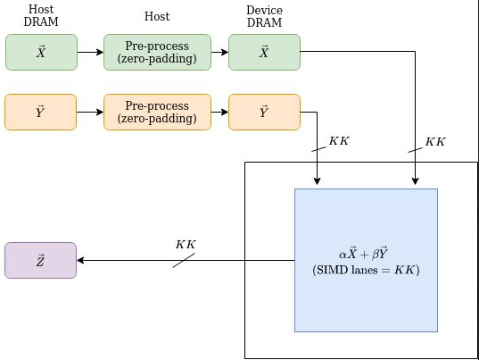

# Vector Addition

This design demonstrates the following addition of two vectors:

$$
\vec{z} \longleftarrow \alpha * \vec{x} + \beta * \vec{y}
$$

where $\alpha$ and $\beta$ are scalars, and $\vec{x}$ and $\vec{y}$ are vectors.

The design has static and dynamic parameters. The static parameters include

* data type of the vectors, denoted `TTYPE`. In this release, the scalars' type is the same as the vectors' type. A data type can be any of `s` (single precision), `d` (double precision), `c` (complex single precision), and `z` (complex double precision).

* [size of the hardware](#user-content-size-of-the-hardware)

For each combination of the static parameters, the design needs to be synthesized once.

Once the design is synthesized, the dynamic parameters are passed in and control its execution:

* `IncX`, `IncY`: strides of the input vectors.

* `Alpha`, `Beta`: the input scalars.

Through APIs that provide appropriate dynamic parameters and post-processing, a synthesized design simulates the following standard BLAS kernels:

* `AXPY` - Computes a vector-scalar product and adds the result to a vector.

* `SCAL` - Computes the product of a vector by a scalar.

* `COPY` - Copies a vector to another vector.

| Area                | Description                                                                       |
| ------------------- | --------------------------------------------------------------------------------- |
| What you will learn | How to implement a high performance circuit for vector addition on an FPGA |
| Time to complete    | ~1 hr (excluding compile time)                                                    |
| Category            | Reference Designs and End to End                                                  |

## Prerequisites

| Optimized for | Description                                                                                                                                                                                           |
| ------------- | ----------------------------------------------------------------------------------------------------------------------------------------------------------------------------------------------------- |
| OS            | Ubuntu* 18.04/20.04 (The design is not really specific to any OS. Other Linux distributions or Windows might also work, although not tested)                                                          |
| Hardware      | Intel® Programmable Acceleration Card with Intel® Arria® 10 GX FPGA (Intel® PAC with Intel® Arria® 10 GX FPGA)<br/>Intel® FPGA Programmable Acceleration Card (PAC) D5005 (with Intel Stratix® 10 SX) |
| Software      | Intel® oneAPI DPC++/C++ Compiler 2023.2<br/>BSP used for Arria® 10 FPGA: inteldevstack/a10_gx_pac_ias_1_2_1_pv/opencl/opencl_bsp<br/>T2SP compiler (a beta version is pre-installed)                  |

## The design

Vector addition has no data reuse. A data is loaded and then used only once. Thus the performance is bound by the bandwidth of the FPGA DRAM. The key to achieve high performance is to effectively utilize the bandwidth.

In this design, the input vectors are pre-processed on the host: the data of the vectors are loaded in the order they are to be used, and sent to the device DRAM sequentially. Then the FPGA device simply loads data from the device DRAM sequentially.

The device divides an input vector into `parts`, and calculates the vector addition of each part one by one. More specifically, the input vectors $\vec{x}$ and $\vec{y}$ are loaded from the device DRAM in parts of size `KK`. Each time, a `pair` of parts are loaded, in a vectorized way, from the two input vectors. The two parts are then added, in a vectorized way, on the device.



### Size of the hardware

* `KK` - SIMD lanes.

#### Restrictions

* Data sizes: For memory efficiency, the input data must be loaded in a vectorized way from the device memory. Therefore, the width of $\vec{x}$ and $\vec{y}$ must be multiples of  `KK`.

The [parameters.h](./parameters.h) file pre-defines the sizes for a tiny and large hardware implementation. The tiny configuration specifies 4 SIMD lanes. The large configuration tries to maximally utilize resources, and varies with precision and hardware. One can modify these parameters. If so, please remember to modify the `get_systolic_array_dimensions()` function in [api.hpp](./api.hpp) accordingly.

## Test
Follow the general instructions in [blas/README.md](../README.md#user-content-environment-requirement) to set up the environment and build a demo application `demo_VARIATION_SIZE_HW` for any kernel `VARIATION` with a systolic array of any `SIZE` (`tiny` or `large` as defined in [parameters.h](./parameters.h)) on any `HW` (`a10` or `s10`), and the design will be synthesized under the hood into an image (bitstream) of the systolic array and linked with that kernel. The correspondence between the VARIATIONs and images is as follows:

| VARIATION of a kernel | Image   |
| --------------------- | ------- |
| saxpy, sscal, scopy   | svecadd |
| daxpy, dscal, dcopy   | dvecadd |
| caxpy, cscal, ccopy   | cvecadd |
| zaxpy, zscal, zcopy   | zvecadd |

For example,

```
    source /glob/development-tools/versions/oneapi/2023.2.0.1/oneapi/setvars.sh --force
    cd PATH_TO_ONEAPI_SAMPLES/DirectProgramming/C++SYCL_FPGA/ReferenceDesigns/productive_libraries/blas/axpy 
    mkdir -p build && cd build
    cmake ..
    
    make demo_saxpy_large_a10
```

will automatically synthesize this design into an image `svecadd_large_a10.a` under `blas/reconfigurable_vecadd/bin/`, and link the image into the demo application `demo_saxpy_large_a10` under `blas/axpy/bin/`. 

Alternatively, one can install a pre-synthesized image following the general instructions there.

After unsigning the image (for A10 FPGA only), the demo can run on a hardware, which will generate performance metrics.

## Metrics

<table style="width:120%">
<tr>
    <th>Device</th>
    <th>Static parameters<br>(TTYPE<br>KK)</th>
    <th>Logic utilization</th>
    <th>DSP blocks</th>
    <th>RAM blocks</th>
    <th>Frequency<br>(MHZ)</th>
    <th>Throughput in GFLOPS</th>
    <th>Vector Size<br>(#elements of X, Y)</th>
    <th>Command to reproduce</th>
</tr>
<tr>
    <td rowspan="4">Intel Arria 10 GX 1150</td>
    <td>S, S<br>16</td>
    <td>80,715 / 427,200 ( 19 % )</td>
    <td>32 / 1,518 ( 2 % )</td>
    <td>446 / 2,713 ( 16 % )</td>
    <td>303</td>
    <td>5.3<br>(62% peak)</td>
    <td>256M, 256M</td>
    <td>blas/axpy/bin/demo_saxpy_large_a10.unsigned</td>
</tr>
<tr>
    <td>D, D<br>8</td>
    <td>88,892 / 427,200 ( 21 % )</td>
    <td>64 / 1,518 ( 4 % )</td>
    <td>446 / 2,713 ( 16 % )</td>
    <td>279</td>
    <td>2.9<br>(68% peak)</td>
    <td>128M, 128M</td>
    <td>blas/axpy/bin/demo_daxpy_large_a10.unsigned</td>
</tr>
<tr>
    <td>C, C<br>8</td>
    <td>80,820 / 427,200 ( 19 % )</td>
    <td>64 / 1,518 ( 4 % )</td>
    <td>446 / 2,713 ( 16 % )</td>
    <td>294</td>
    <td>14.3<br>(72% peak)</td>
    <td>128M, 128M</td>
    <td>blas/axpy/bin/demo_caxpy_large_a10.unsigned</td>
</tr>
<tr>
    <td>Z, Z<br>4</td>
    <td>102,022 / 427,200 ( 24 % )</td>
    <td>128 / 1,518 ( 8 % )</td>
    <td>461 / 2,713 ( 17 % )</td>
    <td>291</td>
    <td>7.3<br>(73% peak)</td>
    <td>64M, 64M</td>
    <td>blas/axpy/bin/demo_zaxpy_large_a10.unsigned</td>
</tr>
<tr>
    <td rowspan="4">Intel Stratix 10 GX 2800</td>
    <td>S, S<br>16</td>
    <td>237,809 / 933,120 ( 25 % )</td>
    <td> 32 / 5,760 ( < 1 % )</td>
    <td> 755 / 11,721 ( 6 % )</td>
    <td>328</td>
    <td>15.3<br>(80% peak)</td>
    <td>256M, 256M</td>
    <td>blas/axpy/bin/demo_saxpy_large_s10</td>
</tr>
<tr>
    <td>D, D<br>8</td>
    <td> 249,791 / 933,120 ( 27 % )</td>
    <td> 64 / 5,760 ( 1 % )</td>
    <td>755 / 11,721 ( 6 % )</td>
    <td>328</td>
    <td>7.6<br>(79% peak)</td>
    <td>128M, 128M</td>
    <td>blas/axpy/bin/demo_daxpy_large_s10</td>
</tr>
<tr>
    <td>C, C<br>8</td>
    <td> 239,652 / 933,120 ( 26 % )</td>
    <td> 64 / 5,760 ( 1 % )</td>
    <td>755 / 11,721 ( 6 % )</td>
    <td>329</td>
    <td>35.7<br>(80% peak)</td>
    <td>128M, 128M</td>
    <td>blas/axpy/bin/demo_caxpy_large_s10</td>
</tr>
<tr>
    <td>Z, Z<br>4</td>
    <td> 267,396 / 933,120 ( 29 % )</td>
    <td>128 / 5,760 ( 2 % )</td>
    <td> 755 / 11,721 ( 6 % )</td>
    <td>344</td>
    <td>18.6<br>(83% peak)</td>
    <td>64M, 64M</td>
    <td>blas/axpy/bin/demo_zaxpy_large_s10</td>
</tr>

</table>

## Performance analysis

$$
\begin{aligned}
\text{Arithmetic intensity} &= \frac{\text{number of ops}}{\text{number of bytes}}\\
&= \frac{\text{number of ADD ops} + \text{number of MUL ops}}{3\times \text{Vector Length}\times \text{sizeof(T)}}\\
&= \frac{\text{Vector Length}\times (\text{is complex type}\ ?\ 14\ :\ 3)}{3\times \text{Vector Length}\times \text{sizeof(T)}}\\
&= \frac{\text{is complex type}\ ?\ 14\ :\ 3}{3\times \text{sizeof(T)}}
\end{aligned}
$$

Note: every pair of input data is processed by 2 multiplications and 1 addition. For a real type, a multiplication/addition is simply a MUL/ADD operation. For a complex type, multiplying two complex numbers requires 4 MUL and 2 ADD operations, and adding two complex numbers requires 2 ADD operations.

Obviously, the arithmetic intensity is very small (the maximal value is only 14/12=1.17), so `reconfigurable_vecadd`'s machine peak throughput is limited by the FPGA DRAM bandwidth. Thus the theoretical peak performance = FPGA DRAM bandwidth * Arithmetic intensity. The maximum bandwidth is 34.1 GB/s and 76.8 GB/s for A10 and S10, respectively, so for different data types, their peak throughputs are as follows:


|         |  Peak performance on A10 (GFLOPS) | Peak performance on S10 (GFLOPS) |Note: precision of the ops|
| ------- | ----------- | ----------- |----------- |
| svecadd | 8.5           | 19.2  |single|
| dvecadd | 4.3           | 9.6       |double|
| cvecadd | 19.9           | 44.8      |single|
| zvecadd | 9.9           | 22.4      |double|


These kernels suffer from [an issue](https://github.com/haoxiaochen/t2sp/issues/40) that two input vectors cannot be allocated to two different DDR channels exclusively in SYCL compiler in USM memory model. One addressed, their performances are expected double and close to their peaks.

