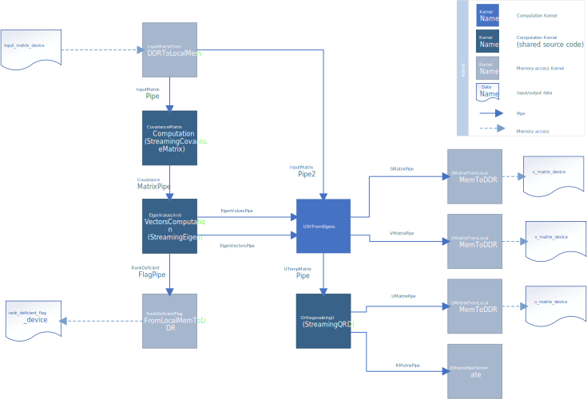
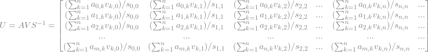

# `Singular Value Decomposition (SVD)` Sample
The `SVD` reference design demonstrates a singular value decomposition implementation for real matrices on an FPGA.


| Area                  | Description
|:---                   |:---
| What you will learn   | How to implement an FPGA version of singular value decomposition.
| Time to complete      | 1 hr (not including compile time)
| Category              | Reference Designs and End to End

## Purpose
This FPGA reference design demonstrates the Singular Value Decomposition (SVD) of real matrices. SVD is a common linear algebra factorization used for applications such as matrix pseudo-inverse and solving homogeneous linear equations. The SVD of a real, 2D input matrix $A$ is defined as follows:

```math
A = USV^T
```

where $U$ and $V$ are orthonormal bases of $A$, called (left and right) singular vectors. Orthonormal bases are vectors that are orthogonal to each other and of length 1.

$S$ is a diagonal matrix (matrix where all elements but the diagonals are zeros). The diagonals are called singular values corresponding to each singular vectors.

While SVD can generally be applied to complex matrices, this design does not support complex matrices to simplify its implementation.

## Prerequisites

This sample is part of the FPGA code samples.
It is categorized as a Tier 4 sample that demonstrates a reference design.


Find more information about how to navigate this part of the code samples in the [FPGA top-level README.md](/DirectProgramming/C++SYCL_FPGA/README.md).
You can also find more information about [troubleshooting build errors](/DirectProgramming/C++SYCL_FPGA/README.md#troubleshooting), [using Visual Studio Code with the code samples](/DirectProgramming/C++SYCL_FPGA/README.md#use-visual-studio-code-vs-code-optional), [links to selected documentation](/DirectProgramming/C++SYCL_FPGA/README.md#documentation), etc.

| Optimized for        | Description
|:---                  |:---
| OS                   | Ubuntu* 20.04 <br> RHEL*/CentOS* 8 <br> SUSE* 15 <br> Windows* 10 <br> Windows Server* 2019
| Hardware             | Intel® Agilex® 7, Arria® 10, and Stratix® 10 FPGAs
| Software             | Intel® oneAPI DPC++/C++ Compiler

> **Note**: Even though the Intel DPC++/C++ OneAPI compiler is enough to compile for emulation, generating reports and generating RTL, there are extra software requirements for the simulation flow and FPGA compiles.
>
> For using the simulator flow, Intel® Quartus® Prime Pro Edition and one of the following simulators must be installed and accessible through your PATH:
> - Questa*-Intel® FPGA Edition
> - Questa*-Intel® FPGA Starter Edition
> - ModelSim® SE
>
> When using the hardware compile flow, Intel® Quartus® Prime Pro Edition must be installed and accessible through your PATH.
>
> :warning: Make sure you add the device files associated with the FPGA that you are targeting to your Intel® Quartus® Prime installation.

### Performance

Performance results are based on testing as of September 12, 2024 with fixed 55 [QR iterations](../pca/README.md#eigen-values-and-eigen-vectors-computation).

> **Note**: Refer to the [Performance Disclaimers](/DirectProgramming/C++SYCL_FPGA/README.md#performance-disclaimers) section for important performance information.

| Device                      | Input size (Rows x Cols) | Throughput     |
|-----------------------------|--------------------------|----------------|
| Silicom FPGA SmartNIC N6011 | 32 x 32                  | 987 matrices/s |
| Silicom FPGA SmartNIC N6011 | 128 x 32                 | 560 matrices/s |
| Silicom FPGA SmartNIC N6011 | 128 x 16                 | 1531 matrices/s|

## Key Implementation Details
This SVD design consists of 4 computation kernels, as well as several memory access kernels to handle input and output. These kernels are connected through inter-kernel pipes and input/output through unified shared memory (USM).



### Source file structure
#### Design specific files:
| File name              | Type                            | Content                                                                                                                                                                                              |
| ---------------------- | ------------------------------- | ---------------------------------------------------------------------------------------------------------------------------------------------------------------------------------------------------- |
| svd_demo.cpp           | Host code                       | Launch a demonstration using the SVD design. Contains the `main()` function.                                                                                                                         |
| svd_testcase.hpp       | Host code                       | A `struct` that lunches the design with a set of input and check result for correctness. The input can either be specified or generated.                                                             |
| svd_testbench_tool.hpp  | Host code                       | Helper functions that are used in the test bench of the SVD demonstration to check for correctness.                                                                                                   |
| print_matrix.hpp       | Host code                       | Helper functions to print matrices.                                                                                                                                                                  |
| golden_pca.hpp         | Host code                       | A CPU reference PCA design that is used to calculate reference eigenvalues for the test bench.                                                                                                      |
| svd.hpp                | Host code with some device code | Contains wrapper function `SingularValueDecomposition` that launches individual kernels of the SVD design.                                                                                           |
| memory_transfers.hpp   | Device code                     | Contains kernel implementations of `MatrixReadFromDDRTo2PipesByBlocks` , `MatrixReadPipeToDDR` and `VectorReadPipeToDDR`. These kernels transfers data between DDR and streaming interfaces (pipes).|
| usv_from_eigens.hpp       | Device code                     | Contains kernel implementation of `USVFromEigens`.                                                                                                                                                   |
#### Shared source file:
| Shared file                                                                      | Type        | Content                                                                                           |
|----------------------------------------------------------------------------------|-------------|---------------------------------------------------------------------------------------------------|
| [streaming_covariance_matrix.hpp](../../include/streaming_covariance_matrix.cpp) | Device code | Contains kernel implementations of `StreamingCovarianceMatrix` that computes covariance matrix.   |
| [streaming_eigen.hpp](../../include/streaming_eigen.hpp)                         | Device code | Contains kernel implementations of `StreamingEigen` that computes eigen values and eigen vectors. |
| [streaming_qrd.hpp](../../include/streaming_qrd.hpp)                             | Device code | Contains kernel implementations of `StreamingQRD` that is used to compute orthogonalized matrix.  |

### Input covariance matrix computation
This design imports `streaming_covariance_matrix.hpp` from the shared [include](../../include) directory. The covariance computation in this design uses the `fpga_linalg::StreamingCovarianceMatrix` functor, with the `standardized` parameter of the `StreamingCovarianceMatrix` functor set to `false`.

The covariance of input A is equal to the transpose of A multiplied by A:
```math
Cov(A) = A^{T}A
```
Therefore this kernel performs a matrix multiplication by blocks, as described in the [PCA](../pca/) reference design, which also uses this functor.

### Eigenvalues and Eigenvectors computation
This design imports `streaming_eigen.hpp` from the shared [include]() directory. The eigenvalues and eigenvectors of the input covariance matrix are computed using the `fpga_linalg::StreamingEigen` functor. These eigenvalues and eigenvectors are going to be used to construct the final outputs of SVD.

This kernel works only with input of rank sufficient matrix (all columns are linearly independent). It produces an output `rank_deficent_flag` to indicate if the input matrix is not linearly independent. If the flag is set to 1, the result of the SVD is known to be incorrect.

The [PCA](../pca/) reference design also uses this functor. A detailed explanation of the algorithm of computing eigenvalues can be found in [Eigenvalues and Eigenvectors computation](../pca/README.md#eigen-values-and-eigen-vectors-computation) in the PCA sample.

### Construct Output from Eigenvalues and Eigenvectors
The functor `USVFromEigens` in `usv_from_eigens.hpp`, constructs the final outputs of SVD from the eigenvalues and eigenvectors of the input covariance matrix. 

Consider an input matrix $A$ of size $m \times n$.

#### $V$ Matrix
The right singular vectors (the $V$ matrix) can be produced by copying the eigenvectors , and should be of size $n \times n$:
```math
V = [v_0, v_1, v_2, ...,v_n] 
```

#### $S$ Matrix
The singular value matrix (the $S$ matrix) can be constructed as an $m \times n$ diagonal matrix (all but the values on the main diagonal are zeros) where the non-zero values are the square root of each eigenvalue:
```math
S =
\begin{bmatrix}
\sqrt{\lambda_{0}} & 0                  & 0                  & ... & 0 \\
0                  & \sqrt{\lambda_{1}} & 0                  & ... & 0 \\
0                  & 0                  & \sqrt{\lambda_{2}} & ... & 0 \\
...                & ...                & ...                & ... & 0 \\
0                  & 0                  & 0                  & 0   & \sqrt{\lambda_{n}} \\
0                  & 0                  & 0                  & 0   & 0
\end{bmatrix} 
```

#### $U$ Matrix
The left singular vectors (the $U$ matrix) cannot be directly constructed with eigenvalues and eigenvectors of the input covariance. However, since we have now computed the $U$ and $S$ matrix, and knowing the original input $A$ matrix, we can calculate $U$ matrix using the original SVD relationship:
```math
A = USV^T
```
Since the $V$ matrix is orthogonal by construction, $V^{-1}$ is the same as $V^T$, therefore:
```math
AV = US
```
And since $S$ is a diagonal matrix, $S^{-1}$ is the same as multiplying by the reciprocals of each element on the main diagonal of $S$.

In summary, the $m \times n$ portion of matrix $U$ ($U_{[0:m][0:n]}$) can be obtained through:


When the input matrix $A$ is not square, the number of eigenvectors calculated is less than the number of columns in the $U$ matrix. An orthogonalization kernel is needed to generate extra orthogonal vectors.

### $U$ Matrix Orthogonalization
As mentioned above, when extra filler vectors are needed to complete the $U$ matrix, we need to orthogonalize the matrix.

An efficient algorithm to do this is already implemented in our [QR Decomposition sample](../qrd/README.md), so here we will insert an instance of the `fpga_linalg::streamingQRD` functor from [`streaming_qrd.hpp`](../../include/streaming_qrd.hpp). The $Q$ output of this kernel is orthogonalized $U$ matrix. Since we only care about the orthogonalized $U$ matrix, $R$ output of the Streaming QRD kernel is discarded.

### Demonstration Testbench
In this sample, a testbench is used to demonstrate the SVD design.

The resulting singular values are checked against eigenvalues calculated by a reference PCA algorithm that is also used in the PCA sample.

Since the singular vectors in $U$ and $V$ are non-unique, their correctness are checked by (1) checking for orthogonality, and (2) that they satisfy the relationship $A = USV^T$.

## Build the `SVD` Design
> **Note**: When working with the command-line interface (CLI), you should configure the oneAPI toolkits using environment variables.
> Set up your CLI environment by sourcing the `setvars` script located in the root of your oneAPI installation every time you open a new terminal window.
> This practice ensures that your compiler, libraries, and tools are ready for development.
>
> Linux*:
> - For system wide installations: `. /opt/intel/oneapi/setvars.sh`
> - For private installations: ` . ~/intel/oneapi/setvars.sh`
> - For non-POSIX shells, like csh, use the following command: `bash -c 'source <install-dir>/setvars.sh ; exec csh'`
>
> Windows*:
> - `C:\"Program Files (x86)"\Intel\oneAPI\setvars.bat`
> - Windows PowerShell*, use the following command: `cmd.exe "/K" '"C:\Program Files (x86)\Intel\oneAPI\setvars.bat" && powershell'`
>
> For more information on configuring environment variables, see [Use the setvars Script with Linux* or macOS*](https://www.intel.com/content/www/us/en/develop/documentation/oneapi-programming-guide/top/oneapi-development-environment-setup/use-the-setvars-script-with-linux-or-macos.html) or [Use the setvars Script with Windows*](https://www.intel.com/content/www/us/en/develop/documentation/oneapi-programming-guide/top/oneapi-development-environment-setup/use-the-setvars-script-with-windows.html).

### On Linux*

1. Change to the sample directory.
2. Configure the build system for the Agilex® 7 device family, which is the default.

   ```
   mkdir build
   cd build
   cmake ..
   ```

   > **Note**: You can change the default target by using the command:
   >  ```
   >  cmake .. -DFPGA_DEVICE=<FPGA device family or FPGA part number>
   >  ```
   >
   > Alternatively, you can target an explicit FPGA board variant and BSP by using the following command:
   >  ```
   >  cmake .. -DFPGA_DEVICE=<board-support-package>:<board-variant> -DIS_BSP=1
   >  ```
   > **Note**: You can poll your system for available BSPs using the `aoc -list-boards` command. The board list that is printed out will be of the form
   > ```
   > $> aoc -list-boards
   > Board list:
   >   <board-variant>
   >      Board Package: <path/to/board/package>/board-support-package
   >   <board-variant2>
   >      Board Package: <path/to/board/package>/board-support-package
   > ```
   >
   > You will only be able to run an executable on the FPGA if you specified a BSP.

3. Compile the design. (The provided targets match the recommended development flow.)

   1. Compile for emulation (fast compile time, targets emulated FPGA device).
      ```
      make fpga_emu
      ```
   2. Compile for simulation (fast compile time, targets simulator FPGA device):
      ```
      make fpga_sim
      ```
   3. Generate HTML performance report.
      ```
      make report
      ```
      The report resides at `svd_report.prj/reports/report.html`.

   4. Compile for FPGA hardware (longer compile time, targets FPGA device).
      ```
      make fpga
      ```

### On Windows*

1. Change to the sample directory.
2. Configure the build system for the Agilex® 7 device family, which is the default.
   ```
   mkdir build
   cd build
   cmake -G "NMake Makefiles" ..
   ```

  > **Note**: You can change the default target by using the command:
  >  ```
  >  cmake -G "NMake Makefiles" .. -DFPGA_DEVICE=<FPGA device family or FPGA part number>
  >  ```
  >
  > Alternatively, you can target an explicit FPGA board variant and BSP by using the following command:
  >  ```
  >  cmake -G "NMake Makefiles" .. -DFPGA_DEVICE=<board-support-package>:<board-variant> -DIS_BSP=1
  >  ```
  > **Note**: You can poll your system for available BSPs using the `aoc -list-boards` command. The board list that is printed out will be of the form
  > ```
  > $> aoc -list-boards
  > Board list:
  >   <board-variant>
  >      Board Package: <path/to/board/package>/board-support-package
  >   <board-variant2>
  >      Board Package: <path/to/board/package>/board-support-package
  > ```
  >
  > You will only be able to run an executable on the FPGA if you specified a BSP.

3. Compile the design. (The provided targets match the recommended development flow.)

   1. Compile for emulation (fast compile time, targets emulated FPGA device).
      ```
      nmake fpga_emu
      ```
   2. Compile for simulation (fast compile time, targets simulator FPGA device):
      ```
      nmake fpga_sim
      ```
   3. Generate HTML performance report.
      ```
      nmake report
      ```
      The report resides at `svd_report.a.prj/reports/report.html`.

   4. Compile for FPGA hardware (longer compile time, targets FPGA device).
      ```
      nmake fpga
      ```
>**Note**: If you encounter any issues with long paths when compiling under Windows*, you may have to create your 'build' directory in a shorter path, for example `C:\samples\build`. You can then run cmake from that directory, and provide cmake with the full path to your sample directory, for example:
>
>  ```
  > C:\samples\build> cmake -G "NMake Makefiles" C:\long\path\to\code\sample\CMakeLists.txt
>  ```
## Run the `SVD` Design

### Configurable Parameters

| Argument  | Description
|:---       |:---
| `<num>`   | (Optional) Specifies the number of times to repeat the decomposition. Its default value is **1** for the emulation and simulation flow and **16384** for the FPGA flow.

### On Linux

#### Run on FPGA Emulator

1. Run the sample on the FPGA emulator (the kernel executes on the CPU).
   ```
   ./svd.fpga_emu
   ```

#### Run on FPGA Simulator

1. Run the sample on the FPGA simulator.
   ```
   CL_CONTEXT_MPSIM_DEVICE_INTELFPGA=1 ./svd.fpga_sim
   ```

#### Run on FPGA

1. Run the sample on the FPGA device (only if you ran `cmake` with `-DFPGA_DEVICE=<board-support-package>:<board-variant>`).
   ```
   ./svd.fpga
   ```

### On Windows

#### Run on FPGA Emulator

1. Run the sample on the FPGA emulator (the kernel executes on the CPU).
   ```
   svd.fpga_emu.exe
   ```

#### Run on FPGA Simulator

1. Run the sample on the FPGA simulator.
   ```
   set CL_CONTEXT_MPSIM_DEVICE_INTELFPGA=1
   svd.fpga_sim.exe
   set CL_CONTEXT_MPSIM_DEVICE_INTELFPGA=
   ```

## Example Output

Example Output when running on the **Silicom FPGA SmartNIC N6011**.

```
Running on device: ofs_n6001 : Intel OFS Platform (ofs_ee00000)
Running SVD test with 8 input(s) size 32 x 32, repeating 16384 time(s)
Using device allocations
Singular value differences: 0.00016194
Decomposition differences (A = USVt): 0.000376672
U orthogonal differences: 2.38419e-07
V orthogonal differences: 0.000817776
Total duration: 132.838s
Throughput: 0.986704k matrices/s
PASSED
```

## License

Code samples are licensed under the MIT license. See [License.txt](/License.txt) for details.

Third party program Licenses can be found here: [third-party-programs.txt](/third-party-programs.txt).