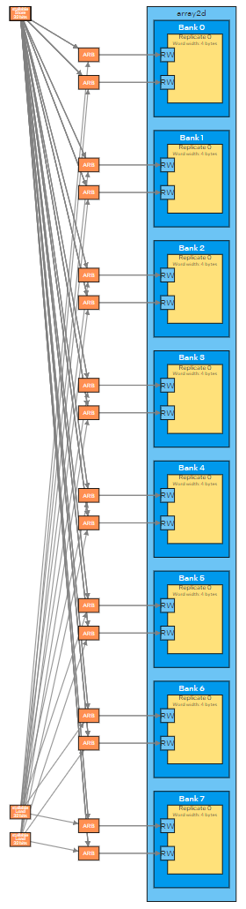
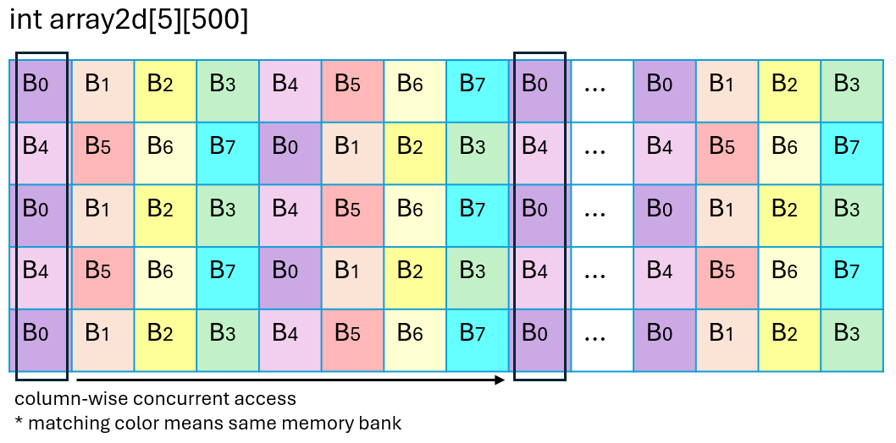
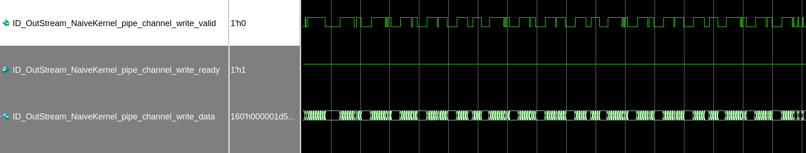
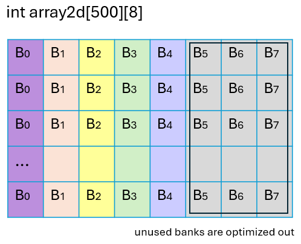
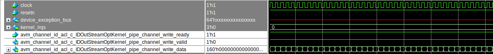

# `Banked Memory System` Sample

This code sample demonstrates how to optimize a banked memory system.

## Purpose

When compiling your design for FPGA architectures, the Intel® oneAPI DPC++/C++ Compiler can choose to implement your variables as registers, or as block memories. The details of this decision are better defined in the [Memory System code sample](DirectProgramming/C++SYCL_FPGA/Tutorials/Features/memory_attributes). However, an ill-formed memory layout can lead to negative impact on your system performance. 

In this code sample, you will learn:

* When to use a banked memory and how the compiler optimizes banked memory systems.

* How to recognize stallable arbitration in the FPGA optimization report, and how it can lead to bad system performance.

* How to construct an efficient banked memory system to improve throughput in your designs.

## Prerequisites

This sample is part of the FPGA code samples. It is categorized as a Tier 3 sample that demonstrates a design pattern.


Find more information about how to navigate this part of the code samples in the [FPGA top-level README.md](/DirectProgramming/C++SYCL_FPGA/README.md).
You can also find more information about [troubleshooting build errors](/DirectProgramming/C++SYCL_FPGA/README.md#troubleshooting), [running the sample on the Intel® DevCloud](/DirectProgramming/C++SYCL_FPGA/README.md#build-and-run-the-samples-on-intel-devcloud-optional), [using Visual Studio Code with the code samples](/DirectProgramming/C++SYCL_FPGA/README.md#use-visual-studio-code-vs-code-optional), [links to selected documentation](/DirectProgramming/C++SYCL_FPGA/README.md#documentation), etc.

| Optimized for      | Description
|:---                |:---
| OS                 | Ubuntu* 20.04 <br> RHEL*/CentOS* 8 <br> SUSE* 15 <br> Windows* 10 <br> Windows Server* 2019
| Hardware           | Intel® Agilex® 7, Agilex® 5, Arria® 10, Stratix® 10, and Cyclone® V FPGAs
| Software           | Intel® oneAPI DPC++/C++ Compiler

> **Note**: Even though the Intel DPC++/C++ oneAPI compiler is enough to compile for emulation, generating reports and generating RTL, there are extra software requirements for the simulation flow and FPGA compiles.
>
> For using the simulator flow, Intel® Quartus® Prime Pro Edition (or Standard Edition when targeting Cyclone® V) and one of the following simulators must be installed and accessible through your PATH:
> - Questa*-Intel® FPGA Edition
> - Questa*-Intel® FPGA Starter Edition
> - ModelSim® SE
>
> When using the hardware compile flow, Intel® Quartus® Prime Pro Edition (or Standard Edition when targeting Cyclone® V) must be installed and accessible through your PATH.
>
> :warning: Make sure you add the device files associated with the FPGA that you are targeting to your Intel® Quartus® Prime installation.

## Key Implementation Details

The sample design shows access to a 2-dimensional FIFO buffer, `array2d`, implemented in on-chip memory. The design performs a read-modify-write on this buffer in the `col` loop, which should have an initiation interval of 1. The fully-unrolled `row` loop accesses an entire dimension of the buffer in **the same clock cycle**.

Each memory block has a read port and a write port, so the design can issue one read and one write in the same clock cycle. If the design tries to perform more than 2 accesses in the same clock cycle, arbitration hardware is inserted to resolve any possible access conflicts. If this arbitration hardware has to be used, your design's throughput will suffer. To guarantee the maximum possible throughput, try to avoid arbitration logic in your memory systems.

### Naive Kernel

The desired memory access pattern in `NaiveKernel` is illustrated in the following diagram:


```c++
struct NaiveKernel {
  void operator()() const {    
    [[intel::fpga_memory("BLOCK_RAM")]]
    int array2d[kNumRows][kNumCols];
    [[intel::initiation_interval(1)]]
    for (int col = 0; col < kNumCols; ++col) {
      SimpleInputT input = InStream_NaiveKernel::read();
      SimpleOutputT output;

      // Shift one new item into the FIFO.
      #pragma unroll
      for (int row = 0; row < kNumRows - 1; ++row) {
        array2d[row][col] = array2d[row + 1][col];
      }
      array2d[kNumRows - 1][col] = input;

      // Populate the output.
      #pragma unroll
      for (int idx = 0; idx < kNumRows; ++idx) {
        output[idx] = array2d[idx][col];
      }
      OutStream_NaiveKernel::write(output);
    }
  }
};
```

In the `NaiveKernel`, the first array dimension (row) is unrolled in a loop. In this way, the kernel tries to access all five elements in one column of the buffer, namely `array2d[0][col]` to `array2d[4][col]`. As a result, there are 4 loads and 5 stores to the memory system in each loop iteration, and since the initiation interval is 1, they happen in a single clock cycle. The  [kernel memory viewer report](https://www.intel.com/content/www/us/en/docs/oneapi-fpga-add-on/developer-guide/current/kernel-memory-viewer.html) shows that the memory system for `array2d` has 8 banks. 



#### Making sense of the bank-selection bits

The *Details* pane of the Kernel Memory Viewer report shows that the bank bits are the second to the fourth least significant bits, $b_4$, $b_3$, $b_2$. This means that integers in every other column will be in a different memory bank.

The following table shows how each address encodes its bank of the memory system. Note how the banks do not align with the rows.

|                 | Address | Bank bits | Bank # |
|-----------------|---------|-----------|--------|
| array2d[0][0]   | 0x0000  | 0b000     | 0      |
| array2d[0][1]   | 0x0004  | 0b001     | 1      |
| array2d[0][2]   | 0x0008  | 0b010     | 2      |
| ...             |         |           |        |
| array2d[0][7]   | 0x001C  | 0b111     | 7      |
| array2d[0][8]   | 0x0020  | 0b000     | 0      |
| array2d[0][9]   | 0x0024  | 0b001     | 1      |
| array2d[0][10]  | 0x0028  | 0b010     | 2      |
| ...             |         |           |        |
| array2d[0][15]  | 0x003C  | 0b111     | 7      |
| ...             |         |           |        |

Similarly, the following table shows which memory bank each logical array element gets assigned to. Observe that each access to one column of `array2d` creates 2 stores and 3 loads to even numbered memory banks and 2 stores and 2 loads to odd numbered memory banks. Since more than one load and store is scheduled to the same memory bank in the same clock cycle, the compiler inserts arbitration logic along with stallable load-store units (LSUs). You can see this in the Kernel Memory Viewer in the optimization report.



When the kernel executes and simultaneous accesses to the memory system get arbitrated, the loop stalls. These stalls are visible in the simulation waveform: there are occasional gaps in the `valid` signal for pipe write - the valid signal is de-asserted because of the upstream stall from the memory system. This negatively affects the system throughput.



### Optimized Kernel

To make the memory system more efficient, we can make three changes:

1. Use the right-most array dimension for unrolled accesses, (that is, store the **column** dimension in the right-most array dimension).

2. Choose the number of banks to a power-of-2 using `constexpr`-math functions. This line of code computes the closest power-of-2 above the given number. We use this power-of-2 as the number of banks in our optimized memory system. Since this design performs up to 5 parallel memory accesses, a minimum of 5 banks are required. Since the next power-of-2 is 8, this design should be specified with 8 banks.
   > ```
   > constexpr size_t kNumBanks = fpga_tools::Pow2(fpga_tools::CeilLog2(kNumRows));
   > ```

3. Change the loop induction variables to match with the memory access pattern and result in the correct indices to `array2d` as assigned in change 1.

After making these changes, we have the `OptimizedKernel` exercising the following memory access pattern:


Note that in the Kernel Memory Viewer, although the same bank bits ($b_4$, $b_3$, $b_2$) are used, this time, the memory partitioning is exactly what desired. We can deduce a memory layout using the same table:

|              | Address | Bank bits | Bank # |
|--------------|---------|-----------|--------|
| array2d[0][0] | 0x0000  | 0b000     | 0      |
| array2d[0][1] | 0x0004  | 0b001     | 1      |
| array2d[0][2] | 0x0008  | 0b010     | 2      |
| array2d[0][3] | 0x000C  | 0b011     | 3      |
| array2d[0][4] | 0x0010  | 0b100     | 4      |
| array2d[0][5] | 0x0014  | 0b010     | 5      |
| array2d[0][6] | 0x0018  | 0b011     | 6      |
| array2d[0][7] | 0x001C  | 0b100     | 7      |
| array2d[1][0] | 0x0020  | 0b000     | 0      |
| array2d[1][1] | 0x0024  | 0b001     | 1      |
| ...           |         |           |        |

Because that we are only accessing the first 5 columns of the `array2d`, that provides sufficient knowledge for the compiler to optimize out the unused memory banks - bank 5 to 7. As a result, we have the following memory layout:



Review the memory access pattern above, we can easily find out that within each loop iteration, each of the memory banks is access precisely twice: 1 load and 1 store. This time, the memory accesses do not surpass the physical limit of the memory block hardware, and thus, we have eliminated the memory bottleneck. In the meantime, observe that the Kernel Memory Viewer shows pipelined never-stall LSUs for our optimized memory system, and the compiler successfully optimized out the unused memory banks.


Subsequently, since we have made the LSU non-stallable, we expect no stalls in the loop nor in the downstream task - that the output pipe `OutStream_OptimizedKernel` is not stalled. To verify this improvement, refer to the simulation waveform and observe the `valid` and `data` signal of the output pipe `ID_OutStream_OptimizedKernel_pipe_channel_write`. The gaps no longer appear in the `valid` signal, and the pipe writes out data every clock cycle.



## Building the `banked_memory_system` Tutorial

> **Note**: When working with the command-line interface (CLI), you should configure the oneAPI toolkits using environment variables.
> Set up your CLI environment by sourcing the `setvars` script located in the root of your oneAPI installation every time you open a new terminal window.
> This practice ensures that your compiler, libraries, and tools are ready for development.
>
> Linux*:
> - For system wide installations: `. /opt/intel/oneapi/setvars.sh`
> - For private installations: ` . ~/intel/oneapi/setvars.sh`
> - For non-POSIX shells, like csh, use the following command: `bash -c 'source <install-dir>/setvars.sh ; exec csh'`
>
> Windows*:
> - `C:\Program Files(x86)\Intel\oneAPI\setvars.bat`
> - Windows PowerShell*, use the following command: `cmd.exe "/K" '"C:\Program Files (x86)\Intel\oneAPI\setvars.bat" && powershell'`
>
> For more information on configuring environment variables, see [Use the setvars Script with Linux* or macOS*](https://www.intel.com/content/www/us/en/develop/documentation/oneapi-programming-guide/top/oneapi-development-environment-setup/use-the-setvars-script-with-linux-or-macos.html) or [Use the setvars Script with Windows*](https://www.intel.com/content/www/us/en/develop/documentation/oneapi-programming-guide/top/oneapi-development-environment-setup/use-the-setvars-script-with-windows.html).

Use these commands to run the design, depending on your OS.

### On a Linux* System
This design uses CMake to generate a build script for GNU/make.

1. Change to the sample directory.

2. Configure the build system for the Arria 10 device family, which is the default.

   ```
   mkdir build
   cd build
   cmake ..
   ```

   > **Note**: You can change the default target by using the command:
   > ```
   > cmake .. -DFPGA_DEVICE=<FPGA device family or FPGA part number>
   > ```

3. Compile the design through the generated `Makefile`. The following build targets are provided, matching the recommended development flow:

   | Compilation Type    | Command
   |:---                 |:---
   | FPGA Emulator       | `make fpga_emu`
   | Optimization Report | `make report`
   | FPGA Simulator      | `make fpga_sim`
   | FPGA Hardware       | `nmake fpga`

### On a Windows* System
This design uses CMake to generate a build script for  `nmake`.

1. Change to the sample directory.

2. Configure the build system for the Agilex® 7 device family, which is the default.
   ```
   mkdir build
   cd build
   cmake -G "NMake Makefiles" ..
   ```

   > **Note**: You can change the default target by using the command:
   > ```
   > cmake -G "NMake Makefiles" .. -DFPGA_DEVICE=<FPGA device family or FPGA part number>
   > ```

3. Compile the design through the generated `Makefile`. The following build targets are provided, matching the recommended development flow:

   | Compilation Type    | Command (Windows)
   |:---                 |:---
   | FPGA Emulator       | `nmake fpga_emu`
   | Optimization Report | `nmake report`
   | FPGA Simulator      | `nmake fpga_sim`
   | FPGA Hardware       | `nmake fpga`

   > **Note**: If you encounter any issues with long paths when compiling under Windows*, you may have to create your 'build' directory in a shorter path, for example c:\samples\build.  You can then run cmake from that directory, and provide cmake with the full path to your sample directory, for example:
      > ```
      > cmake -G "NMake Makefiles" C:\long\path\to\code\sample\CMakeLists.txt
      > ```

## Run the `fpga_template` Executable

### On Linux
1. Run the sample on the FPGA emulator (the kernel executes on the CPU).
   ```
   ./banked_memory_system.fpga_emu
   ```
2. Run the sample on the FPGA simulator device.
   ```
   CL_CONTEXT_MPSIM_DEVICE_INTELFPGA=1 ./banked_memory_system.fpga_sim
   ```
### On Windows
1. Run the sample on the FPGA emulator (the kernel executes on the CPU).
   ```
   banked_memory_system.fpga_emu.exe
   ```
2. Run the sample on the FPGA simulator device.
   ```
   set CL_CONTEXT_MPSIM_DEVICE_INTELFPGA=1
   banked_memory_system.fpga_sim.exe
   set CL_CONTEXT_MPSIM_DEVICE_INTELFPGA=
   ```

## Example Output

```
Running on device: Intel(R) FPGA Emulation Device
Launch kernel
Checking output
Verification PASSED.
```

## License
Code samples are licensed under the MIT license. See
[License.txt](/License.txt) for details.

Third party program Licenses can be found here: [third-party-programs.txt](/third-party-programs.txt).
