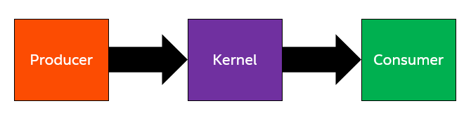
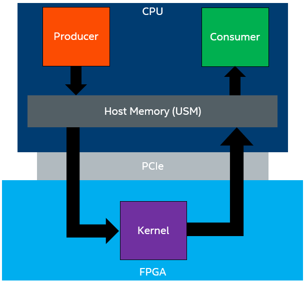
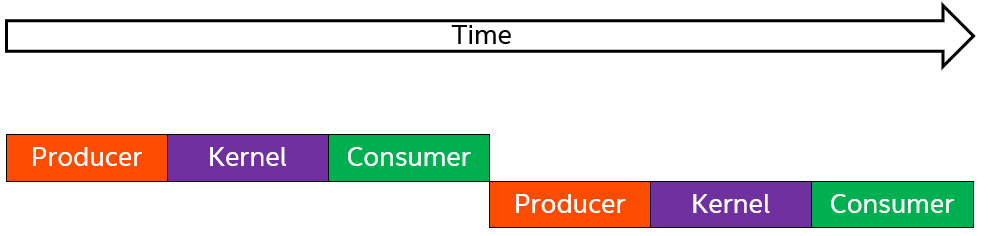
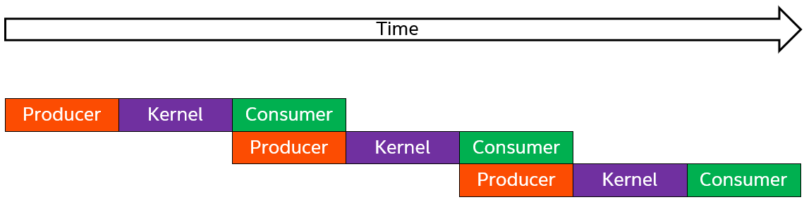
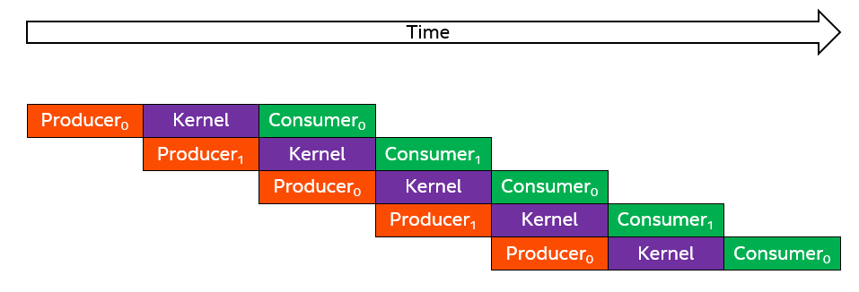
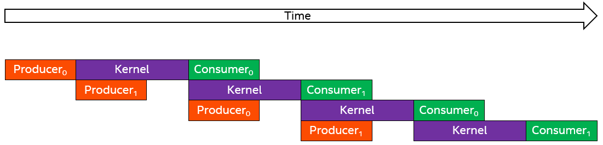
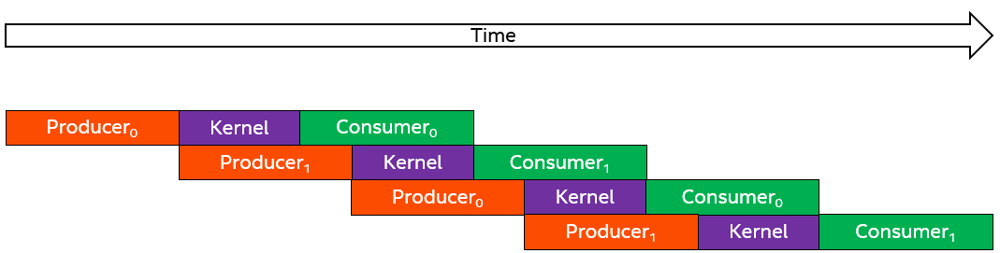

# `Buffered Host-Device Streaming` Sample

This `Buffered Host-Device Streaming` sample demonstrates how to create a high-performance full system CPU-FPGA design using SYCL* USM.

| Optimized for        | Description
|:---                  |:---
| What you will learn  | How to stream data optimally between the host and device to maximize throughput
| Time to complete     | 45 minutes
| Category             | Code Optimization

>**Note**: The concepts in this sample explaining how to implement host streaming will be supplanted by better techniques in a future release. See the [Drawbacks and Future Work](#drawbacks-and-future-work) section below for more information.

## Purpose

This tutorial demonstrates how to optimize a full system design that streams data from the host, to the device, and back to the host. This tutorial illustrates techniques to create heterogeneous designs that can achieve high throughput. The techniques described in this tutorial are not specific to a CPU-FPGA system (like the one used in this tutorial); they apply to GPUs, multi-core CPUs, and other processing units.

Before starting this tutorial, we recommend first reviewing the following FPGA samples
- **Simple Host Streaming** (simple_host_streaming)
- **Double Buffering** (double_buffering)
- **N-Way Buffering** (n_way_buffering).

The concepts explained in these tutorials will be used in this tutorial to create a highly optimized heterogeneous design. This tutorial also assumes that the reader has a basic understanding of multi-threaded C++ programming. More information on C++ multi-threading programming can be found in the *[Multi-threading](http://www.cplusplus.com/reference/multithreading/)* section of the [cplusplus.com](https://cplusplus.com/) site.

## Prerequisites

This sample is part of the FPGA code samples.
It is categorized as a Tier 3 sample that demonstrates a design pattern.


Find more information about how to navigate this part of the code samples in the [FPGA top-level README.md](/DirectProgramming/C++SYCL_FPGA/README.md).
You can also find more information about [troubleshooting build errors](/DirectProgramming/C++SYCL_FPGA/README.md#troubleshooting), [running the sample on the Intel® DevCloud](/DirectProgramming/C++SYCL_FPGA/README.md#build-and-run-the-samples-on-intel-devcloud-optional), [using Visual Studio Code with the code samples](/DirectProgramming/C++SYCL_FPGA/README.md#use-visual-studio-code-vs-code-optional), [links to selected documentation](/DirectProgramming/C++SYCL_FPGA/README.md#documentation), etc.

| Optimized for      | Description
|:---                |:---
| OS                 | Ubuntu* 18.04/20.04 <br> RHEL*/CentOS* 8 <br> SUSE* 15 <br> Windows* 10
| Hardware           | Intel® Agilex® 7, Arria® 10, and Stratix® 10 FPGAs
| Software           | Intel® oneAPI DPC++/C++ Compiler

> **Note**: Even though the Intel DPC++/C++ OneAPI compiler is enough to compile for emulation, generating reports and generating RTL, there are extra software requirements for the simulation flow and FPGA compiles.
>
> For using the simulator flow, Intel® Quartus® Prime Pro Edition and one of the following simulators must be installed and accessible through your PATH:
> - Questa*-Intel® FPGA Edition
> - Questa*-Intel® FPGA Starter Edition
> - ModelSim® SE
>
> When using the hardware compile flow, Intel® Quartus® Prime Pro Edition must be installed and accessible through your PATH.
>
> :warning: Make sure you add the device files associated with the FPGA that you are targeting to your Intel® Quartus® Prime installation.

*Notice: SYCL USM host allocations, used in this tutorial, are only supported on FPGA boards that have a USM capable BSP (e.g. the Intel® FPGA PAC D5005 with Intel Stratix® 10 SX with USM support: intel_s10sx_pac:pac_s10_usm) or when targeting an FPGA family/part number.


## Key Implementation Details

This sample demonstrates the following concepts:

- Host-device optimizations for high performance heterogeneous designs
- Double-buffering
- Runtime SYCL kernel management
- C++17 Multi-threaded programming

## Build the `Buffered Host-Device Streaming` Sample

> **Note**: When working with the command-line interface (CLI), you should configure the oneAPI toolkits using environment variables.
> Set up your CLI environment by sourcing the `setvars` script located in the root of your oneAPI installation every time you open a new terminal window.
> This practice ensures that your compiler, libraries, and tools are ready for development.
>
> Linux*:
> - For system wide installations: `. /opt/intel/oneapi/setvars.sh`
> - For private installations: ` . ~/intel/oneapi/setvars.sh`
> - For non-POSIX shells, like csh, use the following command: `bash -c 'source <install-dir>/setvars.sh ; exec csh'`
>
> Windows*:
> - `C:\Program Files(x86)\Intel\oneAPI\setvars.bat`
> - Windows PowerShell*, use the following command: `cmd.exe "/K" '"C:\Program Files (x86)\Intel\oneAPI\setvars.bat" && powershell'`
>
> For more information on configuring environment variables, see [Use the setvars Script with Linux* or macOS*](https://www.intel.com/content/www/us/en/develop/documentation/oneapi-programming-guide/top/oneapi-development-environment-setup/use-the-setvars-script-with-linux-or-macos.html) or [Use the setvars Script with Windows*](https://www.intel.com/content/www/us/en/develop/documentation/oneapi-programming-guide/top/oneapi-development-environment-setup/use-the-setvars-script-with-windows.html).

### On Linux*

1. Change to the sample directory.
2. Build the program for the Agilex® 7 device family, which is the default.

   ```
   mkdir build
   cd build
   cmake ..
   ```

   > **Note**: You can change the default target by using the command:
   >  ```
   >  cmake .. -DFPGA_DEVICE=<FPGA device family or FPGA part number>
   >  ```
   >
   > Alternatively, you can target an explicit FPGA board variant and BSP by using the following command:
   >  ```
   >  cmake .. -DFPGA_DEVICE=<board-support-package>:<board-variant> -DIS_BSP=1
   >  ```
   >
   > You will only be able to run an executable on the FPGA if you specified a BSP.

3. Compile the design. (The provided targets match the recommended development flow.)

   1. Compile for emulation (fast compile time, targets emulated FPGA device).
      ```
      make fpga_emu
      ```
   2. Compile for simulation (fast compile time, targets simulator FPGA device):
      ```
      make fpga_sim
      ```
   3. Generate HTML performance report.
      ```
      make report
      ```
      The report resides at `buffered_host_streaming_report.prj/reports/report.html`.

   4. Compile for FPGA hardware (longer compile time, targets FPGA device).
      ```
      make fpga
      ```

### On Windows*

1. Change to the sample directory.
2. Build the program for the Agilex® 7 device family, which is the default.
   ```
   mkdir build
   cd build
   cmake -G "NMake Makefiles" ..
   ```

  > **Note**: You can change the default target by using the command:
  >  ```
  >  cmake -G "NMake Makefiles" .. -DFPGA_DEVICE=<FPGA device family or FPGA part number>
  >  ```
  >
  > Alternatively, you can target an explicit FPGA board variant and BSP by using the following command:
  >  ```
  >  cmake -G "NMake Makefiles" .. -DFPGA_DEVICE=<board-support-package>:<board-variant> -DIS_BSP=1
  >  ```
  >
  > You will only be able to run an executable on the FPGA if you specified a BSP.

3. Compile the design. (The provided targets match the recommended development flow.)

   1. Compile for emulation (fast compile time, targets emulated FPGA device).
      ```
      nmake fpga_emu
      ```
   2. Compile for simulation (fast compile time, targets simulator FPGA device):
      ```
      nmake fpga_sim
      ```
   3. Generate HTML performance report.
      ```
      nmake report
      ```
      The report resides at `buffered_host_streaming_report.prj.a/reports/report.html`.

   3. Compile for FPGA hardware (longer compile time, targets FPGA device).
      ```
      nmake fpga
      ```

>**Note**: If you encounter any issues with long paths when compiling under Windows*, you may have to create your `build` directory in a shorter path, for example `C:\samples\build`. You can then build the sample in the new location, but you must specify the full path to the build files.

## Run the `Buffered Host-Device Streaming` Sample

### On Linux

1. Run the sample on the FPGA emulator (the kernel executes on the CPU):
   ```
   ./buffered_host_streaming.fpga_emu
   ```
2. Run the sample on the FPGA simulator device:
   ```
   CL_CONTEXT_MPSIM_DEVICE_INTELFPGA=1 ./buffered_host_streaming.fpga_sim
   ```
3. Run the sample on the FPGA device (only if you ran `cmake` with `-DFPGA_DEVICE=<board-support-package>:<board-variant>`):
   ```
   ./buffered_host_streaming.fpga
   ```

### On Windows

1. Run the sample on the FPGA emulator (the kernel executes on the CPU):
   ```
   buffered_host_streaming.fpga_emu.exe
   ```
2. Run the sample on the FPGA simulator device:
   ```
   set CL_CONTEXT_MPSIM_DEVICE_INTELFPGA=1
   buffered_host_streaming.fpga_sim.exe
   set CL_CONTEXT_MPSIM_DEVICE_INTELFPGA=
   ```
3. Run the sample on the FPGA device (only if you ran `cmake` with `-DFPGA_DEVICE=<board-support-package>:<board-variant>`):
   ```
   buffered_host_streaming.fpga.exe
   ```

## Example Output

### Example Output on an FPGA Emulator

> **Note**: The FPGA emulator does not accurately represent the performance (throughput or latency) of the kernels.

```
    Repetitions:      20
    Buffers:          2
    Buffer Count:     4096
    Iterations:       1
    Total Threads:    12

    Running the roofline analysis
    Producer (6 threads)
      Time:       0.5451 ms
      Throughput: 480.9159 MB/s
    Consumer (6 threads)
      Time:       0.3505 ms
      Throughput: 747.8360 MB/s
    Producer & Consumer (6 threads, each)
      Time:       1.8754 ms
      Throughput: 139.7806 MB/s
    Kernel
      Time:       0.5632 ms
      Throughput: 465.4248 MB/s

    Maximum Design Throughput: 139.7806 MB/s
    The FPGA kernel does not limit the performance of the design
    Done the roofline analysis

    Running the full design without API
    Average latency without API: 1.5041 ms
    Average processing time without API: 29.5807 ms
    Average throughput without API: 177.2398 MB/s

    Running the full design with API
    Average latency with API: 5.0432 ms
    Average processing time with API: 76.0256 ms
    Average throughput with API: 68.9620 MB/s

    PASSED
```

### Example Output on an Intel® PAC D5005 (with Intel Stratix® 10 SX)

>**Note**: In the performance results shown below the FPGA kernel is **not** the bottleneck of the full system. Instead, the **Producer**/**Consumer** running in parallel are the bottlenecks. (See the [Roofline Analysis](#roofline-analysis) section below for more information.) The full design achieves ~87% of the maximum throughput, as measured by the roofline analysis.

```
    Repetitions:      200
    Buffers:          2
    Buffer Count:     524288
    Iterations:       4
    Total Threads:    12

    Running the roofline analysis
    Producer (6 threads)
            Time:       2.1712 ms
            Throughput: 15453.9737 MB/s
    Consumer (6 threads)
            Time:       2.1064 ms
            Throughput: 15929.9736 MB/s
    Producer & Consumer (6 threads, each)
            Time:       4.2813 ms
            Throughput: 7802.4714 MB/s
    Kernel
            Time:       3.2528 ms
            Throughput: 10315.6158 MB/s

    Maximum Design Throughput: 7802.4714 MB/s
    The FPGA kernel does not limit the performance of the design
    Done the roofline analysis

    Running the full design without API
    Average latency without API: 4.8865 ms
    Average processing time without API: 979.9290 ms
    Average throughput without API: 6829.5611 MB/s

    Running the full design with API
    Average latency with API: 3.3371 ms
    Average processing time with API: 1053.3818 ms
    Average throughput with API: 6370.8013 MB/s

    PASSED
```

## `Buffered Host-Device Streaming` Guided Discussion

In this tutorial, we create a design where a **Producer** (running on the CPU) produces data into USM host allocations, a **Kernel** (running on the FPGA) processes this data and produces output into host allocations, and a **Consumer** (running on the CPU) consumes the data. Data is shared between the host and FPGA device via host pointers (pointers to USM host allocations).



In heterogeneous systems, it is important to understand how the different compute architectures are connected (for example, how data is transferred from one to the other) to better reason about and address performance bottlenecks in the system. The figure below is a slightly more detailed illustration of the processing pipeline in this tutorial, which shows the data flow between the **Producer**, **Kernel**, and **Consumer**. It illustrates that the **Producer** and **Consumer** operations both execute on the CPU and communicate with the FPGA kernel over a PCIe link (PCIe Generation 3.0 x16).



### Roofline Analysis

When designing for throughput, the system developer should first estimate the possible maximum throughput capability of the system. This back-of-the-envelop calculation is called *roofline analysis*. What is the maximum achievable throughput of the Producer-Kernel-Consumer design of the previous section?

To start, let's assume the **Producer** and **Consumer** have infinite bandwidth (for example, they can produce/consume data at an infinite rate, respectively). Then, the bottleneck in the system will be the FPGA kernel. Let's say the kernel has an f<sub>MAX</sub> of 400MHz and processes 64 bytes per cycle. The kernel's maximum steady-state throughput is 400 MHz * 64 bytes/cycle = 25.6 Gb per second ~= 26 Gb per second.

In reality, the rate of data transfer to and from the kernel depends on the bandwidth of the PCIe link. Looking at the previous figure again, we see that this depends on the bandwidth of the PCIe link. We have experimentally measured the PCIe 3.0 x16 link to have a total bandwidth of ~22 Gb per second (11 Gb per second bidirectional). This means that, while our kernel can process data at 26 Gb per second, we can only get data to it and from it at a rate of 11 Gb per second. The system bottleneck is the PCIe link between the CPU and FPGA. It is common for the bottleneck in a heterogenous system to be the inter-device link, rather than any single device.

In the analysis we just performed, we assumed that the **Producer** and **Consumer** had infinite bandwidth. We can perform a roofline analysis on the entire system now by assuming a finite bandwidth for the **Producer** and **Consumer**. For the entire **Producer**-**Kernel**-**Consumer** design, the *maximum* throughput is the *minimum* of the **Producer**, **Kernel**, and **Consumer** throughput, and the bandwidth of the link (in this case, PCIe) connecting the CPU and FPGA: "*A chain is only as strong as the weakest link*".

A roofline analysis is performed in the `DoRooflineAnalysis` function in `buffered_host_streaming.cpp`.

### Optimizing the Design

This section discusses how to optimize the design for throughput.

The naive approach to this design is for the **Producer**, **Kernel**, and **Consumer** to run sequentially. The timing diagram for this approach is shown in the figure below. This approach under-performs because operations, which could run in parallel, are run sequentially. For example, in the figure below, the **Producer** could be producing the second set of data, while the **Consumer** is consuming the first set of data.



To improve the performance, we can create a separate CPU thread (called the *Producer thread*) which produces all of the data for the **Kernel** to process, and be later consumed. As shown in the figure below, this allows the **Producer** and **Consumer** to run in parallel (for example, the **Producer** thread produces the next set of data, while the **Consumer** consumes the current data). This approach improves the design's throughput, but does require more complicated thread synchronization logic to synchronize between the **Producer** thread and the main thread that is launching kernels and consuming its output.

In the figure below, you might notice that the **Producer** and **Consumer** are running simultaneously (in separate threads). It is important to account for the fact that both of these processes are running on the CPU in parallel, which affects their individual throughput capabilities. For example, running these processes in parallel could result in saturating the memory bandwidth of the CPU and result in overall lower throughput for the **Producer** and **Consumer** processes--even if the threads run on different CPU cores. We account for this in `DoRooflineAnalysis` function by running the **Producer** and **Consumer** in isolation and in parallel.



By putting the **Producer** into its own thread, we are able to improve performance by producing and consuming data simultaneously. However, it would be ideal if the **Producer** could produce the next set of data while the kernel is processing the current data. This would allow the next kernel to launch as soon as the current kernel finishes, instead of waiting for the **Producer** to finish, like in the figure above. Unfortunately, we cannot produce data into the buffer that the kernel is currently processing, since it is still in use by the kernel.

To address this, we use multiple buffers (for example, n-way buffering) of the input and output buffers that result in a timing diagram like the figure below. The subscript number on the **Producer** and **Consumer** (for example, **Producer**<sub>0</sub> and **Consumer**<sub>0</sub>) represents the buffer index they are processing. The figure below illustrates the case where we use 2 sets of buffers (for example, double-buffering). Notice that in the figure below, the **Producer** produces into buffer 1 (**Producer**<sub>1</sub>) while the kernel is processing the data from buffer 0. Thus, by the time the kernel finishes processing buffer 0, it can start processing buffer 1 right away, so long as the **Producer** has finished producing the next buffer of data.



In the steady-state for the figure above, **the throughput of the design is bottlenecked by the throughput of the slowest stage** (the **Producer**, **Kernel**, or **Consumer**), which matches our roofline analysis from earlier! For example, the first figure below shows an example timeline where the **Kernel** is the throughput bottleneck. The second image below shows an example timeline where the **Producer** (or **Consumer**) is the bottleneck.





### Streaming API

In this tutorial, the technique described in the previous section is implemented in two ways. The design is implemented directly using SYCL USM host allocations, C++ multi-threading, and intelligent management of the SYCL kernel queue. The code achieves high performance, but it may be difficult to understand and extend to different designs. To address this, we have created a convenient and performant API wrapper (`HostStreamer.hpp`). The same design is implemented in `streaming_with_api.hpp` with similar performance and significantly less code that is much easier to understand.

#### About Performance

While the code that uses the `HostStreamer` API achieves similar performance to a direct implementation, it uses extra FPGA resources. The direct implementation has a single kernel (**Kernel**) that does all of the processing. Using the API creates a **Producer** and **Consumer** kernel that access host allocations and produce/consume data to/from the processing kernel (`APIKernel` in `streaming_with_api.hpp`). These extra kernels (that are transparent to the user) are the mechanism by which the API abstracts the production/consumption of data, but come at the cost of extra FPGA resources. However, when compiled for the Intel Stratix® 10 SX, these extra kernels result in less than a 1% increase in FPGA resource utilization. The tradeoff is often worth it considering the programming convenience using them provides.

### Drawbacks and Future Work

Fundamentally, the ability to stream data between the host and device is built around USM host allocations. The underlying problem is how to efficiently synchronize between the host and device to signal that _some_ data is ready to be processed, or has been processed. In other words, how does the host signal to the device that some data is ready to be processed? Conversely, how does the device signal to the host that some data is done being processed?

In this tutorial, we perform this synchronization by using the start of a kernel to signal to the device that the host has produced data to be processed. We use the end of a kernel to signal to the host that data has been processed by the device. However, this method has notable drawbacks.

First, the latency to start and end kernels is high (as of now, roughly 50us). To maintain performance, we must size the USM host allocations sufficiently large to hide the inter-kernel latency. This sacrifices design latency and memory usage for the multiple input and output host allocations.

Second, the programming model to achieve this performance is non-trivial. It involves double-buffering, thread synchronization to avoid race conditions, and intelligently managing the SYCL device queue to efficiently launch and wait on the finish kernels without increasing inter-kernel latency and decreasing throughput. In this tutorial, we partially addressed this drawback with an API (`HostStreamer.hpp`) that hides this logic. This API uses extra FPGA resources and extra CPU threads that are necessary to cleanly abstract the complicated double-buffering and SYCL queue management logic, but are not necessary to achieve the desired performance. You could get the same performance without the API.

We are currently working on a new API and tutorial to address these drawbacks. This API will decrease the latency to synchronize between the host and device, use less area and CPU threads than the `HostStreamer.hpp` API, and will dramatically improve the usability of the programming model to achieve the desired performance.


## License

Code samples are licensed under the MIT license. See [License.txt](https://github.com/oneapi-src/oneAPI-samples/blob/master/License.txt) for details.

Third-party program Licenses can be found here: [third-party-programs.txt](https://github.com/oneapi-src/oneAPI-samples/blob/master/third-party-programs.txt).
