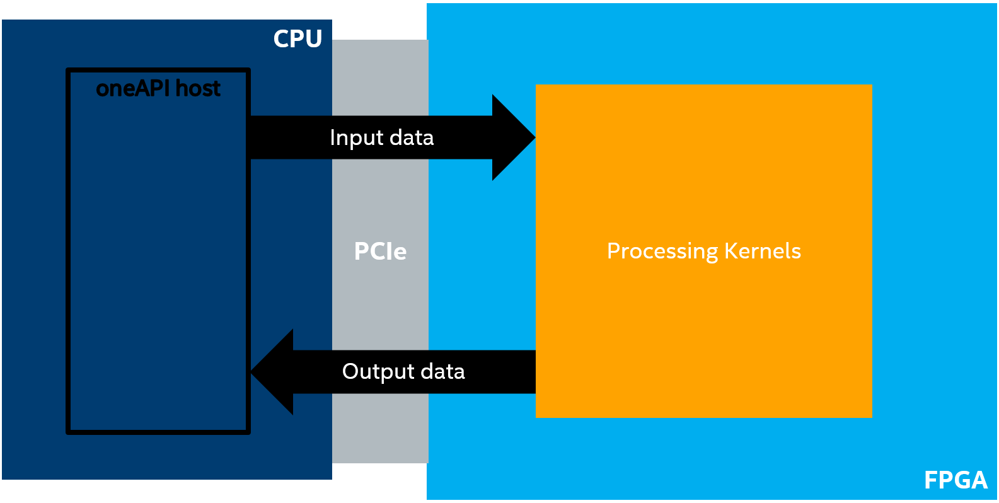
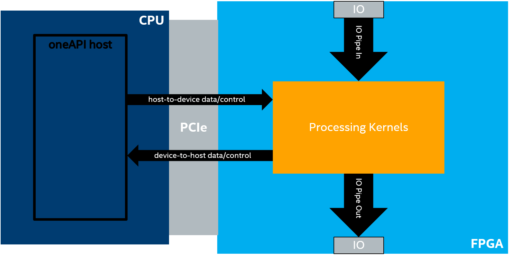
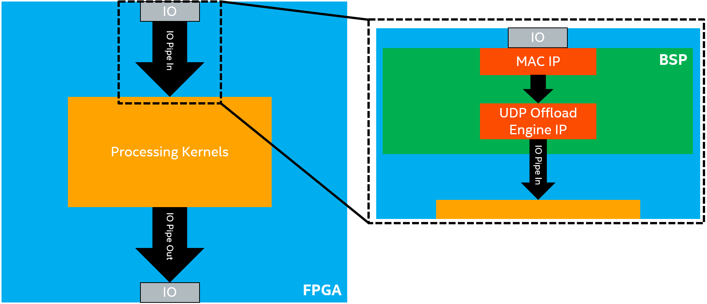
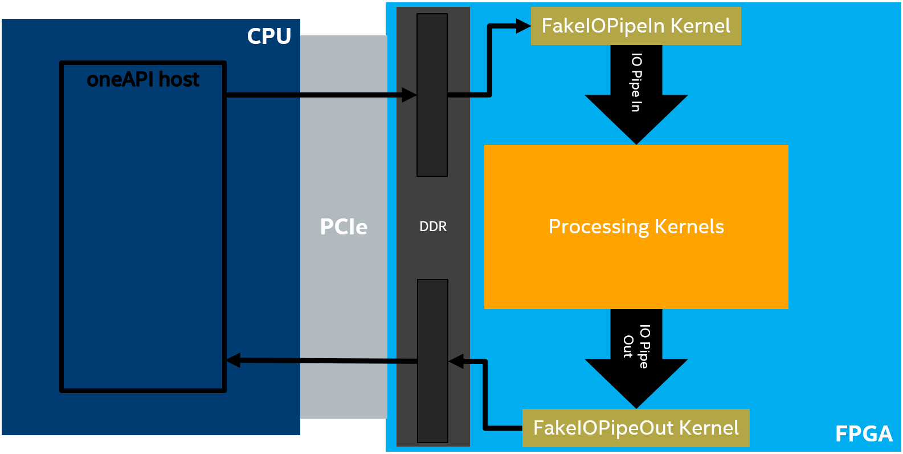
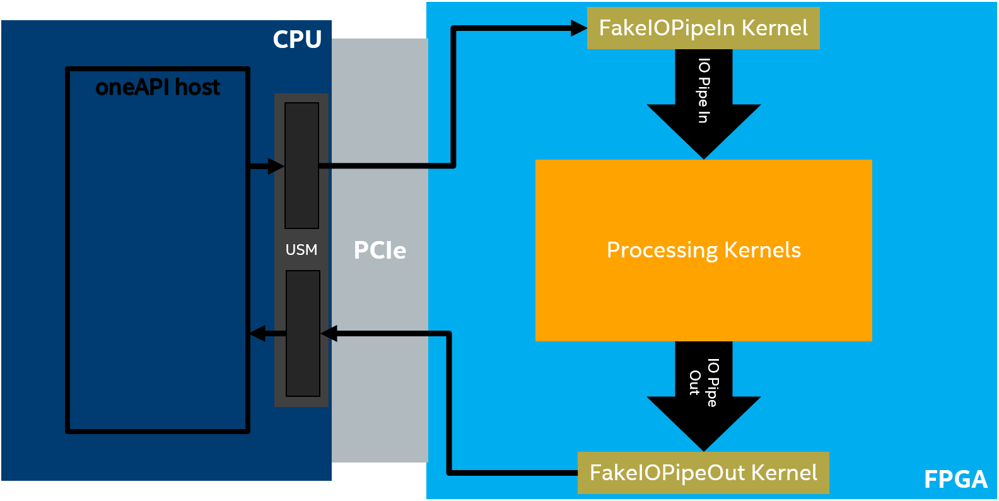
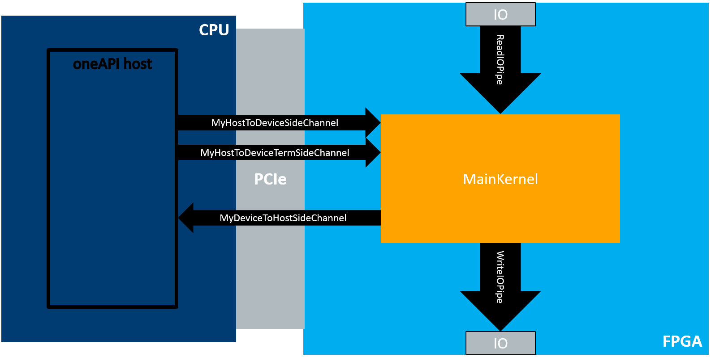

# `IO Streaming with SYCL IO Pipes` Sample

An FPGA code sample describing how to use SYCL* input/output (I/O) pipes to stream data through the FPGA I/O.

| Area                 | Description
|:---                  |:---
| What you will learn  | How to stream data through the FPGA I/O using I/O pipes
| Time to complete     | 30 minutes
| Category             | Code Optimization

## Purpose

The purpose of this code sample is to demonstrate how to do trivial I/O streaming with SYCL I/O pipes.

## Prerequisites

This sample is part of the FPGA code samples.
It is categorized as a Tier 3 sample that demonstrates a design pattern.


Find more information about how to navigate this part of the code samples in the [FPGA top-level README.md](/DirectProgramming/C++SYCL_FPGA/README.md).
You can also find more information about [troubleshooting build errors](/DirectProgramming/C++SYCL_FPGA/README.md#troubleshooting), [running the sample on the Intel® DevCloud](/DirectProgramming/C++SYCL_FPGA/README.md#build-and-run-the-samples-on-intel-devcloud-optional), [using Visual Studio Code with the code samples](/DirectProgramming/C++SYCL_FPGA/README.md#use-visual-studio-code-vs-code-optional), [links to selected documentation](/DirectProgramming/C++SYCL_FPGA/README.md#documentation), etc.

| Optimized for      | Description
|:---                |:---
| OS                 | Ubuntu* 18.04/20.04 <br> RHEL*/CentOS* 8 <br> SUSE* 15 <br> Windows* 10
| Hardware           | Intel® Agilex® 7, Arria® 10, and Stratix® 10 FPGAs
| Software           | Intel® oneAPI DPC++/C++ Compiler

> **Note**: Even though the Intel DPC++/C++ OneAPI compiler is enough to compile for emulation, generating reports and generating RTL, there are extra software requirements for the simulation flow and FPGA compiles.
>
> For using the simulator flow, Intel® Quartus® Prime Pro Edition and one of the following simulators must be installed and accessible through your PATH:
> - Questa*-Intel® FPGA Edition
> - Questa*-Intel® FPGA Starter Edition
> - ModelSim® SE
>
> When using the hardware compile flow, Intel® Quartus® Prime Pro Edition must be installed and accessible through your PATH.
>
> :warning: Make sure you add the device files associated with the FPGA that you are targeting to your Intel® Quartus® Prime installation.

## Key Implementation Details

The following sections will describe I/O streaming and I/O pipes in more detail and conclude with a description of the trivial design used to demonstrate these concepts and features.

### IO Streaming

In many of the other code samples designs, the FPGA device is treated as an accelerator, as illustrated in the figure below. The main computation (and therefore the data to be computed) resides on the host (the CPU) and we accelerate some compute intensive task using oneAPI kernels on the device. The host must move the data to the device, perform the calculation, and move the data back. Other code samples show how the FPGA can effectively offload compute intensive tasks from the CPU host.



A key feature of FPGAs is their rich input/output capabilities (for example, Ethernet). Taking advantage of these capabilities within the oneAPI programming environment requires a different programming model than the accelerator model described in the previous section. In this model, which is illustrated in the figure below, we will create a oneAPI kernel (or kernels) where some of the kernels are connected to the FPGA IO via I/O pipes and the main data flow is *through* the FPGA device, rather than from CPU to FPGA and back.

There are 4 possible directions of data flow:

- I/O-to-device
- device-to-I/O
- device-to-host
- host-to-device

The direction and amount of data flowing in the system is application dependent. In this code sample, the main source of data is I/O; data streams into the device from IO (I/O-to-device) and out of the device to IO (device-to-I/O). The host and device exchange low-bandwidth control signals using a host-to-device and device-to-host connection (or *side channel*).



### IO Pipes

IO-pipes have the same interface API as inter-kernel pipes (see the **Pipes** (pipes) code sample for more information). This abstraction is implemented in the Board Support Package (BSP) and provides a much simpler programming model for accessing the FPGA I/O.

For example, imagine that we want the oneAPI kernel to be able to receive UDP packets through the FPGA Ethernet interface. Implementing the necessary hardware to process the data coming from the Ethernet pins in oneAPI would be both extremely difficult and inefficient. Moreover, there are already many RTL solutions for doing this. So instead we implement this low-level logic with RTL in the BSP. We expose this flow of data as a much simpler I/O pipe interface to the processing kernels.

>**Note**: The *[I/O Pipes](https://www.intel.com/content/www/us/en/develop/documentation/oneapi-fpga-optimization-guide/top/flags-attr-prag-ext/kernel-controls/pipes-extension/i-o-pipes.html)* topic of the *FPGA Optimization Guide for Intel® oneAPI Toolkits Developer Guide* contains more information on I/O pipe interface.

This example is illustrated in the figure below, where the BSP connects the Ethernet I/O pins to a MAC IP, the MAC IP to a UDP offload engine IP, and finally the UDP offload engine IP to an I/O pipe. This IO pipe can then be simply connected to the processing kernels. The details of these connections are abstracted from the oneAPI kernel developer. The figure below only shows an input I/O pipe. The process is similar for an output IO pipe, but the data flows in the opposite direction.



### Faking IO Pipes

Unfortunately, designs that use these I/O pipes are confined to BSPs that support that specific I/O pipe, which makes prototyping and testing the processing kernels difficult. To address these concerns, we have created a library to _fake_ I/O pipes. With this library, you can create kernels that behave like IO pipes without having a BSP that actually supports them. This allows you to start prototyping and testing your processing kernels without a BSP that supports I/O pipes.

There are currently two options for faking I/O pipes:

- **Device memory allocations**: This option requires no special BSP support.
- **Universal Shared Memory (USM) host allocations**: This option requires USM support in the BSP.

These options are illustrated in the figures below, respectively.





You can create _fake_ input data in either device or host memory. Then, the API kernel (`FakeIOPipeIn`) will read this data and produce it into a SYCL inter-kernel pipe (`IO Pipe In`). On the other end, an API kernel (`FakeIOPipeOut`) will read from an inter-kernel pipe (`IO Pipe Out`) and write to DDR or a USM host allocation so that you can analyze the output. In this tutorial, the `cmake` file (*src/CMakeLists.txt*) detects whether USM host allocations are supported and chooses to fake the streaming of data with DDR or USM host allocations automatically.

Since I/O pipes and inter-kernel pipes have the same interface, the oneAPI kernels that implement the core algorithm are agnostic to whether they are reading from or writing to an I/O pipe or a fake I/O pipe. That is, the processing kernels will *always* stream data from `IO Pipe In` and to `IO Pipe Out`, which could be real or fake I/O pipes. It is up to the system developer (the one connecting the oneAPI host and device) to instantiate the kernels and connect them to the correct pipes, which can be done easily using C++ templates and metaprogramming, as shown in *src/LoopbackTest.hpp* and *src/SideChannelTest.hpp* in this code sample. This approach allows the oneAPI kernel developer to prototype and test their kernel system without a BSP that supports I/O pipes. Once the BSP is ready and available, swapping out the fake I/O pipes for real I/O pipes requires no changes to the processing kernels.

### Code Details

In this code sample, we demonstrate the concepts described in the previous section in a trivial way. The first test, in *src/LoopbackTest.hpp*, contains a simple loopback test that demonstrates how to use the fake IO pipes and steam data through a simple main processing kernel.

The second test, in *src/SideChannelTest.hpp* has a main processing kernel (`SideChannelMainKernel`) that constantly streams data in from the input I/O pipe and streams the data out the output I/O pipe. The main processing kernel sends an update to the host anytime it sees a value that matches a given value (`match_num`) through a device-to-host side channel (`MyDeviceToHostSideChannel`). The host can use a host-to-device side channel to update `match_num` as the kernel is processing without exiting and restarting the kernel (`MyHostToDeviceTermSideChannel`). The host also uses a host-to-device side channel to terminate the main processing kernel (`MyHostToDeviceSideChannel`). This is illustrated in the figure below.



Notice that the main kernel in the `SubmitSideChannelKernels` function in *src/SideChannelTest.cpp* is templated on the I/O pipes and side channels. This means that the kernel developer of the main processing kernel does not care whether the I/O pipes are real or fake. Using real or fake I/O pipes is determined by the system developer when creating the full system, which is done in the `RunSideChannelsSystem` function in *src/SideChannelTest.hpp* and simply requires changing some template parameters.

## Build the `IO Streaming with SYCL IO Pipes` Sample

> **Note**: When working with the command-line interface (CLI), you should configure the oneAPI toolkits using environment variables.
> Set up your CLI environment by sourcing the `setvars` script located in the root of your oneAPI installation every time you open a new terminal window.
> This practice ensures that your compiler, libraries, and tools are ready for development.
>
> Linux*:
> - For system wide installations: `. /opt/intel/oneapi/setvars.sh`
> - For private installations: ` . ~/intel/oneapi/setvars.sh`
> - For non-POSIX shells, like csh, use the following command: `bash -c 'source <install-dir>/setvars.sh ; exec csh'`
>
> Windows*:
> - `C:\Program Files(x86)\Intel\oneAPI\setvars.bat`
> - Windows PowerShell*, use the following command: `cmd.exe "/K" '"C:\Program Files (x86)\Intel\oneAPI\setvars.bat" && powershell'`
>
> For more information on configuring environment variables, see [Use the setvars Script with Linux* or macOS*](https://www.intel.com/content/www/us/en/develop/documentation/oneapi-programming-guide/top/oneapi-development-environment-setup/use-the-setvars-script-with-linux-or-macos.html) or [Use the setvars Script with Windows*](https://www.intel.com/content/www/us/en/develop/documentation/oneapi-programming-guide/top/oneapi-development-environment-setup/use-the-setvars-script-with-windows.html).

### On Linux*

1. Change to the sample directory.
2. Build the program for the Agilex® 7 device family, which is the default.

   ```
   mkdir build
   cd build
   cmake ..
   ```

   > **Note**: You can change the default target by using the command:
   >  ```
   >  cmake .. -DFPGA_DEVICE=<FPGA device family or FPGA part number>
   >  ```
   >
   > Alternatively, you can target an explicit FPGA board variant and BSP by using the following command:
   >  ```
   >  cmake .. -DFPGA_DEVICE=<board-support-package>:<board-variant> -DIS_BSP=1
   >  ```
   >
   > You will only be able to run an executable on the FPGA if you specified a BSP.

3. Compile the design. (The provided targets match the recommended development flow.)

   1. Compile for emulation (fast compile time, targets emulated FPGA device).
      ```
      make fpga_emu
      ```
   2. Compile for simulation (fast compile time, targets simulator FPGA device):
      ```
      make fpga_sim
      ```
   3. Generate HTML performance report.
      ```
      make report
      ```
      The report resides at `io_streaming_report.prj/reports/report.html`.

   4. Compile for FPGA hardware (longer compile time, targets FPGA device).
      ```
      make fpga
      ```

### On Windows*

1. Change to the sample directory.
2. Build the program for the Agilex® 7 device family, which is the default.
   ```
   mkdir build
   cd build
   cmake -G "NMake Makefiles" ..
   ```

  > **Note**: You can change the default target by using the command:
  >  ```
  >  cmake -G "NMake Makefiles" .. -DFPGA_DEVICE=<FPGA device family or FPGA part number>
  >  ```
  >
  > Alternatively, you can target an explicit FPGA board variant and BSP by using the following command:
  >  ```
  >  cmake -G "NMake Makefiles" .. -DFPGA_DEVICE=<board-support-package>:<board-variant> -DIS_BSP=1
  >  ```
  >
  > You will only be able to run an executable on the FPGA if you specified a BSP.

3. Compile the design. (The provided targets match the recommended development flow.)

   1. Compile for emulation (fast compile time, targets emulated FPGA device).
      ```
      nmake fpga_emu
      ```
   2. Compile for simulation (fast compile time, targets simulator FPGA device):
      ```
      nmake fpga_sim
      ```
   3. Generate HTML performance report.
      ```
      nmake report
      ```
      The report resides at `io_streaming_report.prj.a/reports/report.html`.

   4. Compile for FPGA hardware (longer compile time, targets FPGA device).
      ```
      nmake fpga
      ```

>**Note**: If you encounter any issues with long paths when compiling under Windows*, you may have to create your `build` directory in a shorter path, for example `C:\samples\build`. You can then build the sample in the new location, but you must specify the full path to the build files.

## Run the `IO Streaming with SYCL IO Pipes` Sample

### On Linux

1. Run the sample on the FPGA emulator (the kernel executes on the CPU).
   ```
   ./io_streaming.fpga_emu
   ```
2. Run the sample on the FPGA simulator device.
   ```
   CL_CONTEXT_MPSIM_DEVICE_INTELFPGA=1 ./io_streaming.fpga_sim
   ```
3. Run the sample on the FPGA device (only if you ran `cmake` with `-DFPGA_DEVICE=<board-support-package>:<board-variant>`).
   ```
   ./io_streaming.fpga
   ```

### On Windows

1. Run the sample on the FPGA emulator (the kernel executes on the CPU).
   ```
   io_streaming.fpga_emu.exe
   ```
2. Run the sample on the FPGA simulator device.
   ```
   set CL_CONTEXT_MPSIM_DEVICE_INTELFPGA=1
   io_streaming.fpga_sim.exe
   set CL_CONTEXT_MPSIM_DEVICE_INTELFPGA=
   ```
3. Run the sample on the FPGA device (only if you ran `cmake` with `-DFPGA_DEVICE=<board-support-package>:<board-variant>`).
   ```
   io_streaming.fpga.exe
   ```

## Example Output

```
Running loopback test
Running side channel test
Checking for values matching '715', expecting 7918 matches.
Checking for values matching '770', expecting 7945 matches
Checking for values matching '1333', expecting 8073 matches.
PASSED
```

## License

Code samples are licensed under the MIT license. See [License.txt](https://github.com/oneapi-src/oneAPI-samples/blob/master/License.txt) for details.

Third-party program Licenses can be found here: [third-party-programs.txt](https://github.com/oneapi-src/oneAPI-samples/blob/master/third-party-programs.txt).
