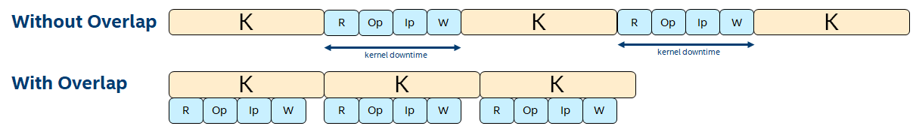

# `N-Way Buffering` Sample

The `N-Way Buffering` sample is an FPGA tutorial that demonstrates how to parallelize host-side processing and buffer transfers between host and device with kernel execution to improve overall application performance. N-Way buffering is a generalization of the double buffering optimization technique (see the *Double Buffering* FPGA tutorial). You can use this approach to perform this overlap when the host-processing time exceeds kernel execution time.

| Area                 | Description
|:--                   |:--
| What you will learn  | How and when to apply the N-way buffering optimization technique
| Time to complete     | 30 minutes
| Category             | Code Optimization

## Purpose

This system-level optimization enables kernel execution to occur in parallel with host-side processing and buffer transfers between host and device, improving application performance. N-way buffering can achieve this overlap even when the host-processing time exceeds kernel execution time.

## Prerequisites

| Optimized for      | Description
|:---                |:---
| OS                 | Ubuntu* 18.04/20.04 <br> RHEL*/CentOS* 8 <br> SUSE* 15 <br> Windows* 10
| Hardware           | Intel® Programmable Acceleration Card (PAC) with Intel Arria® 10 GX FPGA <br> FPGA Programmable Acceleration Card (PAC) D5005 (with Intel Stratix® 10 SX)
| Software           | Intel® oneAPI DPC++/C++ Compiler

> **Note**: Even though the Intel DPC++/C++ OneAPI compiler is enough to compile for emulation, generating reports and generating RTL, there are extra software requirements for the simulation flow and FPGA compiles.
>
> For using the simulator flow, one of the following simulators must be installed and accessible through your PATH:
> - Questa*-Intel® FPGA Edition
> - Questa*-Intel® FPGA Starter Edition
> - ModelSim® SE
>
> When using the hardware compile flow, Intel® Quartus® Prime Pro Edition must be installed and accessible through your PATH.

### Additional Documentation

- *[Explore SYCL* Through Intel® FPGA Code Samples](https://software.intel.com/content/www/us/en/develop/articles/explore-dpcpp-through-intel-fpga-code-samples.html)* helps you to navigate the samples and build your knowledge of FPGAs and SYCL.
- *[FPGA Optimization Guide for Intel® oneAPI Toolkits](https://software.intel.com/content/www/us/en/develop/documentation/oneapi-fpga-optimization-guide)* helps you understand how to target FPGAs using SYCL and Intel® oneAPI Toolkits.
- *[Intel® oneAPI Programming Guide](https://software.intel.com/en-us/oneapi-programming-guide)* helps you understand target-independent, SYCL-compliant programming using Intel® oneAPI Toolkits.

## Key Implementation Details

This sample covers the following key concepts:

- The N-way buffering optimization technique as a generalization of double buffering
- Determining when N-way buffering is practical and beneficial
- How to measure the impact of N-way buffering

In an application where the FPGA kernel is executed multiple-times, the host must perform the following processing and buffer transfers before each kernel invocation:

1. The output data from the *previous* invocation must be transferred from the device to the host and then processed by the host. Examples of this processing include the following:
   - Copying the data to another location.
   - Rearranging the data.
   - Verifying the data.

2. The input data for the *next* invocation must be processed by the host and then transferred to the device. Examples of this processing include:
   - Copying the data from another location.
   - Rearranging the data for kernel consumption.
   - Generating the data.

Without the technique described in this tutorial, host processing and buffer transfers occur **between** kernel executions. There is a gap in time between kernel executions, which you can refer to as kernel **downtime** (see the image below). If these operations overlap with kernel execution, the kernels can execute back-to-back with minimal downtime increasing overall application performance.

### N-Way Buffering

This technique is referred to as *N-Way Buffering*,  but is frequently called *double buffering* in the most common case where N=2. Before proceeding, it is important to define some variables:

| Variable | Description
|:--       |:--
| **R**    | Time to transfer the kernel's output buffer from device to host.
| **Op**   | Host-side processing time of kernel output data (*output processing*).
| **Ip**   | Host-side processing time for kernel input data (*input processing*).
| **W**    | Time to transfer the kernel's input buffer from host to device.
| **K**    | Kernel execution time.
| **N**    | Number of buffer sets used.
| **C**    | Number of host-side CPU cores.





In general, the **R**, **Op**, **Ip**, and **W** operations must all complete before the next kernel is launched. To maximize performance, while one kernel is executing on the device, these operations should run in parallel and operate on a separate set of buffer locations. You should complete before the current kernel completes, thus allowing the next kernel to be launched immediately with no downtime. In general, to maximize performance, the host must launch a new kernel every **K**.

If these host-side operations are executed serially, this leads to the following constraint:

```
R + Op + Ip + W <= K, to minimize kernel downtime.
```

In the above example, if the constraint is satisfied, the application requires two sets of buffers. In this case, **N**=2.

However, the above constraint may not be satisfied in some applications (i.e., if host-processing takes longer than the kernel execution time).

>**Note**: A performance improvement may still be observed because kernel downtime may still be reduced (though perhaps not maximally reduced).

Improve performance by reducing host-processing time through multi-threading. Rather than executing the above operations serially, perform the input- and output-processing operations in parallel using two threads, leading to the following constraint:

```
Max (R+Op, Ip+W) <= K
and
R + W <= K, to minimize kernel downtime.
````

If the above constraint is still unsatisfied, the technique can be extended beyond two sets of buffers to **N** sets of buffers to help improve the degree of overlap. In this case, the constraint becomes:

```
Max (R + Op, Ip + W) <= (N-1)*K
and
R + W <= K, to minimize kernel downtime.
```

The idea of N-way buffering is to prepare **N** sets of kernel input buffers, launch **N** kernels, and when the first kernel completes, begin the subsequent host-side operations. These operations may take a long time (longer than **K**), but they do not cause kernel downtime because an additional **N**-1 kernels have already been queued and can launch immediately. By the time these first **N** kernels complete, the  host-side operations previously mentioned would have also completed, and the **N**+1 kernel can be launched with no downtime. As additional kernels complete, corresponding host-side operations are launched on the host, using multiple threads in a parallel fashion. Although the host operations take longer than **K**, if **N** is chosen correctly, they will complete with a period of **K**, which is required to ensure we can launch a new kernel every **K**. To reiterate, this scheme requires multi-threaded host-operations because the host must perform processing for up to **N** kernels in parallel to keep up.

The above formula can be used to calculate the **N** required to minimize downtime. However, there are some practical limits:

- **N** sets of buffers are required on both the host and device. Therefore both must have the capacity for this many buffers.
- If the input and output processing operations are launched in separate threads, then (**N**-1)*2 cores are required so that **C** can become the limiting factor.

### Measuring the Impact of N-Way Buffering

You must get a sense of the kernel downtime to identify the degree to which this technique can help improve performance.

This can be done by querying the total kernel execution time from the runtime and comparing it to the overall application execution time. In an application where kernels execute with minimal downtime, these two numbers are close. However, if kernels have significant downtime, overall execution time notably exceeds the kernel execution time. The tutorial code demonstrates how to do this.

### Implementation Notes

The example code runs with multiple iterations to illustrate how performance improves as **N** increases and as multi-threading is used.

It is useful to think of the execution space as having **N** slots where the slots execute in chronological order, and each slot has its own set of buffers on the host and device. At the beginning of execution, the host prepares the kernel input data for the **N** slots and launches **N** kernels. When slot-0 completes, slot-1 begins executing immediately because it was already queued. The host begins both the output and input processing for slot-0. These two operations must complete before the host can queue another kernel into slot-0. The same is true for all slots.

After each kernel is launched, the host-side operations (that occur *after* the kernel in that slot completes) are launched immediately from the `main()` program. They block until the kernel execution for that slot completes (this is enforced by the runtime).

## Set Environment Variables

When working with the command-line interface (CLI), you should configure the oneAPI toolkits using environment variables. Set up your CLI environment by sourcing the `setvars` script every time you open a new terminal window. This practice ensures that your compiler, libraries, and tools are ready for development.

## Build the `N-Way Buffering` Sample

> **Note**: If you have not already done so, set up your CLI
> environment by sourcing  the `setvars` script in the root of your oneAPI installation.
>
> Linux*:
> - For system wide installations: `. /opt/intel/oneapi/setvars.sh`
> - For private installations: ` . ~/intel/oneapi/setvars.sh`
> - For non-POSIX shells, like csh, use the following command: `bash -c 'source <install-dir>/setvars.sh ; exec csh'`
>
> Windows*:
> - `C:\Program Files (x86)\Intel\oneAPI\setvars.bat`
> - Windows PowerShell*, use the following command: `cmd.exe "/K" '"C:\Program Files (x86)\Intel\oneAPI\setvars.bat" && powershell'`
>
> For more information on configuring environment variables, see *[Use the setvars Script with Linux* or macOS*](https://www.intel.com/content/www/us/en/develop/documentation/oneapi-programming-guide/top/oneapi-development-environment-setup/use-the-setvars-script-with-linux-or-macos.html)* or *[Use the setvars Script with Windows*](https://www.intel.com/content/www/us/en/develop/documentation/oneapi-programming-guide/top/oneapi-development-environment-setup/use-the-setvars-script-with-windows.html)*.


### Use Visual Studio Code* (VS Code) (Optional)

You can use Visual Studio Code* (VS Code) extensions to set your environment,
create launch configurations, and browse and download samples.

The basic steps to build and run a sample using VS Code include:
 1. Configure the oneAPI environment with the extension **Environment Configurator for Intel® oneAPI Toolkits**.
 2. Download a sample using the extension **Code Sample Browser for Intel® oneAPI Toolkits**.
 3. Open a terminal in VS Code (**Terminal > New Terminal**).
 4. Run the sample in the VS Code terminal using the instructions below.

To learn more about the extensions and how to configure the oneAPI environment, see the *[Using Visual Studio Code with Intel® oneAPI Toolkits User Guide](https://www.intel.com/content/www/us/en/develop/documentation/using-vs-code-with-intel-oneapi/top.html)*.

### On Linux*

1. Change to the sample directory.
2. Build the program for **Intel® PAC with Intel Arria® 10 GX FPGA**, which is the default.

   ```
   mkdir build
   cd build
   cmake ..
   ```
   For **Intel® FPGA PAC D5005 (with Intel Stratix® 10 SX)**, enter the following:
   ```
   cmake .. -DFPGA_DEVICE=intel_s10sx_pac:pac_s10
   ```
   For a custom FPGA platform, ensure that the board support package is installed on your system then enter a command similar to the following:

   ```
   cmake .. -DFPGA_DEVICE=<board-support-package>:<board-variant>
   ```
3. Compile the design. (The provided targets match the recommended development flow.)

   1. Compile for emulation (fast compile time, targets emulated FPGA device).
      ```
      make fpga_emu
      ```
   2. Generate HTML performance report.
      ```
      make report
      ```
      The report resides at `n_way_buffering_report.prj/reports/report.html`.

      >**Note**: Since the optimization described in this tutorial occurs at the **runtime** level, the FPGA compiler report will not show a difference between the optimized and unoptimized cases.

   3. Compile for simulation (fast compile time, targets simulated FPGA device).
      ```
      make fpga_sim
      ```
   4. Compile for FPGA hardware (longer compile time, targets FPGA device).
      ```
      make fpga
      ```

    (Optional) The hardware compiles listed above can take several hours to complete; alternatively, you can download FPGA precompiled binaries (compatible with Linux* Ubuntu* 18.04) from [https://iotdk.intel.com/fpga-precompiled-binaries/latest/n_way_buffering.fpga.tar.gz](https://iotdk.intel.com/fpga-precompiled-binaries/latest/n_way_buffering.fpga.tar.gz).


### On Windows*

>**Note**: The Intel® FPGA PAC D5005 (with Intel Stratix® 10 SX) does not yet support Windows*. Compiling to FPGA hardware on Windows* requires a third-party or custom Board Support Package (BSP) with Windows* support.

1. Change to the sample directory.
2. Build the program for **Intel® PAC with Intel Arria® 10 GX FPGA**, which is the default.
   ```
   mkdir build
   cd build
   cmake -G "NMake Makefiles" ..
   ```

   For **Intel® FPGA PAC D5005 (with Intel Stratix® 10 SX)**, enter the following:
   ```
   cmake -G "NMake Makefiles" .. -DFPGA_DEVICE=intel_s10sx_pac:pac_s10
   ```

   For a custom FPGA platform, ensure that the board support package is installed on your system then enter a command similar to the following:
   ```
   cmake -G "NMake Makefiles" .. -DFPGA_DEVICE=<board-support-package>:<board-variant>
   ```

3. Compile the design. (The provided targets match the recommended development flow.)

   1. Compile for emulation (fast compile time, targets emulated FPGA device).
      ```
      nmake fpga_emu
      ```
   2. Generate HTML performance report.
      ```
      nmake report
      ```
      The report resides at `n_way_buffering_report.prj.a/reports/report.html`.

      >**Note**: Since the optimization described in this tutorial occurs at the **runtime** level, the FPGA compiler report will not show a difference between the optimized and unoptimized cases.

   3. Compile for simulation (fast compile time, targets simulated FPGA device).
      ```
      nmake fpga_sim
      ```
   4. Compile for FPGA hardware (longer compile time, targets FPGA device).
      ```
      nmake fpga
      ```

>**Note**: If you encounter any issues with long paths when compiling under Windows*, you may have to create your `build` directory in a shorter path, for example `C:\samples\build`. You can then build the sample in the new location, but you must specify the full path to the build files.

#### Troubleshooting

If an error occurs, you can get more details by running `make` with
the `VERBOSE=1` argument:
```
make VERBOSE=1
```
If you receive an error message, troubleshoot the problem using the **Diagnostics Utility for Intel® oneAPI Toolkits**. The diagnostic utility provides configuration and system checks to help find missing dependencies, permissions errors, and other issues. See the *[Diagnostics Utility for Intel® oneAPI Toolkits User Guide](https://www.intel.com/content/www/us/en/develop/documentation/diagnostic-utility-user-guide/top.html)* for more information on using the utility.


## Run the `N-Way Buffering` Sample

### On Linux

1. Run the sample on the FPGA emulator (the kernel executes on the CPU).
   ```
   ./n_way_buffering.fpga_emu
   ```
2. Run the sample on the FPGA emulator (the kernel executes on the CPU).
   ```
   ./n_way_buffering.fpga_sim
   ```
3. Run the sample on the FPGA device.
   ```
   ./n_way_buffering.fpga
   ```

### On Windows

1. Run the sample on the FPGA emulator (the kernel executes on the CPU).
   ```
   n_way_buffering.fpga_emu.exe
   ```
2. Run the sample on the FPGA emulator (the kernel executes on the CPU).
   ```
   n_way_buffering.fpga_sim.exe
   ```
3. Run the sample on the FPGA device.
   ```
   n_way_buffering.fpga.exe
   ```

### Build and Run the Samples on Intel® DevCloud (Optional)

When running a sample in the Intel® DevCloud, you must specify the compute node (CPU, GPU, FPGA) and whether to run in batch or interactive mode.

>**Note**: Since Intel® DevCloud for oneAPI includes the appropriate development environment already configured, you do not need to set environment variables.

Use the Linux instructions to build and run the program.

You can specify an FPGA runtime node using a single line script similar to the following example.

```
qsub -I -l nodes=1:fpga_runtime:ppn=2 -d .
```

- `-I` (upper case I) requests an interactive session.
- `-l nodes=1:fpga_runtime:ppn=2` (lower case L) assigns one full node.
- `-d .` makes the current folder as the working directory for the task.

  |Available Nodes           |Command Options
  |:---                      |:---
  |FPGA Compile Time         |`qsub -I -l nodes=1:fpga_compile:ppn=2 -d .`
  |FPGA Runtime (Stratix 10) |`qsub -I -l nodes=1:fpga_runtime:stratix10:ppn=2 -d .`
  |GPU	                    |`qsub -I -l nodes=1:gpu:ppn=2 -d .`
  |CPU	                    |`qsub -I -l nodes=1:xeon:ppn=2 -d .`

>**Note**: For more information on how to specify compute nodes read, *[Launch and manage jobs](https://DevCloud.intel.com/oneapi/documentation/job-submission/)* in the Intel® DevCloud for oneAPI Documentation.

Only `fpga_compile` nodes support compiling to FPGA. When compiling for FPGA hardware, increase the job timeout to **12 hours**.

Executing programs on FPGA hardware is only supported on `fpga_runtime` nodes of the appropriate type, such as `fpga_runtime:stratix10`.

Neither compiling nor executing programs on FPGA hardware are supported on the login nodes. For more information, see the Intel® DevCloud for oneAPI *[Intel® oneAPI Base Toolkit Get Started](https://DevCloud.intel.com/oneapi/get_started/)* page.


## Example Output

### Example Output on FPGA Device

> **Note**: A test compile of this tutorial design achieved an f<sub>MAX</sub> of approximately 340 MHz on the Intel® Programmable Acceleration Card (PAC) with Intel Arria® 10 GX FPGA. The table shows the results.
>
>Configuration                     | Overall Execution Time (ms) | Total Kernel Execution time (ms)
>|:--                              |:--                          |:--
>|1-way buffering, single-threaded | 64401                       | 15187
>|1-way buffering, multi-threaded  | 53540                       | 15187
>|2-way buffering, multi-threaded  | 27281                       | 15187
>|5-way buffering, multi-threaded  | 16284                       | 15188
>
>In all runs, the total kernel execution time is similar as expected. In the first three configurations, the overall execution time exceeds the total kernel execution time, implying there is downtime between kernel executions. However, as we switch from single-threaded to multi-threaded host operations and increase the number of buffer sets used, the overall execution time approaches the kernel execution time.

```
Platform name: Intel(R) FPGA SDK for OpenCL(TM)
Device name: pac_a10 : Intel PAC Platform (pac_ec00000)


Executing kernel 100 times in each round.

*** Beginning execution, 1-way buffering, single-threaded host operations
Launching kernel #0
Launching kernel #10
Launching kernel #20
Launching kernel #30
Launching kernel #40
Launching kernel #50
Launching kernel #60
Launching kernel #70
Launching kernel #80
Launching kernel #90

Overall execution time = 65915 ms
Total kernel-only execution time = 17852 ms
Throughput = 15.907802 MB/s


*** Beginning execution, 1-way buffering, multi-threaded host operations.
Launching kernel #0
Launching kernel #10
Launching kernel #20
Launching kernel #30
Launching kernel #40
Launching kernel #50
Launching kernel #60
Launching kernel #70
Launching kernel #80
Launching kernel #90

Overall execution time = 51814 ms
Total kernel-only execution time = 17852 ms
Throughput = 20.237082 MB/s


*** Beginning execution, 2-way buffering, multi-threaded host operations
Launching kernel #0
Launching kernel #10
Launching kernel #20
Launching kernel #30
Launching kernel #40
Launching kernel #50
Launching kernel #60
Launching kernel #70
Launching kernel #80
Launching kernel #90

Overall execution time = 26109 ms
Total kernel-only execution time = 17852 ms
Throughput = 40.160442 MB/s


*** Beginning execution, N=5-way buffering, multi-threaded host operations
Launching kernel #0
Launching kernel #10
Launching kernel #20
Launching kernel #30
Launching kernel #40
Launching kernel #50
Launching kernel #60
Launching kernel #70
Launching kernel #80
Launching kernel #90

Overall execution time with N-way buffering = 18763 ms
Total kernel-only execution time with N-way buffering = 17851 ms
Throughput = 55.884682 MB/s


Verification PASSED
```

### Example Output on FPGA Emulation
```
Emulator output does not demonstrate true hardware performance. The design may need to run on actual hardware to observe the performance benefit of the optimization exemplified in this tutorial.

Platform name: Intel(R) FPGA Emulation Platform for OpenCL(TM)
Device name: Intel(R) FPGA Emulation Device


Executing kernel 20 times in each round.

*** Beginning execution, 1-way buffering, single-threaded host operations
Launching kernel #0
Launching kernel #10

Overall execution time = 67 ms
Total kernel-only execution time = 3 ms
Throughput = 4.8842378 MB/s


*** Beginning execution, 1-way buffering, multi-threaded host operations.
Launching kernel #0
Launching kernel #10

Overall execution time = 22 ms
Total kernel-only execution time = 2 ms
Throughput = 14.768334 MB/s


*** Beginning execution, 2-way buffering, multi-threaded host operationss
Launching kernel #0
Launching kernel #10

Overall execution time = 13 ms
Total kernel-only execution time = 1 ms
Throughput = 23.413044 MB/s


*** Beginning execution, N=5-way buffering, multi-threaded host operations
Launching kernel #0
Launching kernel #10

Overall execution time with N-way buffering = 32 ms
Total kernel-only execution time with N-way buffering = 1 ms
Throughput = 10.169942 MB/s


Verification PASSED
```


## License

Code samples are licensed under the MIT license. See
[License.txt](https://github.com/oneapi-src/oneAPI-samples/blob/master/License.txt) for details.

Third party program Licenses can be found here: [third-party-programs.txt](https://github.com/oneapi-src/oneAPI-samples/blob/master/third-party-programs.txt).