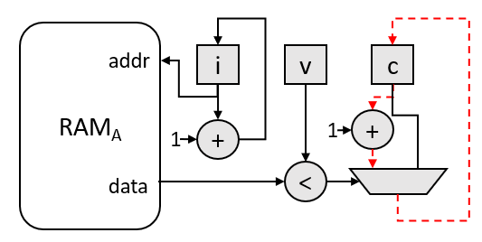
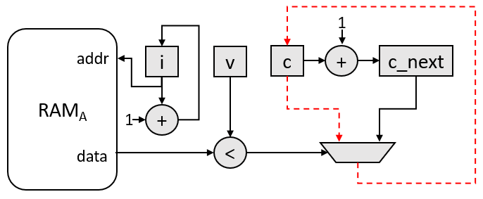

# `Shannonization` Sample

This sample demonstrates the process of *Shannonization* (named after [Claude Shannon](https://en.wikipedia.org/wiki/Claude_Shannon)) for a simple FPGA design. This optimization improves the f<sub>MAX</sub>/II of a design by precomputing operations in a loop to remove them from the critical path.

| Area                 | Description
|:--                   |:--
| What you will learn  | How to make FPGA-specific optimizations to remove computation from the critical path and improve f<sub>MAX</sub>/II
| Time to complete     | 45 minutes
| Category             | Code Optimization

## Purpose

Demonstrate a loop optimization to improve the f<sub>MAX</sub>/II of an FPGA design.

## Prerequisites

| Optimized for        | Description
|:---                  |:---
| OS                   | Ubuntu* 18.04/20.04 <br> RHEL*/CentOS* 8 <br> SUSE* 15 <br> Windows* 10
| Hardware             | Intel® Agilex® 7, Arria® 10, and Stratix® 10 FPGAs
| Software             | Intel® oneAPI DPC++/C++ Compiler

> **Note**: Even though the Intel® oneAPI DPC++/C++ Compiler is enough to compile for emulation, generating reports, generating RTL, there are extra software requirements for the simulation flow and FPGA compiles.
>
> For using the simulator flow, you must have Intel® Quartus® Prime Pro Edition and one of the following simulators installed and accessible through your PATH:
> - Questa*-Intel® FPGA Edition
> - Questa*-Intel® FPGA Starter Edition
> - ModelSim SE
>
> When using the hardware compile flow, Intel® Quartus® Prime Pro Edition must be installed and accessible through your PATH.

> **Warning** Make sure you add the device files associated with the FPGA that you are targeting to your Intel® Quartus® Prime installation.

This sample is part of the FPGA code samples. It is categorized as a Tier 3 sample that demonstrates a design pattern.


Find more information about how to navigate this part of the code samples in the [FPGA top-level README.md](/DirectProgramming/C++SYCL_FPGA/README.md).
You can also find more information about [troubleshooting build errors](/DirectProgramming/C++SYCL_FPGA/README.md#troubleshooting), [running the sample on the Intel® DevCloud](/DirectProgramming/C++SYCL_FPGA/README.md#build-and-run-the-samples-on-intel-devcloud-optional), [using Visual Studio Code with the code samples](/DirectProgramming/C++SYCL_FPGA/README.md#use-visual-studio-code-vs-code-optional), [links to selected documentation](/DirectProgramming/C++SYCL_FPGA/README.md#documentation), and more.


## Key Implementation Details

### Shannonization Explained

Shannonization is the process of removing operations from the critical path of a circuit by precomputation. To demonstrate, consider the trivial case below, which counts the number of elements in an array `A` that are less than some runtime value `v`.
```c++
int A[SIZE] = {/*...*/};
int v = /*some dynamic value*/
int c = 0;
for (int i = 0; i < SIZE; i++) {
  if (A[i] < v) {
    c++;
  }
}
```

A possible circuit diagram for this algorithm is shown in the image below, where the dotted red line represents a possible critical path in the circuit.



The goal of the shannonization optimization is to remove operations from the critical path. In this case, we can precompute the _next_ value of `c` (fittingly named `c_next`) for a later iteration of the loop to use when needed (i.e., the next time `A[i] < v`). This optimization is shown in the code below.

```c++
int A[SIZE] = {/*...*/};
int v = /*some dynamic value*/
int c = 0;
int c_next = 1;
for (int i = 0; i < SIZE; i++) {
  if (A[i] < v) {
    // these operations can happen in parallel!
    c = c_next;
    c_next++;
  }
}
```

A possible circuit diagram for this optimized algorithm is shown in the image below, where the dotted red line represents a possible critical path in the circuit. Notice that we have removed the `+` operation from the critical path. This assumes that the critical path delay through the multiplexer is higher than through the adder. This may not be the case, and the critical path could be from the `c` register to the `c_next` register through the adder, in which case we would have removed the multiplexer from the critical path. Regardless of which operation has the longer critical path delay (the adder or the multiplexer), we have removed an operation from the critical path by precomputing and storing the _next_ value of `c`. This allows us to reduce the critical path delay at the expense of area (in this case, a single 32-bit register).



### Code Sample Details

The purpose of this tutorial is to show methods for improving the f<sub>MAX</sub>/II of a design by removing computation from the critical path. This optimization is widely applicable.

To demonstrate, we will optimize a simple function (useful in database processing) that finds the size of the intersection (denoted by the `∩` symbol) between two sorted arrays. We look at a special case where one array (`A`) **cannot** have duplicates, the second array (`B`) **can** have duplicates, and the output intersection contains the entire intersection (including the duplicates). An example is shown below:

```
A = {2,5,6,7,9}
B = {2,4,6,6,8,9,10}

A ∩ B = {2,6,6,9}
|A ∩ B| = 4
```

For the FPGA, we will create three kernels: two kernels that stream array `A` and `B` from global memory through SYCL pipes and a third kernel that performs the intersection logic. The kernel diagram is shown below:
```
-----------------              ------------------------
|   ProduceA    |------------->|                      |
-----------------              |                      |
                               |     Intersection     |
-----------------              |                      |
|   ProduceB    |------------->|                      |
-----------------              ------------------------
```

The FPGA pseudocode for the `Intersection` kernel is shown below:

```c++
void intersection(int A_size, int B_size, int& intersection_size) {
  int a, b;
  int A_count, B_count;
  intersection_size = 0;

  // initialize first elements
  a = APipe::read();
  b = BPipe::read();
  A_count = 1;
  B_count = 1;

  while (A_count < A_size || B_count < B_size) {
    // values match increment counter
    if (a == b) {
      intersection_size++;
    }

    // read in new element
    if (a < b && A_count < A_size) {
      a = APipe::read();
      A_count++;
    } else if (B_count < B_size) {
      b = BPipe::read();
      B_count++;
    }
  };

  // check the last values
  if (a == b) {
    intersection_size++;
  }
}
```

To achieve an II of 1 for the main `while` loop in the FPGA code shown above, the compiler must schedule three 32-bit Compare Operations, a 32-bit Add Operation, a 32-bit Select Operation (i.e., a pipe read), and a 1-bit And Operation into a single cycle. This is necessary since the actions of the *next* iteration of the loop depend on the result of the loop's current iteration. More specifically, the current iteration must: compare the current values of `a` and `b`, compare the number of elements read from the pipes (i.e. `A_count < A_size` and `B_count < B_size`), increment `A_count` or `B_count`, and then update either `a` or `b` by reading the respective pipe before the next iteration of the loop can enter the same block of code. This creates a long critical path that requires a tradeoff in f<sub>MAX</sub> or II (i.e., either f<sub>MAX</sub> must decrease or II must increase). This tutorial will explain optimizations that remove these operations from the critical path (at the expense of some area) and improve the f<sub>MAX</sub>/II tradeoff and, therefore, the throughput.

## Build the `Shannonization` Sample

>**Note**: When working with the command-line interface (CLI), you should configure the oneAPI toolkits using environment variables. Set up your CLI environment by sourcing the `setvars` script in the root of your oneAPI installation every time you open a new terminal window. This practice ensures that your compiler, libraries, and tools are ready for development.
>
> Linux*:
> - For system wide installations: `. /opt/intel/oneapi/setvars.sh`
> - For private installations: ` . ~/intel/oneapi/setvars.sh`
> - For non-POSIX shells, like csh, use the following command: `bash -c 'source <install-dir>/setvars.sh ; exec csh'`
>
> Windows*:
> - `C:\Program Files(x86)\Intel\oneAPI\setvars.bat`
> - Windows PowerShell*, use the following command: `cmd.exe "/K" '"C:\Program Files (x86)\Intel\oneAPI\setvars.bat" && powershell'`
>
> For more information on configuring environment variables, see [Use the setvars Script with Linux* or macOS*](https://www.intel.com/content/www/us/en/develop/documentation/oneapi-programming-guide/top/oneapi-development-environment-setup/use-the-setvars-script-with-linux-or-macos.html) or [Use the setvars Script with Windows*](https://www.intel.com/content/www/us/en/develop/documentation/oneapi-programming-guide/top/oneapi-development-environment-setup/use-the-setvars-script-with-windows.html).

### On Linux*

1. Change to the sample directory.
2. Build the program for Intel® Agilex® 7 device family, which is the default.
   ```
   mkdir build
   cd build
   cmake ..
   ```
   > **Note**: You can change the default target by using the command:
   >  ```
   >  cmake .. -DFPGA_DEVICE=<FPGA device family or FPGA part number>
   >  ```
   >
   > Alternatively, you can target an explicit FPGA board variant and BSP by using the following command:
   >  ```
   >  cmake .. -DFPGA_DEVICE=<board-support-package>:<board-variant>
   >  ```
   >
   > You will only be able to run an executable on the FPGA if you specified a BSP.

3. Compile the design. (The provided targets match the recommended development flow.)

    1. Compile for emulation (fast compile time, targets emulated FPGA device):
       ```
       make fpga_emu
       ```
    2. Generate the optimization report:
       ```
       make report
       ```
      The report resides at `shannonization_report.prj/reports/report.html`. See the [*Reading the Reports*](#reading-the-reports) section below to understand the report contents.

    3. Compile for simulation (fast compile time, targets simulated FPGA device, reduced data size):
       ```
       make fpga_sim
       ```
    4. Compile for FPGA hardware (longer compile time, targets FPGA device):
       ```
       make fpga
       ```

### On Windows*

1. Change to the sample directory.
2. Build the program for the Intel® Agilex® 7 device family, which is the default.
   ```
   mkdir build
   cd build
   cmake -G "NMake Makefiles" ..
   ```
   > **Note**: You can change the default target by using the command:
   >  ```
   >  cmake -G "NMake Makefiles" .. -DFPGA_DEVICE=<FPGA device family or FPGA part number>
   >  ```
   >
   > Alternatively, you can target an explicit FPGA board variant and BSP by using the following command:
   >  ```
   >  cmake -G "NMake Makefiles" .. -DFPGA_DEVICE=<board-support-package>:<board-variant>
   >  ```
   >
   > You will only be able to run an executable on the FPGA if you specified a BSP.

3. Compile the design. (The provided targets match the recommended development flow.)

   1. Compile for emulation (fast compile time, targets emulated FPGA device):
      ```
      nmake fpga_emu
      ```
   2. Generate the optimization report:
      ```
      nmake report
      ```
      The report resides at `shannonization_report.prj.a/reports/report.html`. See the [*Reading the Reports*](#reading-the-reports) section below to understand the report contents.

   3. Compile for simulation (fast compile time, targets simulated FPGA device, reduced data size):
      ```
      nmake fpga_sim
      ```
   4. Compile for FPGA hardware (longer compile time, targets FPGA device):
      ```
      nmake fpga
      ```

> **Note**: If you encounter any issues with long paths when compiling under Windows*, you may have to create your ‘build’ directory in a shorter path, for example c:\samples\build.  You can then run cmake from that directory, and provide cmake with the full path to your sample directory.


### Reading the Reports

This section will walk through how the HTML reports show the result of the optimizations we made in each version of the kernel, the definition of which can be found in `src/IntersectionKernel.hpp`. The f<sub>MAX</sub> numbers mentioned in these sections assume that the Arria® 10 FPGA is the target. However, the discussion is similar for the other targets.

#### Version 0

The first version of the kernel, `Intersection<0>`, is the baseline implementation of the intersection kernel. Check the *Details* pane in the *Loop Analysis* tab for the `while` loop in the `Intersection<0>` kernel. You will notice that the *Block Scheduled f<sub>MAX</sub>* for the `Intersection<0>` kernel is far lower than the target (e.g., ~140 MHz). The *Details* pane shows that the most critical path contains the operations mentioned earlier at the end of the [Algorithm Details](#algorithm-details) Section.

#### Version 1

The second version of the kernel, `Intersection<1>`, uses the shannonization optimization to remove the increment of `A_count` and `B_count` from the critical path. To do this, we create two new variables, `A_count_next` and `B_count_next`, which will store the value of `A_count` and `B_count` **for the next iteration of the loop**. The code snippet below shows how `A_count` and `B_count` are updated using `A_count_next` and `B_count_next`:

```c++
  ...
  if (a < b && A_count < A_size) {
    a = APipe::read();
    A_count = A_count_next;
    A_count_next++;
  } else if (B_count < B_size) {
    b = BPipe::read();
    B_count = B_count_next;
    B_count_next++;
  }
  ...
```

Now, the assignments of `A_count = A_count_next` and `B_count = B_count_next` can be done **in parallel to the increment of the counts for the next iteration of the loop** (i.e. in parallel to `A_count_next++` and `B_count_next++`). This removes the 32-bit Integer Add Operation from the critical path, as can be seen in the *Details* pane of the *Loop Analysis* report for the `Intersection<1>` kernel. The *Loop Analysis* pane will show an increase in the *Block Scheduled f<sub>MAX</sub>* (e.g. ~190 MHz).

#### Version 2

The third version of the kernel, `Intersection<2>`, extends the previous optimization by removing the 32-bit Integer Compare Operation from the critical path. The first step is to precompute the comparisons for the next loop iteration (`A_count_inrange` and `B_count_inrange`) and the next iteration (`A_count_next_inrange` and `B_count_next_inrange`), as we did for the accumulations. This is shown in the code snippet below:

```c++
  ...
  if (a < b && A_count_inrange) {
    a = APipe::read();

    A_count = A_count_next;
    A_count_next++;

    A_count_inrange = A_count_next_inrange;
    A_count_next_inrange = A_count_next < A_size;
  } else if (B_count_inrange) {
    b = BPipe::read();

    B_count = B_count_next;
    B_count_next++;

    B_count_inrange = B_count_next_inrange;
    B_count_next_inrange = B_count_next < B_size;
  }
  ...
```

However, this places a 32-bit Integer Add Operation back into the critical path (e.g. `A_count_next++` must be computed before computing `A_count_next_inrange = A_count_next < A_size`). To remove this addition from the critical path, we do the same optimization as version 1. We now precompute the additions for the next **two** iterations of the loop (`A_count_next_next` and `B_count_next_next`), which again removes the addition from the critical path. This is shown in the code snippet below:

```c++
  ...
  if (a < b && A_count_inrange) {
    a = APipe::read();

    A_count_inrange = A_count_next_inrange;
    A_count_next_inrange = A_count_next_next < A_size;

    A_count = A_count_next;
    A_count_next = A_count_next_next;
    A_count_next_next++;
  } else if (B_count_inrange) {
    b = BPipe::read();

    B_count_inrange = B_count_next_inrange;
    B_count_next_inrange = B_count_next_next < B_size;

    B_count = B_count_next;
    B_count_next = B_count_next_next;
    B_count_next_next++;
  }
  ...
```
In general, these shannonization optimizations create a shift-register that precomputes and *passes* values (additions and comparisons) to the loop's later iterations. The size of the shift-register determines how many *future* iterations we precompute for. In version 1, we precompute for one iteration; in this version, we precompute for 2 iterations. The reports for the `Intersection<2>` should show a critical path with: a single 32-bit Integer Compare Operation (`a < b`), a 32-bit Select Operation (`::read`), and a 1-bit And Operation (`a < b && A_count_inrange`). Note the removal of two 32-bit Compare Operations and one 32-bit Add Operation from the critical path. Looking at the *Loop Analysis* pane, you will see that the *Block Scheduled f<sub>MAX</sub>* is highest for `Intersection<2>` (e.g., 240 MHz).

#### Version 3

As a consequence of the fabric architecture of the Intel® Stratix® 10 SX FPGA, the hardware implementation of pipes for the Intel® Stratix® 10 SX FPGA has a longer latency for blocking pipe reads and writes. In version 3 of the kernel, `Intersection<3>`, we transform the code to use non-blocking pipe reads. For the Intel® Arria® 10 FPGA, this does not have a noticeable difference. However, this transformation allows the design to reach an II of 1 for the Intel® Stratix® 10 and Intel Agilex® 7 FPGAs.

## Run the `Shannonization` Sample

### Configurable Parameters

The following table explains the command-line arguments that can be passed to the `Shannonization` program.

| Argument name | Description               | Default
|:---           |:---                       |:---
|`--A`          | Set the size of array A   | 128 for emulation, 16384 for FPGA
|`--B`          | Set the size of array B   | 256 for emulation, 32768 for FPGA
|`--help`       | Print the help message    | N/A

### On Linux

1. Run the sample on the FPGA emulator (the kernel executes on the CPU).
   ```
   ./shannonization.fpga_emu
   ```
2. Run the sample on the FPGA simulator device.
   ```
   CL_CONTEXT_MPSIM_DEVICE_INTELFPGA=1 ./shannonization.fpga_sim
   ```
3. Run the sample on the FPGA device (only if you ran `cmake` with `-DFPGA_DEVICE=<board-support-package>:<board-variant>`).
   ```
   ./shannonization.fpga
   ```

### On Windows

1. Run the sample on the FPGA emulator (the kernel executes on the CPU).
   ```
   shannonization.fpga_emu.exe
   ```
2. Run the sample on the FPGA simulator device.
   ```
   set CL_CONTEXT_MPSIM_DEVICE_INTELFPGA=1
   shannonization.fpga_sim.exe
   set CL_CONTEXT_MPSIM_DEVICE_INTELFPGA=
   ```
3. Run the sample on the FPGA device (only if you ran `cmake` with `-DFPGA_DEVICE=<board-support-package>:<board-variant>`).
   ```
   shannonization.fpga.exe
   ```

## Example Output

### Example Output for FPGA Emulator

```
Generating input data
Computing golden result
Running 1 iteration of kernel 0 with |A|=128 and |B|=256
Running 1 iteration of kernel 1 with |A|=128 and |B|=256
Running 1 iteration of kernel 2 with |A|=128 and |B|=256
Running 1 iteration of kernel 3 with |A|=128 and |B|=256
PASSED
```

### Example Output for FPGA Device

```
Generating input data
Computing golden result
Running 5 iterations of kernel 0 with |A|=16384 and |B|=32768
Kernel 0 average throughput: 248.460 MB/s
Running 5 iterations of kernel 1 with |A|=16384 and |B|=32768
Kernel 1 average throughput: 372.191 MB/s
Running 5 iterations of kernel 2 with |A|=16384 and |B|=32768
Kernel 2 average throughput: 372.279 MB/s
Running 5 iterations of kernel 3 with |A|=16384 and |B|=32768
Kernel 2 average throughput: 742.257 MB/s
PASSED
```

> **Note**: These throughput numbers were collected using the Intel® FPGA PAC D5005 with Intel Stratix® 10 SX.

## License

Code samples are licensed under the MIT license. See
[License.txt](https://github.com/oneapi-src/oneAPI-samples/blob/master/License.txt) for details.

Third party program Licenses can be found here: [third-party-programs.txt](https://github.com/oneapi-src/oneAPI-samples/blob/master/third-party-programs.txt).
