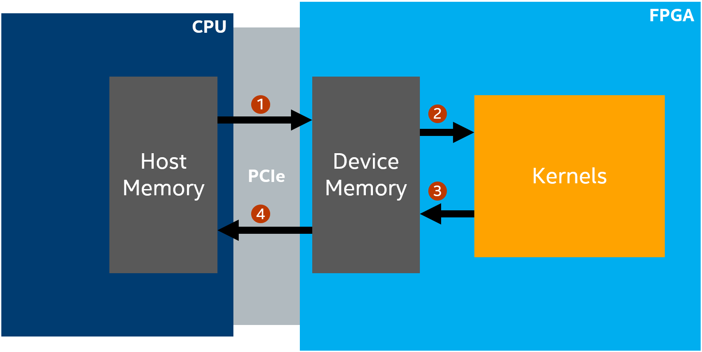
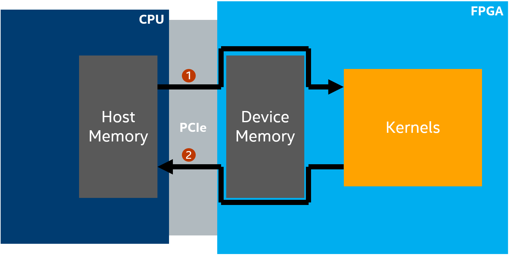

# `Zero Copy Data Transfer` Sample

This tutorial demonstrates how to use zero-copy host memory via the SYCL Unified Shared Memory (USM) to improve your FPGA design performance.

| Area                 | Description
|:--                   |:--
| What you will learn  | How to use SYCL USM host allocations for the FPGA.
| Time to complete     | 15 minutes
| Category             | Code Optimization

## Purpose

This sample illustrates some important concepts:

- How to use USM host allocations for the FPGA.
- The performance benefits of using host allocations over traditional SYCL buffers or device allocations.

This sample demonstrates how to take advantage of zero-copy host memory for the FPGA to improve the performance of your design. On FPGA, SYCL* implements all host and shared allocations as *zero-copy* data in host memory. This means that the FPGA will access the data directly over PCIe, which can improve performance in cases where there is little or no temporal reuse of data in the FPGA kernel. This tutorial includes two different kernels: one using traditional SYCL buffers (`src/buffer_kernel.hpp`) and one using USM host allocations (`src/zero_copy_kernel.hpp`) that takes advantage of zero-copy host memory. Before completing this sample, you should review the **Explicit USM** (explicit_usm) tutorial.

## Prerequisites

| Optimized for        | Description
|:---                  |:---
| OS                   | Ubuntu* 18.04/20.04 <br> RHEL*/CentOS* 8 <br> SUSE* 15 <br> Windows* 10
| Hardware             | Intel® Agilex® 7, Arria® 10, and Stratix® 10 FPGAs
| Software             | Intel® oneAPI DPC++/C++ Compiler

> **Note**: Even though the Intel® oneAPI DPC++/C++ Compiler is enough to compile for emulation, generating reports, generating RTL, there are extra software requirements for the simulation flow and FPGA compiles.
>
> For using the simulator flow, you must have Intel® Quartus® Prime Pro Edition and one of the following simulators installed and accessible through your PATH:
> - Questa*-Intel® FPGA Edition
> - Questa*-Intel® FPGA Starter Edition
> - ModelSim SE
>
> When using the hardware compile flow, Intel® Quartus® Prime Pro Edition must be installed and accessible through your PATH.

> **Warning** Make sure you add the device files associated with the FPGA that you are targeting to your Intel® Quartus® Prime installation.

>**Notice**: SYCL USM host allocations, used in this tutorial, are only supported on FPGA boards that have a USM capable BSP (for example, the Intel® FPGA PAC D5005 with Intel Stratix® 10 SX with USM support: **intel_s10sx_pac:pac_s10_usm**) or when targeting an FPGA family/part number.

This sample is part of the FPGA code samples. It is categorized as a Tier 3 sample that demonstrates a design pattern.


Find more information about how to navigate this part of the code samples in the [FPGA top-level README.md](/DirectProgramming/C++SYCL_FPGA/README.md).
You can also find more information about [troubleshooting build errors](/DirectProgramming/C++SYCL_FPGA/README.md#troubleshooting), [running the sample on the Intel® DevCloud](/DirectProgramming/C++SYCL_FPGA/README.md#build-and-run-the-samples-on-intel-devcloud-optional), [using Visual Studio Code with the code samples](/DirectProgramming/C++SYCL_FPGA/README.md#use-visual-studio-code-vs-code-optional), [links to selected documentation](/DirectProgramming/C++SYCL_FPGA/README.md#documentation), and more.

## Key Implementation Details

### USM Host Allocations

USM host allocations allow the host and device to share their respective memories. A typical SYCL design, which transfers data using either SYCL buffers/accessors or USM device allocations, copies its input data from the Host Memory to the FPGA's Device Memory. To do this, the data is sent to the FPGA board over PCIe. Once all the data is copied to the FPGA's Device Memory, the FPGA kernel is run and produces output that is also stored in Device Memory. Finally, the output data is transferred from the FPGA's Device Memory back to the CPU's Host Memory over PCIe.

This model is shown in the figure below.



Consider a kernel that simply performs computation for each entry in a buffer independently. Using SYCL buffers or explicit USM, we would bulk transfer the data from the Host Memory to the FPGA's Device Memory, run the kernel that performs the computation on each entry in the buffer, and then bulk transfer the buffer back to the host.

However, a better approach would simply stream the data from the host memory to the FPGA over PCIe, perform the computation on each piece of data, and then stream it back to host memory over PCIe. The desired structure is illustrated below. This would enable us to eliminate the overhead of copying the data to and from the Host Memory and the FPGA's Device Memory. This is done by using zero-copy host memory via the SYCL USM host allocations.

This technique is demonstrated in `src/zero_copy_kernel.hpp`.



This approach is not considered host streaming since the CPU and FPGA cannot (reliably) access the input/output data simultaneously. In other words, the host must wait until all the FPGA kernels have finished before accessing the output data. However, we did avoid copying the data to and from the FPGA's Device Memory and therefore, we get overall savings in total latency. This savings can be seen by running the sample on FPGA hardware or the example output later in the [Example Output](#example-output) section. Another FPGA tutorial, **Simple Host Streaming** (simple_host_streaming), describes how to achieve true host streaming using USM host allocations.

## Build the `Zero Copy Data Transfer` Sample

>**Note**: When working with the command-line interface (CLI), you should configure the oneAPI toolkits using environment variables. Set up your CLI environment by sourcing the `setvars` script in the root of your oneAPI installation every time you open a new terminal window. This practice ensures that your compiler, libraries, and tools are ready for development.
>
> Linux*:
> - For system wide installations: `. /opt/intel/oneapi/setvars.sh`
> - For private installations: ` . ~/intel/oneapi/setvars.sh`
> - For non-POSIX shells, like csh, use the following command: `bash -c 'source <install-dir>/setvars.sh ; exec csh'`
>
> Windows*:
> - `C:\Program Files(x86)\Intel\oneAPI\setvars.bat`
> - Windows PowerShell*, use the following command: `cmd.exe "/K" '"C:\Program Files (x86)\Intel\oneAPI\setvars.bat" && powershell'`
>
> For more information on configuring environment variables, see [Use the setvars Script with Linux* or macOS*](https://www.intel.com/content/www/us/en/develop/documentation/oneapi-programming-guide/top/oneapi-development-environment-setup/use-the-setvars-script-with-linux-or-macos.html) or [Use the setvars Script with Windows*](https://www.intel.com/content/www/us/en/develop/documentation/oneapi-programming-guide/top/oneapi-development-environment-setup/use-the-setvars-script-with-windows.html).

### On Linux*

1. Change to the sample directory.
2. Build the program for Intel® Agilex® 7 device family, which is the default.
   ```
   mkdir build
   cd build
   cmake ..
   ```
   > **Note**: You can change the default target by using the command:
   >  ```
   >  cmake .. -DFPGA_DEVICE=<FPGA device family or FPGA part number>
   >  ```
   >
   > Alternatively, you can target an explicit FPGA board variant and BSP by using the following command:
   >  ```
   >  cmake .. -DFPGA_DEVICE=<board-support-package>:<board-variant>
   >  ```
   >
   > You will only be able to run an executable on the FPGA if you specified a BSP.

3. Compile the design. (The provided targets match the recommended development flow.)

    1. Compile for emulation (fast compile time, targets emulated FPGA device):
       ```
       make fpga_emu
       ```
    2. Generate the optimization report:
       ```
       make report
       ```
       The report resides at `zero_copy_data_transfer_report.prj/reports/report.html`.

    3. Compile for simulation (fast compile time, targets simulated FPGA device, reduced data size):
       ```
       make fpga_sim
       ```
    4. Compile for FPGA hardware (longer compile time, targets FPGA device):
       ```
       make fpga
       ```

### On Windows*

1. Change to the sample directory.
2. Build the program for the Intel® Agilex® 7 device family, which is the default.
   ```
   mkdir build
   cd build
   cmake -G "NMake Makefiles" ..
   ```
   > **Note**: You can change the default target by using the command:
   >  ```
   >  cmake -G "NMake Makefiles" .. -DFPGA_DEVICE=<FPGA device family or FPGA part number>
   >  ```
   >
   > Alternatively, you can target an explicit FPGA board variant and BSP by using the following command:
   >  ```
   >  cmake -G "NMake Makefiles" .. -DFPGA_DEVICE=<board-support-package>:<board-variant>
   >  ```
   >
   > You will only be able to run an executable on the FPGA if you specified a BSP.

3. Compile the design. (The provided targets match the recommended development flow.)

   1. Compile for emulation (fast compile time, targets emulated FPGA device):
      ```
      nmake fpga_emu
      ```
   2. Generate the optimization report:
      ```
      nmake report
      ```
      The report resides at `zero_copy_data_transfer_report.prj.a/reports/report.html`.

   3. Compile for simulation (fast compile time, targets simulated FPGA device, reduced data size):
      ```
      nmake fpga_sim
      ```
   4. Compile for FPGA hardware (longer compile time, targets FPGA device):
      ```
      nmake fpga
      ```

> **Note**: If you encounter any issues with long paths when compiling under Windows*, you may have to create your ‘build’ directory in a shorter path, for example c:\samples\build.  You can then run cmake from that directory, and provide cmake with the full path to your sample directory.

## Run the `Zero Copy Data Transfer` Sample

### On Linux

1. Run the sample on the FPGA emulator (the kernel executes on the CPU).
   ```
   ./zero_copy_data_transfer.fpga_emu
   ```
2. Run the sample on the FPGA simulator (the kernel executes on the CPU).
   ```
   CL_CONTEXT_MPSIM_DEVICE_INTELFPGA=1 ./zero_copy_data_transfer.fpga_sim
   ```
3. Run the sample on the FPGA device (only if you ran `cmake` with `-DFPGA_DEVICE=<board-support-package>:<board-variant>`).
   ```
   ./zero_copy_data_transfer.fpga
   ```

### On Windows

1. Run the sample on the FPGA emulator (the kernel executes on the CPU).
   ```
   zero_copy_data_transfer.fpga_emu.exe
   ```
2. Run the sample on the FPGA simulator (the kernel executes on the CPU).
   ```
   set CL_CONTEXT_MPSIM_DEVICE_INTELFPGA=1
   zero_copy_data_transfer.fpga_sim.exe
   set CL_CONTEXT_MPSIM_DEVICE_INTELFPGA=
   ```
3. Run the sample on the FPGA device (only if you ran `cmake` with `-DFPGA_DEVICE=<board-support-package>:<board-variant>`).
   ```
   zero_copy_data_transfer.fpga.exe
   ```

## Example Output

### Example Output for the FPGA Emulator

```
Running the buffer kernel version with size=10000
Running the zero-copy kernel version with size=10000
PASSED
```

### Example Output for an FPGA Device

```
Running the buffer kernel with size=100000000
Running the zero-copy kernel version with size=100000000
Average latency for the buffer kernel: 479.713 ms
Average latency for the zero-copy kernel: 310.734 ms
PASSED
```

## License

Code samples are licensed under the MIT license. See
[License.txt](https://github.com/oneapi-src/oneAPI-samples/blob/master/License.txt) for details.

Third party program Licenses can be found here: [third-party-programs.txt](https://github.com/oneapi-src/oneAPI-samples/blob/master/third-party-programs.txt).
