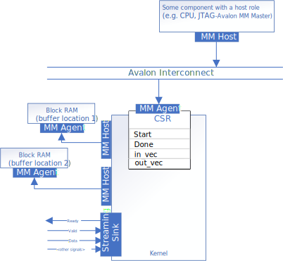
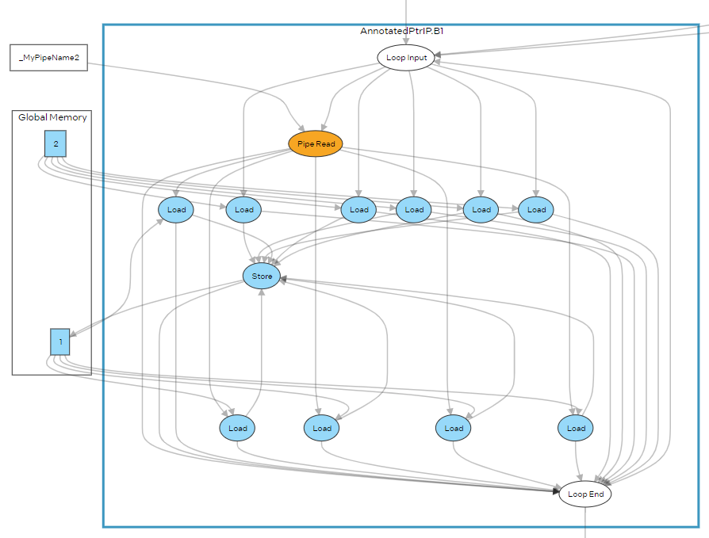
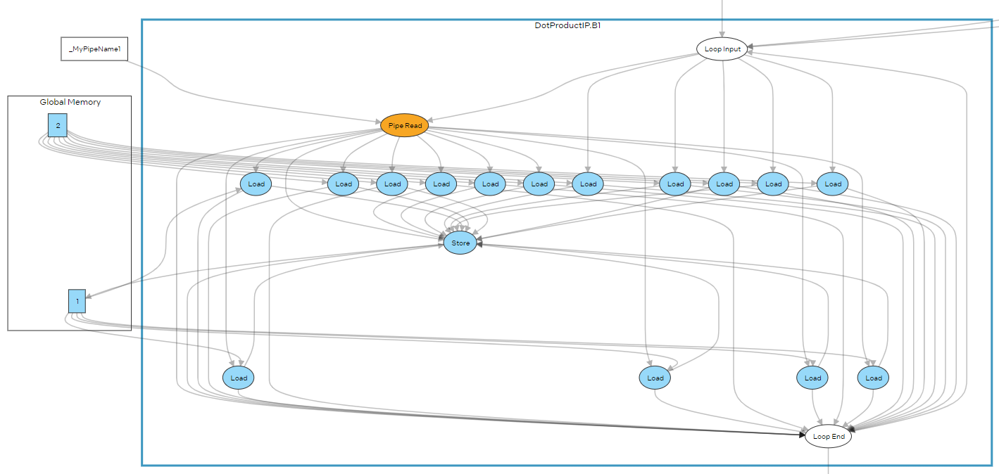

# `annotated_ptr` Sample

This tutorial demonstrates how to use the `annotated_ptr` class to constrain memory accesses in your kernel code. This can help you build more efficient FPGA IP components with the Intel® oneAPI DPC++/C++ Compiler.

| Optimized for                     | Description
|:---                               |:---
| OS                                | Ubuntu* 20.04 <br> RHEL*/CentOS* 8 <br> SUSE* 15 <br> Windows* 10 <br> Windows Server* 2019
| Hardware                          | Intel® Agilex® 7, Agilex® 5, Arria® 10, Stratix® 10, and Cyclone® V FPGAs
| Software                          | Intel® oneAPI DPC++/C++ Compiler
| What you will learn               | Best practices for creating and managing a oneAPI FPGA project
| Time to complete                  | 15 minutes

> **Note**: Even though the Intel DPC++/C++ oneAPI compiler is enough to compile for emulation, generating reports and generating RTL, there are extra software requirements for the simulation flow and FPGA compiles.
>
> To use the simulator flow, Intel® Quartus® Prime Pro Edition (or Standard Edition when targeting Cyclone® V) and one of the following simulators must be installed and accessible through your PATH:
> - Questa*-Intel® FPGA Edition
> - Questa*-Intel® FPGA Starter Edition
> - ModelSim® SE
>
> When using the hardware compile flow, Intel® Quartus® Prime Pro Edition (or Standard Edition when targeting Cyclone® V) must be installed and accessible through your PATH.
>
> :warning: Make sure you add the device files associated with the FPGA that you are targeting to your Intel® Quartus® Prime installation.

## Prerequisites

This sample is part of the FPGA code samples.
It is categorized as a Tier 3 sample that demonstrates an advanced code optimization.


Find more information about how to navigate this part of the code samples in the [FPGA top-level README.md](/DirectProgramming/C++SYCL_FPGA/README.md).
You can also find more information about [troubleshooting build errors](/DirectProgramming/C++SYCL_FPGA/README.md#troubleshooting), [running the sample on the Intel® DevCloud](/DirectProgramming/C++SYCL_FPGA/README.md#build-and-run-the-samples-on-intel-devcloud-optional), [using Visual Studio Code with the code samples](/DirectProgramming/C++SYCL_FPGA/README.md#use-visual-studio-code-vs-code-optional), [links to selected documentation](/DirectProgramming/C++SYCL_FPGA/README.md#documentation), etc.

## Purpose

The [hls_flow_interfaces/mmhost](/DirectProgramming/C++SYCL_FPGA/Tutorials/Features/hls_flow_interfaces/mmhost) code sample demonstrates how to use the `annotated_arg` wrapper class to customize an Avalon memory-mapped interface for an FPGA IP component.

A useful design optimization in FPGA SYCL code is to design with multiple buffer locations, (either multiple memory channels in a full SYCL system, or multiple memory-mapped host interfaces in a SYCL HLS IP). If your code contains un-annotated pointers (e.g. `float *`), the compiler will not know at compile time which buffer location to assign to load/store units (LSUs) associated with that pointer. This tutorial shows how to use the `annotated_ptr` class to constrain memory accesses to a pointer variable inside the kernel, which reduces the number of LSUs used in the generated FPGA IP component.

### An FPGA Component That Contains Memory Access to an Ambiguous Buffer Location
In the example, the device code defines a SYCL kernel functor that computes the dot product between a weight matrix (located in buffer location 1) and a vector (located in buffer location 2), and saves to the result vector (located in buffer location 1).



The input and output vectors are kernel arguments passed by the host and annotated with `annotated_arg`:
```c++
struct DotProductIP {
  annotated_arg<float *, decltype(properties{buffer_location<kBL2>})> in_vec;
  annotated_arg<float *, decltype(properties{buffer_location<kBL1>})> out_vec;
  ...
};
```

The address to each row of the weight matrix is transferred into the kernel via a host pipe. The kernel reads the row pointers of the weight matrix and then performs the dot product operation.
```c++
using Pipe2DotProductIP = ext::intel::experimental::pipe<class MyPipeName1, float *>;
...
float *p = MyPipe::read();

float sum = 0.0f;
#pragma unroll COLS
for (int j = 0; j < COLS; j++)
   sum += p[j] * in_vec[j];
out_vec[i] = sum;
```

The global memory access of the kernel is distributed as follows
- `p[j]`: buffer location is ambiguous because `p` is simply a `float *` without any annotations telling the compiler which buffer location it should be assigned to. So the compiler will generate load units connected to buffer location 1 **and** load units connected to buffer location 2. This is illustrated in the FPGA report, see [Read the Reports](#read-the-reports) below for more details.
- `in_vec[j]`: The compiler knows this accesses buffer location 2 because `in_vec` is an annotated kernel argument.
- `out_vec[j]`: The compiler knows this accesses buffer location 1 because `out_vec` is an annotated kernel argument.

### Use the `annotated_ptr` Class to Constrain the Memory Access
You can provide the buffer location information of `p` to the compiler by wrapping it in an `annotated_ptr`, and then use the `annotated_ptr` local variable in the dot-product computation
```c++
annotated_ptr<float, decltype(properties{buffer_location<1>})> mat{p};

float sum = 0.0f;
#pragma unroll COLS
for (int j = 0; j < COLS; j++)
   sum += mat[j] * in_vec[j];
out_vec[i] = sum;
```

Now all the global memory accesses are assigned to a specific buffer location, including `p`, which is located in buffer location 1. This removes half of the load units connected to buffer location 2, saving significant FPGA resources.

> [!WARNING]
> The buffer location that is passed to `annotated_ptr` must be one of the buffer locations already assigned to global memory kernel arguments (in this case, buffer location `kBL1` and `kBL2`).

> [!WARNING]
> The `annotated_ptr` class does not currently support the `alignment` property. Therefore, the consecutive memory accesses via the pointer `mat` in the unrolled loop cannot be configured to generate a statically coalesced load unit.

## Building the `annotated_ptr` Tutorial
> **Note**: When working with the command-line interface (CLI), you should configure the oneAPI toolkits using environment variables.
> Set up your CLI environment by sourcing the `setvars` script located in the root of your oneAPI installation every time you open a new terminal window.
> This practice ensures that your compiler, libraries, and tools are ready for development.
>
> Linux*:
> - For system wide installations: `. /opt/intel/oneapi/setvars.sh`
> - For private installations: ` . ~/intel/oneapi/setvars.sh`
> - For non-POSIX shells, like csh, use the following command: `bash -c 'source <install-dir>/setvars.sh ; exec csh'`
>
> Windows*:
> - `C:\Program Files(x86)\Intel\oneAPI\setvars.bat`
> - Windows PowerShell*, use the following command: `cmd.exe "/K" '"C:\Program Files (x86)\Intel\oneAPI\setvars.bat" && powershell'`
>
> For more information on configuring environment variables, see [Use the setvars Script with Linux* or macOS*](https://www.intel.com/content/www/us/en/develop/documentation/oneapi-programming-guide/top/oneapi-development-environment-setup/use-the-setvars-script-with-linux-or-macos.html) or [Use the setvars Script with Windows*](https://www.intel.com/content/www/us/en/develop/documentation/oneapi-programming-guide/top/oneapi-development-environment-setup/use-the-setvars-script-with-windows.html).

Use these commands to run the design, depending on your OS.

### On a Linux* System
This design uses CMake to generate a build script for GNU/make.

1. Change to the sample directory.

2. Configure the build system for the Agilex® 7 device family, which is the default.

   ```
   mkdir build
   cd build
   cmake ..
   ```

3. Compile the design with the generated `Makefile`. The following build targets are provided, matching the recommended development flow:

	| Compilation Type    | Command
	|:---                 |:---
	| FPGA Emulator       | `make fpga_emu`
	| Optimization Report | `make report`
	| FPGA Simulator      | `make fpga_sim`
	| FPGA Hardware       | `make fpga`

### On a Windows* System
This design uses CMake to generate a build script for  `nmake`.

1. Change to the sample directory.

2. Configure the build system for the Agilex® 7 device family, which is the default.

   ```
   mkdir build
   cd build
   cmake -G "NMake Makefiles" ..
   ```
   
3. Compile the design with the generated `Makefile`. The following build targets are provided, matching the recommended development flow:

	| Compilation Type    | Command (Windows)
	|:---                 |:---
	| FPGA Emulator       | `nmake fpga_emu`
	| Optimization Report | `nmake report`
	| FPGA Simulator      | `nmake fpga_sim`
	| FPGA Hardware       | `nmake fpga`


### Read the Reports

Build the `report` target and locate `report.html` in the `annotated_ptr.report.prj/reports/` directory.

Navigate to *System Viewer* (*Views* > *System Viewer*) and click on the *AnnotatedPtrIP* kernel in the *System* hierarchy. Observe that the compiler generates a number of `COLS` LD nodes connected to global memory 1, which correspond to `COLS` times of read access over annotated_ptr `mat` in the inner loop of the computation.



By clicking on the *DotProductIP* kernel, you can verify that using the unannotated pointer `p` in the inner loop of dot product will result in an additional number of `COLS` LD nodes generated and connected to global memory 2, and thereby an increase in the *Area Estimates* tab.



## Run the `annotated_ptr` Executable

### On Linux
1. Run the sample on the FPGA emulator (the kernel executes on the CPU).
   ```
   ./annotated_ptr.fpga_emu
   ```
2. Run the sample on the FPGA simulator device.
   ```
   CL_CONTEXT_MPSIM_DEVICE_INTELFPGA=1 ./annotated_ptr.fpga_sim
   ```
### On Windows
1. Run the sample on the FPGA emulator (the kernel executes on the CPU).
   ```
   annotated_ptr.fpga_emu.exe
   ```
2. Run the sample on the FPGA simulator device.
   ```
   set CL_CONTEXT_MPSIM_DEVICE_INTELFPGA=1
   annotated_ptr.fpga_sim.exe
   set CL_CONTEXT_MPSIM_DEVICE_INTELFPGA=
   ```

## Example Output

```
Running on device: Intel(R) FPGA Emulation Device
PASSED: The results are correct
```
## License
Code samples are licensed under the MIT license. See
[License.txt](/License.txt) for details.

Third party program Licenses can be found here: [third-party-programs.txt](/third-party-programs.txt).
