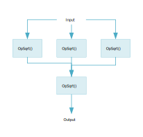
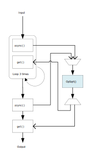
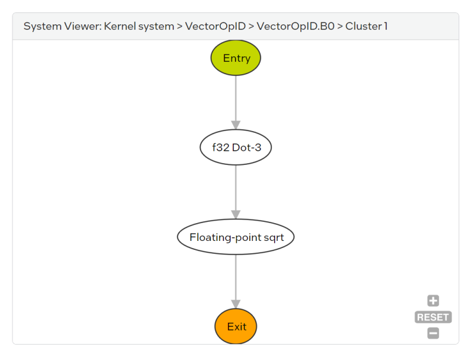
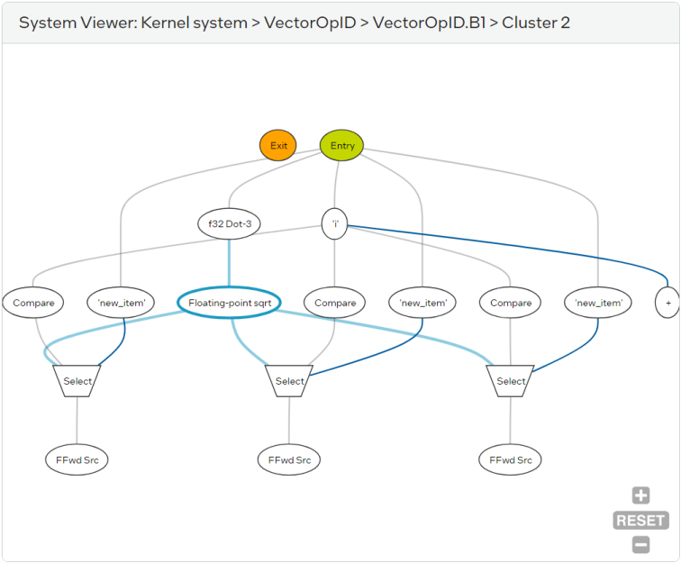

# `Hardware Reuse` Sample

This sample is a tutorial that demonstrates how to reuse hardware in your FPGA designs by using loops and task sequences.

| Area                 | Description
|:--                   |:--
| What you will learn  | How to code your FPGA SYCL program to reuse hardware that has same functionality
| Time to complete     | 30 minutes
| Category             | Concepts and Functionality

## Purpose

In normal operation, the oneAPI FPGA compiler automatically in-lines repeated function calls, creating multiple instances of hardware that can run in parallel. This in-lining strategy is necessary to achieve high throughput, but in cases where you want to minimize area utilization, you may wish to sacrifice throughput and allow certain functions to be reused. This sample demonstrates two strategies to reuse hardware in your designs:

1. Calling a function in a loop will causes it to only be instantiated once
2. Launching a task sequence with a function callback lets you reuse a function in cases where it is not practical to reuse it in a loop.

## Prerequisites

| Optimized for        | Description
|:---                  |:---
| OS                   | Ubuntu* 20.04 <br> RHEL*/CentOS* 8 <br> SUSE* 15 <br> Windows* 10 <br> Windows Server* 2019
| Hardware             | Intel® Agilex® 7, Arria® 10, and Stratix® 10 FPGAs
| Software             | Intel® oneAPI DPC++/C++ Compiler

> **Note**: Even though the Intel® oneAPI DPC++/C++ compiler is enough to compile for emulation, generating reports and generating RTL, there are extra software requirements for the simulation flow and FPGA compiles.
>
> To use the simulator flow, Intel® Quartus® Prime Pro Edition (or Standard Edition when targeting Cyclone® V) and one of the following simulators must be installed and accessible through your PATH environment variable setting:
> - Questa*-Intel® FPGA Edition
> - Questa*-Intel® FPGA Starter Edition
> - ModelSim® SE
>
> When using the hardware compile flow, Intel® Quartus® Prime Pro Edition (or Standard Edition when targeting Cyclone® V) must be installed and accessible through your PATH.
>
> **Warning** Make sure you add the device files associated with the FPGA that you are targeting to your Intel® Quartus® Prime installation.

This sample is part of the FPGA code samples.
It is categorized as a Tier 2 sample that demonstrates a compiler feature.


Find more information about how to navigate this part of the code samples in the [FPGA top-level README.md](/DirectProgramming/C++SYCL_FPGA/README.md).
You can also find more information about [troubleshooting build errors](/DirectProgramming/C++SYCL_FPGA/README.md#troubleshooting), [running the sample on the Intel® DevCloud](/DirectProgramming/C++SYCL_FPGA/README.md#build-and-run-the-samples-on-intel-devcloud-optional), [using Visual Studio Code with the code samples](/DirectProgramming/C++SYCL_FPGA/README.md#use-visual-studio-code-vs-code-optional), [links to selected documentation](/DirectProgramming/C++SYCL_FPGA/README.md#documentation), etc.

## Key Implementation Details

This sample illustrates some key concepts:
- Simple hardware reuse by invoking the task function in a 'for' loop.
- More flexible hardware reuse by invoking the function task using a task sequence wrapper object.

### No resource sharing
This tutorial demonstrates a design that computes the 'square root of a dot product' multiple times. This operation is contained within a function named `OpSqrt()`. Without resource sharing, multiple identical compute blocks for `OpSqrt()` are generated on the FPGA. 

```c++
D3Vector new_item, item;

item = InputPipeA::read();
new_item[0] = OpSqrt(item, coef1);
item = InputPipeA::read();
new_item[1] = OpSqrt(item, coef1);
item = InputPipeA::read();
new_item[2] = OpSqrt(item, coef1);

OutputPipeZ::write(OpSqrt(new_item, coef2));
```



By sharing the compute block using a loop or task sequence, we can tell the compiler to reuse the compute block, and avoid replicating the compute block hardware on the FPGA. The important trade-off made by resource sharing is that multiple invocations of the same compute block will block each other, so the II of the loop in which the shared compute block is called will increase.

### Resource sharing with a loop
Instead of invoking the `OpSqrt()` function one by one, you may reuse the function by calling it in a loop. In the `loop` directory, the device code calls the `OpSqrt()` function in a loop.

```c++
struct VectorOp{
  int len;

  void operator()() const{
    constexpr D3Vector coef1 = {0.2, 0.3, 0.4};
    constexpr D3Vector coef2 = {0.6, 0.7, 0.8};

    D3Vector new_item;

    // Calling OpSqrt() in a loop will reuse it
    for (int i = 0; i < 3; i++){
      D3Vector item = InputPipeA::read();
      new_item[i] = OpSqrt(item, coef1);
    }

    // Another square root block 
    // will be generated for this function call
    OutputPipeZ::write(OpSqrt(new_item, coef2));
  }
};
```


Looping is a simple, but effective way to share a resource, but it is not always convenient to put _all_ instances of a function call into the same loop. consider the fourth call to `OpSqrt()`, which depends on the outputs of the first three calls. We could write the complex multiplexer logic to select whether the `OpSqrt()` function should be processing the outputs from the reads from `InputPipeA` or combining the outputs of the first three calls, but this code would be hard to read and debug. A better solution is to use task sequences to let the compiler generate this logic for us.

### Resource sharing with a task sequence object
To use a task sequence in your design, include the `<sycl/ext/intel/experimental/3_task_sequence.hpp>` header file in your source code. The `task_sequence` class is a templated class with 3 parameters:

| Template Parameter | Type     | Default Value | Description
|--------------------|----------|---------------|---
| Task function      | callable | N/A           | A callable object `f` that defines the asynchronous task to be associated with the `task_sequence`. The callable object `f` must meet the following requirements: <br> • The object `f` must be statically resolvable at compile time, which means it is not a function pointer. <br> • The object `f` must not be an overloaded function. <br> • The return type (`ReturnT`) and argument types (`ArgsT…`) of object f must be resolvable and fixed.
| Invocation Capacity* | `uint32_t` | 1 | The size of the hardware queue instantiated for `async()` function calls.
| Response Capacity* | `uint32_t` | 1 | The size of the hardware queue instantiated to hold task function results.

> *Invocation capacity and response capacity are optional 
The following example shows how to use task sequences to

Each task sequence class object represents a specific instantiation of FPGA hardware to perform the operation defined by the 'Task function' parameter.
Launching tasks via repeated `async()` function calls on the same object tells the compiler to reuse that object's hardware. Thus, you can control the reuse or replication of FPGA hardware by the number of `task_sequence` objects you declare. Since object lifetime is confined to the scope in which the `task_sequence` object is created, carefully declare your object in the scope in which you intend to reuse it.

In the `3_task_sequence` directory, the device code declares the task sequence object once, and invokes it inside the loop, and at the return point.

```c++
struct VectorOp{
  int len;

  void operator()() const{
    constexpr D3Vector coef1 = {0.2, 0.3, 0.4};
    constexpr D3Vector coef2 = {0.6, 0.7, 0.8};

    D3Vector new_item;

    // Object declarations of a parameterized task_sequence 
    // class must be local, which means global declarations
    // and dynamic allocations are not allowed.
    // Declare the task sequence object outside the for loop 
    // so that the hardware can be shared at the return point.
    sycl::ext::intel::experimental::task_sequence<OpSqrt> task_a;

    for (int i = 0; i < len; i++){
      D3Vector item = InputPipeA::read();
      task_a.async(item, coef1);
      new_item[i] = task_a.get();
    }

    task_a.async(new_item, coef2);
    OutputPipeZ::write(task_a.get());
  }
};
```



## Sample Structure
The 3 different example designs in this sample perform similar operations. You may compare the C++ source files to see the code changes that are necessary to apply hardware reuse.

1. [Naive](1_naive/src/main.cpp) The component directly implements square root of dot product four times and each of them generates the hardware for its own use. 
2. [Looping](2_loop/src/main.cpp) Square root of dot product with same level of of data path are group together, and invoked in the 'for' loop. The hardware are shared by each invocation in the loop. Another square root of dot product, which is involed at the return point, generates its own hardware.
3. [Task sequence](3_task_sequence/src/main.cpp) Square root of dot product is invoked with a same task sequence object, both in the loop and at the return point. The hardware of it is shared by each invocation of the task.

## Build the `hardware_reuse` Tutorial
> **Note**: When working with the command-line interface (CLI), you should configure the oneAPI toolkits using environment variables.
> Set up your CLI environment by sourcing the `setvars` script located in the root of your oneAPI installation every time you open a new terminal window.
> This practice ensures that your compiler, libraries, and tools are ready for development.
>
> Linux*:
> - For system wide installations: `. /opt/intel/oneapi/setvars.sh`
> - For private installations: ` . ~/intel/oneapi/setvars.sh`
> - For non-POSIX shells, like csh, use the following command: `bash -c 'source <install-dir>/setvars.sh ; exec csh'`
>
> Windows*:
> - `C:\"Program Files (x86)"\Intel\oneAPI\setvars.bat`
> - Windows PowerShell*, use the following command: `cmd.exe "/K" '"C:\Program Files (x86)\Intel\oneAPI\setvars.bat" && powershell'`
>
> For more information on configuring environment variables, see [Use the setvars Script with Linux* or macOS*](https://www.intel.com/content/www/us/en/docs/oneapi/programming-guide/current/use-the-setvars-and-oneapi-vars-scripts-with-linux.html or [Use the setvars Script with Windows*](https://www.intel.com/content/www/us/en/docs/oneapi/programming-guide/current/use-the-setvars-and-oneapi-vars-scripts-with-linux.html).

Use these commands to run the design, depending on your OS.

### On Linux* Systems

1. Change to the sample directory.

2. Configure the build system for the Agilex® 7 device family, which is the default.

   ```
   mkdir build
   cd build
   cmake .. -DTYPE=<NAIVE/LOOP/TASK_SEQUENCE>
   ```
   >Use the appropriate `TYPE` parameter when running CMake to choose which design to compile:
   >| Example                                      | Directory             | Type (-DTYPE=) |
   >|----------------------------------------------|-----------------------|----------------|
   >| Naive                                        | naive/                | `NAIVE`        |
   >| Loop                                         | loop/                 | `LOOP`         |
   >| Task sequence                                | task-sequence/        | `TASK_SEQUENCE`|
   
   > **Note**: You can override the default target by using the command:
   >  ```
   >  cmake .. -DFPGA_DEVICE=<FPGA device family or FPGA part number> -DTYPE=<NAIVE/LOOP/TASK_SEQUENCE>
   >  ```

3. Compile the design. (The provided targets match the recommended development flow.)

   1. Compile for emulation (fast compile time, targets emulates an FPGA device).
      ```
      make fpga_emu
      ```
   2. Generate the HTML optimization reports.
      ```
      make report
      ```
   3. Compile for simulation (fast compile time, targets simulator FPGA device).
      ```
      make fpga_sim
      ```
   4. Compile with Quartus place and route (To get accurate area estimate, longer compile time).
      ```
      make fpga
      ```

### On Windows* Systems

1. Change to the sample directory.
2. Configure the build system for the Intel® Agilex® 7 device family, which is the default.
   ```
   mkdir build
   cd build
   cmake -G "NMake Makefiles" .. -DTYPE=<NAIVE/LOOP/TASK_SEQUENCE>
   ```
   >Use the appropriate `TYPE` parameter when running CMake to choose which design to compile:
   >| Example                                      | Directory             | Type (-DTYPE=) |
   >|----------------------------------------------|-----------------------|----------------|
   >| Naive                                        | naive/                | `NAIVE`        |
   >| Loop                                         | loop/                 | `LOOP`         |
   >| Task sequence                                | task-sequence/        | `TASK_SEQUENCE`|
   
   > **Note**: You can override the default target by using the command:
   >  ```
   >  cmake -G "NMake Makefiles" .. -DFPGA_DEVICE=<FPGA device family or FPGA part number> -DTYPE=<NAIVE/LOOP/TASK_SEQUENCE>
   >  ```

3. Compile the design. (The provided targets match the recommended development flow.)

   1. Compile for emulation (fast compile time, targets emulated FPGA device).
      ```
      nmake fpga_emu
      ```
   2. Generate the optimization report. 
      ```
      nmake report
      ```
   3. Compile for simulation (fast compile time, targets simulator FPGA device).
      ```
      nmake fpga_sim
      ```
   4. Compile with Quartus place and route (To get accurate area estimate, longer compile time).
      ```
      nmake fpga
      ```

> **Note**: If you encounter any issues with long paths when compiling under Windows*, you may have to create your ‘build’ directory in a shorter path, for example `C:\samples\build`.  You can then run cmake from that directory, and provide cmake with the full path to your sample directory.

### Read the Reports
Locate `report.html` in the `naive.report.prj/reports/`, `naive_loop.report.prj/reports/` and `task_sequences.report.prj/reports/` directory.

Navigate to **System Resource Utilization Summary** (Summary > System Resource Utilization Summary) and compare the estimated area numbers in these report. You may found that area usage has been estimated to decrease as we moved towards task sequence implementation.

#### Naive
The four instances of `OpSqrt()` are split across two clusters in the report. Locate `report.html` in the `naive.report.prj/reports/` directory and navigate to *System Viewer: Kernel system > IDVectorOp > IDVectorOp.B0 > Cluster 1* and *Cluster 2* to see FOUR `Floating-point sqrt` illustrated, representing FOUR replicate of hardware to be generated to complete the design.
| In-lines repeated function calls create multiple instances of hardware |                                       |
|:-----------------------------------------------------------------------|:--------------------------------------|
|                                 ||

#### Loop
Locate `report.html` in the `naive_loop.report.prj/reports/` directory.
Navigate to *System Viewer: Kernel system > IDVectorOp > IDVectorOp.B1 > Cluster 1* to see each loop invoke the same ONE `Floating-point sqrt`. 
Navigate to *System Viewer: Kernel system > IDVectorOp > IDVectorOp.B2 > Cluster 2* to find another `Floating-point sqrt`.
There are a total TWO replicates of the `OpSqrt()` hardware used in this design.
| `Floating-point sqrt` reused by each loop iteration | Another `Floating-point sqrt` at return point |
|:----------------------------------------------------|:----------------------------------------------|
|               |         |

#### Task sequence
Locate `report.html` in the `task_sequences.report.prj/reports/` directory.
Navigate through the list in **System Viewer**, only ONE block of `Floating-point sqrt` can be found under *
System Viewer: Kernel system > 3ull>) > 3ull>).B1 > Cluster 3*
| Repeated call on a single task sequence object reused the same hardware instance |
|:---------------------------------------------------------------------------------|


## Run the Design

### On Linux
1. Run the sample on the FPGA emulator (the kernel executes on the CPU).
   ```
   ./hw_reuse_naive.fpga_emu
   ./hw_reuse_loop.fpga_emu
   ./hw_reuse_tseq.fpga_emu
   ```
2. Run the sample on the FPGA simulator device.
   ```
   CL_CONTEXT_MPSIM_DEVICE_INTELFPGA=1 ./hw_reuse_naive.fpga_sim
   CL_CONTEXT_MPSIM_DEVICE_INTELFPGA=1 ./hw_reuse_loop.fpga_sim
   CL_CONTEXT_MPSIM_DEVICE_INTELFPGA=1 ./hw_reuse_tseq.fpga_sim 
   ```

### On Windows
1. Run the sample on the FPGA emulator (the kernel executes on the CPU).
   ```
   hw_reuse_naive.fpga_emu.exe
   hw_reuse_loop.fpga_emu.exe
   hw_reuse_tseq.fpga_emu.exe 
   ```
2. Run the sample on the FPGA simulator device.
   ```
   set CL_CONTEXT_MPSIM_DEVICE_INTELFPGA=1
   hw_reuse_naive.fpga_sim.exe
   hw_reuse_loop.fpga_sim.exe
   hw_reuse_tseq.fpga_sim.exe
   set CL_CONTEXT_MPSIM_DEVICE_INTELFPGA=
   ```

## Example Output

### Naive
```
Running on device: Intel(R) FPGA Emulation Device
Processing vectors of size 3
PASSED
```
### Loop
```
Running on device: Intel(R) FPGA Emulation Device
Processing vectors of size 3
PASSED
```

### Task Sequence
```
Running on device: Intel(R) FPGA Emulation Device
Processing vectors of size 3
PASSED
```

## License
Code samples are licensed under the MIT license. See
[License.txt](/License.txt) for details.

Third party program Licenses can be found here: [third-party-programs.txt](/third-party-programs.txt).
