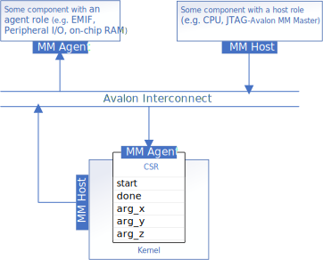

# Memory-Mapped Interfaces (mmhost)
This tutorial demonstrates how to configure Avalon memory-mapped host data interfaces for IP components produced with the Intel® oneAPI DPC++/C++ Compiler.

| Optimized for                     | Description
---                                 |---
| OS                                | Linux* Ubuntu* 18.04/20.04, RHEL*/CentOS* 8, SUSE* 15; Windows* 10
| Hardware                          | Intel® FPGAs
| Software                          | Intel® oneAPI DPC++/C++ Compiler
| What you will learn               | How to customize Avalon memory-mapped host interfaces in your FPGA IP components
| Time to complete                  | 45 minutes

> **Note**: Even though the Intel DPC++/C++ OneAPI compiler is enough to compile for emulation, generating reports and generating RTL, there are extra software requirements for the simulation flow and FPGA compiles.
>
> For using the simulator flow, Intel® Quartus® Prime Pro Edition and one of the following simulators must be installed and accessible through your PATH:
> - Questa*-Intel® FPGA Edition
> - Questa*-Intel® FPGA Starter Edition
> - ModelSim® SE
>
> When using the hardware compile flow, Intel® Quartus® Prime Pro Edition must be installed and accessible through your PATH.

> **Note**: Make sure you add the device files associated with the FPGA that you are targeting to your Intel® Quartus® Prime installation.

> **Note**: This tutorial will not work for a Full System compile. 

## Prerequisites

This sample is part of the FPGA code samples.
It is categorized as a Tier 2 sample that demonstrates a compiler feature.


Find more information about how to navigate this part of the code samples in the [FPGA top-level README.md](/DirectProgramming/C++SYCL_FPGA/README.md).
You can also find more information about [troubleshooting build errors](/DirectProgramming/C++SYCL_FPGA/README.md#troubleshooting), [running the sample on the Intel® DevCloud](/DirectProgramming/C++SYCL_FPGA/README.md#build-and-run-the-samples-on-intel-devcloud-optional), [using Visual Studio Code with the code samples](/DirectProgramming/C++SYCL_FPGA/README.md#use-visual-studio-code-vs-code-optional), [links to selected documentation](/DirectProgramming/C++SYCL_FPGA/README.md#documentation), etc.


## Purpose
When you design an IP component for an FPGA system, that system will often dictate the interface requirements of your IP component. This tutorial shows how to use `annotated_ptr` to configure Avalon memory-mapped host data interfaces. An Avalon memory-mapped host interface allows your IP component to send read or write requests to one or more Avalon memory-mapped agent interfaces. To learn more about Avalon memory-mapped host interfaces and Avalon memory-mapped agent interfaces, please refer to the appropriate section of the [Avalon Interface Specifications](https://www.intel.com/content/www/us/en/docs/programmable/683091/current/memory-mapped-interfaces.html). 


The compiler will infer Avalon memory-mapped host interfaces for your design when your kernel includes one or more pointer arguments. As with scalar kernel arguments, pointer arguments can be passed to your kernel via a `conduit` interface or your component's control/status register (CSR). By default, pointer arguments will be passed to your IP component through the CSR. For more details on kernel arguments, please see `<Temporary: https://github.com/intel-sandbox/wenkaixu.ip-auth-demos/tree/2024_0/mm-host>`. By default, the Intel® oneAPI DPC++/C++ Compiler will produce a kernel with a single Avalon memory-mapped host interface that will be shared amongst those pointers. 

#### Example 1: A kernel with multiple pointer arguments
```c++
struct PointerIP{

  //Declare the pointer interfaces to be used in this kernel,
  //look at the other kernals to compare the difference 
  int *x; 
  int *y; 
  int *z;
  int size;

  void operator()() const {
    for (int i = 0; i < size; ++i) {
      z[i] = x[i] + y[i];
    }
  }
};
```


### Using `annotated_ptr` to configure Avalon memory-mapped host interfaces

You can override the default behaviour of a pointer argument by declaring an `annotated_ptr` kernel argument instead.

#### Example 2: A kernel with a single customized Avalon memory-mapped host interface
```c++
struct SingleMMIP {
  annotated_ptr<int, decltype(properties{
    register_map,
    buffer_location<kBL1>,
    awidth<32>, 
    dwidth<32>, 
    latency<0>, 
    read_write_mode<read>,
    maxburst<4>
  })> my_pointer; 
  void operator()() const {
    ...
    // Kernel code
    my_pointer[x] = y;
    ...
  }
}
```

The following table describes mutually exclusive properties you can use to customize the interface. Only one may be specified at a time. 

| Parameter                 | Description
|---                        |---
| `register_map`            | Pass the pointer for this memory-mapped host interface through the IP component's control/status register
| `conduit`                 | Pass the pointer for this memory-mapped host interface through a conduit interface 


You can use the following parameters to configure your IP component's Avalon memory-mapped host interfaces:

| Parameter                | Default Value | Description
|---                       |---            |---
|  `buffer_location<id>`   | N/A           | The address space of the interface that associates with the host. Each unique buffer location will result in a unique Avalon memory-mapped host interface. When `buffer_location` is not specified, then corresponding LSUs will connect to all of the IP's Avalon memory-mapped host interfaces.
| `awidth<width>`          | 41            | Width of the Avalon memory-mapped host address bus in bits. 
| `dwidth<width>`          | 64            | Width of the Avalon memory-mapped host data bus in bits. 
| `latency<value>`         | 0             | Read/Write latency for downstream fixed-latency Avalon memory-mapped agent. For a variable-latency Avalon memory-mapped agent, set `latency<0>`. 
| `read_write_mode<mode>`  | `read_write`  | Port direction of the interface. (`read_write`, `read` or `write`) 
| `maxburst<value>`        | 1             | Maximum number of data transfers that can associate with a read or write request. 
| `alignment<alignment>`   | 1          | Alignment of the Avalon memory-mapped host interface
| `stable`                 | N/A | User guarantee that the pointer will not change between pipelined invocations of the kernel. The compiler uses this to furthur optimize the kernel.

We can use some of these parameters to improve the performance of `Example 1`. Re-structure the design so that each pointer had exclusive access to a dedicated Avalon memory-mapped agent memory, like this:


#### Example 3: A kernel with dedicated Avalon memory-mapped host interfaces
```c++
constexpr int kBL1 = 1;
constexpr int kBL2 = 2;
constexpr int kBL3 = 3;

struct MultiMMIP {

  //Declare the pointer interfaces to be used in this kernel,
  //look at the other kernals to compare the difference 
  annotated_ptr<int, decltype(properties{
    buffer_location<kBL1>,
    awidth<32>, 
    dwidth<32>, 
    latency<0>, 
    read_write_mode_read,
    maxburst<4>
  })> x;

  annotated_ptr<int, decltype(properties{
    buffer_location<kBL2>,
    awidth<32>, 
    dwidth<32>, 
    latency<0>, 
    read_write_mode_read,
    maxburst<4>
  })> y;

  annotated_ptr<int, decltype(properties{
    buffer_location<kBL3>,
    awidth<32>, 
    dwidth<32>, 
    latency<0>, 
    read_write_mode_write,
    maxburst<4>
  })> z;

  int size;

  void operator()() const {

    #pragma unroll 4
    for(int i = 0; i < size; i++){
      z[i] = x[i] + y[i];
    }
  }
};
```

### Interfacing with off-chip memory

Most of the time, a component's interfaces will be subject to system constraints. Assume that the input and output vectors are too large for on-chip memory. Instead, assume a memory system with the following constraints:

* Two banks of DDR
* Data bus of 256 bits
* bursts of up to 8 requests


We can make better use of the available DDR bandwidth by coalescing the 32-bit wide load-store units into wider 256-bit load-store units to match the memory interface.

#### Example 4: A kernel that interfaces with two off-chip memories
```c++
constexpr int kBL1 = 1;
constexpr int kBL2 = 2;

struct DDR_IP{

  using params = decltype(properties{
          buffer_location<kBL1>,
          maxburst<8>,
          dwidth<256>,
          alignment<32>
          });

  //Declare the pointer interfaces to be used in this kernel,
  //look at the other kernals to compare the difference 
  annotated_ptr<int, params> x;
  annotated_ptr<int, params> y;
  annotated_ptr<int, decltype(properties{
          buffer_location<kBL2>,
          maxburst<8>,
          dwidth<256>,
          alignment<32>
          })> z;   
  int size;

  void operator()() const {
    #pragma unroll 4
    for (int i = 0; i < size; ++i) {
      z[i] = x[i] + y[i];
    }
  }
};
```

## Building the `mmhost` Tutorial
> **Note**: When working with the command-line interface (CLI), you should configure the oneAPI toolkits using environment variables.
> Set up your CLI environment by sourcing the `setvars` script located in the root of your oneAPI installation every time you open a new terminal window.
> This practice ensures that your compiler, libraries, and tools are ready for development.
>
> Linux*:
> - For system wide installations: `. /opt/intel/oneapi/setvars.sh`
> - For private installations: ` . ~/intel/oneapi/setvars.sh`
> - For non-POSIX shells, like csh, use the following command: `bash -c 'source <install-dir>/setvars.sh ; exec csh'`
>
> Windows*:
> - `C:\Program Files(x86)\Intel\oneAPI\setvars.bat`
> - Windows PowerShell*, use the following command: `cmd.exe "/K" '"C:\Program Files (x86)\Intel\oneAPI\setvars.bat" && powershell'`
>
> For more information on configuring environment variables, see [Use the setvars Script with Linux* or macOS*](https://www.intel.com/content/www/us/en/develop/documentation/oneapi-programming-guide/top/oneapi-development-environment-setup/use-the-setvars-script-with-linux-or-macos.html) or [Use the setvars Script with Windows*](https://www.intel.com/content/www/us/en/develop/documentation/oneapi-programming-guide/top/oneapi-development-environment-setup/use-the-setvars-script-with-windows.html).

Use these commands to run the design, depending on your OS.

### On a Linux* System
This design uses CMake to generate a build script for GNU/make.

1. Change to the sample directory.

2. For different parts of this tutorial, navigate to the appropriate sub-folder.
   ```
   cd <partX_XXX>
   ```
   where `<partX_XXX>` is:
   - `part1_pointers`
   - `part2_hosts`
   - `part3_ddr_hosts`

3. Configure the build system for the Agilex® 7 device family, which is the default.

   ```
   mkdir build
   cd build
   cmake ..
   ```

   > **Note**: You can change the default target by using the command:
   >  ```
   >  cmake .. -DFPGA_DEVICE=<FPGA device family or FPGA part number>
   >  ```

4. Compile the design using `make`.
   | Compilation Type    | Command
   |:---                 |:---
   | FPGA Emulator       | `make fpga_emu`
   | Optimization Report | `make report`
   | FPGA Simulator      | `make fpga_sim`
   | FPGA Hardware       | `make fpga`

### On a Windows* System
This design uses CMake to generate a build script for  `nmake`.

1. Change to the sample directory.
2. For different parts of this tutorial, navigate to the appropriate sub-folder.
   ```
   cd <partX_XXX>
   ```
   where `<partX_XXX>` is:
   - `part1_pointers`
   - `part2_hosts`
   - `part3_ddr_hosts`

3. Configure the build system for the Agilex® 7 device family, which is the default.
   ```
   mkdir build
   cd build
   cmake -G "NMake Makefiles" ..
   ```
   > **Note**: You can change the default target by using the command:
   >  ```
   >  cmake -G "NMake Makefiles" .. -DFPGA_DEVICE=<FPGA device family or FPGA part number>
   >  ```
3. Compile the design using `nmake`.
   | Compilation Type    | Command (Windows)
   |:---                 |:---
   | FPGA Emulator       | `nmake fpga_emu`
   | Optimization Report | `nmake report`
   | FPGA Simulator      | `nmake fpga_sim`
   | FPGA Hardware       | `nmake fpga`
   > **Note**: If you encounter any issues with long paths when compiling under Windows*, you may have to create your ‘build’ directory in a shorter path, for example c:\samples\build.  You can then run cmake from that directory, and provide cmake with the full path to your sample directory.

## Examining the Reports
Locate `report.html` in the `<source_file>.prj/reports/` directory. Open the report in Chrome*, Firefox*, Edge*, or Internet Explorer*.

Navigate to the Area Analysis section of the optimization report. The Kernel System section displays the area consumption of each kernel. Notice that the `MultiMMIP` kernel consumes way less area under all categories than the `PointerIP` kernel. This is due to stall free memory accesses and the removal of arbiration logic, both of which come from separating the accesses into their own interfaces.

Navigate to the Loop Throughput section under Throughput Analysis, and you will see that the `MultiMMIP` kernel has a lower latency than the `PointerIP` kernel, and there are less blcoks being scheduled. This is because the kernel has access to all 3 memories in parallel without contention.

Observe how the 32-bit LSUs are coalesced for you, after unrolling the for-loop.


## Running the Sample

### On Linux

1. Run the sample on the FPGA emulator (the kernel executes on the CPU):
   ```
   ./mmhost.fpga_emu
   ```

2. Run the sample on the FPGA simulator device (the kernel executes in a simulator):
   ```
   CL_CONTEXT_MPSIM_DEVICE_INTELFPGA=1 ./mmhost.fpga_sim
   ```

### On Windows

1. Run the sample on the FPGA emulator (the kernel executes on the CPU):
   ```
   mmhost.fpga_emu.exe
   ```

2. Run the sample on the FPGA simulator device (the kernel executes in a simulator):
   ```
   set CL_CONTEXT_MPSIM_DEVICE_INTELFPGA=1
   mmhost.fpga_sim.exe
   set CL_CONTEXT_MPSIM_DEVICE_INTELFPGA=
   ```

### Example of Output

```
Running on device: Intel(R) FPGA Emulation Device
Elements in vector : 8
PASSED
```

## License

Code samples are licensed under the MIT license. See
[License.txt](https://github.com/oneapi-src/oneAPI-samples/blob/master/License.txt) for details.

Third party program Licenses can be found here: [third-party-programs.txt](https://github.com/oneapi-src/oneAPI-samples/blob/master/third-party-programs.txt).