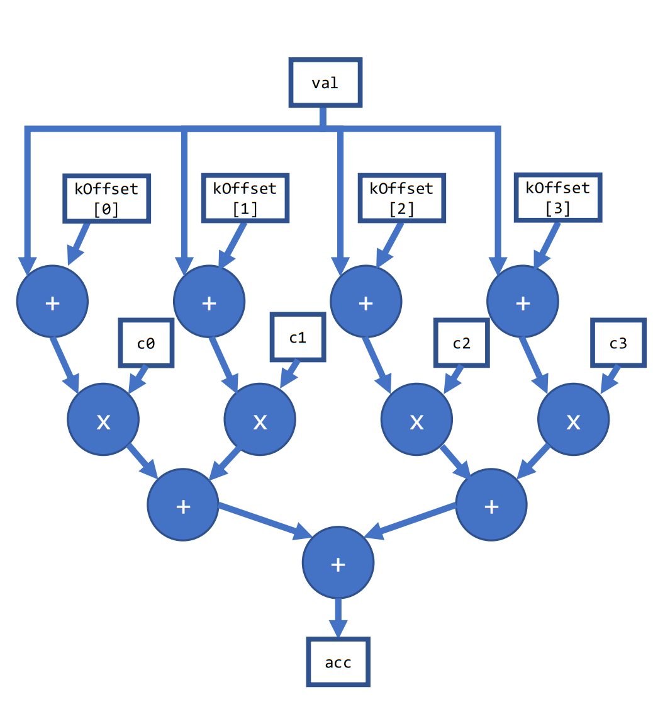
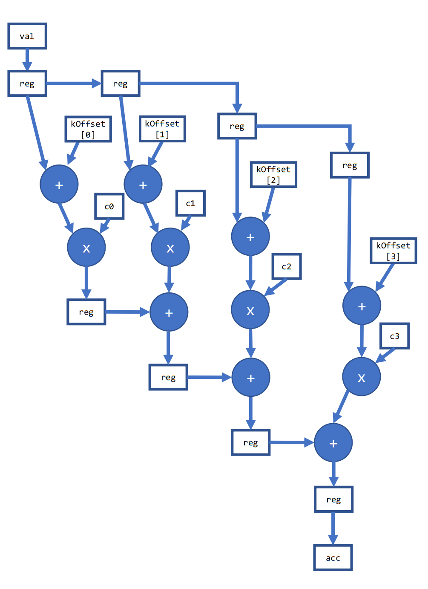

# `fpga_reg` Sample

This sample is an FPGA tutorial that demonstrates how a power user can apply the SYCL*-compliant Explicit Pipeline Register Insertion C++ extension, `ext::intel::fpga_reg`, to tweak the hardware generated by the compiler.

> **Note**: **This is an advanced tutorial for FPGA power users.**

| Area                 | Description
|:---                  |:---
| What you will learn  | How to use the `ext::intel::fpga_reg` extension. <br> How `ext::intel::fpga_reg` can be used to re-structure the compiler-generated hardware. <br> How to identify situations where applying `ext::intel::fpga_reg` can help.
| Time to complete     | 20 minutes
| Category             | Concepts and Functionality

## Purpose

This FPGA tutorial demonstrates an example of using the `ext::intel::fpga_reg` extension to:

- Help reduce the fanout of specific signals in the SYCL-compliant design.
- Improve the overall f<sub>MAX</sub> of the generated hardware.

> **Note**: A f<sub>MAX</sub> improvement is not always possible when using `ext::intel::fpga_reg`.

## Prerequisites

| Optimized for        | Description
|:---                  |:---
| OS                   | Ubuntu* 18.04/20.04 <br> RHEL*/CentOS* 8 <br> SUSE* 15 <br> Windows* 10
| Hardware             | Intel® Agilex® 7, Arria® 10, and Stratix® 10 FPGAs
| Software             | Intel® oneAPI DPC++/C++ Compiler

> **Note**: Even though the Intel DPC++/C++ OneAPI compiler is enough to compile for emulation, generating reports and generating RTL, there are extra software requirements for the simulation flow and FPGA compiles.
>
> For using the simulator flow, Intel® Quartus® Prime Pro Edition and one of the following simulators must be installed and accessible through your PATH:
> - Questa*-Intel® FPGA Edition
> - Questa*-Intel® FPGA Starter Edition
> - ModelSim® SE
>
> When using the hardware compile flow, Intel® Quartus® Prime Pro Edition must be installed and accessible through your PATH.

> **Warning**: Make sure you add the device files associated with the FPGA that you are targeting to your Intel® Quartus® Prime installation.

This sample is part of the FPGA code samples.
It is categorized as a Tier 3 sample that demonstrates a compiler feature.


Find more information about how to navigate this part of the code samples in the [FPGA top-level README.md](/DirectProgramming/C++SYCL_FPGA/README.md).
You can also find more information about [troubleshooting build errors](/DirectProgramming/C++SYCL_FPGA/README.md#troubleshooting), [running the sample on the Intel® DevCloud](/DirectProgramming/C++SYCL_FPGA/README.md#build-and-run-the-samples-on-intel-devcloud-optional), [using Visual Studio Code with the code samples](/DirectProgramming/C++SYCL_FPGA/README.md#use-visual-studio-code-vs-code-optional), [links to selected documentation](/DirectProgramming/C++SYCL_FPGA/README.md#documentation), and more.

## Key Implementation Details

This tutorial demonstrates the following key concepts:

- How to use the `ext::intel::fpga_reg` extension.
- How to use `ext::intel::fpga_reg` to restructure the compiler-generated hardware.
- How to identify situations where applying `ext::intel::fpga_reg` can help.

### Simple Code Example

The signature of `ext::intel::fpga_reg` is as follows:

```cpp
template <typenameT>
T ext::intel::fpga_reg(T input)
```

To use this function in your code, you must include the following header:

```cpp
#include <sycl/ext/intel/fpga_extensions.hpp>
```

When you use this function on any value in your code, the compiler will insert at least one register stage between the input and output of `ext::intel::fpga_reg` function. For example:

```cpp
int func (int input) {
  int output = ext::intel::fpga_reg(input)
  return output;
}
```

This forces the compiler to insert a register between the input and output. You can observe this in the optimization report's System Viewer.

### Understanding the Design

The basic function performed by the tutorial kernel is a vector dot product with a pre-adder. The loop is unrolled so that the core part of the algorithm is a feed-forward datapath. The coefficient array is implemented as a circular shift register and rotates by one for each iteration of the outer loop.

The optimization applied in this tutorial impacts the system f<sub>MAX</sub> or the maximum frequency that the design can run at. Since the compiler implements all kernels in a common clock domain, f<sub>MAX</sub> is a global system parameter. To see the impact of the `ext::intel::fpga_reg` optimization in this tutorial, you will need to compile the design twice.

Part 1 compiles the kernel code without setting the `USE_FPGA_REG` macro, whereas Part 2 compiles the kernel while setting this macro. This chooses between two functionally equivalent code segments, but the latter version uses `ext::intel::fpga_reg`. In the `USE_FPGA_REG` version of the code, the compiler is guaranteed to insert at least one register stage between the input and output of each of the calls to `ext::intel::fpga_reg` function.

#### Part 1: Without Using `USE_FPGA_REG`

The compiler generates the following hardware for Part 1. The diagram below has been simplified for illustration.



The compiler automatically infers a tree structure for the series of adders. There is a large fanout (of up to 4 in this simplified example) from `val` to each of the adders.

The fanout grows linearly with the unroll factor in this tutorial. In FPGA designs, signals with large fanout can sometimes degrade system f<sub>MAX</sub>. This happens because the FPGA placement algorithm cannot place *all* of the fanout logic elements physically close to the fanout source, leading to longer wires.  In this situation, it can be helpful to add explicit fanout control in your code via `ext::intel::fpga_reg`. This is an advanced optimization for FPGA power-users.

#### Part 2: Using `USE_FPGA_REG`

In this part, we added two sets of `ext::intel::fpga_reg` within the unrolled loop. The first is added to pipeline `val` once per iteration. This reduces the fanout of `val` from 4 in the example in Part 1 to just 2. The second `ext::intel::fpga_reg` is inserted between accumulation into the `acc` value. This generates the following structure in hardware.



In this version, the adder tree has been transformed into a vine-like structure. This increases latency, but it helps us achieve our goal of reducing the fanout and improving f<sub>MAX</sub>.
Since the outer loop is pipelined and has a high trip count, the inner loop's increased latency has a negligible impact on throughput. The tradeoff pays off, as the f<sub>MAX</sub> improvement yields a higher performing design.

## Build the `fpga_reg` Tutorial

>**Note**: When working with the command-line interface (CLI), you should configure the oneAPI toolkits using environment variables. Set up your CLI environment by sourcing the `setvars` script in the root of your oneAPI installation every time you open a new terminal window. This practice ensures that your compiler, libraries, and tools are ready for development.
>
> Linux*:
> - For system wide installations: `. /opt/intel/oneapi/setvars.sh`
> - For private installations: ` . ~/intel/oneapi/setvars.sh`
> - For non-POSIX shells, like csh, use the following command: `bash -c 'source <install-dir>/setvars.sh ; exec csh'`
>
> Windows*:
> - `C:\Program Files(x86)\Intel\oneAPI\setvars.bat`
> - Windows PowerShell*, use the following command: `cmd.exe "/K" '"C:\Program Files (x86)\Intel\oneAPI\setvars.bat" && powershell'`
>
> For more information on configuring environment variables, see [Use the setvars Script with Linux* or macOS*](https://www.intel.com/content/www/us/en/develop/documentation/oneapi-programming-guide/top/oneapi-development-environment-setup/use-the-setvars-script-with-linux-or-macos.html) or [Use the setvars Script with Windows*](https://www.intel.com/content/www/us/en/develop/documentation/oneapi-programming-guide/top/oneapi-development-environment-setup/use-the-setvars-script-with-windows.html).

### On Linux*

1. Change to the sample directory.
2. Build the program for Intel® Agilex® 7 device family, which is the default.
   ```
   mkdir build
   cd build
   cmake ..
   ```
   > **Note**: You can change the default target by using the command:
   >  ```
   >  cmake .. -DFPGA_DEVICE=<FPGA device family or FPGA part number>
   >  ```
   >
   > Alternatively, you can target an explicit FPGA board variant and BSP by using the following command:
   >  ```
   >  cmake .. -DFPGA_DEVICE=<board-support-package>:<board-variant>
   >  ```
   >
   > You will only be able to run an executable on the FPGA if you specified a BSP.

3. Compile the design. (The provided targets match the recommended development flow.)

   1. Compile and run for emulation (fast compile time, targets emulates an FPGA device).
      ```
      make fpga_emu
      ```
   2. Generate the HTML optimization reports. (See [Read the Reports](#read-the-reports) below for information on finding and understanding the reports.)
      ```
      make report
      ```
   3. Compile for simulation (fast compile time, targets simulated FPGA device).
      ```
      make fpga_sim
      ```
   4. Compile and run on FPGA hardware (longer compile time, targets an FPGA device).
      ```
      make fpga
      ```

### On Windows*

1. Change to the sample directory.
2. Build the program for the Intel® Agilex® 7 device family, which is the default.
   ```
   mkdir build
   cd build
   cmake -G "NMake Makefiles" ..
   ```
   > **Note**: You can change the default target by using the command:
   >  ```
   >  cmake -G "NMake Makefiles" .. -DFPGA_DEVICE=<FPGA device family or FPGA part number>
   >  ```
   >
   > Alternatively, you can target an explicit FPGA board variant and BSP by using the following command:
   >  ```
   >  cmake -G "NMake Makefiles" .. -DFPGA_DEVICE=<board-support-package>:<board-variant>
   >  ```
   >
   > You will only be able to run an executable on the FPGA if you specified a BSP.

3. Compile the design. (The provided targets match the recommended development flow.)

   1. Compile for emulation (fast compile time, targets emulated FPGA device).
      ```
      nmake fpga_emu
      ```
   2. Generate the optimization report. (See [Read the Reports](#read-the-reports) below for information on finding and understanding the reports.)
      ```
      nmake report
      ```
   3. Compile for simulation (fast compile time, targets simulated FPGA device, reduced problem size).
      ```
      nmake fpga_sim
      ```
   4. Compile for FPGA hardware (longer compile time, targets FPGA device):
      ```
      nmake fpga
      ```
> **Note**: If you encounter any issues with long paths when compiling under Windows*, you may have to create your ‘build’ directory in a shorter path, for example c:\samples\build.  You can then run cmake from that directory, and provide cmake with the full path to your sample directory.

### Read the Reports

Locate the pair of `report.html` files in either:

* **Report-only compile**:  `fpga_reg_report.prj` and `fpga_reg_registered_report.prj`
* **FPGA hardware compile**: `fpga_reg.prj` and `fpga_reg_registered.prj`

Observe the structure of the design in the optimization report's System Viewer and notice the changes within `Cluster 2` of the `SimpleMath.B3` block when compiling with Intel Arria® 10 GX FPGA. In the report for Part 1, the viewer shows a much more shallow graph compared to the one in Part 2. This is because the operations are performed much closer to one another in Part 1 compared to Part 2. By transforming the code in Part 2, with more register stages, the compiler achieved a higher f<sub>MAX</sub>.

>**Note**: Only the report generated after the FPGA hardware compile will reflect the performance benefit of using the `fpga_reg` extension. The difference is *not* apparent in the reports generated by `make report` because a design's f<sub>MAX</sub> cannot be predicted. The final achieved f<sub>MAX</sub> can be found in `fpga_reg.prj/reports/report.html` and `fpga_reg_registered.prj/reports/report.html` (after `make fpga` completes).


## Run the `fpga_reg` Sample

### On Linux

1. Run the sample on the FPGA emulator (the kernel executes on the CPU).
   ```
   ./fpga_reg.fpga_emu
   ```

2. Run the sample on the FPGA simulator device.
   ```
   CL_CONTEXT_MPSIM_DEVICE_INTELFPGA=1 ./fpga_reg.fpga_sim
   CL_CONTEXT_MPSIM_DEVICE_INTELFPGA=1 ./fpga_reg_registered.fpga_sim
   ```

3. Run the sample on the FPGA device (only if you ran `cmake` with `-DFPGA_DEVICE=<board-support-package>:<board-variant>`).
   ```
   ./fpga_reg.fpga
   ./fpga_reg_registered.fpga
   ```

### On Windows

1. Run the sample on the FPGA emulator (the kernel executes on the CPU).
   ```
   fpga_reg.fpga_emu.exe
   ```

2. Run the sample on the FPGA simulator device.
   ```
   set CL_CONTEXT_MPSIM_DEVICE_INTELFPGA=1
   fpga_reg.fpga_sim.exe
   fpga_reg_registered.fpga_sim.exe
   set CL_CONTEXT_MPSIM_DEVICE_INTELFPGA=
   ```

3. Run the sample on the FPGA device (only if you ran `cmake` with `-DFPGA_DEVICE=<board-support-package>:<board-variant>`).
   ```
   fpga_reg.fpga.exe
   fpga_reg_registered.fpga.exe
   ```

## Example Output

```
Throughput for kernel with input size 1000000 and coefficient array size 64: 2.819272 GFlops
PASSED: Results are correct.
```

You will be able to observe the improvement in the throughput going from Part 1 to Part 2. You will also note that the f<sub>MAX</sub> of Part 2 is significantly larger than of Part 1.

## License

Code samples are licensed under the MIT license. See [License.txt](https://github.com/oneapi-src/oneAPI-samples/blob/master/License.txt) for details.

Third-party program Licenses can be found here: [third-party-programs.txt](https://github.com/oneapi-src/oneAPI-samples/blob/master/third-party-programs.txt).