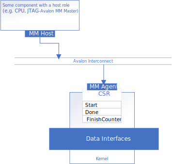
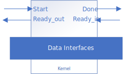
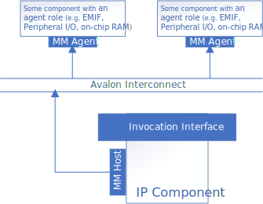
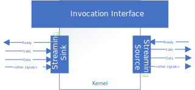
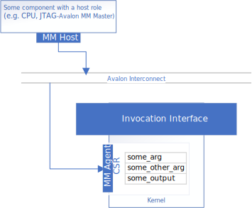

# Component Interfaces Comparison
This sample introduces different invocation/data interfaces that can be used when creating FPGA IP with the Intel® oneAPI DPC++/C++ Compiler.

| Area                 | Description
|:---                  |:---
| What you will learn  | The basics of different invocation interfaces and data interfaces for FPGA IP produced with the Intel® oneAPI DPC++/C++ Compiler, and how to implement and configure these interfaces
| Time to complete     | 60 minutes
| Category             | Concepts and Functionality

## Prerequisites

| Optimized for        | Description
|:---                  |:---
| OS                   | Ubuntu* 20.04 <br> RHEL*/CentOS* 8 <br> SUSE* 15 <br> Windows* 10 <br> Windows Server* 2019
| Hardware             | Intel® Agilex® 7, Agilex® 5, Arria® 10, Stratix® 10, and Cyclone® V FPGAs
| Software             | Intel® oneAPI DPC++/C++ Compiler

> **Note**: Even though the Intel® oneAPI DPC++/C++ Compiler is enough to compile for emulation, generating reports and generating RTL, there are extra software requirements for the simulation flow and FPGA compiles.
>
> For using the simulator flow, Intel® Quartus® Prime Pro Edition (or Standard Edition when targeting Cyclone® V) and one of the following simulators must be installed and accessible through your PATH:
> - Questa*-Intel® FPGA Edition
> - Questa*-Intel® FPGA Starter Edition
> - ModelSim® SE
>
> When using the hardware compile flow, Intel® Quartus® Prime Pro Edition (or Standard Edition when targeting Cyclone® V) must be installed and accessible through your PATH.

> **Warning**: Make sure you add the device files associated with the FPGA that you are targeting to your Intel® Quartus® Prime installation.

This sample is part of the FPGA code samples. It is categorized as a Tier 1 sample that helps you getting started.


Find more information about how to navigate this part of the code samples in the [FPGA top-level README.md](/DirectProgramming/C++SYCL_FPGA/README.md).
You can also find more information about [troubleshooting build errors](/DirectProgramming/C++SYCL_FPGA/README.md#troubleshooting), [running the sample on the Intel® DevCloud](/DirectProgramming/C++SYCL_FPGA/README.md#build-and-run-the-samples-on-intel-devcloud-optional), [using Visual Studio Code with the code samples](/DirectProgramming/C++SYCL_FPGA/README.md#use-visual-studio-code-vs-code-optional), [links to selected documentation](/DirectProgramming/C++SYCL_FPGA/README.md#documentation), and more.

## IP Component Interfaces
When you create an FPGA multi-architecture binary for an accelerator card equipped with a board support package (BSP), the Intel® oneAPI DPC++/C++ Compiler will infer a set of interfaces for you that fits your selected BSP. When you create FPGA IP with the Intel® oneAPI DPC++/C++ Compiler, you can customize the interfaces for your IP component, since IP components are not constrained by specific attach points in a specific BSP.

## Invocation Interface
The invocation interface is generated by the Intel® oneAPI DPC++/C++ Compiler and controls how your FPGA IP communicates with the rest of your system. This interface lets your system start the component and (optionally) pass input arguments, and lets the component inform the system when it is finished. There are two ways that the invocation interface can be implemented:

1. As signals mapped to the IP's control/status register (CSR)
2. As a handshake similar to the ready/valid handshake used by streaming interfaces.

### Register-mapped
The signals for starting your component, and the signals used by the component to signal its status are mapped to registers accessible through an Avalon memory-mapped agent interface. You should use a register-mapped invocation interface if your component will operate in a system like this:



By default, the Intel® oneAPI DPC++/C++ Compiler generates a register-mapped invocation interface for kernels, as you may observe in the [Naive Design](naive).

### Streaming
The signals for starting your component and the signals used by the component to signal its status appear as dedicated conduits on your IP component. These signals mimic the ready-valid handshake commonly used by streaming interfaces. You should use a streaming invocation interface if your component will operate in a system like this:



The streaming invocation handshake resembles an Avalon streaming transaction. The IP kernel begins operating on the clock cycle that the `start` and `ready_out` signals are asserted. The IP component kernel invocation is finished on the clock cycle that the `done` and `ready_in` signals are asserted.

For details on how to configure a streaming invocation interface, go to [streaming-invocation](streaming-invocation)

## Data Interface
The data interfaces allow data to enter and leave your component's data path. SYCL kernels do not have return types, so you must use one of the following three data interfaces to pass output data:

1. Memory-mapped host interface
2. Streaming interface
3. Memory-mapped agent (CSR)

### Memory-Mapped Host
When your data resides in an off-kernel memory (for example: global memory or off-chip DRAM, or an on-chip block RAM) you can use a memory-mapped host data interface to communicate with it. Memory-mapped host  interfaces are inferred by default for all pointer members in oneAPI kernels, as you may observe in the [Naive Design](naive).



You can customize this interface by explicitly declaring interfaces with the `annotated_arg` type. See [mm-host](mm-host/) part of this tutorial for an example of how to do this. For more information on the customization of Memory-mapped host interfaces, see this dedicated [mmhost](/DirectProgramming/C++SYCL_FPGA/Tutorials/Features/hls_flow_interfaces/mmhost) code sample.

### Stream (Pipe)
You may also choose to stream data into/out of your kernel using pipes. Pipes are a first-in first-out (FIFO) buffer construct that provide links between elements of a design. The Intel® oneAPI DPC++/C++ Compiler provides host pipes for host-kernel streaming and inter-kernel pipes for kernel-kernel streaming. The [pipes](pipes/) example demonstrates how to use host pipes to read and write data through an Avalon streaming interface that can be connected to other IP components in an FPGA design. 



### Memory-Mapped Agent (Control/Status Register)
You may wish to register your data in a memory-mapped register space.



There are two ways you can do this:
- Use (non-pointer) members of your functor. This is the default way to get data into your kernel as demonstrated in the [Naive Design](naive).
- Use host pipes configured to use the `sycl::ext::intel::experimental::protocol_avalon_mm` protocol. Please review the [csr-pipes](csr-pipes/) example design.

## Sample Structure
There are 5 different example designs in this sample, all of which implement a simple vector addition. You can compare the C++ source code for each of these designs.
1. [Naive](naive/) This simple vector add implementation is similar to the one presented in the [fpga_compile](/DirectProgramming/C++SYCL_FPGA/Tutorials/GettingStarted/fpga_compile) code sample. It demonstrates a kernel that uses a register-mapped invocation interface, and a single shared memory-mapped host data interface. This is the only design that can support the full-system compilation flow, since the other designs implement interface customizations that are not supported by any BSP.
2. [Streaming invocation](streaming-invocation/) This implementation uses a streaming invocation interface and conduits to pass the input pointer arguments instead of the CSR. It uses a single, shared memory-mapped host data interface.
3. [Customized memory-mapped host data interface](mm-host/) This implementation uses a register-mapped invocation interface, and demonstrates how to use `annotated_arg` to customize the memory-mapped host data interface.
4. [Streaming Data (pipes)](pipes/) This implementation uses a register-mapped invocation interface, and demonstrates how to use pipes to configure a streaming data interface.
5. [CSR Data](csr-pipes/) This implementation uses a register-mapped invocation interface, and demonstrates how to use host pipes to configure a streaming data interface, and how to return output into the CSR using the `protocol_avalon_mm` pipe protocol.

## Build a Design

All designs in this sample supports four compilation options: Emulator, Simulator, Optimization Report, FPGA Hardware. For details on the different compilation options, see the [fpga_compile](/DirectProgramming/C++SYCL_FPGA/Tutorials/GettingStarted/fpga_compile) tutorial.

Use the appropriate TYPE parameter when running CMake to config which design to compile:
| Example                                      | Directory             | Type (-DTYPE=) |
|----------------------------------------------|-----------------------|----------------|
| Naive                                        | naive/                | NAIVE          |
| Streaming invocation                         | streaming-invocation/ | STREAMING      |
| Customized memory-mapped host data interface | mm-host/              | MMHOST         |
| Streaming Data (pipes)                       | pipes/                | PIPES          |
| CSR Data                                     | csr-pipes/            | CSR            |


> **Note**: When working with the command-line interface (CLI), you should configure the oneAPI toolkits using environment variables. 
> Set up your CLI environment by sourcing the `setvars` script located in the root of your oneAPI installation every time you open a new terminal window. 
> This practice ensures that your compiler, libraries, and tools are ready for development.
>
> Linux*:
> - For system wide installations: `. /opt/intel/oneapi/setvars.sh`
> - For private installations: ` . ~/intel/oneapi/setvars.sh`
> - For non-POSIX shells, like csh, use the following command: `bash -c 'source <install-dir>/setvars.sh ; exec csh'`
>
> Windows*:
> - `C:\"Program Files (x86)"\Intel\oneAPI\setvars.bat`
> - Windows PowerShell*, use the following command: `cmd.exe "/K" '"C:\Program Files (x86)\Intel\oneAPI\setvars.bat" && powershell'`
>
> For more information on configuring environment variables, see [Use the setvars Script with Linux* or macOS*](https://www.intel.com/content/www/us/en/develop/documentation/oneapi-programming-guide/top/oneapi-development-environment-setup/use-the-setvars-script-with-linux-or-macos.html) or [Use the setvars Script with Windows*](https://www.intel.com/content/www/us/en/develop/documentation/oneapi-programming-guide/top/oneapi-development-environment-setup/use-the-setvars-script-with-windows.html).

### On Linux*

1. Change to the sample directory.
2. Configure the build system for the Agilex™ 7 device family, which is the default.

   ```
   mkdir build
   cd build
   cmake ..
   ```

   > **Note**: You can change the default target by using the command:
   >  ```
   >  cmake .. -DFPGA_DEVICE=<FPGA device family or FPGA part number> -DTYPE=<NAIVE/CSR/STREAMING/PIPES/MMHOST>
   >  ``` 

3. Compile the design. (The provided targets match the recommended development flow.)

   1. Compile for emulation (fast compile time, targets emulated FPGA device).
      ```
      make fpga_emu
      ```

   2. Compile for simulation (fast compile time, targets simulator FPGA device):
      ```
      make fpga_sim
      ```

   3. Generate HTML performance report.
      ```
      make report
      ```
      The report resides at `vector_add.report.prj/reports/report.html`.

   4. Compile with Quartus place and route (To get accurate area estimate, longer compile time).
      ```
      make fpga
      ```

### On Windows*

1. Change to the sample directory.
2. Configure the build system for the Agilex™ 7 device family, which is the default.
   ```
   mkdir build
   cd build
   cmake -G "NMake Makefiles" .. -DTYPE=<NAIVE/CSR/STREAMING/PIPES/MMHOST>
   ```

  > **Note**: You can change the default target by using the command:
  >  ```
  >  cmake -G "NMake Makefiles" .. -DFPGA_DEVICE=<FPGA device family or FPGA part number> -DTYPE=<NAIVE/CSR/STREAMING/PIPES/MMHOST>
  >  ``` 

3. Compile the design. (The provided targets match the recommended development flow.)

   1. Compile for emulation (fast compile time, targets emulated FPGA device).
      ```
      nmake fpga_emu
      ```
   2. Compile for simulation (fast compile time, targets simulator FPGA device):
      ```
      nmake fpga_sim
      ```
   3. Generate HTML performance report.
      ```
      nmake report
      ```
      The report resides at `vector_add.report.prj/reports/report.html`.

   4. Compile with Quartus place and route (To get accurate area estimate, longer compile time).
      ```
      nmake fpga
      ```

>**Note**: If you encounter any issues with long paths when compiling under Windows*, you may have to create your 'build' directory in a shorter path, for example `C:\samples\build`. You can then run cmake from that directory, and provide cmake with the full path to your sample directory, for example:
>
>  ```
  > C:\samples\build> cmake -G "NMake Makefiles" C:\long\path\to\code\sample\CMakeLists.txt
>  ```
## Run the Design

### On Linux

#### Run on FPGA Emulator

1. Run the sample on the FPGA emulator (the kernel executes on the CPU).
   ```
   ./vector_add.fpga_emu
   ```

#### Run on FPGA Simulator

1. Run the sample on the FPGA simulator.
   ```
   CL_CONTEXT_MPSIM_DEVICE_INTELFPGA=1 ./vector_add.fpga_sim
   ```

### On Windows

#### Run on FPGA Emulator

1. Run the sample on the FPGA emulator (the kernel executes on the CPU).
   ```
   vector_add.fpga_emu.exe
   ```

#### Run on FPGA Simulator

1. Run the sample on the FPGA simulator.
   ```
   set CL_CONTEXT_MPSIM_DEVICE_INTELFPGA=1
   vector_add.fpga_sim.exe
   set CL_CONTEXT_MPSIM_DEVICE_INTELFPGA=
   ```

## License
Code samples are licensed under the MIT license. See
[License.txt](/License.txt) for details.

Third party program Licenses can be found here: [third-party-programs.txt](/third-party-programs.txt).
