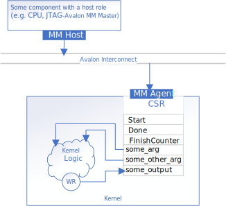

# CSR Data
This implementation uses a register-mapped invocation interface, and demonstrates how to use host pipes to return output into the CSR using the `protocol_avalon_mm` pipe protocol.



## Invocation Interface
By default, an un-decorated oneAPI kernel will have all its control signals and arguments mapped into the IP component's control/status register (CSR).

## Data Interface - CSR Pipe
In this design, the inputs `InputPipeA` and `InputPipeB` are implemented as streaming interfaces using pipes, as in [Streaming Data](../pipes/). However, the output `OutputPipeC` is implemented to write a single vector sum to the IP component's CSR.

To configure a host pipe to map to the CSR, set its protocol as `protocol_name::avalon_mm` or `protocol_name::avalon_mm_uses_ready` (from `sycl::ext::intel::experimental` namespace).

Alternatively, you can use the following property shorthands:
- `sycl::ext::intel::experimental::protocol_avalon_mm_uses_ready`
- `sycl::ext::intel::experimental::protocol_avalon_mm`

For more details on how to use host pipes in general, refer to the [Streaming Data](../pipes/) part of this code sample.

## Example Output

```
Add two vectors of size 256
PASSED
```
You can find the address of the output CSR in `vector_add.report.prj\include\kernel_headers\SimpleVAddPipes_register_map.hpp`:
```cpp
/* Status register contains all the control bits to control kernel execution */
/******************************************************************************/
/* Memory Map Summary                                                         */
/******************************************************************************/

/*
 Address | Access | Register     | Argument                            | Description 
---------|--------|--------------|-------------------------------------|-------------------------------
     0x0 |    R/W |   reg0[63:0] |                        Status[63:0] |   * Read/Write the status bits
         |        |              |                                     |       that are described below
---------|--------|--------------|-------------------------------------|-------------------------------
     0x8 |    R/W |   reg1[31:0] |                         Start[31:0] |        * Write 1 to initiate a
         |        |              |                                     |                   kernel start
---------|--------|--------------|-------------------------------------|-------------------------------
    0x30 |      R |   reg6[31:0] |                 FinishCounter[31:0] | * Read to get number of kernel
         |        |  reg6[63:32] |                 FinishCounter[31:0] |       finishes, note that this
         |        |              |                                     |    register will clear on read
---------|--------|--------------|-------------------------------------|-------------------------------
    0x80 |      W |  reg16[31:0] |                       arg_len[31:0] |                              
         |        | reg16[95:32] | acl_c_IDPipeC_pipe_channel_data[63:0] |        * Output host pipe data
         |        | reg16[159:96] | acl_c_IDPipeC_pipe_channel_valid[63:0] |       * Output host pipe valid
         |        |              |                                     |             a 1 indicates data
         |        |              |                                     |           register may be read
*/

```
## License
Code samples are licensed under the MIT license. See
[License.txt](/License.txt) for details.

Third party program Licenses can be found here: [third-party-programs.txt](/third-party-programs.txt).