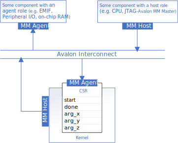

# Naive Design
This simple vector addition implementation is similar to the one presented in the [fpga_compile]((/DirectProgramming/C++SYCL_FPGA/Tutorials/GettingStarted/fpga_compile)) code sample. It demonstrates a kernel that uses a register-mapped invocation interface as well as a register-mapped data interface. The compiler generates a single shared memory-mapped host data interface for the pointer kernel arguments and the arguments are stored in the register map. These are the default interfaces that are selected by the Intel® oneAPI DPC++/C++ Compiler, and therefore this is the only design that can support the full-system compilation flow.



## Invocation Interface
By default, an un-decorated oneAPI kernel will have all its control signals and arguments mapped into the IP component's control/status register (CSR).

## Data Interface
Unless otherwise customized, the data interfaces inherit the same style as the invocation interfaces. Since by default, the invocation interface is a register-mapped interface, data interfaces also default to register-mapped interfaces.

Hence, in this design, the pointer arguments `a_in`, `b_in`, `c_out` and scalar argument `len` are passed through the IP component's CSR. The IP component accesses the data pointed to by the pointers through a single memory-mapped host interface.

## Example Output

```
Add two vectors of size 256
PASSED
```

## License
Code samples are licensed under the MIT license. See
[License.txt](/License.txt) for details.

Third party program Licenses can be found here: [third-party-programs.txt](/third-party-programs.txt).
