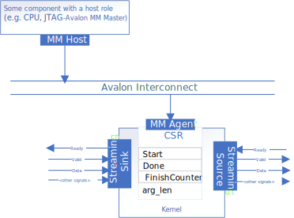

# Streaming Data Interfaces (Pipes)
This implementation uses a register-mapped invocation interface, and demonstrates how to use pipes to configure a streaming data interface.



## Invocation Interface
By default, an un-decorated oneAPI kernel will have all its control signals and arguments mapped into the IP component's control/status register (CSR).

## Data Interface - Streaming (Pipes)
Pipes are a first-in first-out (FIFO) buffer construct that provide links between elements of a design. In this design, interfaces `InputPipeA`, `InputPipeB`, `OutputPipeC` are implemented as  pipes.

### Declaring a Pipe
Each pipe is a declaration of the templated `pipe` class:
```cpp
sycl::ext::intel::experimental::pipe<id, type, min_capacity, properties>;
```
Detailed explanation for each parameters and a list of properties can be found in this dedicated [Streaming Data Interfaces](DirectProgramming/C++SYCL_FPGA/Tutorials/Features/hls_flow_interfaces/streaming_data_interfaces) code sample.

### Example of Pipe Declaration
```cpp
using PipeProps = decltype(sycl::ext::oneapi::experimental::properties(
    sycl::ext::intel::experimental::ready_latency<0>));
class ID_PipeA;
using InputPipeA =
    sycl::ext::intel::experimental::pipe<ID_PipeA, int, 0, PipeProps>;
```

### Pipe API
Pipes expose read and write interfaces that allow a single element to be read or written in FIFO order to the pipe.

See the [Host Pipes](/DirectProgramming/C++SYCL_FPGA/Tutorials/Features/experimental/hostpipes) code sample for more details on the read and write APIs.

## Build the Design
This design supports four compilation options: Emulator, Simulator, Optimization Report, FPGA Hardware. For details on the different compilation options, see [fpga_compile](/DirectProgramming/C++SYCL_FPGA/Tutorials/GettingStarted/fpga_compile) tutorial.

> **Note**: When working with the command-line interface (CLI), you should configure the oneAPI toolkits using environment variables. 
> Set up your CLI environment by sourcing the `setvars` script located in the root of your oneAPI installation every time you open a new terminal window. 
> This practice ensures that your compiler, libraries, and tools are ready for development.
>
> Linux*:
> - For system wide installations: `. /opt/intel/oneapi/setvars.sh`
> - For private installations: ` . ~/intel/oneapi/setvars.sh`
> - For non-POSIX shells, like csh, use the following command: `bash -c 'source <install-dir>/setvars.sh ; exec csh'`
>
> Windows*:
> - `C:\"Program Files (x86)"\Intel\oneAPI\setvars.bat`
> - Windows PowerShell*, use the following command: `cmd.exe "/K" '"C:\Program Files (x86)\Intel\oneAPI\setvars.bat" && powershell'`
>
> For more information on configuring environment variables, see [Use the setvars Script with Linux* or macOS*](https://www.intel.com/content/www/us/en/develop/documentation/oneapi-programming-guide/top/oneapi-development-environment-setup/use-the-setvars-script-with-linux-or-macos.html) or [Use the setvars Script with Windows*](https://www.intel.com/content/www/us/en/develop/documentation/oneapi-programming-guide/top/oneapi-development-environment-setup/use-the-setvars-script-with-windows.html).

## Example Output

```
Add two vectors of size 256
PASSED
```

## License
Code samples are licensed under the MIT license. See
[License.txt](/License.txt) for details.

Third party program Licenses can be found here: [third-party-programs.txt](/third-party-programs.txt).
