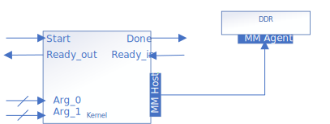

# Streaming Invocation and Conduit Arguments
This implementation uses a streaming invocation interface, and conduits to pass the input pointer arguments instead of the CSR. It uses a single, shared memory-mapped host data interface.
This design also shows how to specify conduit interfaces using `annotated_arg`.



## Invocation Interface - Streaming interface
In this design, the `SimpleVAdd` kernel uses a streaming invocation interface. This is explicitly specified using kernel properties. The following member function is added to the kernel functor to specify kernel properties:
```cpp
auto get(sycl::ext::oneapi::experimental::properties_tag) {
    return sycl::ext::oneapi::experimental::properties{
        sycl::ext::intel::experimental::streaming_interface<>
    };
}
```
The property `sycl::ext::intel::experimental::streaming_interface<>` configures a streaming invocation interface with a `ready_in` interface to allow down-stream components to backpressure. You can choose to remove the `ready_in` interface by using `sycl::ext::intel::experimental::streaming_interface_remove_downstream_stall` instead. If you omit the `streaming_interface` property, the compiler will configure your kernel with a register-mapped invocation interface.

Detailed explanation of invocation interfaces can be found in this dedicated [Invocation Interfaces](/DirectProgramming/C++SYCL_FPGA/Tutorials/Features/hls_flow_interfaces/invocation_interfaces) code sample.

## Data Interface
In this design, all kernel arguments (`A_in`, `B_in`, `C_out`, `len`) are implemented as conduits. In kernels with a streaming invocation interface, all unannotated arguments will be implemented as conduits by default. In kernels with a register-mapped invocation interface, all unannotated arguments will be implemented in the control/status register by default. In this design, they are explicitly specified as conduits to demonstrate the `annotated_arg` wrapper with property `sycl::ext::intel::experimental::conduit`.

Since `A_in`, `B_in` and `C_out` are pointers, they will share a Avalon memory-mapped host interface.

## Build the Design
This design supports four compilation options: Emulator, Simulator, Optimization Report, FPGA Hardware. For details on the different compilation options, see [fpga_compile](DirectProgramming/C++SYCL_FPGA/Tutorials/GettingStarted/fpga_compile) tutorial.

> **Note**: When working with the command-line interface (CLI), you should configure the oneAPI toolkits using environment variables. 
> Set up your CLI environment by sourcing the `setvars` script located in the root of your oneAPI installation every time you open a new terminal window. 
> This practice ensures that your compiler, libraries, and tools are ready for development.
>
> Linux*:
> - For system wide installations: `. /opt/intel/oneapi/setvars.sh`
> - For private installations: ` . ~/intel/oneapi/setvars.sh`
> - For non-POSIX shells, like csh, use the following command: `bash -c 'source <install-dir>/setvars.sh ; exec csh'`
>
> Windows*:
> - `C:\"Program Files (x86)"\Intel\oneAPI\setvars.bat`
> - Windows PowerShell*, use the following command: `cmd.exe "/K" '"C:\Program Files (x86)\Intel\oneAPI\setvars.bat" && powershell'`
>
> For more information on configuring environment variables, see [Use the setvars Script with Linux* or macOS*](https://www.intel.com/content/www/us/en/develop/documentation/oneapi-programming-guide/top/oneapi-development-environment-setup/use-the-setvars-script-with-linux-or-macos.html) or [Use the setvars Script with Windows*](https://www.intel.com/content/www/us/en/develop/documentation/oneapi-programming-guide/top/oneapi-development-environment-setup/use-the-setvars-script-with-windows.html).

## Example Output

```
Add two vectors of size 256
PASSED
```

## License
Code samples are licensed under the MIT license. See
[License.txt](/License.txt) for details.

Third party program Licenses can be found here: [third-party-programs.txt](/third-party-programs.txt).
