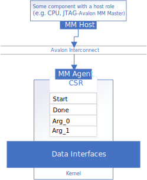
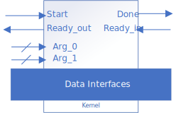
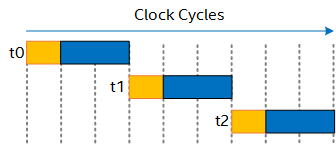
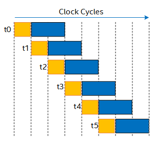
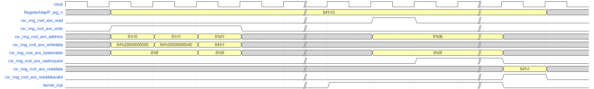
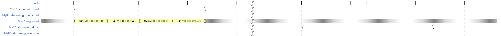

# `Invocation Interfaces` Sample

This sample is an FPGA tutorial that demonstrates how to specify the kernel invocation interface and kernel argument interface for an FPGA IP produced with the Intel® oneAPI DPC++/C++ Compiler.

| Area                 | Description
|:--                   |:--
| What you will learn  | Basics of specifying kernel invocation interfaces and kernel argument interfaces
| Time to complete     | 30 minutes
| Category             | Concepts and Functionality

## Purpose

The sample demonstrates the differences between streaming invocation interfaces that use a ready/valid handshake and register-mapped invocation interfaces that exist in the control/status register (CSR) of FPGA IP produced with the Intel® oneAPI DPC++/C++ Compiler.

Use the `get` kernel properties method to specify how the IP is started, and `annotated_arg` wrapper to specify how arguments are passed to the IP.

## Prerequisites

| Optimized for        | Description
|:---                  |:---
| OS                   | Ubuntu* 20.04 <br> RHEL*/CentOS* 8 <br> SUSE* 15 <br> Windows* 10 <br> Windows Server* 2019
| Hardware             | Intel® Agilex® 7, Agilex® 5, Arria® 10, Stratix® 10, and Cyclone® V FPGAs
| Software             | Intel® oneAPI DPC++/C++ Compiler

> **Note**: Even though the Intel DPC++/C++ oneAPI compiler is enough to compile for emulation, generating reports and generating RTL, there are extra software requirements for the simulation flow and FPGA compiles.
>
> For using the simulator flow, Intel® Quartus® Prime Pro Edition (or Standard Edition when targeting Cyclone® V) and one of the following simulators must be installed and accessible through your PATH:
> - Questa*-Intel® FPGA Edition
> - Questa*-Intel® FPGA Starter Edition
> - ModelSim® SE
>
> When using the hardware compile flow, Intel® Quartus® Prime Pro Edition (or Standard Edition when targeting Cyclone® V) must be installed and accessible through your PATH.

> **Warning** Make sure you add the device files associated with the FPGA that you are targeting to your Intel® Quartus® Prime installation.

This sample is part of the FPGA code samples.
It is categorized as a Tier 2 sample that demonstrates a compiler feature.


Find more information about how to navigate this part of the code samples in the [FPGA top-level README.md](/DirectProgramming/C++SYCL_FPGA/README.md).
You can also find more information about [troubleshooting build errors](/DirectProgramming/C++SYCL_FPGA/README.md#troubleshooting), [running the sample on the Intel® DevCloud](/DirectProgramming/C++SYCL_FPGA/README.md#build-and-run-the-samples-on-intel-devcloud-optional), [using Visual Studio Code with the code samples](/DirectProgramming/C++SYCL_FPGA/README.md#use-visual-studio-code-vs-code-optional), [links to selected documentation](/DirectProgramming/C++SYCL_FPGA/README.md#documentation), and more.

## Key Implementation Details

The sample demonstrates in detail how to declare kernel invocation interfaces and kernel argument interfaces.

### Understanding Register-Mapped and Streaming Interfaces

The kernel invocation interface (namely, the `start` and `done` signals) can be implemented in the kernel's CSR, or using a ready/valid handshake. Similarly, the kernel arguments can be passed through the CSR, or through dedicated conduits. 

| Register-mapped Invocation with Register-mapped Arguments | Streaming Invocation with Conduit Arguments
|:--:                                                       |:--:
|                   | 

The invocation interface and any argument interfaces are specified independently, so you may choose to implement the invocation interface with a ready/valid handshake, and implement the kernel arguments in the CSR. The following table lists valid kernel argument interface synchronizations.

| Invocation Interface    | Argument Interface    | Argument Interface Synchronization
|:---                     |:---                   |:---
| Streaming               | Conduit               | Consumed when `<kernel_name>_streaming_start`=1 and `<kernel_name>_streaming_ready_out`=0 
| Streaming               | Register-mapped       | Consumed if written one clock cycle before `<kernel_name>_streaming_start`=1 and `<kernel_name>_streaming_ready_out`=0 
| Register-mapped         | Conduit               | Consumed one clock cycle after writing to the `start` register 
| Register-mapped         | Register-mapped       | Consumed if written any time before writing to the `start` register 

If you would like an argument to have its own **dedicated** ready/valid handshake, implement that argument using a [streaming interface](../streaming_data_interfaces/).

> **Note**: The register-mapped and streaming interface features are **only** supported in the SYCL HLS flow. The SYCL HLS flow compiles SYCL* source code to IPs that can be deployed into your Intel® Quartus® Prime projects. Emulator and simulator executables are still generated to allow you to validate your IP. You can compile the generated RTL with Intel® Quartus® Prime to generate accurate f<sub>MAX</sub> and area estimates. However, the six `.fpga` executables generated in this tutorial are **not** designed to run on FPGA devices directly.

### Declaring a Register-Mapped Invocation Interface

By default, your IP's `start` and `done` signals will appear in the IP's CSR. This is true whether you declare your kernel using the 'functor' or 'lambda' syntax.

#### Functor Syntax

```c++
struct MyIP {
  ...
  void operator()() const {
    ...
  }
};

...

q.single_task(MyIP{});
```

#### Lambda Syntax

```c++
void myIPFunction() {
  ...
}

...

q.single_task([=] {
  myIPFunction();
  ...
});
```

You can see concrete examples of kernels that use register-mapped invocation interfaces in `src/reg_map_functor.cpp` and `src/reg_map_lambda.cpp` 


### Declaring a Streaming Invocation Interface

You can force your IP's `start` and `done` signals to appear as signals on your IP boundary by adding the `streaming_interface` kernel property.

Using the property `sycl::ext::intel::experimental::streaming_interface<>` or `sycl::ext::intel::experimental::streaming_interface_accept_downstream_stall` configures a streaming invocation interface with a `ready_in` interface to allow down-stream components to backpressure. You can choose to remove the `ready_in` interface by using `sycl::ext::intel::experimental::streaming_interface<remove_downstream_stall>` or `sycl::ext::intel::experimental::streaming_interface_remove_downstream_stall` instead. If you omit the `streaming_interface` property, the compiler will configure your kernel with a register-mapped invocation interface. The syntax for declaring a kernel property is different depending on if you use the functor syntax or the lambda syntax, but the `streaming_interface` property is the same. 


#### Functor Syntax

If you declare your kernel using the functor syntax, you must declare your kernel properties in the `get()` function, as shown here:

```c++
struct MyIP {
  ...
  auto get(sycl::ext::oneapi::experimental::properties_tag) {
      return sycl::ext::oneapi::experimental::properties {
          sycl::ext::intel::experimental::streaming_interface<>
      };
  }
  void operator()() const {
    ...
  }
};

...

q.single_task(MyIP{});
```

`src/stream_functor.cpp` and `src/stream_lambda.cpp`
demonstrate two different kernels that use a streaming invocation interface.
`src/stream_rm_stall.cpp` demonstrates a kernel
that has a streaming invocation interface with the `ready_in` signal disabled.

#### Lambda Syntax

If you declare your kernel using the lambda syntax, you must declare your kernel properties in an object that you pass to the `single_task()` function.

```c++
sycl::ext::oneapi::experimental::properties kernel_properties {
  sycl::ext::intel::experimental::streaming_interface<>,
};

q.single_task(kernel_properties, [=] {
  ...
})
```

#### Pipelined Streaming Invocation Interface

SYCL* task kernels are non-pipelined by default, meaning the next kernel invocation can only be started after the previous one has completed its execution. Kernels with a streaming kernel invocation interface can optionally be pipelined to increase the throughput of the kernel. A pipelined kernel is one that can be invoked while the previous kernel invocation is still executing, making full use of the entire hardware pipeline. The delay between successive invocations is called the initiation interval (II).

| Non-pipelined Invocation | Pipelined Invocation with II=1
|:--:                      |:--:
|  | 

The kernel property `sycl::ext::intel::experimental::pipelined` takes an optional template parameter that controls whether to pipeline the kernel. Valid parameters are:
- **-1**: Pipeline the kernel, and automatically infer lowest possible II at target fMAX.
- **0**: Do not pipeline the kernel.
- **N (N> 0)**: Pipeline the kernel, and force the II of the kernel to be N.

If a parameter is not specified, the default parameter of `-1` will be inferred, so the compiler will make its best effort to achieve the lowest kernel II. 

> **Note**: The `sycl::ext::intel::experimental::pipelined<>` property only supports kernels with a streaming invocation interface.

When you invoke a kernel with a pipelined streaming interface, you should only call the `wait()` blocking function after all kernel invocations have launched.

```c++
for (int i = 0; i < count; i++) {
	q.single_task<StreamPipelined>(StreamPipelinedIP{&input[i], &functor_streaming_pipelined_out[i]});
}
q.wait();
```

> **Note**: As per the SYCL language semantics, separate invocations of a kernel are **independent**. This means that you can't make assumptions about memory ordering or memory dependences between kernel invocations. Make sure you use synchronization mechanisms such as the `.wait()` function or *atomic operations* to avoid race conditions. \
If you want to guarantee sequential equivalence, you can also write your kernel with a `while(1)` loop in the kernel body instead of using a pipelined kernel. \
In particular, a repeatedly-invoked kernel with a memory dependence will result in undefined behavior in SYCL and may not function as you expect. 

For an example of a pipelined streaming kernel, see `src/stream_pipelined.cpp`.

### Customizing the Kernel Argument Interface

You can use the `sycl::ext::oneapi::experimental::annotated_arg` wrapper type to customize whether a kernel argument should be passed to the IP component as a conduit, or through the CSR. If you do not specify an `annotated_arg` wrapper, the compiler will infer an argument interface based on your invocation interface.

| Invocation Interface | Automatically Inferred Argument Interface | SYCL* Property
|:--                   |:--                                        |:--
| Register-mapped      | Register-mapped                           | `sycl::ext::intel::experimental::register_map`
| Streaming            | Conduit                                   | `sycl::ext::intel::experimental::conduit`


You can add a `conduit` property to an `annotated_arg` like this:

```c++
struct MyIP {
  sycl::ext::oneapi::experimental::annotated_arg<
    int, decltype(sycl::ext::oneapi::experimental::properties {
                  sycl::ext::intel::experimental::conduit})>
  arg1;
  void operator()() const {
    ...
    // access arg1 here
  }
};
```

> **Note**: If you use a `struct` or `class` type as the payload of an `annotated_arg`, you must cast away the `annotated_arg` wrapper to access the members and methods of your `struct` or `class`. In particular, this applies to `ac_int` types. If you forget to cast away the `annotated_arg` wrapper and try to access members or methods anyway, you will see a compiler error.
> 
> ```c++
> using MyUInt5 = ac_int<5, false>;
> 
> struct FunctorRegMapIP {
> 
>   int *input;
>   int *output;
> 
>   // A kernel with a register map invocation interface can also independently
>   // have streaming kernel arguments, when annotated by 'conduit' property.
>   sycl::ext::oneapi::experimental::annotated_arg<
>     MyUInt5, decltype(sycl::ext::oneapi::experimental::properties{
>                   sycl::ext::intel::experimental::conduit})>
>     n;
> 
>   // Without kernel invocation interface annotation, a register-mapped invocation
>   // interface will be inferred by the compiler.
>   void operator()() const {
>     // For annotated_arg of ac_int type, explicitly cast away the annotated_arg
>     // to prevent compiler error when using methods or accessing members.
>     for (MyUInt5 i = 0; i < ((MyUInt5)n).slc<5>(0); i++) { 
>       output[i] = input[i] * (input[i] + 1);
>     }
>   }
> };
> ```
> This is demonstrated in `src/reg_map_functor.cpp`, `src/reg_map_lambda.cpp` and `src/stream_functor.cpp`.

### Source File Summary

This code sample contains 6 source files that together demonstrate a full spectrum of configuration options for IP component invocation interfaces.

1. `src/reg_map_functor.cpp`
   * Register-mapped invocation interface
   * Functor coding style
   * Register-mapped argument (explicitly specified with `annotated_arg`)
   * Proper casting away of `annotated_arg` to access an `ac_int` method

2. `src/reg_map_lambda.cpp`
   * Register-mapped invocation interface
   * Lambda coding style
   * Register-mapped argument (explicitly specified with `annotated_arg`)
   * Proper casting away of `annotated_arg` to access an `ac_int` method

3. `src/stream_functor.cpp`
   * Streaming invocation interface (non-pipelined)
   * Functor coding style
   * Conduit argument (explicitly specified with `annotated_arg`)
   * Register-mapped argument (explicitly specified with `annotated_arg`)
   * Proper casting away of `annotated_arg` to access an `struct` member

4. `src/stream_lambda.cpp`
   * Streaming invocation interface (non-pipelined)
   * Lambda coding style
   * Conduit argument (implied)

5. `src/stream_pipelined.cpp`
   * Streaming invocation interface (pipelined)
   * Functor coding style
   * Conduit argument (implied)

6. `src/stream_rm_stall.cpp`
   * Streaming invocation interface (non-pipelined, stall-free)
   * Functor coding style
   * Register-mapped argument (explicitly specified with `annotated_arg`)
   * Conduit argument (explicitly specified with `annotated_arg`)

## Build the `Invocation Interfaces` Tutorial

>**Note**: When working with the command-line interface (CLI), you should configure the oneAPI toolkits using environment variables. Set up your CLI environment by sourcing the `setvars` script in the root of your oneAPI installation every time you open a new terminal window. This practice ensures that your compiler, libraries, and tools are ready for development.
>
> Linux*:
> - For system wide installations: `. /opt/intel/oneapi/setvars.sh`
> - For private installations: ` . ~/intel/oneapi/setvars.sh`
> - For non-POSIX shells, like csh, use the following command: `bash -c 'source <install-dir>/setvars.sh ; exec csh'`
>
> Windows*:
> - `C:\"Program Files (x86)"\Intel\oneAPI\setvars.bat`
> - Windows PowerShell*, use the following command: `cmd.exe "/K" '"C:\Program Files (x86)\Intel\oneAPI\setvars.bat" && powershell'`
>
> For more information on configuring environment variables, see [Use the setvars Script with Linux* or macOS*](https://www.intel.com/content/www/us/en/develop/documentation/oneapi-programming-guide/top/oneapi-development-environment-setup/use-the-setvars-script-with-linux-or-macos.html) or [Use the setvars Script with Windows*](https://www.intel.com/content/www/us/en/develop/documentation/oneapi-programming-guide/top/oneapi-development-environment-setup/use-the-setvars-script-with-windows.html).

### On Linux*

1. Change to the sample directory.
2. Build the program for Intel® Agilex® 7 device family, which is the default.
   ```
   mkdir build
   cd build
   cmake .. -DPART=<X>
   ```
   where `X` is:
   - `REG_MAP_FUNCTOR`
   - `STREAM_FUNCTOR`
   - `STREAM_RM_STALL`
   - `REG_MAP_LAMBDA`
   - `STREAM_LAMBDA`
   - `STREAM_PIPELINED`
   > **Note**: You can change the default target by using the command:
   >  ```
   >  cmake .. -DPART=<X> -DFPGA_DEVICE=<FPGA device family or FPGA part number>
   >  ```
   >
   > Alternatively, you can target an explicit FPGA board variant and BSP by using the following command:
   >  ```
   >  cmake .. -DPART=<X> -DFPGA_DEVICE=<board-support-package>:<board-variant>
   >  ```
  > **Note**: You can poll your system for available BSPs using the `aoc -list-boards` command. The board list that is printed out will be of the form
  > ```
  > $> aoc -list-boards
  > Board list:
  >   <board-variant>
  >      Board Package: <path/to/board/package>/board-support-package
  >   <board-variant2>
  >      Board Package: <path/to/board/package>/board-support-package
  > ```
   >
   > You will only be able to run an executable on the FPGA if you specified a BSP.

3. Compile the design. (The provided targets match the recommended development flow.)

   1. Compile and run for emulation (fast compile time, targets emulates an FPGA device).
      ```
      make fpga_emu
      ```
   2. Generate the HTML optimization reports. (See [Read the Reports](#read-the-reports) below for information on finding and understanding the reports.)
      ```
      make report
      ```
   3. Compile for simulation (:warning: This design compiles many source files, so the simulation compilation may take up to 3 hours depending on your computer).
      ```
      make fpga_sim
      ```
   4. Run the generated HDL through Intel® Quartus® Prime to generate accurate f<sub>MAX</sub> and area estimates.
      > **Warning**: The FPGA executables generated in this tutorial are **not** supported to be run on FPGA devices directly.
      ```
      make fpga
      ```

### On Windows*

1. Change to the sample directory.
2. Build the program for the Intel® Agilex® 7 device family, which is the default.
   ```
   mkdir build
   cd build
   cmake -G "NMake Makefiles" .. -DPART=<X>
   ```
   where `X` is:
   - `REG_MAP_FUNCTOR`
   - `STREAM_FUNCTOR`
   - `STREAM_RM_STALL`
   - `REG_MAP_LAMBDA`
   - `STREAM_LAMBDA`
   - `STREAM_PIPELINED`
   > **Note**: You can change the default target by using the command:
   >  ```
   >  cmake -G "NMake Makefiles" .. -DPART=<X> -DFPGA_DEVICE=<FPGA device family or FPGA part number>
   >  ```
   >
   > Alternatively, you can target an explicit FPGA board variant and BSP by using the following command:
   >  ```
   >  cmake -G "NMake Makefiles" .. -DPART=<X> -DFPGA_DEVICE=<board-support-package>:<board-variant>
   >  ```
  > **Note**: You can poll your system for available BSPs using the `aoc -list-boards` command. The board list that is printed out will be of the form
  > ```
  > $> aoc -list-boards
  > Board list:
  >   <board-variant>
  >      Board Package: <path/to/board/package>/board-support-package
  >   <board-variant2>
  >      Board Package: <path/to/board/package>/board-support-package
  > ```
   >
   > You will only be able to run an executable on the FPGA if you specified a BSP.

3. Compile the design. (The provided targets match the recommended development flow.)

   1. Compile for emulation (fast compile time, targets emulated FPGA device).
      ```
      nmake fpga_emu
      ```
   2. Generate the optimization report. (See [Read the Reports](#read-the-reports) below for information on finding and understanding the reports.)
      ```
      nmake report
      ```
   3. Compile for simulation (fast compile time, targets simulated FPGA device, reduced problem size).
      ```
      nmake fpga_sim
      ```
   4. Run the generated HDL through Intel® Quartus® Prime to generate accurate f<sub>MAX</sub> and area estimates.
      > **Warning**: The FPGA executables generated in this tutorial are **not** supported to be run on FPGA devices directly.

> **Note**: If you encounter any issues with long paths when compiling under Windows*, you may have to create your 'build' directory in a shorter path, for example c:\samples\build.  You can then run cmake from that directory, and provide cmake with the full path to your sample directory, for example:
>
>  ```
  > C:\samples\build> cmake -G "NMake Makefiles" C:\long\path\to\code\sample\CMakeLists.txt
>  ```
### Read the Reports

1. Locate `report.html` in the corresponding `<source_file>.report.prj/reports/` directory.

2. Open the **Views** menu and select **System Viewer**.

In the left-hand pane, select **FunctorRegMap** or **LambdaRegMap** under the System hierarchy for the kernels with a register-mapped invocation interface.

In the main **System Viewer** pane, the kernel invocation interfaces and kernel arguments interfaces are shown. They show that the `start`, `busy`, and `done` kernel invocation interfaces are implemented in register map interfaces, and the `arg_input` and `arg_output` kernel arguments are implemented in register map interfaces. The `arg_n` kernel argument is implemented in a streaming interface in both the **FunctorRegMap**, and **LambdaRegMap**.

Similarly, in the left-hand pane, select **FunctorStream**, **StreamRmStall**, **StreamPipelined** or **LambdaStream** under the System hierarchy for the kernels with a streaming invocation interface.

In the main **System Viewer** pane, the kernel invocation interfaces and kernel arguments interfaces are shown. They show that the `start`, `done`, `ready_in`, and `ready_out` kernel invocation interfaces are implemented in streaming interfaces. The `arg_input` kernel argument are implemented in streaming interfaces, `arg_n` kernel argument are implemented in streaming interfaces except for **StreamPipelined** which does not have this argument input and `arg_output` kernel argument are implemented in a register map interface in the **FunctorStream** and **StreamRmStall**, and in a streaming interface in the **StreamPipelined** and **LambdaStream**.

> **Note**: Kernel invocation interfaces `ready_in` and `ready_out` are shown as `stall_in` and `stall_out` respectively.

> **Note**: The report of **StreamRmStall** shows the internals of the kernel. Thus, there is a `stall_in`, but tied to ground and not seen at the device image boundary.

## Run the `Invocation Interfaces` Sample

### On Linux

1. Run the sample on the FPGA emulator (the kernel executes on the CPU).
   ```
   ./vector_add.fpga_emu
   ```
2. Run the sample on the FPGA simulator.
   ```
   CL_CONTEXT_MPSIM_DEVICE_INTELFPGA=1 ./vector_add.fpga_sim
   ```

### On Windows

1. Run the sample on the FPGA emulator (the kernel executes on the CPU).
   ```
   vector_add.fpga_emu.exe
   ```
2. Run the sample on the FPGA simulator.
   ```
   set CL_CONTEXT_MPSIM_DEVICE_INTELFPGA=1
   vector_add.fpga_sim.exe
   set CL_CONTEXT_MPSIM_DEVICE_INTELFPGA=
   ```

## Example Output

### Register-Mapped Functor Example Output

```
Running the kernel with register map invocation interface implemented in the functor programming model
	 Done
PASSED
```
### Streaming Functor Example Output

```
Running the kernel with streaming invocation interface implemented in the functor programming model
	 Done
PASSED
```
### Streaming Remove Downstream Stall Functor Example Output

```
Running the kernel with streaming invocation interface implemented in the functor programming model
	 Done
PASSED
```
### Streaming Pipelined Functor Example Output

```
Launching streaming pipelined kernels consecutively
         Done

PASSED
```
### Register-Mapped Lambda Example Output

```
Running the kernel with register map invocation interface implemented in the lambda programming model
	 Done
PASSED
```

### Streaming Lambda Example Output

```
Running the kernel with streaming invocation interface implemented in the lambda programming model
	 Done
PASSED
```

### Example Simulation Waveform

The diagram below shows the example waveform generated by the simulator that you will see for the kernels with a register-mapped invocation interface. The waveform shows the register-mapped kernel arguments and kernel invocation handshaking signals are passed in through an Avalon agent interface, whose addresses are as specified in the agent memory map header files in the project directory.



The diagram below shows the example waveform generated by the simulator that you will see for the kernels with a streaming invocation interface. The waveform shows the streaming kernel arguments and kernel invocation handshaking signals follow the Avalon-ST protocol. The register map arguments need to be written before the `start` signal is asserted. The streaming invocation interface consumes the streaming kernel arguments on the clock cycle that the `start` and `ready_out` signals are asserted, and the kernel invocation is finished on the clock cycle that the `done` and `ready_in` signals are asserted.


The diagram below shows the example waveform generated by the simulator that you will see for the pipelined kernel design. The waveform shows that the kernel is always ready, and 4 consecutive kernel invocations are launched with the `start` signal being asserted for 4 consecutive clock cycles. When the 4 kernel execution finishes, the `done` signal is asserted for 4 consecutive clock cycles.



## License
Code samples are licensed under the MIT license. See [License.txt](/License.txt) for details.

Third party program Licenses can be found here: [third-party-programs.txt](/third-party-programs.txt).
