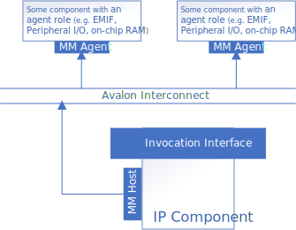
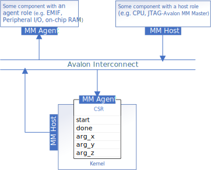
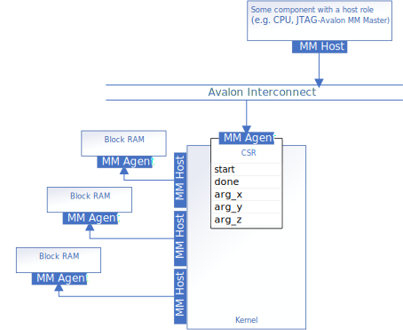
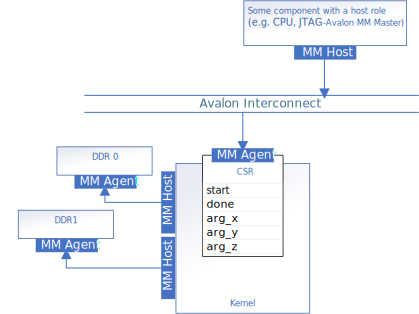

# Avalon Memory-Mapped Host Interfaces (mmhost) Sample
This tutorial demonstrates how to configure Avalon memory-mapped host data interfaces for IP components produced with the Intel® oneAPI DPC++/C++ Compiler.

| Optimized for                     | Description
---                                 |---
| OS                                | Ubuntu* 20.04 <br> RHEL*/CentOS* 8 <br> SUSE* 15 <br> Windows* 10 <br> Windows Server* 2019
| Hardware                          | Intel® Agilex® 7, Agilex® 5, Arria® 10, Stratix® 10, and Cyclone® V FPGAs
| Software                          | Intel® oneAPI DPC++/C++ Compiler
| What you will learn               | How to customize Avalon memory-mapped host interfaces in your FPGA IP components
| Time to complete                  | 45 minutes

> **Note**: Even though the Intel DPC++/C++ oneAPI compiler is enough to compile for emulation, generating reports and generating RTL, there are extra software requirements for the simulation flow and FPGA compiles.
>
> For using the simulator flow, Intel® Quartus® Prime Pro Edition (or Standard Edition when targeting Cyclone® V) and one of the following simulators must be installed and accessible through your PATH:
> - Questa*-Intel® FPGA Edition
> - Questa*-Intel® FPGA Starter Edition
> - ModelSim® SE
>
> When using the hardware compile flow, Intel® Quartus® Prime Pro Edition (or Standard Edition when targeting Cyclone® V) must be installed and accessible through your PATH.

> **Note**: Make sure you add the device files associated with the FPGA that you are targeting to your Intel® Quartus® Prime installation.

> **Note**: This tutorial will not work for a Full System compile as it demonstrates a SYCL HLS flow specific feature.

## Prerequisites

This sample is part of the FPGA code samples.
It is categorized as a Tier 2 sample that demonstrates a compiler feature.


Find more information about how to navigate this part of the code samples in the [FPGA top-level README.md](/DirectProgramming/C++SYCL_FPGA/README.md).
You can also find more information about [troubleshooting build errors](/DirectProgramming/C++SYCL_FPGA/README.md#troubleshooting), [running the sample on the Intel® DevCloud](/DirectProgramming/C++SYCL_FPGA/README.md#build-and-run-the-samples-on-intel-devcloud-optional), [using Visual Studio Code with the code samples](/DirectProgramming/C++SYCL_FPGA/README.md#use-visual-studio-code-vs-code-optional), [links to selected documentation](/DirectProgramming/C++SYCL_FPGA/README.md#documentation), etc.


## Purpose
When designing an IP component for an FPGA system, that system will often dictate the interface requirements of the IP component. This tutorial shows how to use `annotated_arg` to configure Avalon memory-mapped host data interfaces. An Avalon memory-mapped host interface allows an IP component to send read or write requests to one or more Avalon memory-mapped agent interfaces. To learn more about Avalon memory-mapped host interfaces and Avalon memory-mapped agent interfaces, refer to the appropriate section of the [Avalon Interface Specifications](https://www.intel.com/content/www/us/en/docs/programmable/683091/current/memory-mapped-interfaces.html).



The compiler will infer Avalon memory-mapped host interfaces for a design when the kernel includes one or more pointer arguments. As with scalar kernel arguments, pointer arguments can be passed to the kernel via a `conduit` interface or the component's control/status register (CSR). By default, pointer arguments will be passed to the IP component through the CSR. For more details on kernel arguments, see the sample [Component Interfaces Comparison](../component_interfaces_comparison). By default, the Intel® oneAPI DPC++/C++ Compiler will produce a kernel with a single Avalon memory-mapped host interface that will be shared amongst those pointers. 

#### Example 1: A kernel with multiple pointer arguments
(Code can be found under `part1_pointers`)
```c++
struct PointerIP {
  // Pointer kernel arguments will be passed through the component's CSR. They
  // will refer to data accessible through a shared Avalon memory-mapped host
  // interface.
  int *x;
  int *y;
  int *z;
  int size;

  void operator()() const {
    for (int i = 0; i < size; ++i) {
      z[i] = x[i] + y[i];
    }
  }
};
```


### Using `annotated_arg` to configure Avalon memory-mapped host interfaces

The default behaviour of a pointer argument can be overridden by declaring an `annotated_arg` kernel argument.

#### Example 2: A kernel with a single customized Avalon memory-mapped host interface
(Code can be found under `part2_single_host`).
```c++
struct SingleMMIP {
  // This kernel has 3 annotated pointers, but since they have no properties
  // specified, this kernel will result in the same IP component as Example 1.
  sycl::ext::oneapi::experimental::annotated_arg<int *> x;
  sycl::ext::oneapi::experimental::annotated_arg<int *> y;
  sycl::ext::oneapi::experimental::annotated_arg<int *> z;
  int size;

  void operator()() const {
    for (int i = 0; i < size; ++i) {
      z[i] = x[i] + y[i];
    }
  }
};
```

The following table describes the properties under `sycl::ext::intel::experimental` that can be used to customize how the pointer argument is passed to the component. Only one may be specified at a time. 

| Parameter                 | Description
|---                        |---
| `register_map`            | Pass the pointer for this memory-mapped host interface through the IP component's control/status register
| `conduit`                 | Pass the pointer for this memory-mapped host interface through a conduit interface
| `stable`                 | N/A | User guarantee that the pointer will not change between pipelined invocations of the kernel. The compiler uses this to further optimize the kernel.


The following parameters are found under `sycl::ext::intel::experimental`, with the exception of `alignment` under `sycl::ext::oneapi::experimental`. They can be used to configure an IP component's Avalon memory-mapped host interfaces:

| Parameter                | Default Value | Description
|---                       |---            |---
|  `buffer_location<id>`   | N/A           | The address space of the interface that associates with the host. Each unique buffer location will result in a unique Avalon memory-mapped host interface. When `buffer_location` is not specified, then the pointer can be used to access any of the IP's Avalon memory-mapped host interfaces depending on which memory the pointer points to.
| `awidth<width>`          | 41            | Width of the Avalon memory-mapped host address bus in bits. 
| `dwidth<width>`          | 64            | Width of the Avalon memory-mapped host data bus in bits. 
| `latency<value>`         | 1             | Read/Write latency for downstream fixed-latency Avalon memory-mapped agent. For a variable-latency Avalon memory-mapped agent, set `latency<0>`. 
| `read_write_mode<mode>`  | `read_write`  | Port direction of the interface. (`read_write`, `read` or `write`) 
| `maxburst<value>`        | 1             | Maximum number of data transfers that can associate with a read or write request. 
| `alignment<alignment>`   | 1          | Alignment of the pointer.

These parameters can be used to improve the performance of `Example 1` by ensuring that each pointer points to data in a dedicated Avalon memory-mapped agent memory, like this:



#### Example 3: A kernel with dedicated Avalon memory-mapped host interfaces
(Code can be found under `part3_hosts`).
```c++
constexpr int kBL1 = 1;
constexpr int kBL2 = 2;
constexpr int kBL3 = 3;
constexpr int kAlignment = 4;

struct MultiMMIP {
  // Each annotated pointer is configured with a unique `buffer_location`,
  // resulting in three unique Avalon memory-mapped host interfaces.
  using XProps = decltype(sycl::ext::oneapi::experimental::properties{
      sycl::ext::intel::experimental::buffer_location<kBL1>,
      sycl::ext::intel::experimental::awidth<32>,
      sycl::ext::intel::experimental::dwidth<32>,
      sycl::ext::intel::experimental::latency<1>,
      sycl::ext::oneapi::experimental::alignment<kAlignment>,
      sycl::ext::intel::experimental::read_write_mode_read});
  using YProps = decltype(sycl::ext::oneapi::experimental::properties{
      sycl::ext::intel::experimental::buffer_location<kBL2>,
      sycl::ext::intel::experimental::awidth<32>,
      sycl::ext::intel::experimental::dwidth<32>,
      sycl::ext::intel::experimental::latency<1>,
      sycl::ext::oneapi::experimental::alignment<kAlignment>,
      sycl::ext::intel::experimental::read_write_mode_read});
  using ZProps = decltype(sycl::ext::oneapi::experimental::properties{
      sycl::ext::intel::experimental::buffer_location<kBL3>,
      sycl::ext::intel::experimental::awidth<32>,
      sycl::ext::intel::experimental::dwidth<32>,
      sycl::ext::intel::experimental::latency<1>,
      sycl::ext::oneapi::experimental::alignment<kAlignment>,
      sycl::ext::intel::experimental::read_write_mode_write});

  sycl::ext::oneapi::experimental::annotated_arg<int *, XProps> x;
  sycl::ext::oneapi::experimental::annotated_arg<int *, YProps> y;
  sycl::ext::oneapi::experimental::annotated_arg<int *, ZProps> z;

  int size;

  void operator()() const {
    for (int i = 0; i < size; i++) {
      z[i] = x[i] + y[i];
    }
  }
};
```

### Interfacing with off-chip memory

If the input and output vectors are too large for on-chip memory, larger off-chip memories can be used. Consider the parameterization of a system with the following off-chip memory interfaces:

* Two banks of DDR SDRAM
* Data bus of 256 bits
* bursts of up to 8 requests



The available memory bandwidth can be better used by coalescing the 32-bit wide load-store units into wider 256-bit wide load-store units to match the memory interface. By choosing an unroll factor of 8, the compiler may coalesce 8 memory accesses into a single 256 bit access. By specifying the `alignment` property, the compiler can assume the specified `alignment` and infer an optimized LSU. Without this property, a non-aligned LSU is inferred requiring additional logic to handle potential unaligned accesses. When the alignment property is specified on the kernel argument, the same alignment must be specified to the SYCL runtime using `aligned_alloc_shared` as shown in the codesample. 

#### Example 4: A kernel that interfaces with two off-chip memories
(Code can be found under `part4_ddr_hosts`).
```c++
struct DDRIP {
  using ParamsBl1 = decltype(sycl::ext::oneapi::experimental::properties{
      sycl::ext::intel::experimental::buffer_location<kBL1>,
      sycl::ext::intel::experimental::maxburst<8>,
      sycl::ext::intel::experimental::dwidth<256>,
      sycl::ext::oneapi::experimental::alignment<kAlignment>,
      sycl::ext::intel::experimental::awidth<32>,
      sycl::ext::intel::experimental::latency<0>});

  using ParamsBl2 = decltype(sycl::ext::oneapi::experimental::properties{
      sycl::ext::intel::experimental::buffer_location<kBL2>,
      sycl::ext::intel::experimental::maxburst<8>,
      sycl::ext::intel::experimental::dwidth<256>,
      sycl::ext::oneapi::experimental::alignment<32>,
      sycl::ext::intel::experimental::awidth<kAlignment>,
      sycl::ext::intel::experimental::latency<0>});

  sycl::ext::oneapi::experimental::annotated_arg<int *, ParamsBl1> x;
  sycl::ext::oneapi::experimental::annotated_arg<int *, ParamsBl1> y;
  sycl::ext::oneapi::experimental::annotated_arg<int *, ParamsBl2> z;
  int size;

  void operator()() const {
#pragma unroll 8
    for (int i = 0; i < size; ++i) {
      z[i] = x[i] + y[i];
    }
  }
};
```

## Building the `mmhost` Sample
> **Note**: When working with the command-line interface (CLI), you should configure the oneAPI toolkits using environment variables.
> Set up your CLI environment by sourcing the `setvars` script located in the root of your oneAPI installation every time you open a new terminal window.
> This practice ensures that your compiler, libraries, and tools are ready for development.
>
> Linux*:
> - For system wide installations: `. /opt/intel/oneapi/setvars.sh`
> - For private installations: ` . ~/intel/oneapi/setvars.sh`
> - For non-POSIX shells, like csh, use the following command: `bash -c 'source <install-dir>/setvars.sh ; exec csh'`
>
> Windows*:
> - `C:\"Program Files (x86)"\Intel\oneAPI\setvars.bat`
> - Windows PowerShell*, use the following command: `cmd.exe "/K" '"C:\Program Files (x86)\Intel\oneAPI\setvars.bat" && powershell'`
>
> For more information on configuring environment variables, see [Use the setvars Script with Linux* or macOS*](https://www.intel.com/content/www/us/en/develop/documentation/oneapi-programming-guide/top/oneapi-development-environment-setup/use-the-setvars-script-with-linux-or-macos.html) or [Use the setvars Script with Windows*](https://www.intel.com/content/www/us/en/develop/documentation/oneapi-programming-guide/top/oneapi-development-environment-setup/use-the-setvars-script-with-windows.html).


### On Linux*
This design uses CMake to generate a build script for GNU/make.

1. Change to the sample directory.

2. Configure the build system for the Agilex® 7 device family, which is the default.

   ```
   mkdir build
   cd build
   cmake .. -DTYPE=<TYPE>
   ```

   where `<TYPE>` is: 
   - `PART1` for `part1_pointers`
   - `PART2` for `part2_single_host`
   - `PART3` for `part3_hosts`
   - `PART4` for `part4_ddr_hosts`
   
   > **Note**: You can change the default target by using the command:
   >  ```
   >  cmake .. -DFPGA_DEVICE=<FPGA device family or FPGA part number> -DTYPE=<TYPE>
   >  ```

3. Compile the design using `make`.
   1. Compile for emulation (fast compile time, targets emulated FPGA device).
      ```
      make fpga_emu
      ```
   2. Compile for simulation (fast compile time, targets simulator FPGA device):
      ```
      make fpga_sim
      ```
   3. Generate HTML performance report. (See [Read the Reports](#read-the-reports) below for information on finding and understanding the reports.)
      ```
      make report
      ```
   4. Compile for FPGA hardware (longer compile time, targets FPGA device).
      ```
      make fpga
      ```

### On Windows*

1. Change to the sample directory.

2. Configure the build system for the Agilex® 7 device family, which is the default.
   ```
   mkdir build
   cd build
   cmake -G "NMake Makefiles" .. -DTYPE=<TYPE>
   ```

   where `<TYPE>` is: 
   - `PART1` for `part1_pointers`
   - `PART2` for `part2_single_host`
   - `PART3` for `part3_hosts`
   - `PART4` for `part4_ddr_hosts`

   > **Note**: You can change the default target by using the command:
   >  ```
   >  cmake -G "NMake Makefiles" .. -DFPGA_DEVICE=<FPGA device family or FPGA part number> -DTYPE=<TYPE>
   >  ```
3. Compile the design using `nmake`.
   1. Compile for emulation (fast compile time, targets emulated FPGA device).
      ```
      nmake fpga_emu
      ```
   2. Compile for simulation (fast compile time, targets simulator FPGA device):
      ```
      nmake fpga_sim
      ```
   3. Generate HTML performance report. (See [Read the Reports](#read-the-reports) below for information on finding and understanding the reports.)
      ```
      nmake report
      ```
   4. Compile for FPGA hardware (longer compile time, targets FPGA device).
      ```
      nmake fpga
      ```
   > **Note**: If you encounter any issues with long paths when compiling under Windows*, you may have to create your 'build' directory in a shorter path, for example c:\samples\build.  You can then run cmake from that directory, and provide cmake with the full path to your sample directory, for example:
>
>  ```
  > C:\samples\build> cmake -G "NMake Makefiles" C:\long\path\to\code\sample\CMakeLists.txt
>  ```
## Examining the Generated RTL
Locate `mmhost_partx_report_di_inst.v` in the `build/mmhost_partx.report.prj/` directory and open it with a text editor. This file demonstrates how to instantiate your IP component using Verilog or System Verilog code.

## Read the Reports
Locate `report.html` in the `build/mmhost_partx.report.prj/reports/` directory. Open the report in Chrome*, Firefox*, Edge*, or Internet Explorer*. Each `partx` will have its own report under its own build directory. You can compare multiple reports by opening them in multiple browser windows/tabs.

Navigate to the Area Analysis section of the optimization reports for `mmhost_part1` and `mmhost_part3`. The Kernel System section displays the area consumption of each kernel. Notice that the `MultiMMIP` kernel consumes less area under all categories than the `PointerIP` kernel. This is due to stall-free memory accesses and the removal of arbitration logic. The fixed-latency on-chip block RAMs can be accessed with stall-free load/store units (LSUs), and giving each memory access a single dedicated interface allows the removal of arbitration logic.

Navigate to the Loop Throughput section under Throughput Analysis: the `MultiMMIP` kernel has a lower latency than the `PointerIP` kernel, and there are less blocks being scheduled. This is because the kernel has access to all 3 memories in parallel without contention.

Observe how the 32-bit LSUs are now coalesced, after unrolling the for-loop.


## Run the `mmhost` Sample

### On Linux

1. Run the sample on the FPGA emulator (the kernel executes on the CPU):
   ```
   ./mmhost_partx.fpga_emu
   ```

2. Run the sample on the FPGA simulator device (the kernel executes in a simulator):
   ```
   CL_CONTEXT_MPSIM_DEVICE_INTELFPGA=1 ./mmhost_partx.fpga_sim
   ```

### On Windows

1. Run the sample on the FPGA emulator (the kernel executes on the CPU):
   ```
   mmhost_partx.fpga_emu.exe
   ```

2. Run the sample on the FPGA simulator device (the kernel executes in a simulator):
   ```
   set CL_CONTEXT_MPSIM_DEVICE_INTELFPGA=1
   mmhost_partx.fpga_sim.exe
   set CL_CONTEXT_MPSIM_DEVICE_INTELFPGA=
   ```

### Example of Output

```
Running on device: Intel(R) FPGA Emulation Device
Elements in vector : 8
PASSED
```

## License

Code samples are licensed under the MIT license. See
[License.txt](/License.txt) for details.

Third party program Licenses can be found here: [third-party-programs.txt](/third-party-programs.txt).
