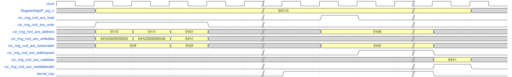
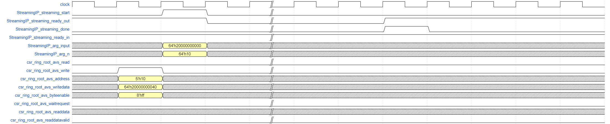

# `Invocation Interfaces` Sample

This sample is an FPGA tutorial that demonstrates how to specify the kernel invocation interfaces and kernel argument interfaces.

| Area                 | Description
|:--                   |:--
| What you will learn  | Basics of specifying kernel invocation interfaces and kernel argument interfaces
| Time to complete     | 30 minutes
| Category             | Concepts and Functionality

## Purpose

The sample demonstrates the differences between streaming interfaces that use a ready/valid handshake and register-mapped interfaces that exist in the control/status register (CSR) of the kernel.

Use register map and streaming interface annotations to specify how the kernel invocation handshaking is performed, as well as how the kernel argument data is passed in to the kernel.

## Prerequisites

| Optimized for        | Description
|:---                  |:---
| OS                   | Ubuntu* 18.04/20.04 <br> RHEL*/CentOS* 8 <br> SUSE* 15 <br> Windows* 10
| Hardware             | Intel® Agilex® 7, Arria® 10, and Stratix® 10 FPGAs
| Software             | Intel® oneAPI DPC++/C++ Compiler

> **Note**: Even though the Intel DPC++/C++ OneAPI compiler is enough to compile for emulation, generating reports and generating RTL, there are extra software requirements for the simulation flow and FPGA compiles.
>
> For using the simulator flow, Intel® Quartus® Prime Pro Edition and one of the following simulators must be installed and accessible through your PATH:
> - Questa*-Intel® FPGA Edition
> - Questa*-Intel® FPGA Starter Edition
> - ModelSim® SE
>
> When using the hardware compile flow, Intel® Quartus® Prime Pro Edition must be installed and accessible through your PATH.

> **Warning** Make sure you add the device files associated with the FPGA that you are targeting to your Intel® Quartus® Prime installation.

This sample is part of the FPGA code samples.
It is categorized as a Tier 2 sample that demonstrates a compiler feature.


Find more information about how to navigate this part of the code samples in the [FPGA top-level README.md](/DirectProgramming/C++SYCL_FPGA/README.md).
You can also find more information about [troubleshooting build errors](/DirectProgramming/C++SYCL_FPGA/README.md#troubleshooting), [running the sample on the Intel® DevCloud](/DirectProgramming/C++SYCL_FPGA/README.md#build-and-run-the-samples-on-intel-devcloud-optional), [using Visual Studio Code with the code samples](/DirectProgramming/C++SYCL_FPGA/README.md#use-visual-studio-code-vs-code-optional), [links to selected documentation](/DirectProgramming/C++SYCL_FPGA/README.md#documentation), and more.

## Key Implementation Details

The sample illustrates the key concepts about the basics of declaring kernel invocation interfaces and kernel argument interfaces.

### Understanding Register Map and Streaming Interfaces

The kernel invocation interface (namely, the `start` and `done` signals) can be implemented in the kernel's CSR, or using a ready/valid handshake. Similarly, the kernel arguments can be passed through the CSR, or through dedicated conduits. The invocation interface and any argument interfaces are specified independently, so you may choose to implement the invocation interface with a ready/valid handshake, and implement the kernel arguments in the CSR. All argument interfaces that are implemented as conduits will be synchronized to the ready/valid handshake of the kernel invocation interface. This means that it is not possible to configure a kernel with a register-mapped invocation interface and conduit arguments. The following table lists valid kernel argument interface synchronizations.

| Invocation Interface    | Argument Interface    | Argument Interface Synchronization
|:---                     |:---                   |:---
| Streaming               | Streaming             | Synchronized with `start` and `ready_out`
| Streaming               | Register mapped       | N/A
| Register mapped         | Streaming             | *No synchronization possible*
| Register mapped         | Register mapped       | N/A

If you would like an argument to have its own dedicated ready/valid handshake, implement that argument using a [Host Pipe](../hostpipes/).

>**Warning**: The register map and streaming interface features are only supported in the IP Authoring flow. The IP Authoring flow compiles SYCL* source code to stand-alone IPs that can be deployed into your Intel® Quartus® Prime projects. Emulator and simulator executables are still generated to allow you to validate your IP.
>
>You can run the generated HDL through Intel® Quartus® Prime to generate accurate f<sub>MAX</sub> and area estimates. However, the FPGA four executables generated in this tutorial are ***not*** supported to be run on FPGA devices directly.

### Declaring a Register Map Kernel Interface

#### Example Functor

```c++
struct MyIP {
  MyIP() {}
  register_map_interface void operator()() const {
    ...
  }
};
```

#### Example Lambda
```c++
q.single_task([=] register_map_interface {
  ...
})
```

### Declaring a Streaming Kernel Interface

#### Example Functor

```c++
struct MyIP {
  MyIP() {}
  streaming_interface void operator()() const {
    ...
  }
};
```

#### Example Lambda
```c++
q.single_task([=] streaming_interface {
  ...
})
```

### Declaring a Register Map Kernel Argument Interface

#### Example Functor

```c++
struct MyIP {
  register_map int arg1;
  register_map_interface void operator()() const {
    ...
  }
};
```

### Declaring a Streaming Kernel Argument Interface

```c++
struct MyIP {
  conduit int arg1;
  register_map_interface void operator()() const {
    ...
  }
};
```

### Default Interfaces

If no annotation is specified for the kernel invocation interface, then a register map kernel invocation interface will be inferred by the compiler. If no annotation is specified for the kernel argument, then that kernel argument will have the same interface as the kernel invocation interface. In the Lambda programming model, all kernel arguments will have the same interface as the kernel invocation interface.

### Testing the Tutorial

A total of four sources files are in the `src/` directory, declaring a total of four kernels. Two use the functor programming model, and the other use the lambda programming model. For each programming model, one kernel is declared with the register map kernel invocation interface and the other kernel is declared with the streaming kernel invocation interface.

```c++
struct FunctorRegisterMapIP {
  register_map ValueT *input;
  ValueT *output;
  conduit size_t n;
  register_map_interface void operator()() const {
    for (int i = 0; i < n; i++) {
      output[i] = SomethingComplicated(input[i]);
    }
  }
};
```

```c++
struct FunctorStreamingIP {
  conduit ValueT *input;
  conduit ValueT *output;
  size_t n;
  streaming_interface void operator()() const {
    for (int i = 0; i < n; i++) {
      output[i] = SomethingComplicated(input[i]);
    }
  }
};
```

These two functor kernels are invoked in the same way in the host code, by constructing the struct and submitting a `single_task` into the SYCL `queue`.

```c++
q.single_task(FunctorRegisterMapIP{in, functor_register_map_out, count}).wait();
```

```c++
q.single_task(FunctorStreamingIP{in, functor_streaming_out, count}).wait();
```

The two lambda kernels are annotated directly on the lambda function body and submitted into the SYCL `queue` as a `single_task`.

```c++
void TestLambdaRegisterMapKernel(sycl::queue &q, ValueT *in, ValueT *out, size_t count) {
  q.single_task<LambdaRegisterMapIP>([=] register_map_interface  {
    for (int i = 0; i < count; i++) {
      out[i] = SomethingComplicated(in[i]);
    }
  }).wait();
}
```

```c++
void TestLambdaStreamingKernel(sycl::queue &q, ValueT *in, ValueT *out, size_t count) {
  q.single_task<LambdaStreamingIP>([=] streaming_interface  {
    for (int i = 0; i < count; i++) {
      out[i] = SomethingComplicated(in[i]);
    }
  }).wait();
}
```

## Build the `Invocation Interfaces` Tutorial

>**Note**: When working with the command-line interface (CLI), you should configure the oneAPI toolkits using environment variables. Set up your CLI environment by sourcing the `setvars` script in the root of your oneAPI installation every time you open a new terminal window. This practice ensures that your compiler, libraries, and tools are ready for development.
>
> Linux*:
> - For system wide installations: `. /opt/intel/oneapi/setvars.sh`
> - For private installations: ` . ~/intel/oneapi/setvars.sh`
> - For non-POSIX shells, like csh, use the following command: `bash -c 'source <install-dir>/setvars.sh ; exec csh'`
>
> Windows*:
> - `C:\Program Files(x86)\Intel\oneAPI\setvars.bat`
> - Windows PowerShell*, use the following command: `cmd.exe "/K" '"C:\Program Files (x86)\Intel\oneAPI\setvars.bat" && powershell'`
>
> For more information on configuring environment variables, see [Use the setvars Script with Linux* or macOS*](https://www.intel.com/content/www/us/en/develop/documentation/oneapi-programming-guide/top/oneapi-development-environment-setup/use-the-setvars-script-with-linux-or-macos.html) or [Use the setvars Script with Windows*](https://www.intel.com/content/www/us/en/develop/documentation/oneapi-programming-guide/top/oneapi-development-environment-setup/use-the-setvars-script-with-windows.html).

### On Linux*

1. Change to the sample directory.
2. Build the program for Intel® Agilex® 7 device family, which is the default.
   ```
   mkdir build
   cd build
   cmake ..
   ```
   > **Note**: You can change the default target by using the command:
   >  ```
   >  cmake .. -DFPGA_DEVICE=<FPGA device family or FPGA part number>
   >  ```
   >
   > Alternatively, you can target an explicit FPGA board variant and BSP by using the following command:
   >  ```
   >  cmake .. -DFPGA_DEVICE=<board-support-package>:<board-variant>
   >  ```
   >
   > You will only be able to run an executable on the FPGA if you specified a BSP.

3. Compile the design. (The provided targets match the recommended development flow.)

   1. Compile and run for emulation (fast compile time, targets emulates an FPGA device).
      ```
      make fpga_emu
      ```
   2. Generate the HTML optimization reports. (See [Read the Reports](#read-the-reports) below for information on finding and understanding the reports.)
      ```
      make report
      ```
   3. Compile for simulation (fast compile time, targets simulated FPGA device).
      ```
      make fpga_sim
      ```
   4. Run the generated HDL through Intel® Quartus® Prime to generate accurate f<sub>MAX</sub> and area estimates.
      > **Warning**: The FPGA executables generated in this tutorial are **not** supported to be run on FPGA devices directly.
      ```
      make fpga
      ```

### On Windows*

1. Change to the sample directory.
2. Build the program for the Intel® Agilex® 7 device family, which is the default.
   ```
   mkdir build
   cd build
   cmake -G "NMake Makefiles" ..
   ```
   > **Note**: You can change the default target by using the command:
   >  ```
   >  cmake -G "NMake Makefiles" .. -DFPGA_DEVICE=<FPGA device family or FPGA part number>
   >  ```
   >
   > Alternatively, you can target an explicit FPGA board variant and BSP by using the following command:
   >  ```
   >  cmake -G "NMake Makefiles" .. -DFPGA_DEVICE=<board-support-package>:<board-variant>
   >  ```
   >
   > You will only be able to run an executable on the FPGA if you specified a BSP.

3. Compile the design. (The provided targets match the recommended development flow.)

   1. Compile for emulation (fast compile time, targets emulated FPGA device).
      ```
      nmake fpga_emu
      ```
   2. Generate the optimization report. (See [Read the Reports](#read-the-reports) below for information on finding and understanding the reports.)
      ```
      nmake report
      ```
   3. Compile for simulation (fast compile time, targets simulated FPGA device, reduced problem size).
      ```
      nmake fpga_sim
      ```
   4. Run the generated HDL through Intel® Quartus® Prime to generate accurate f<sub>MAX</sub> and area estimates.
      > **Warning**: The FPGA executables generated in this tutorial are **not** supported to be run on FPGA devices directly.

> **Note**: If you encounter any issues with long paths when compiling under Windows*, you may have to create your ‘build’ directory in a shorter path, for example c:\samples\build.  You can then run cmake from that directory, and provide cmake with the full path to your sample directory.

### Read the Reports

1. Locate `report.html` in the corresponding `<source_file>_report.prj/reports/` directory.

2. Open the **Views** menu and select **System Viewer**.

In the left-hand pane, select **FunctorRegisterMapIP** or **LambdaRegisterMapIP** under the System hierarchy for the kernels with a register-mapped invocation interface.

In the main **System Viewer** pane, the kernel invocation interfaces and kernel argument interfaces are shown. They show that the `start`, `busy`, and `done` kernel invocation interfaces are implemented in register map interfaces, and the `arg_input` and `arg_output` kernel arguments are implemented in register map interfaces. The `arg_n` kernel argument is implemented in a streaming interface in the **FunctorRegisterMapIP**, and in a register map interface in the **LambdaRegisterMapIP**.

Similarly, in the left-hand pane, select **FunctorStreamingIP** or **LambdaStreamingIP** under the System hierarchy for the kernels with a streaming invocation interface.

In the main **System Viewer** pane, the kernel invocation interface and kernel argument interfaces are shown. They show that the `start`, `done`, `ready_in`, and `ready_out` kernel invocation interfaces are implemented in streaming interfaces, and the `arg_input` and `arg_n` kernel arguments are implemented in streaming interfaces. The `arg_output` kernel argument is implemented in a register map interface in the **FunctorStreamingIP**, and in a streaming interface in the **LambdaStreamingIP**.

## Run the `Invocation Interfaces` Sample

### On Linux

1. Run the sample on the FPGA emulator (the kernel executes on the CPU).
   ```
   ./register_map_functor_model.fpga_emu
   ./streaming_functor_model.fpga_emu
   ./register_map_lambda_model.fpga_emu
   ./streaming_lambda_model.fpga_emu
   ```
2. Run the sample on the FPGA simulator.
   ```
   CL_CONTEXT_MPSIM_DEVICE_INTELFPGA=1 ./register_map_functor_model.fpga_sim
   CL_CONTEXT_MPSIM_DEVICE_INTELFPGA=1 ./streaming_functor_model.fpga_sim
   CL_CONTEXT_MPSIM_DEVICE_INTELFPGA=1 ./register_map_lambda_model.fpga_sim
   CL_CONTEXT_MPSIM_DEVICE_INTELFPGA=1 ./streaming_lambda_model.fpga_sim
   ```

### On Windows

1. Run the sample on the FPGA emulator (the kernel executes on the CPU).
   ```
   register_map_functor_model.fpga_emu.exe
   streaming_functor_model.fpga_emu.exe
   register_map_lambda_model.fpga_emu.exe
   streaming_lambda_model.fpga_emu.exe
   ```
2. Run the sample on the FPGA simulator.
   ```
   set CL_CONTEXT_MPSIM_DEVICE_INTELFPGA=1
   register_map_functor_model.fpga_sim.exe
   streaming_functor_model.fpga_sim.exe
   register_map_lambda_model.fpga_sim.exe
   streaming_lambda_model.fpga_sim.exe
   set CL_CONTEXT_MPSIM_DEVICE_INTELFPGA=
   ```

## Example Output

### Register Map Functor Example Output

```
Running the kernel with register map invocation interface implemented in the functor programming model
	 Done
PASSED
```
### Streaming Functor Example Output

```
Running the kernel with streaming invocation interface implemented in the functor programming model
	 Done
PASSED
```
### Register Map Lambda Example Output

```
Running kernel with register map invocation interface implemented in the lambda programming model
	 Done
PASSED
```

### Streaming Lambda Example Output

```
Running kernel with streaming invocation interface implemented in the lambda programming model
	 Done
PASSED
```

### Example Simulation Waveform

The diagram below shows the example waveform generated by the simulator that you will see for the kernels with a register-mapped invocation interface. The waveform shows the register-mapped kernel arguments and kernel invocation handshaking signals are passed in through an Avalon agent interface, whose addresses are as specified in the agent memory map header files in the project directory.



The diagram below shows the example waveform generated by the simulator that you will see for the kernels with a streaming invocation interface. The waveform shows the streaming kernel arguments and kernel invocation handshaking signals follow the Avalon-ST protocol. The register map arguments need to be written before the `start` signal is asserted. The streaming invocation interface consumes the streaming kernel arguments on the clock cycle that the `start` and `ready_out` signals are asserted, and the kernel invocation is finished on the clock cycle that the `done` and `ready_in` signals are asserted.



## License
Code samples are licensed under the MIT license. See [License.txt](https://github.com/oneapi-src/oneAPI-samples/blob/master/License.txt) for details.

Third party program Licenses can be found here: [third-party-programs.txt](https://github.com/oneapi-src/oneAPI-samples/blob/master/third-party-programs.txt).