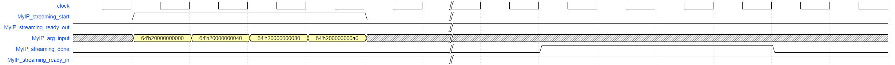

# `Pipelined Kernels` sample
This FPGA tutorial demonstrates how to increase the throughput of your kernel by specifying a pipelined kernel invocation interface.

| Optimized for                     | Description
---                                 |---
| OS                                | Linux* Ubuntu* 18.04/20.04 <br> RHEL*/CentOS* 8 <br> SUSE* 15 <br> Windows* 10
| Hardware                          | Intel® Agilex® 7, Arria® 10, and Stratix® 10 FPGAs
| Software                          | Intel® oneAPI DPC++/C++ Compiler
| What you will learn               | Basics of specifying a pipelined kernel invocation interface
| Time to complete                  | 30 minutes

> **Note**: Even though the Intel DPC++/C++ OneAPI compiler is enough to compile for emulation, generating reports and generating RTL, there are extra software requirements for the simulation flow.
>
> For using the simulator flow, Intel® Quartus® Prime Pro Edition and one of the following simulators must be installed and accessible through your PATH:
> - Questa*-Intel® FPGA Edition
> - Questa*-Intel® FPGA Starter Edition
> - ModelSim® SE
>
> When using the hardware compile flow, Intel® Quartus® Prime Pro Edition must be installed and accessible through your PATH.
>
> :warning: Make sure you add the device files associated with the FPGA that you are targeting to your Intel® Quartus® Prime installation.

## Prerequisites

This sample is part of the FPGA code samples.
It is categorized as a Tier 2 sample that demonstrates a compiler feature.


Find more information about how to navigate this part of the code samples in the [FPGA top-level README.md](/DirectProgramming/C++SYCL_FPGA/README.md).
You can also find more information about [troubleshooting build errors](/DirectProgramming/C++SYCL_FPGA/README.md#troubleshooting), [running the sample on the Intel® DevCloud](/DirectProgramming/C++SYCL_FPGA/README.md#build-and-run-the-samples-on-intel-devcloud-optional), [using Visual Studio Code with the code samples](/DirectProgramming/C++SYCL_FPGA/README.md#use-visual-studio-code-vs-code-optional), [links to selected documentation](/DirectProgramming/C++SYCL_FPGA/README.md#documentation), etc.

## Purpose

Use a pipelined kernel invocation interface to allow the kernel to be invoked without needing to wait for the previous kernel invocation to finish.

## Understanding Pipelined Kernels

The SYCL* task kernels are non-pipelined by default, meaning the next kernel invocation can only be started after the previous one has completed its execution. Kernels with a streaming kernel invocation interface can optionally be pipelined to increase the throughput of the kernel. A pipelined kernel is one that can be invoked while the previous kernel invocation is still executing, make full use of the entire hardware pipeline.

To allow pipelined execution, the compiler will wrap the user-defined kernel with a pipelined while(1) loop. A kernel invocation starts one iteration of the outer while(1) loop. For a pipelined kernel, the compiler will make its best effort to achieve the lowest kernel initiation interval (II).

:warning: The pipelined kernels feature is only supported in the IP Authoring flow. The IP Authoring flow compiles SYCL* source code to standalone IPs that can be deployed into your Intel® Quartus® Prime projects. Emulator and simulator executables are still generated to allow you to validate your IP. You can run the generated HDL through Intel® Quartus® Prime to generate accurate f<sub>MAX</sub> and area estimates. However, the FPGA executables generated in this tutorial is ***not*** supported to be run on FPGA devices directly.

### Declaring a pipelined kernel interface

```c++
struct MyIP {
  MyIP() {}
  streaming_pipelined_interface void operator()() const {
    ...
  }
};
```

### Invoking a pipelined kernel interface
To invoke a pipelined kernel before the previous invocation finishes, call the SYCL* `single_task()` method without calling `wait()` on the queue immediately after the task has been submitted. After all kernel invocations are submitted to the SYCL* `queue`, call `wait()` on the queue to wait for all invocations of the kernel to finish.
```c++
for (int i = 0; i < kN; i++) {
  q.single_task(MyIP{&input_array[i]}); // Don't call wait() here
}
q.wait();
```

## Key Concepts
* Basics of declaring and launching a pipelined kernel

## Building the `pipelined_kernels` Tutorial

> **Note**: When working with the command-line interface (CLI), you should configure the oneAPI toolkits using environment variables.
> Set up your CLI environment by sourcing the `setvars` script located in the root of your oneAPI installation every time you open a new terminal window.
> This practice ensures that your compiler, libraries, and tools are ready for development.
>
> Linux*:
> - For system wide installations: `. /opt/intel/oneapi/setvars.sh`
> - For private installations: ` . ~/intel/oneapi/setvars.sh`
> - For non-POSIX shells, like csh, use the following command: `bash -c 'source <install-dir>/setvars.sh ; exec csh'`
>
> Windows*:
> - `C:\Program Files(x86)\Intel\oneAPI\setvars.bat`
> - Windows PowerShell*, use the following command: `cmd.exe "/K" '"C:\Program Files (x86)\Intel\oneAPI\setvars.bat" && powershell'`
>
> For more information on configuring environment variables, see [Use the setvars Script with Linux* or macOS*](https://www.intel.com/content/www/us/en/develop/documentation/oneapi-programming-guide/top/oneapi-development-environment-setup/use-the-setvars-script-with-linux-or-macos.html) or [Use the setvars Script with Windows*](https://www.intel.com/content/www/us/en/develop/documentation/oneapi-programming-guide/top/oneapi-development-environment-setup/use-the-setvars-script-with-windows.html).

### On a Linux* System

1. Generate the Makefile by running `cmake`.
     ```
   mkdir build
   cd build
   ```
   To compile for the default target (the Agilex® 7 device family), run `cmake` using the following command:
   ```
   cmake ..
   ```
  > **Note**: You can change the default target by using the command:
  >  ```
  >  cmake .. -DFPGA_DEVICE=<FPGA device family or FPGA part number>
  >  ```

2. Compile the design through the generated `Makefile`. The following build targets are provided, matching the recommended development flow:

   * Compile for emulation (fast compile time, targets emulated FPGA device):
      ```
      make fpga_emu
      ```
   * Compile for FPGA simulator (fast compile time, targets simulated FPGA device):
     ```
     make fpga_sim
     ```
   * Generate the optimization report:
     ```
     make report
     ```
   * Run the generated HDL through Intel® Quartus® Prime to generate accurate f<sub>MAX</sub> and area estimates
   :warning: The FPGA executables generated in this tutorial is ***not*** supported to be run on FPGA devices directly.
     ```
     make fpga
     ```

### On a Windows* System

1. Generate the `Makefile` by running `cmake`.
     ```
   mkdir build
   cd build
   ```
   To compile for the default target (the Agilex® 7 device family), run `cmake` using the command:
   ```
   cmake -G "NMake Makefiles" ..
   ```
  > **Note**: You can change the default target by using the command:
  >  ```
  >  cmake -G "NMake Makefiles" .. -DFPGA_DEVICE=<FPGA device family or FPGA part number>
  >  ```

2. Compile the design through the generated `Makefile`. The following build targets are provided, matching the recommended development flow:

   * Compile for emulation (fast compile time, targets emulated FPGA device):
     ```
     nmake fpga_emu
     ```
   * Compile for FPGA simulator (fast compile time, targets simulated FPGA device):
     ```
     nmake fpga_sim
     ```
   * Generate the optimization report:
     ```
     nmake report
     ```
   * Run the generated HDL through Intel® Quartus® Prime to generate accurate f<sub>MAX</sub> and area estimates
   :warning: The FPGA executables generated in this tutorial is ***not*** supported to be run on FPGA devices directly.
     ```
     nmake fpga
     ```

## Examining the Reports

Locate `report.html` in the corresponding `pipelined_kernels_report.prj/reports/` directory. Open the report in any of the following web browsers:  Chrome*, Firefox*, Edge*, or Internet Explorer*.

Open the **Views** menu and select **System Viewer**.

In the left-hand pane, select **MyIP** under the System hierarchy. Check that the original kernel operations are now wrapped in a loop.

After you run the design through simulation, open the **Throughput Analysis** menu and select **Simulation Statistics**, in which you can check the maxinum, minimum and average II that the kernel achieved.

## Running the Sample

 1. Run the sample on the FPGA emulator (the kernel executes on the CPU):
     ```
     ./pipelined_kernels.fpga_emu                (Linux)
     pipelined_kernels.fpga_emu.exe              (Windows)
     ```
2. Run the sample on the FPGA simulator:
  * On Linux
     ```bash
     CL_CONTEXT_MPSIM_DEVICE_INTELFPGA=1 ./pipelined_kernels.fpga_sim
     ```
  * On Windows
     ```bash
    set CL_CONTEXT_MPSIM_DEVICE_INTELFPGA=1
     pipelined_kernels.fpga_sim.exe
    set CL_CONTEXT_MPSIM_DEVICE_INTELFPGA=
     ```

### Example of Output

```
Launching pipelined kernels consecutively
	 Done
PASSED: Results are correct
```

### Example Simulation Waveform

The block diagram below shows the handshaking block diagram for the kernel in this sample. The ready_out and arg_input signals are paired with the start signal to push kernel arguments into the kernel and launch the kernel invocation. The ready_in and done signals are paired together to notify the controller of the kernel completions.


The diagram below shows the example waveform generated by the simulator that you will see for the pipelined kernel design. The waveform shows that the kernel is always ready, and 4 consecutive kernel invocations are launched with the `start` signal being asserted for 4 consecutive clock cycles. When the 4 kernel execution finishes, the `done` signal is asserted for 4 consecutive clock cycles.



## License
Code samples are licensed under the MIT license. See [License.txt](https://github.com/oneapi-src/oneAPI-samples/blob/master/License.txt) for details.

Third party program Licenses can be found here: [third-party-programs.txt](https://github.com/oneapi-src/oneAPI-samples/blob/master/third-party-programs.txt)
