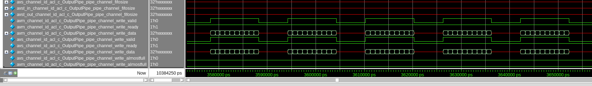
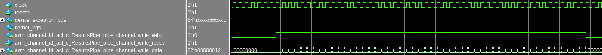

# `max_reinvocation_delay` Sample

This sample is an FPGA tutorial that explains how to use the `max_reinvocation_delay` attribute for loops.

| Area                 | Description
|:--                   |:--
| What you will learn  | How and when to apply the `max_reinvocation_delay` attribute when optimizing loop throughput
| Time to complete     | 15 minutes
| Category             | Concepts and Functionality

## Purpose

This tutorial demonstrates how and when to apply the `max_reinvocation_delay` attribute to a loop in your program to direct the Intel® oneAPI DPC++/C++ Compiler to implement that loop with a specified maximum loop reinvocation delay. The loop reinvocation delay is the delay between launching the last iteration of a loop invocation and launching the first iteration of the next loop invocation.

## Prerequisites

| Optimized for        | Description
|:---                  |:---
| OS                   | Ubuntu* 20.04 <br> RHEL*/CentOS* 8 <br> SUSE* 15 <br> Windows* 10 <br> Windows Server* 2019
| Hardware             | Intel® Agilex® 7, Agilex® 5, Arria® 10, Stratix® 10, and Cyclone® V FPGAs
| Software             | Intel® oneAPI DPC++/C++ Compiler

> **Note**: Even though the Intel® oneAPI DPC++/C++ Compiler is enough to compile for emulation, generating reports and generating RTL, there are extra software requirements for the simulation flow and FPGA compiles.
>
> For using the simulator flow, Intel® Quartus® Prime Pro Edition (or Standard Edition when targeting Cyclone® V) and one of the following simulators must be installed and accessible through your PATH:
> - Questa*-Intel® FPGA Edition
> - Questa*-Intel® FPGA Starter Edition
> - ModelSim® SE
>
> When using the hardware compile flow, Intel® Quartus® Prime Pro Edition (or Standard Edition when targeting Cyclone® V) must be installed and accessible through your PATH.

> **Warning**: Make sure you add the device files associated with the FPGA that you are targeting to your Intel® Quartus® Prime installation.

This sample is part of the FPGA code samples.
It is categorized as a Tier 3 sample that demonstrates a compiler feature.


Find more information about how to navigate this part of the code samples in the [FPGA top-level README.md](/DirectProgramming/C++SYCL_FPGA/README.md).
You can also find more information about [troubleshooting build errors](/DirectProgramming/C++SYCL_FPGA/README.md#troubleshooting), [running the sample on the Intel® DevCloud](/DirectProgramming/C++SYCL_FPGA/README.md#build-and-run-the-samples-on-intel-devcloud-optional), [using Visual Studio Code with the code samples](/DirectProgramming/C++SYCL_FPGA/README.md#use-visual-studio-code-vs-code-optional), [links to selected documentation](/DirectProgramming/C++SYCL_FPGA/README.md#documentation), and more.

## Key Implementation Details

Apply the `[[intel::max_reinvocation_delay(N)]]` attribute to loops in your program on which you want to specify a maximum loop reinvocation delay. The *loop reinvocation delay* is defined as the latency between the last iteration of a loop invocation and the first iteration of the next invocation of that loop. 

> **Note**:  A loop **invocation** begins when the program flow enters a loop for the first time, while an **iteration** begins each time the program flow enters the loop body. In the example below, the `i` loop will have `sequence_length` iterations for each invocation. It will be invoked once for each **iteration** of the outer `factor` loop.

The attribute parameter `N` is required and must be a positive constant expression of integer type. This parameter controls the maximum loop reinvocation delay allowed, measured in clock cycles. Currently, only `N=1` is supported, i.e., that there should be no delay between invocations. If you do not specify this attribute, the compiler may insert some delay to improve fMAX as shown in the following example.

### Example

Consider the following loop nest:

```c++
for (int factor = 0; factor < kFactors; factor++) {
  for (int i = 0; i < sequence_length; i++) {
    PipeOut::write(first_term + i * factor);
  }
}
```

By default, the compiler inserts a loop reinvocation delay of a few cycles on the inner loop. In general, the compiler may insert a higher loop reinvocation delay to better optimize a loop by enabling loop speculation or by pipelining the loop orchestration hardware, which can increase fMAX. This delay can be seen by observing the transactions coming out of the streaming interface associated with `PipeOut`.



However, the extra latency between invocations of a loop can have a significant impact in performance if the loop has a very small trip count. Applying `[[intel::max_reinvocation_delay(1)]]` to the inner loop allows us to remove this delay between invocations. 

```c++
for (int factor = 0; factor < kFactors; factor++) {
  [[intel::max_reinvocation_delay(1)]]
  for (int i = 0; i < sequence_length; i++) {
    PipeOut::write(first_term + i * factor);
  }
}
```

Now, the first iteration of the `i+1`th  invocation of the inner loop will launch immediately following the final iteration of the `i`th invocation of the inner loop. 




## Build the `max_reinvocation_delay` Tutorial

>**Note**: When working with the command-line interface (CLI), you should configure the oneAPI toolkits using environment variables. Set up your CLI environment by sourcing the `setvars` script in the root of your oneAPI installation every time you open a new terminal window. This practice ensures that your compiler, libraries, and tools are ready for development.
>
> Linux*:
> - For system wide installations: `. /opt/intel/oneapi/setvars.sh`
> - For private installations: ` . ~/intel/oneapi/setvars.sh`
> - For non-POSIX shells, like csh, use the following command: `bash -c 'source <install-dir>/setvars.sh ; exec csh'`
>
> Windows*:
> - `C:\"Program Files (x86)"\Intel\oneAPI\setvars.bat`
> - Windows PowerShell*, use the following command: `cmd.exe "/K" '"C:\Program Files (x86)\Intel\oneAPI\setvars.bat" && powershell'`
>
> For more information on configuring environment variables, see [Use the setvars Script with Linux* or macOS*](https://www.intel.com/content/www/us/en/develop/documentation/oneapi-programming-guide/top/oneapi-development-environment-setup/use-the-setvars-script-with-linux-or-macos.html) or [Use the setvars Script with Windows*](https://www.intel.com/content/www/us/en/develop/documentation/oneapi-programming-guide/top/oneapi-development-environment-setup/use-the-setvars-script-with-windows.html).

### On Linux*

1. Change to the sample directory.
2. Build the program for Intel® Agilex® 7 device family, which is the default.
   ```
   mkdir build
   cd build
   cmake ..
   ```
   > **Note**: You can change the default target by using the command:
   >  ```
   >  cmake .. -DFPGA_DEVICE=<FPGA device family or FPGA part number>
   >  ```
   > For simplicity, this tutorial only uses the SYCL HLS flow and does not support targeting an explicit FPGA board variant and BSP.

3. Compile the design. (The provided targets match the recommended development flow.)

   1. Compile and run for emulation (fast compile time, targets emulated FPGA device).
      ```
      make fpga_emu
      ```
   2. Generate the optimization reports.
      ```
      make report
      ```
   3. Compile and run for simulation (fast compile time, targets simulated FPGA device).
      ```
      make fpga_sim
      ```
   4. Compile for FPGA hardware (longer compile time, targets an FPGA device).
      ```
      make fpga
      ```

### On Windows*

1. Change to the sample directory.
2. Build the program for the Intel® Agilex® 7 device family, which is the default.
   ```
   mkdir build
   cd build
   cmake -G "NMake Makefiles" ..
   ```
   > **Note**: You can change the default target by using the command:
   >  ```
   >  cmake -G "NMake Makefiles" .. -DFPGA_DEVICE=<FPGA device family or FPGA part number>
   >  ```
   > For simplicity, this tutorial only uses the SYCL HLS flow and does not support targeting an explicit FPGA board variant and BSP.

3. Compile the design. (The provided targets match the recommended development flow.)

   1. Compile and run for emulation (fast compile time, targets emulated FPGA device).
      ```
      nmake fpga_emu
      ```
   2. Generate the optimization reports.
      ```
      nmake report
      ```
   3. Compile and run for simulation (fast compile time, targets simulated FPGA device).
      ```
      nmake fpga_sim
      ```
   4. Compile for FPGA hardware (longer compile time, targets an FPGA device).
      ```
      nmake fpga
      ```

> **Note**: If you encounter any issues with long paths when compiling under Windows*, you may have to create your 'build' directory in a shorter path, for example c:\samples\build.  You can then run cmake from that directory, and provide cmake with the full path to your sample directory, for example:
>
>  ```
  > C:\samples\build> cmake -G "NMake Makefiles" C:\long\path\to\code\sample\CMakeLists.txt
>  ```
## Run the `max_reinvocation_delay` Sample

### On Linux

1. Run the sample on the FPGA emulator (the kernel executes on the CPU).
   ```
   ./max_reinvocation_delay.fpga_emu
   ```
2. Run the sample on the FPGA simulator device.
   ```
   CL_CONTEXT_MPSIM_DEVICE_INTELFPGA=1 ./max_reinvocation_delay.fpga_sim
   ```
> **Note**: Running this sample on an actual FPGA device requires a BSP that supports host pipes. As there are currently no commercial BSPs with such support, only the SYCL HLS flow is enabled for this code sample.

### On Windows

1. Run the sample on the FPGA emulator (the kernel executes on the CPU).
   ```
   max_reinvocation_delay.fpga_emu.exe
   ```
2. Run the sample on the FPGA simulator device.
   ```
   set CL_CONTEXT_MPSIM_DEVICE_INTELFPGA=1
   max_reinvocation_delay.fpga_sim.exe
   set CL_CONTEXT_MPSIM_DEVICE_INTELFPGA=
   ```
> **Note**: Running this sample on an actual FPGA device requires a BSP that supports host pipes. As there are currently no commercial BSPs with such support, only the SYCL HLS flow is enabled for this code sample.

## Example Output

```
Calculating arithmetic sequence with factor = 1
Calculating arithmetic sequence with factor = 2
Calculating arithmetic sequence with factor = 3
Calculating arithmetic sequence with factor = 4
Calculating arithmetic sequence with factor = 5
PASSED
```

> **Note**: To observe the effect of `max_reinovcation_delay`, you should simulate the design and view the waveforms. The program output is only to verify functional correctness.


## License

Code samples are licensed under the MIT license. See [License.txt](/License.txt) for details.

Third-party program Licenses can be found here: [third-party-programs.txt](/third-party-programs.txt).